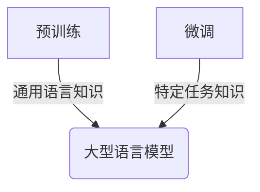

# 大语言模型应用指南：智能的可计算性

## 1. 背景介绍

### 1.1 人工智能的崛起

人工智能(Artificial Intelligence, AI)作为一门富有前景的学科,近年来取得了长足的进步。随着计算能力的不断提升和大数据时代的到来,人工智能技术得以广泛应用于各个领域,推动着社会的数字化转型。在这一进程中,大型语言模型(Large Language Models, LLMs)作为人工智能的重要组成部分,为自然语言处理(Natural Language Processing, NLP)领域带来了革命性的变革。

### 1.2 大型语言模型的重要性

大型语言模型是一种基于深度学习技术训练的人工智能模型,能够从海量文本数据中学习语言知识和模式,并在此基础上生成自然、流畅的语言输出。凭借其强大的语言理解和生成能力,大型语言模型在自然语言处理领域发挥着越来越重要的作用,包括机器翻译、问答系统、文本摘要、内容创作等多个应用场景。

### 1.3 本文意义

随着大型语言模型的不断发展和应用范围的扩大,如何有效利用这一前沿技术,充分发挥其潜力,成为了当前人工智能领域的一个重要课题。本文旨在为读者提供一份全面的大型语言模型应用指南,阐释其核心概念、算法原理、实践应用,并展望未来发展趋势,帮助读者深入理解这一革命性技术,把握其应用要点,促进人工智能技术在实际场景中的落地和推广。

## 2. 核心概念与联系

### 2.1 大型语言模型的定义

大型语言模型(LLMs)是一种基于深度学习的人工智能模型,专门用于自然语言处理任务。它通过在大规模语料库上进行预训练,学习语言的统计规律和语义关系,从而获得对自然语言的深刻理解和生成能力。

### 2.2 核心技术

#### 2.2.1 transformer架构

Transformer是大型语言模型的核心架构,它采用自注意力(Self-Attention)机制来捕捉输入序列中元素之间的依赖关系,从而更好地建模长距离依赖。这种架构的优势在于并行计算能力强、捕捉长距离依赖能力好,因此在处理长文本时表现出色。

#### 2.2.2 预训练与微调

大型语言模型通常采用两阶段训练策略:预训练(Pre-training)和微调(Fine-tuning)。在预训练阶段,模型在海量无标注语料库上进行自监督学习,获取通用的语言知识;在微调阶段,模型在特定任务的标注数据上进行进一步训练,使其适应具体的应用场景。



### 2.3 主要模型

目前,一些知名的大型语言模型包括:

- GPT系列(OpenAI)
- BERT系列(Google)
- T5(Google)
- XLNet(CMU/Google Brain)
- ALBERT(Google)
- RoBERTa(Facebook AI)
- ELECTRA(Stanford/Google Brain)

这些模型在架构、训练方式、参数规模等方面存在差异,但都旨在提高语言理解和生成的能力。

## 3. 核心算法原理具体操作步骤

### 3.1 transformer架构原理

Transformer架构的核心是自注意力(Self-Attention)机制,它能够自动捕捉输入序列中任意两个元素之间的依赖关系,从而更好地建模长距离依赖。自注意力机制的计算过程如下:

1) 将输入序列 $X = (x_1, x_2, ..., x_n)$ 线性映射到查询(Query)、键(Key)和值(Value)向量:

$$
\begin{aligned}
Q &= X \cdot W_Q \\
K &= X \cdot W_K \\
V &= X \cdot W_V
\end{aligned}
$$

其中 $W_Q, W_K, W_V$ 为可训练的权重矩阵。

2) 计算查询和键之间的点积,得到注意力分数矩阵 $A$:

$$
A = \text{softmax}\left(\frac{Q \cdot K^T}{\sqrt{d_k}}\right)
$$

其中 $d_k$ 为缩放因子,用于防止点积值过大导致梯度消失。

3) 将注意力分数矩阵 $A$ 与值向量 $V$ 相乘,得到加权和作为输出:

$$
\text{Attention}(Q, K, V) = A \cdot V
$$

通过多头注意力(Multi-Head Attention)机制,transformer可以从不同的子空间捕捉不同的依赖关系,进一步提高模型性能。

### 3.2 预训练与微调流程

大型语言模型的训练通常分为两个阶段:预训练(Pre-training)和微调(Fine-tuning)。

#### 3.2.1 预训练阶段

预训练阶段的目标是在大规模无标注语料库上,让模型学习通用的语言知识和模式。常见的预训练任务包括:

- 掩码语言模型(Masked Language Modeling, MLM):随机掩码部分输入token,模型需要预测被掩码的token。
- 下一句预测(Next Sentence Prediction, NSP):判断两个句子是否为连续句子。
- 因果语言模型(Causal Language Modeling, CLM):给定前文,预测下一个token。

通过这些自监督任务,模型可以学习到丰富的语义和语法知识,为后续的微调奠定基础。

#### 3.2.2 微调阶段

在微调阶段,模型需要在特定任务的标注数据上进行进一步训练,使其适应具体的应用场景。常见的微调方式包括:

1) 添加任务特定的输出层
2) 对整个模型或部分层进行微调
3) 采用特定的损失函数和优化策略

通过微调,模型可以学习到特定任务的知识,提高在该任务上的性能表现。

### 3.3 生成式任务流程

对于生成式任务(如机器翻译、文本摘要、开放式问答等),大型语言模型的工作流程如下:

1) 将输入文本编码为token序列
2) 将token序列输入到模型,计算出条件概率分布 $P(y_t|y_{<t}, X)$
3) 根据条件概率分布对下一个token进行采样
4) 重复步骤2和3,直到生成完整的输出序列

在生成过程中,可以采用不同的解码策略(如贪婪搜索、束搜索、顶端采样等)来控制输出质量和多样性。同时,也可以引入外部知识和约束条件,以提高生成结果的准确性和相关性。

## 4. 数学模型和公式详细讲解举例说明  

### 4.1 transformer模型数学表示

transformer模型的核心是自注意力机制,它能够捕捉输入序列中任意两个元素之间的依赖关系。自注意力机制的数学表示如下:

给定输入序列 $X = (x_1, x_2, ..., x_n)$,其中 $x_i \in \mathbb{R}^{d_{\text{model}}}$ 为 $d_{\text{model}}$ 维向量。

1) 线性映射得到查询(Query)、键(Key)和值(Value)矩阵:

$$
\begin{aligned}
Q &= X \cdot W_Q &\in \mathbb{R}^{n \times d_k} \\
K &= X \cdot W_K &\in \mathbb{R}^{n \times d_k} \\
V &= X \cdot W_V &\in \mathbb{R}^{n \times d_v}
\end{aligned}
$$

其中 $W_Q, W_K, W_V$ 为可训练的权重矩阵,分别将输入映射到查询、键和值空间;$d_k$和$d_v$分别为查询/键和值的维度。

2) 计算注意力分数矩阵:

$$
A = \text{softmax}\left(\frac{Q \cdot K^T}{\sqrt{d_k}}\right) \in \mathbb{R}^{n \times n}
$$

其中 $\sqrt{d_k}$ 为缩放因子,用于防止点积值过大导致梯度消失。

3) 计算加权和作为输出:

$$
\text{Attention}(Q, K, V) = A \cdot V \in \mathbb{R}^{n \times d_v}
$$

通过多头注意力机制,transformer可以从不同的子空间捕捉不同的依赖关系,进一步提高模型性能。具体来说,将查询、键和值矩阵分别线性映射 $h$ 次,得到 $h$ 组查询、键和值,分别计算 $h$ 组注意力输出,最后将它们拼接起来作为最终的多头注意力输出。

以上是transformer模型自注意力机制的数学表示,通过这种方式,模型可以自动学习输入序列中元素之间的依赖关系,从而更好地捕捉长距离依赖,提高在各种自然语言处理任务上的性能表现。

### 4.2 掩码语言模型(MLM)目标函数

掩码语言模型(Masked Language Modeling, MLM)是大型语言模型预训练的一种常用任务,其目标函数可以表示为:

$$
\mathcal{L}_{\text{MLM}} = -\mathbb{E}_{X, \mathcal{M}} \left[ \sum_{i \in \mathcal{M}} \log P(x_i | X_{\backslash \mathcal{M}}) \right]
$$

其中:

- $X = (x_1, x_2, ..., x_n)$ 为输入token序列
- $\mathcal{M}$ 为被掩码token的位置集合
- $X_{\backslash \mathcal{M}}$ 表示将 $\mathcal{M}$ 中的token用特殊的[MASK]标记替换后的序列
- $P(x_i | X_{\backslash \mathcal{M}})$ 为模型预测被掩码token $x_i$ 的条件概率

目标是最小化该损失函数,使模型能够根据上下文准确预测被掩码的token,从而学习到有效的语言表示。

在实际操作中,通常会在输入序列中随机选择一定比例(如15%)的token进行掩码,其中一部分token会被[MASK]标记替换,另一部分则会被随机替换或保持不变,以提高模型的鲁棒性。

### 4.3 因果语言模型(CLM)目标函数

因果语言模型(Causal Language Modeling, CLM)是另一种常见的大型语言模型预训练任务,其目标函数可以表示为:

$$
\mathcal{L}_{\text{CLM}} = -\mathbb{E}_{X} \left[ \sum_{t=1}^n \log P(x_t | x_{<t}) \right]
$$

其中:

- $X = (x_1, x_2, ..., x_n)$ 为输入token序列
- $x_{<t}$ 表示序列前 $t-1$ 个token $(x_1, x_2, ..., x_{t-1})$
- $P(x_t | x_{<t})$ 为模型预测第 $t$ 个token的条件概率

目标是最小化该损失函数,使模型能够根据前文准确预测下一个token,从而学习到语言的序列化知识和因果关系。

在训练过程中,模型会遍历整个序列,对每个位置的token进行预测,并根据预测结果和真实标签计算损失,反向传播更新模型参数。

因果语言模型任务要求模型只能利用当前位置之前的信息进行预测,这与掩码语言模型任务不同,后者允许模型利用双向上下文信息。因此,两种任务能够让模型学习到complementary的语言知识。

## 5. 项目实践:代码实例和详细解释说明

为了更好地理解大型语言模型的实际应用,我们将使用Python和Hugging Face的Transformers库,构建一个基于GPT-2的文本生成示例。

### 5.1 安装依赖库

首先,我们需要安装所需的Python库:

```bash
pip install transformers
```

### 5.2 加载预训练模型

接下来,我们将加载一个预训练的GPT-2模型:

```python
from transformers import GPT2LMHeadModel, GPT2Tokenizer

# 加载预训练模型和tokenizer
model = GPT2LMHeadModel.from_pretrained('gpt2')
tokenizer = GPT2Tokenizer.from_pretrained('gpt2')
```

### 5.3 文本生成函数

我们