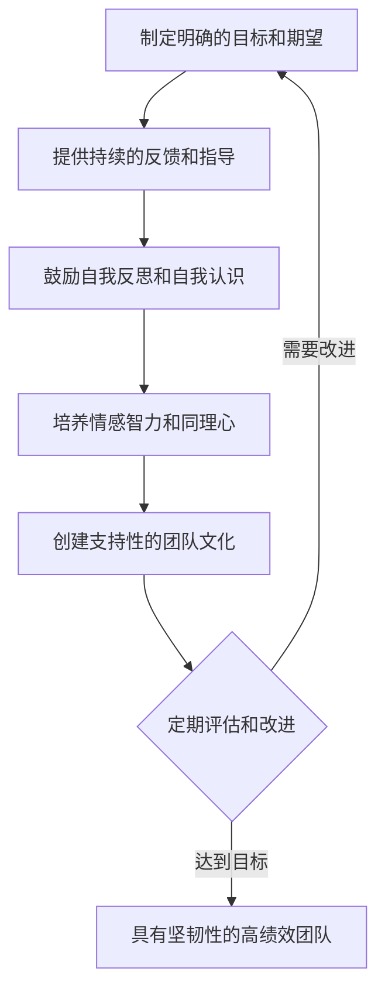

# 如何通过领导力培养团队的坚韧性？

## 1. 背景介绍

在当今瞬息万变的商业环境中,组织面临着前所未有的挑战和不确定性。在这种情况下,培养一支具有坚韧性的团队至关重要。坚韧性是指个人或团队在面对逆境、压力或失败时,能够迅速恢复并继续前进的能力。作为领导者,您在培养团队坚韧性方面发挥着关键作用。本文将探讨如何通过有效的领导力来培养团队的坚韧性。

## 2. 核心概念与联系

### 2.1 坚韧性的定义

坚韧性是指个人或团队在面对逆境、压力或失败时,能够迅速恢复并继续前进的能力。它涉及适应变化、克服障碍以及在困难时期保持积极性和动力。

### 2.2 领导力与坚韧性的关系

领导力在培养团队坚韧性方面发挥着关键作用。有效的领导者能够激励和支持团队成员,帮助他们应对挑战并从失败中学习。领导者还可以通过塑造团队文化和提供必要的资源来促进坚韧性的发展。

### 2.3 团队坚韧性的重要性

具有坚韧性的团队能够更好地适应变化,克服障碍,并在困难时期保持高绩效。这对于组织的长期成功和可持续发展至关重要。

## 3. 培养团队坚韧性的核心原则

### 3.1 建立信任和心理安全

- 营造开放、透明的沟通环境
- 鼓励团队成员分享想法和担忧
- 以身作则,展示脆弱性和真诚性

### 3.2 提供支持和资源

- 为团队成员提供必要的工具和培训
- 提供情感支持和辅导
- 确保团队成员有足够的休息和恢复时间

### 3.3 鼓励学习和成长心态

- 将失败视为学习和成长的机会
- 鼓励团队成员走出舒适区,接受新的挑战
- 提供持续的反馈和指导

### 3.4 培养适应性和灵活性

- 鼓励创新和解决问题的能力
- 促进跨职能协作和知识共享
- 帮助团队成员发展多样化的技能

### 3.5 庆祝成功和韧性

- 认可和奖励团队成员的努力和成就
- 分享克服逆境的故事和经验教训
- 营造积极、支持性的团队氛围

## 4. 领导力实践:培养团队坚韧性的具体步骤

### 4.1 制定明确的目标和期望

- 与团队成员合作制定具有挑战性但可实现的目标
- 明确传达期望和责任
- 定期审查进展并根据需要进行调整

### 4.2 提供持续的反馈和指导

- 定期与团队成员进行一对一会谈
- 提供建设性反馈,强调优势和改进机会
- 为团队成员提供指导和支持,帮助他们实现目标

### 4.3 鼓励自我反思和自我认识

- 鼓励团队成员反思自己的优势、弱点和价值观
- 提供自我评估工具和资源
- 帮助团队成员制定个人发展计划

### 4.4 培养情感智力和同理心

- 提高自我认识和自我管理能力
- 积极倾听团队成员的想法和关切
- 表现出同情心和理解力

### 4.5 创建支持性的团队文化

- 鼓励团队成员相互支持和帮助
- 促进开放、诚实的沟通
- 庆祝团队的成功和里程碑

## 5. 实际应用场景

### 5.1 应对组织变革

- 与团队成员公开讨论变革的影响和机遇
- 提供必要的支持和资源,帮助团队适应新的工作方式
- 鼓励团队成员积极参与变革过程

### 5.2 处理项目挫折

- 与团队成员一起分析失败的原因和吸取的教训
- 重新调整目标和策略,必要时寻求额外资源
- 保持积极态度,激励团队成员继续前进

### 5.3 应对个人或团队冲突

- 鼓励开放、尊重的对话
- 帮助团队成员找到共同点并达成妥协
- 必要时进行调解或寻求外部支持

## 6. 工具和资源推荐

### 6.1 情感智力培训

- 提供情感智力工作坊或在线课程
- 鼓励团队成员阅读相关书籍和文章

### 6.2 韧性评估工具

- 使用标准化的韧性量表评估团队和个人的韧性水平
- 根据评估结果制定针对性的发展计划

### 6.3 团队建设活动

- 组织团队建设活动,如户外拓展训练或解决问题工作坊
- 鼓励团队成员分享个人经历和见解

## 7. 总结:未来发展趋势与挑战

随着商业环境的不断变化,培养具有坚韧性的团队将变得越来越重要。未来,领导者需要不断提高自己的情感智力和指导能力,以更好地支持团队成员。此外,组织需要将坚韧性培养纳入其文化和人才发展战略。

然而,培养团队坚韧性也面临着一些挑战。这些挑战包括:

- 平衡高绩效与员工福祉
- 应对不断变化的技术和市场趋势
- 管理远程或分布式团队的坚韧性
- 应对跨文化和跨代沟通的挑战

尽管存在这些挑战,但通过持续的努力和创新,领导者可以帮助团队培养出更强的坚韧性,从而更好地应对未来的不确定性。

## 8. 附录:常见问题与解答

### 8.1 如何衡量团队的坚韧性?

可以使用标准化的韧性量表,如康纳-戴维森韧性量表(CD-RISC)或简式韧性量表(BRS)。此外,还可以通过观察团队在面对挑战时的表现以及他们从失败中恢复的速度来评估坚韧性。

### 8.2 培养个人坚韧性与培养团队坚韧性有何不同?

虽然个人坚韧性是团队坚韧性的基础,但培养团队坚韧性还需要关注团队动态、沟通和协作。领导者需要创造一个支持性的环境,鼓励团队成员相互支持和学习。

### 8.3 如何在远程工作环境中培养团队坚韧性?

在远程工作环境中,领导者需要更加有意识地创造机会,促进团队成员之间的联系和沟通。这可以通过定期的虚拟团队会议、一对一检查以及使用协作工具来实现。领导者还应该特别关注团队成员的心理健康和福祉。

### 8.4 培养团队坚韧性需要多长时间?

培养团队坚韧性是一个持续的过程,需要时间和努力。虽然一些策略可以在短期内产生影响,但真正嵌入团队文化的坚韧性需要持续的关注和支持。领导者应该将培养坚韧性视为一项长期投资。

### 8.5 如何在预算有限的情况下培养团队坚韧性?

虽然一些培养坚韧性的策略可能需要财务投资,但许多最有效的方法都是低成本或免费的。例如,提供情感支持、鼓励学习和成长心态以及庆祝成功等策略都不需要大量预算。领导者可以创造性地利用现有资源来支持团队坚韧性的发展。

## 9. Mermaid 流程图:培养团队坚韧性的关键步骤

通过遵循这些关键步骤并持续关注团队的发展,领导者可以有效地培养团队的坚韧性,帮助他们更好地应对未来的挑战和机遇。

作者:禅与计算机程序设计艺术 / Zen and the Art of Computer Programming