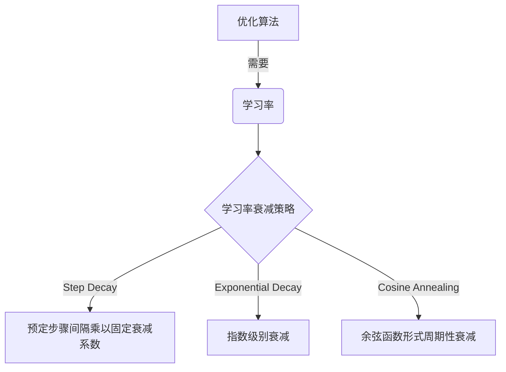
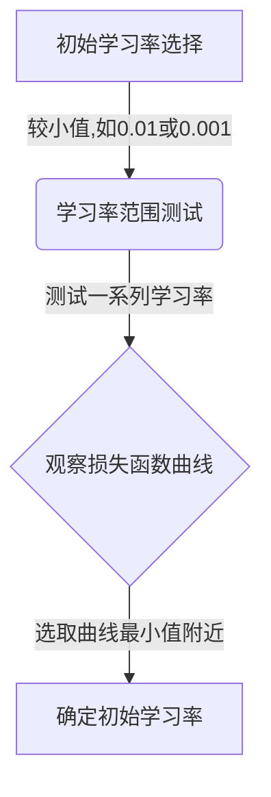
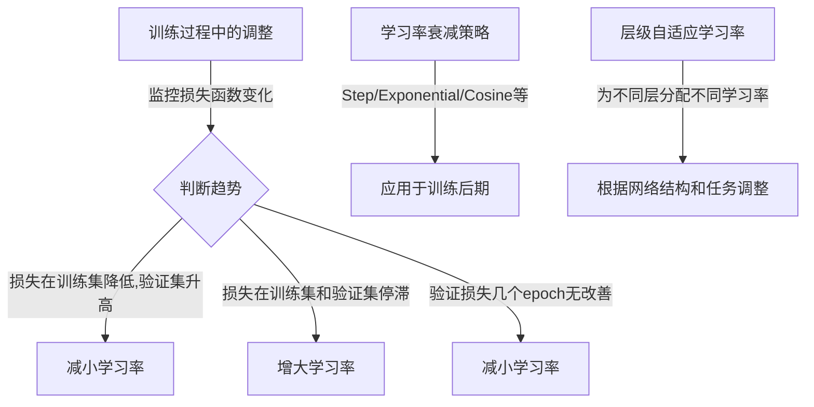

# 学习率的选择：优化过程的加速器

## 1.背景介绍

在机器学习和深度学习领域中,优化算法扮演着至关重要的角色。它们旨在通过迭代地调整模型参数,最小化损失函数或目标函数,从而找到最优解。然而,优化过程的效率和收敛性能在很大程度上取决于学习率的选择。

学习率作为优化算法的一个超参数,决定了每次迭代时参数更新的幅度。一个合适的学习率可以加快收敛速度,提高模型性能,而一个不当的学习率则可能导致优化过程diverge(发散)或converge(收敛)缓慢。因此,正确选择和调整学习率对于确保优化算法的有效性至关重要。

### 1.1 学习率的重要性

学习率的选择直接影响着优化算法的表现,包括:

1. **收敛速度**: 合适的学习率可以加快收敛速度,减少迭代次数,从而节省训练时间。
2. **最终性能**: 适当的学习率有助于达到更好的最终模型性能,避免陷入次优解或saddle point(鞍点)。
3. **稳定性**: 合理的学习率可以确保优化过程的稳定性,避免出现振荡或diverge现象。

因此,学习率的选择对于优化算法的整体效率和性能至关重要。

## 2.核心概念与联系

### 2.1 学习率与优化算法的关系

不同的优化算法对学习率的要求也不尽相同。例如,在经典的随机梯度下降(SGD)算法中,学习率需要小心调整以确保收敛性和稳定性。而一些自适应学习率优化算法,如AdaGrad、RMSProp和Adam等,则能够自动调整每个参数的学习率,减轻了手动调参的负担。

### 2.2 学习率衰减策略

为了在训练过程中动态调整学习率,通常采用学习率衰减(Learning Rate Decay)策略。常见的衰减策略包括:

1. **Step Decay**: 在预定的步骤间隔时,将学习率乘以一个固定的衰减系数。
2. **Exponential Decay**: 学习率按指数级别衰减。
3. **Cosine Annealing**: 学习率按余弦函数形式周期性衰减。

这些策略旨在在训练早期保持较大的学习率以加快收敛,而在后期减小学习率以实现收敛和微调。



### 2.3 层级自适应学习率

除了全局学习率之外,一些优化算法还支持为不同的层或参数组分配不同的学习率。这种层级自适应学习率(Layer-wise Adaptive Learning Rates)可以更好地满足不同层和参数的需求,提高优化效率。

例如,在训练卷积神经网络时,可以为不同类型的层(如卷积层和全连接层)分配不同的学习率,以适应它们的不同特性和更新需求。

## 3.核心算法原理具体操作步骤

选择合适的学习率通常需要一定的经验和实践。以下是一些常用的技巧和步骤:

1. **初始学习率选择**:
   - 通常从一个较小的值开始,如0.01或0.001。
   - 也可以尝试更大的初始值,如0.1或更高,但需要小心观察是否出现diverge或不稳定的情况。

2. **学习率范围测试(Learning Rate Range Test)**:
   - 通过测试一系列不同的学习率,绘制出学习率与损失函数的关系曲线。
   - 选择曲线的最小值附近的学习率作为初始值。
   - 该方法可以帮助快速缩小合适的学习率范围。



3. **训练过程中的调整**:
   - 监控训练和验证损失的变化趋势。
   - 如果损失函数在训练集上降低但在验证集上升高,可能需要减小学习率。
   - 如果损失函数在训练集和验证集上均停滞不前,可能需要增大学习率。
   - 根据经验,当验证损失在几个epoch内没有改善时,可以尝试减小学习率。

4. **学习率衰减策略的应用**:
   - 在训练后期应用学习率衰减策略,以实现收敛和微调。
   - 常见的衰减策略包括Step Decay、Exponential Decay和Cosine Annealing等。
   - 可以根据具体问题和模型复杂度选择合适的衰减策略和衰减系数。

5. **层级自适应学习率的使用**:
   - 对于复杂的深度神经网络,可以为不同的层或参数组分配不同的学习率。
   - 通常将较大的学习率分配给底层,较小的学习率分配给顶层。
   - 需要根据具体网络结构和任务特性进行调整和实验。



总的来说,学习率的选择需要结合具体问题、模型复杂度和训练数据,通过实践和经验积累来确定最佳策略。同时,也需要密切监控训练过程,并根据损失函数的变化趋势动态调整学习率。

## 4.数学模型和公式详细讲解举例说明

### 4.1 学习率在优化算法中的作用

在优化算法中,我们通常需要最小化一个损失函数或目标函数 $J(\theta)$,其中 $\theta$ 表示模型的参数向量。优化算法的目标是通过迭代地更新参数,使得损失函数值不断减小,最终达到一个最小值或接近最小值。

在每一次迭代中,参数的更新公式通常可以表示为:

$$\theta_{t+1} = \theta_t - \eta \nabla J(\theta_t)$$

其中:
- $\theta_t$ 表示当前迭代步的参数值
- $\nabla J(\theta_t)$ 表示损失函数在当前参数值下的梯度
- $\eta$ 就是学习率(Learning Rate),它决定了参数在梯度方向上的更新步长

一个合适的学习率可以确保参数朝着正确的方向更新,并控制更新的幅度,从而加快收敛速度和提高最终性能。然而,如果学习率过大,可能会导致参数在最小值附近来回振荡,无法收敛;如果学习率过小,则可能需要更多的迭代次数才能收敛,效率低下。

### 4.2 学习率衰减策略的数学表示

为了在训练过程中动态调整学习率,我们可以采用学习率衰减策略。以下是一些常见策略的数学表示:

1. **Step Decay**:

$$\eta_t = \eta_0 \times \gamma^{\lfloor\frac{t}{s}\rfloor}$$

其中:
- $\eta_t$ 表示第 $t$ 次迭代的学习率
- $\eta_0$ 表示初始学习率
- $\gamma$ 是衰减系数,通常取值在 $(0, 1)$ 范围内
- $s$ 是衰减步长,表示每隔多少步骤衰减一次
- $\lfloor\frac{t}{s}\rfloor$ 表示对 $\frac{t}{s}$ 取整

2. **Exponential Decay**:

$$\eta_t = \eta_0 \times \gamma^t$$

其中:
- $\eta_t$ 表示第 $t$ 次迭代的学习率
- $\eta_0$ 表示初始学习率
- $\gamma$ 是衰减率,通常取值在 $(0, 1)$ 范围内

3. **Cosine Annealing**:

$$\eta_t = \eta_{\min} + \frac{1}{2}(\eta_{\max} - \eta_{\min})(1 + \cos(\frac{t\pi}{T_{\max}}))$$

其中:
- $\eta_t$ 表示第 $t$ 次迭代的学习率
- $\eta_{\max}$ 和 $\eta_{\min}$ 分别表示最大和最小学习率
- $T_{\max}$ 表示总的训练步数

这些策略旨在在训练早期保持较大的学习率以加快收敛,而在后期减小学习率以实现收敛和微调。具体选择哪种策略需要根据问题的特点和实验结果进行判断。

### 4.3 层级自适应学习率的实现

对于复杂的深度神经网络,我们可以为不同的层或参数组分配不同的学习率,以满足它们的不同需求。这种层级自适应学习率(Layer-wise Adaptive Learning Rates)可以通过对参数进行分组,并为每个组指定一个单独的学习率来实现。

假设我们有一个深度神经网络,其参数向量 $\theta$ 可以分为 $K$ 个组,即 $\theta = [\theta_1, \theta_2, \ldots, \theta_K]$。我们可以为每个组指定一个单独的学习率 $\eta_k$,参数更新公式则变为:

$$\theta_{k, t+1} = \theta_{k, t} - \eta_k \nabla J(\theta_{k, t})$$

其中:
- $\theta_{k, t}$ 表示第 $k$ 个参数组在第 $t$ 次迭代的值
- $\eta_k$ 表示第 $k$ 个参数组的学习率
- $\nabla J(\theta_{k, t})$ 表示损失函数关于第 $k$ 个参数组的梯度

通过这种方式,我们可以为不同的层或参数组分配不同的学习率,以适应它们的不同特性和更新需求。例如,在训练卷积神经网络时,我们可以为卷积层和全连接层分配不同的学习率,以提高优化效率。

需要注意的是,层级自适应学习率的实现通常需要对深度学习框架进行一定的修改和扩展,以支持参数分组和分配不同的学习率。同时,确定每个组的最佳学习率也需要一定的实践和调试。

## 5.项目实践:代码实例和详细解释说明

为了更好地理解学习率的选择和应用,我们将通过一个实际的代码示例来演示如何在PyTorch中实现不同的学习率策略。

在这个示例中,我们将构建一个简单的多层感知机(Multilayer Perceptron, MLP)模型,并在MNIST手写数字识别任务上进行训练。我们将探索不同的学习率选择策略,包括固定学习率、Step Decay和Cosine Annealing,并比较它们对模型性能和收敛速度的影响。

### 5.1 导入所需的库

```python
import torch
import torch.nn as nn
import torch.optim as optim
from torch.utils.data import DataLoader
from torchvision import datasets, transforms
```

### 5.2 定义MLP模型

```python
class MLP(nn.Module):
    def __init__(self):
        super(MLP, self).__init__()
        self.fc1 = nn.Linear(28 * 28, 512)
        self.fc2 = nn.Linear(512, 256)
        self.fc3 = nn.Linear(256, 10)

    def forward(self, x):
        x = x.view(-1, 28 * 28)
        x = torch.relu(self.fc1(x))
        x = torch.relu(self.fc2(x))
        x = self.fc3(x)
        return x
```

### 5.3 加载MNIST数据集

```python
train_dataset = datasets.MNIST(root='./data', train=True, transform=transforms.ToTensor(), download=True)
test_dataset = datasets.MNIST(root