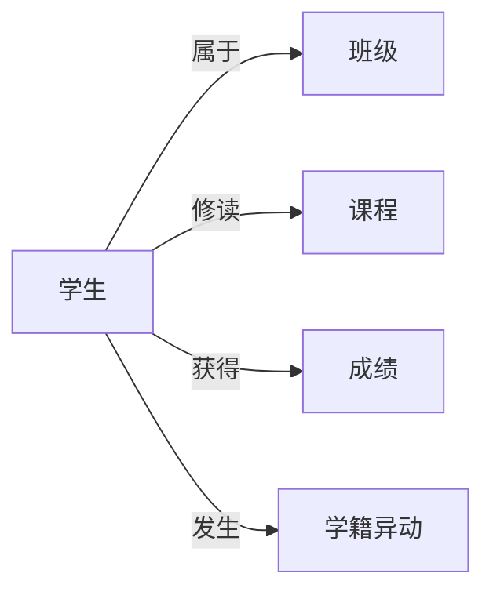

# 学籍管理系统设计与实现

## 1. 背景介绍
### 1.1 学籍管理系统的重要性
在现代化教育管理中,学籍管理系统扮演着至关重要的角色。它是学校教育管理信息化的核心组成部分,对于提高教学管理效率、规范教学管理流程、加强学籍信息管理具有重要意义。一个设计合理、功能完善、性能优异的学籍管理系统能够有效地提升学校管理水平,为学校的可持续发展提供有力支撑。

### 1.2 学籍管理系统的主要功能
学籍管理系统的主要功能包括:
- 学生信息管理:录入、修改、删除、查询学生基本信息,如姓名、学号、性别、出生日期、籍贯等。
- 学籍异动管理:处理学生转学、休学、复学、退学等学籍异动业务。
- 成绩管理:记录学生各科成绩,提供成绩查询、统计、分析功能。
- 班级管理:对班级信息进行管理,如班级名称、班主任、上课时间、上课地点等。
- 课程管理:维护课程信息,如课程名称、学分、授课教师、考核方式等。
- 系统管理:用户权限管理、数据备份与恢复、系统日志管理等。

### 1.3 学籍管理系统面临的挑战
尽管学籍管理系统为学校教学管理带来诸多益处,但在实际应用中仍面临一些挑战:
1. 数据安全与隐私保护:如何有效保障学生个人信息的安全,防止数据泄露。
2. 系统性能与可扩展性:如何设计一个高性能、易于扩展的系统架构。
3. 用户体验:如何提供友好的用户界面,降低用户的学习成本。
4. 与其他系统的集成:如何与学校的其他管理系统(如教务系统、一卡通系统等)进行无缝集成。

## 2. 核心概念与关联
### 2.1 学籍管理系统的核心概念
- 学生:学籍管理系统的主要服务对象,包含学生的基本信息和学籍信息。
- 班级:学生所在的行政单位,具有班级编号、班级名称等属性。
- 课程:学生修读的科目,包含课程编号、课程名称、学分、授课教师等信息。
- 成绩:学生修读课程所得到的评价结果,通常以百分制或等级制表示。
- 学籍异动:学生在校期间发生的学籍状态变化,如休学、复学、转专业等。

### 2.2 核心概念之间的关系


## 3. 核心算法原理与具体操作步骤
### 3.1 学生信息的增删改查
学籍管理系统的基本功能是对学生信息进行增删改查。以下是实现这些操作的基本步骤:

#### 3.1.1 添加学生信息
1. 接收用户输入的学生信息,包括姓名、学号、性别、出生日期等。
2. 对输入的数据进行合法性校验,如学号是否已存在、日期格式是否正确等。
3. 将验证通过的学生信息插入到数据库对应的表中。
4. 返回操作结果,提示用户添加成功或失败。

#### 3.1.2 删除学生信息
1. 接收用户输入的学生学号。
2. 检查数据库中是否存在该学号的学生记录。
3. 如果存在,则从数据库表中删除该学生的所有信息。
4. 返回操作结果,提示用户删除成功或失败。

#### 3.1.3 修改学生信息
1. 接收用户输入的学生学号和需要修改的信息。
2. 检查数据库中是否存在该学号的学生记录。
3. 如果存在,则根据用户输入的信息更新数据库表中对应的字段值。
4. 返回操作结果,提示用户修改成功或失败。

#### 3.1.4 查询学生信息
1. 接收用户输入的查询条件,如姓名、学号、班级等。
2. 根据查询条件生成 SQL 语句。
3. 执行 SQL 查询,从数据库中检索符合条件的学生记录。
4. 将查询结果返回给用户,以列表或详情的形式展示。

### 3.2 学籍异动管理
学籍异动是指学生在校期间学籍状态的变化,如休学、复学、转专业等。学籍异动管理的基本流程如下:
1. 接收用户提交的学籍异动申请,包括学生学号、异动类型、异动原因等。
2. 根据学校的规章制度,对异动申请进行审核。
3. 如果审核通过,则将异动信息录入系统,更新学生的学籍状态。
4. 生成异动文档,并通知相关部门和学生本人。
5. 如果审核未通过,则返回申请人,并说明未通过的原因。

### 3.3 成绩管理
成绩管理是学籍管理系统的另一项重要功能,主要包括以下几个方面:

#### 3.3.1 成绩录入
1. 教师登录系统,选择需要录入成绩的课程。
2. 系统显示该课程的学生名单,教师逐一输入每个学生的成绩。
3. 系统对输入的成绩进行合法性校验,如是否在合理的分数范围内。
4. 将成绩保存到数据库中,并计算每个学生的总分和平均分。

#### 3.3.2 成绩查询
1. 用户登录系统,选择查询成绩的方式(如按学号、按课程等)。
2. 根据用户的选择,生成相应的 SQL 查询语句。
3. 执行查询,从数据库中检索符合条件的成绩记录。
4. 将查询结果返回给用户,以表格或图表的形式展示。

#### 3.3.3 成绩统计与分析
1. 用户选择需要统计或分析的范围,如全校、院系、班级等。
2. 根据用户的选择,从数据库中检索相应的成绩记录。
3. 对检索到的成绩数据进行汇总、计算,生成统计报表或分析图表。
4. 将统计或分析结果展示给用户,并提供导出功能。

## 4. 数学模型与公式详解
在学籍管理系统中,有些功能需要用到数学模型和公式,如成绩的加权平均、学分绩点的计算等。

### 4.1 加权平均分
加权平均分是根据每门课程的学分数和所得分数计算出的平均分数。其计算公式为:

$$
\bar{x} = \frac{\sum_{i=1}^{n} (x_i \times w_i)}{\sum_{i=1}^{n} w_i}
$$

其中,$\bar{x}$表示加权平均分,$x_i$表示第$i$门课程的分数,$w_i$表示第$i$门课程的学分数,$n$表示课程总数。

例如,某学生修读了3门课程,分数和学分如下表所示:

| 课程 | 分数 | 学分 |
|------|------|------|
| 数学 | 85   | 4    |
| 英语 | 92   | 3    |
| 物理 | 78   | 2    |

根据加权平均分公式,该学生的加权平均分为:

$$
\bar{x} = \frac{85 \times 4 + 92 \times 3 + 78 \times 2}{4 + 3 + 2} \approx 86.11
$$

### 4.2 学分绩点
学分绩点(GPA)是衡量学生学习质量的一个重要指标,它综合考虑了每门课程的分数和学分。其计算公式为:

$$
GPA = \frac{\sum_{i=1}^{n} (g_i \times c_i)}{\sum_{i=1}^{n} c_i}
$$

其中,$GPA$表示学分绩点,$g_i$表示第$i$门课程的绩点,$c_i$表示第$i$门课程的学分数,$n$表示课程总数。

课程绩点与分数的对应关系如下:

| 分数段   | 绩点 |
|----------|------|
| 90-100   | 4.0  |
| 85-89    | 3.7  |
| 82-84    | 3.3  |
| 78-81    | 3.0  |
| 75-77    | 2.7  |
| 72-74    | 2.3  |
| 68-71    | 2.0  |
| 64-67    | 1.5  |
| 60-63    | 1.0  |
| 60以下   | 0    |

例如,上表中的学生的学分绩点为:

$$
GPA = \frac{3.7 \times 4 + 4.0 \times 3 + 3.0 \times 2}{4 + 3 + 2} \approx 3.61
$$

## 5. 项目实践:代码实例与详解
下面以Java语言为例,演示学籍管理系统中几个核心功能的代码实现。

### 5.1 学生信息管理
#### 5.1.1 学生实体类
```java
public class Student {
    private String id;  // 学号
    private String name;  // 姓名
    private String gender;  // 性别
    private Date birthday;  // 出生日期
    private String classId;  // 所属班级
    
    // 构造函数、getter和setter方法省略
}
```

#### 5.1.2 学生DAO接口
```java
public interface StudentDao {
    void addStudent(Student student);
    void deleteStudent(String id);
    void updateStudent(Student student);
    Student getStudentById(String id);
    List<Student> getAllStudents();
}
```

#### 5.1.3 学生Service类
```java
@Service
public class StudentService {
    @Autowired
    private StudentDao studentDao;
    
    public void addStudent(Student student) {
        // 校验学号是否已存在
        if (studentDao.getStudentById(student.getId()) != null) {
            throw new RuntimeException("学号已存在!");
        }
        studentDao.addStudent(student);
    }
    
    public void deleteStudent(String id) {
        studentDao.deleteStudent(id);
    }
    
    public void updateStudent(Student student) {
        studentDao.updateStudent(student);
    }
    
    public Student getStudentById(String id) {
        return studentDao.getStudentById(id);
    }
    
    public List<Student> getAllStudents() {
        return studentDao.getAllStudents();
    }
}
```

### 5.2 成绩管理
#### 5.2.1 成绩实体类
```java
public class Score {
    private String studentId;  // 学号
    private String courseId;  // 课程编号
    private Double score;  // 分数
    
    // 构造函数、getter和setter方法省略
}
```

#### 5.2.2 成绩DAO接口
```java
public interface ScoreDao {
    void addScore(Score score);
    void updateScore(Score score);
    Score getScore(String studentId, String courseId);
    List<Score> getScoresByStudentId(String studentId);
    List<Score> getScoresByCourseId(String courseId);
}
```

#### 5.2.3 成绩Service类
```java
@Service
public class ScoreService {
    @Autowired
    private ScoreDao scoreDao;
    
    public void addScore(Score score) {
        scoreDao.addScore(score);
    }
    
    public void updateScore(Score score) {
        scoreDao.updateScore(score);
    }
    
    public Score getScore(String studentId, String courseId) {
        return scoreDao.getScore(studentId, courseId);
    }
    
    public List<Score> getScoresByStudentId(String studentId) {
        return scoreDao.getScoresByStudentId(studentId);
    }
    
    public List<Score> getScoresByCourseId(String courseId) {
        return scoreDao.getScoresByCourseId(courseId);
    }
    
    public Double getWeightedAvgScore(String studentId) {
        List<Score> scores = scoreDao.getScoresByStudentId(studentId);
        Double totalWeightedScore = 0.0;
        Double totalCredit = 0.0;
        for (Score score : scores) {
            Course course = courseService.getCourseById(score.getCourseId());
            totalWeightedScore += score.getScore() * course.getCredit();
            totalCredit += course.getCredit();
        }
        return totalWeightedScore / totalCredit;
    }
    
    public Double getGPA(String studentId) {
        List<Score> scores = scoreDao.getScoresByStudentId(studentId);
        Double totalGradePoint = 0.0;
        Double totalCredit = 0.0;
        for (Score score : scores) {
            Course course = courseService.getC