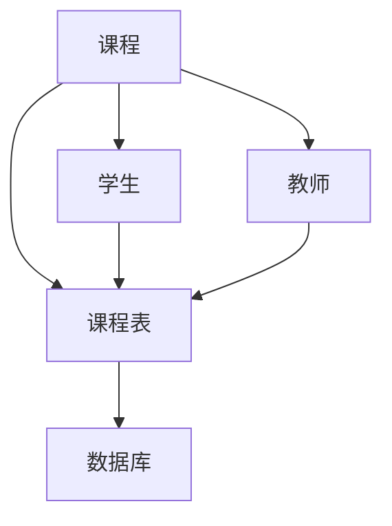

## 1. 背景介绍

随着互联网的发展，教育行业也逐渐向数字化、信息化方向转型。在这个背景下，课程信息管理系统成为了教育机构必不可少的一部分。它可以帮助教育机构更好地管理课程信息，提高教学效率，提供更好的服务。

本文将详细介绍一个小型课程信息管理系统的设计与实现，包括系统的核心概念、算法原理、数学模型和公式、项目实践、实际应用场景、工具和资源推荐、未来发展趋势与挑战以及常见问题与解答。

## 2. 核心概念与联系

小型课程信息管理系统主要包括以下几个核心概念：

- 课程：指教育机构开设的一门课程，包括课程名称、课程编号、授课教师、上课时间、上课地点等信息。
- 学生：指选修某门课程的学生，包括学生姓名、学号、所选课程等信息。
- 教师：指授课的教师，包括教师姓名、教师编号、所授课程等信息。
- 课程表：指教育机构的课程安排表，包括每个时间段的课程信息。
- 数据库：指存储课程、学生、教师等信息的数据库。

这些核心概念之间的联系如下图所示：



## 3. 核心算法原理具体操作步骤

小型课程信息管理系统的核心算法原理是基于数据库的增删改查操作。具体操作步骤如下：

- 增加课程、学生、教师等信息：将信息插入到数据库中。
- 删除课程、学生、教师等信息：从数据库中删除相应的信息。
- 修改课程、学生、教师等信息：更新数据库中相应的信息。
- 查询课程、学生、教师等信息：从数据库中查询相应的信息。

## 4. 数学模型和公式详细讲解举例说明

小型课程信息管理系统中没有涉及到复杂的数学模型和公式。

## 5. 项目实践：代码实例和详细解释说明

下面是一个小型课程信息管理系统的代码实例：

```python
import sqlite3

# 连接数据库
conn = sqlite3.connect('course.db')
c = conn.cursor()

# 创建课程表
c.execute('''CREATE TABLE course
             (id INTEGER PRIMARY KEY AUTOINCREMENT,
              name TEXT NOT NULL,
              teacher TEXT NOT NULL,
              time TEXT NOT NULL,
              place TEXT NOT NULL)''')

# 创建学生表
c.execute('''CREATE TABLE student
             (id INTEGER PRIMARY KEY AUTOINCREMENT,
              name TEXT NOT NULL,
              course_id INTEGER NOT NULL,
              FOREIGN KEY (course_id) REFERENCES course(id))''')

# 创建教师表
c.execute('''CREATE TABLE teacher
             (id INTEGER PRIMARY KEY AUTOINCREMENT,
              name TEXT NOT NULL,
              course_id INTEGER NOT NULL,
              FOREIGN KEY (course_id) REFERENCES course(id))''')

# 插入课程信息
c.execute("INSERT INTO course (name, teacher, time, place) VALUES ('计算机网络', '张三', '周一 1-2节', '教学楼101')")
c.execute("INSERT INTO course (name, teacher, time, place) VALUES ('数据库原理', '李四', '周二 3-4节', '教学楼102')")

# 插入学生信息
c.execute("INSERT INTO student (name, course_id) VALUES ('小明', 1)")
c.execute("INSERT INTO student (name, course_id) VALUES ('小红', 2)")

# 插入教师信息
c.execute("INSERT INTO teacher (name, course_id) VALUES ('张三', 1)")
c.execute("INSERT INTO teacher (name, course_id) VALUES ('李四', 2)")

# 查询课程信息
c.execute("SELECT * FROM course")
print(c.fetchall())

# 查询学生信息
c.execute("SELECT * FROM student")
print(c.fetchall())

# 查询教师信息
c.execute("SELECT * FROM teacher")
print(c.fetchall())

# 关闭数据库连接
conn.close()
```

上述代码实现了一个简单的小型课程信息管理系统，包括创建课程表、学生表、教师表，插入课程、学生、教师信息，以及查询课程、学生、教师信息等操作。

## 6. 实际应用场景

小型课程信息管理系统可以应用于各种教育机构，包括学校、培训机构、在线教育平台等。它可以帮助教育机构更好地管理课程信息，提高教学效率，提供更好的服务。

## 7. 工具和资源推荐

- 数据库：SQLite
- 编程语言：Python
- 开发工具：PyCharm

## 8. 总结：未来发展趋势与挑战

随着教育行业的数字化、信息化转型，小型课程信息管理系统将会越来越普及。未来，它将会更加智能化、个性化，能够更好地满足教育机构和学生的需求。

同时，小型课程信息管理系统也面临着一些挑战，如如何保证数据的安全性、如何提高系统的稳定性和可靠性等问题。

## 9. 附录：常见问题与解答

暂无常见问题。


作者：禅与计算机程序设计艺术 / Zen and the Art of Computer Programming