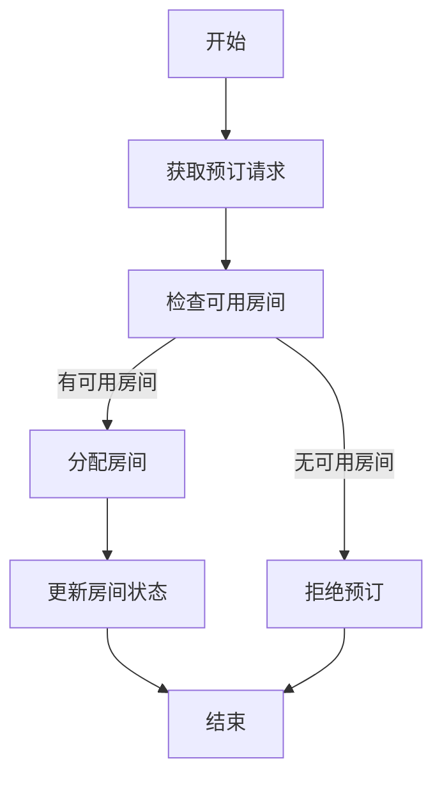
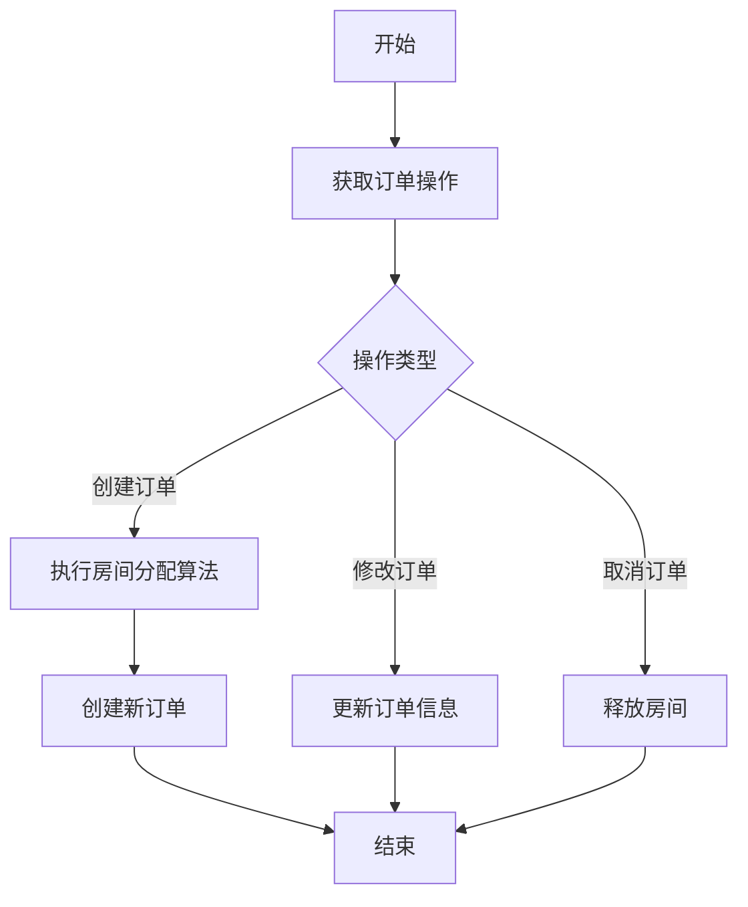
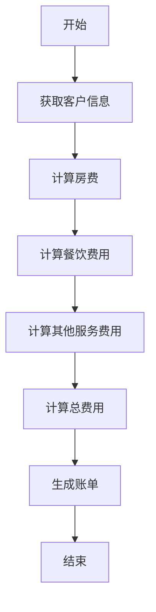

# 小型酒店管理系统详细设计与具体代码实现

## 1.背景介绍

在当今时代,旅游业的蓬勃发展使得酒店管理变得越来越重要。为了提高酒店的运营效率和客户满意度,许多酒店开始采用计算机管理系统。一个良好的酒店管理系统不仅可以简化日常运营,还能为客户提供更好的服务体验。

本文将介绍一个小型酒店管理系统的详细设计和具体代码实现,该系统包括客房管理、订单管理、财务管理等多个模块。我们将探讨系统的核心概念、算法原理、数学模型,并提供实际应用场景、工具推荐和未来发展趋势等内容。

## 2.核心概念与联系

酒店管理系统涉及多个核心概念,它们之间存在着紧密的联系。以下是一些关键概念:

### 2.1 客房管理

客房管理模块负责管理酒店的房间信息,包括房间类型、状态、价格等。它还需要处理客房预订、入住和退房等操作。

### 2.2 订单管理

订单管理模块负责处理客户的预订请求,包括创建订单、修改订单、取消订单等功能。它需要与客房管理模块协作,以确保房间的可用性。

### 2.3 财务管理

财务管理模块负责记录酒店的收入和支出,包括房费、餐饮费用、其他服务费用等。它需要与客房管理和订单管理模块交互,以获取相关数据。

### 2.4 客户管理

客户管理模块负责维护客户信息,包括个人资料、历史订单、积分等。它可以与其他模块集成,为客户提供个性化服务。

### 2.5 员工管理

员工管理模块负责管理酒店员工的信息,包括职位、工作安排、薪资等。它可以与其他模块集成,以便于工作分配和绩效考核。

这些核心概念相互关联,共同构成了一个完整的酒店管理系统。下面我们将详细探讨系统的设计和实现。

## 3.核心算法原理具体操作步骤

酒店管理系统的核心算法包括房间分配算法、订单处理算法和财务计算算法等。

### 3.1 房间分配算法

房间分配算法负责将客户的预订请求分配到合适的房间。它需要考虑多个因素,如房间类型、入住时间、离店时间等。以下是一种常见的房间分配算法流程:



1. 获取客户的预订请求,包括入住时间、离店时间、房间类型等信息。
2. 检查在请求的时间段内是否有符合条件的可用房间。
3. 如果有可用房间,则分配一个合适的房间给客户,并更新该房间的状态为"已预订"。
4. 如果没有可用房间,则拒绝该预订请求。

该算法的时间复杂度为O(n),其中n是可用房间的数量。在实际实现中,我们可以使用数据结构(如哈希表或树)来加速查找过程。

### 3.2 订单处理算法

订单处理算法负责处理客户的订单操作,包括创建订单、修改订单和取消订单等。以下是一种常见的订单处理算法流程:



1. 获取客户的订单操作,包括操作类型(创建、修改或取消)和相关信息。
2. 根据操作类型执行相应的操作:
   - 创建订单:执行房间分配算法,如果有可用房间,则创建新订单。
   - 修改订单:更新订单信息,如入住时间、离店时间等。
   - 取消订单:释放已分配的房间,将其状态设置为"可用"。
3. 更新相关数据,如客户信息、房间状态等。

该算法的时间复杂度取决于具体操作,通常为O(1)或O(n),其中n是可用房间的数量。

### 3.3 财务计算算法

财务计算算法负责计算客户的费用,包括房费、餐饮费用、其他服务费用等。以下是一种常见的财务计算算法流程:



1. 获取客户的相关信息,如入住时间、离店时间、消费记录等。
2. 计算房费,通常根据房间类型和入住天数计算。
3. 计算餐饮费用,根据客户的餐饮消费记录计算。
4. 计算其他服务费用,如洗衣、租车等。
5. 将上述费用相加,得到客户的总费用。
6. 根据总费用生成账单,供客户支付。

该算法的时间复杂度通常为O(1),因为计算过程相对简单。但是,如果需要处理大量客户数据,可能需要优化算法或使用并行计算等技术。

## 4.数学模型和公式详细讲解举例说明

在酒店管理系统中,我们可以使用一些数学模型和公式来优化系统的性能和决策。

### 4.1 房间供需预测模型

为了更好地管理房间资源,我们可以使用时间序列分析和机器学习技术来预测未来一段时间内的房间供需情况。这可以帮助酒店做出合理的定价策略和营销决策。

一种常见的房间供需预测模型是基于历史数据的时间序列模型,例如自回归移动平均模型(ARIMA)。ARIMA模型的基本形式如下:

$$
y_t = c + \phi_1 y_{t-1} + \phi_2 y_{t-2} + ... + \phi_p y_{t-p} + \theta_1 \epsilon_{t-1} + \theta_2 \epsilon_{t-2} + ... + \theta_q \epsilon_{t-q} + \epsilon_t
$$

其中:

- $y_t$ 是时间 $t$ 的观测值
- $c$ 是常数项
- $\phi_1, \phi_2, ..., \phi_p$ 是自回归参数
- $\theta_1, \theta_2, ..., \theta_q$ 是移动平均参数
- $\epsilon_t$ 是时间 $t$ 的残差项

通过对历史数据进行拟合,我们可以估计出模型参数,并利用该模型预测未来的房间需求。

另一种常见的方法是使用机器学习算法,如随机森林、梯度增强树等,将多个影响因素(如节假日、天气、活动等)作为特征,对房间需求进行预测。

### 4.2 收益管理模型

为了最大化酒店的收益,我们可以使用收益管理模型来优化定价策略。一种常见的模型是基于线性规划的收益管理模型。

假设我们有 $n$ 种房间类型,每种房间类型有 $c_i$ 个可用房间,售价为 $p_i$。我们的目标是最大化总收益,同时满足房间供给的约束条件。该问题可以表示为以下线性规划模型:

$$
\begin{aligned}
\max \quad & \sum_{i=1}^n p_i x_i \\
\text{s.t.} \quad & \sum_{i=1}^n x_i \leq \sum_{i=1}^n c_i \\
& x_i \geq 0, \quad i = 1, 2, \ldots, n
\end{aligned}
$$

其中 $x_i$ 表示第 $i$ 种房间类型的销售量。

通过求解该线性规划问题,我们可以得到每种房间类型的最优销售量,从而确定定价策略和销售策略。

在实际应用中,我们可以根据具体情况调整模型,例如考虑不同时段的需求、客户类型等因素,以获得更准确的结果。

## 5.项目实践:代码实例和详细解释说明

为了更好地理解酒店管理系统的实现,我们将提供一些核心模块的代码示例和详细解释。这些示例使用Python编写,但是核心思想也可以应用于其他编程语言。

### 5.1 客房管理模块

客房管理模块负责管理酒店的房间信息,包括房间类型、状态、价格等。以下是一个简化的Python实现:

```python
class Room:
    def __init__(self, room_number, room_type, price):
        self.room_number = room_number
        self.room_type = room_type
        self.price = price
        self.status = 'available'
        self.check_in_date = None
        self.check_out_date = None

class RoomManager:
    def __init__(self):
        self.rooms = []

    def add_room(self, room_number, room_type, price):
        room = Room(room_number, room_type, price)
        self.rooms.append(room)

    def check_availability(self, room_type, check_in_date, check_out_date):
        available_rooms = [room for room in self.rooms
                            if room.room_type == room_type
                            and room.status == 'available'
                            and (room.check_in_date is None or room.check_out_date < check_in_date)
                            and (room.check_in_date is None or check_out_date < room.check_in_date)]
        return available_rooms

    def book_room(self, room, check_in_date, check_out_date):
        if room.status == 'available':
            room.status = 'booked'
            room.check_in_date = check_in_date
            room.check_out_date = check_out_date
            return True
        else:
            return False

    def check_out(self, room):
        if room.status == 'booked':
            room.status = 'available'
            room.check_in_date = None
            room.check_out_date = None
            return True
        else:
            return False
```

在这个示例中,我们定义了两个类:`Room`和`RoomManager`。

- `Room`类表示一个房间,包含房间号、房间类型、价格、状态、入住日期和离店日期等属性。
- `RoomManager`类负责管理所有房间,提供添加房间、检查可用房间、预订房间和退房等功能。

我们可以使用以下代码创建一个`RoomManager`实例并执行相关操作:

```python
# 创建RoomManager实例
room_manager = RoomManager()

# 添加房间
room_manager.add_room(101, 'standard', 100)
room_manager.add_room(102, 'deluxe', 150)
room_manager.add_room(103, 'suite', 200)

# 检查可用房间
check_in_date = datetime.date(2023, 6, 1)
check_out_date = datetime.date(2023, 6, 3)
available_rooms = room_manager.check_availability('standard', check_in_date, check_out_date)
print(f"Available standard rooms: {[room.room_number for room in available_rooms]}")

# 预订房间
room = available_rooms[0]
if room_manager.book_room(room, check_in_date, check_out_date):
    print(f"Room {room.room_number} booked successfully.")
else:
    print(f"Failed to book room {room.room_number}.")

# 退房
if room_manager.check_out(room):
    print(f"Room {room.room_number} checked out successfully.")
else:
    print(f"Failed to check out room {room.room_number}.")
```

这个示例展示了如何创建房间、检查可用房间、预订房间和退房等操作。您可以根据实际需求扩展和修改这个模块。

### 5.2 订单管理模块

订单管理模块负责处理客户的预订请求,包括创建订单、修改订单和取消订单等功能。以下是一个简化的Python实现:

```python
class Order:
    def __init__(self, order_id, customer_name, room, check_in_date, check_out_date):
        self.order_id = order_id
        self.customer_name = customer_name
        self.room = room
        self.check_in_date = check_in_date
        self.check_out_date = check_out_date