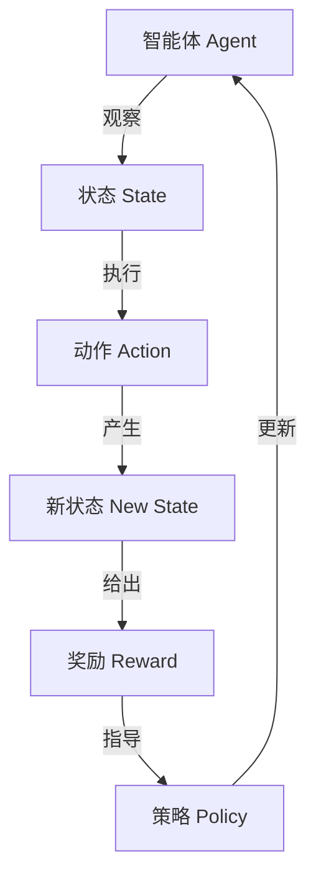

# 强化学习(Reinforcement Learning) - 原理与代码实例讲解

## 1.背景介绍

强化学习(Reinforcement Learning, RL)是机器学习的一个重要分支,它赋予了智能体(Agent)在一个不确定的环境中通过试错来学习并优化其行为的能力。与监督学习和无监督学习不同,强化学习没有提供明确的输入-输出数据对,而是专注于如何基于反馈信号(Reward)来学习一系列行为序列,以最大化预期的长期回报。

RL的概念源于心理学中的操作条件反射理论,并在20世纪50年代首次应用于机器学习领域。近年来,随着深度学习的兴起,强化学习在多个领域取得了突破性进展,如AlphaGo战胜人类顶尖棋手、Dota2人工智能战胜世界冠军队伍、机器人控制等。

强化学习广泛应用于游戏、机器人控制、自动驾驶、自然语言处理、计算机系统优化等诸多领域,展现出巨大的应用前景。本文将深入探讨强化学习的核心概念、算法原理、数学模型以及实际应用场景,并提供代码实例帮助读者更好地理解和掌握这一强大的机器学习技术。

## 2.核心概念与联系

强化学习系统通常由以下几个核心组件构成:

### 2.1 智能体(Agent)

智能体是强化学习系统中的主体,它通过与环境交互来学习并优化其行为策略。智能体可以观察环境的状态,并根据当前状态选择执行一个动作。

### 2.2 环境(Environment)

环境是智能体所处的外部世界,它会根据智能体的动作产生新的状态,并给出相应的奖励或惩罚信号。环境可以是确定性的或随机的,部分可观测或完全可观测。

### 2.3 状态(State)

状态是对环境的数学抽象描述,它反映了环境在某个时刻的情况。状态通常由一个或多个变量组成,可以是离散值或连续值。

### 2.4 动作(Action)

动作是智能体在当前状态下可以采取的行为选择。动作的空间可以是离散的或连续的,取决于问题的性质。

### 2.5 奖励(Reward)

奖励是环境对智能体行为的反馈信号,它是一个标量值,用于指导智能体朝着期望的方向优化其策略。奖励可以是正值(表示期望的行为)、负值(表示不期望的行为)或零值(表示中性行为)。

### 2.6 策略(Policy)

策略是智能体在每个状态下选择动作的规则或函数映射。策略可以是确定性的(每个状态只有一个动作)或随机的(每个状态有多个动作的概率分布)。强化学习的目标就是学习一个最优策略,使得在给定的环境中获得最大的预期长期回报。

上述概念之间的关系可以用下面的流程图来表示:

## 3.核心算法原理具体操作步骤

强化学习算法的核心思想是通过试错来学习,根据获得的奖励信号不断优化策略,以最大化预期的长期回报。主要算法包括价值迭代(Value Iteration)、策略迭代(Policy Iteration)、时序差分学习(Temporal Difference Learning)和深度强化学习(Deep Reinforcement Learning)等。

### 3.1 价值迭代算法

价值迭代算法是一种基于动态规划的强化学习算法,它通过不断更新状态价值函数(Value Function)来逼近最优策略。算法的具体步骤如下:

1. 初始化状态价值函数 $V(s)$ 为任意值(通常为0)
2. 对每个状态 $s$,计算其价值函数:
   $$V(s) \leftarrow \max_{a} \sum_{s'} P(s'|s,a) [R(s,a,s') + \gamma V(s')]$$
   其中 $P(s'|s,a)$ 是从状态 $s$ 执行动作 $a$ 转移到状态 $s'$ 的概率, $R(s,a,s')$ 是相应的奖励, $\gamma$ 是折现因子。
3. 重复步骤2,直到价值函数收敛
4. 从价值函数导出最优策略 $\pi^*(s) = \arg\max_a \sum_{s'} P(s'|s,a)[R(s,a,s') + \gamma V(s')]$

### 3.2 策略迭代算法

策略迭代算法直接学习最优策略,包括两个核心步骤:策略评估(Policy Evaluation)和策略改进(Policy Improvement)。算法步骤如下:

1. 初始化一个随机策略 $\pi_0$
2. 策略评估: 对于当前策略 $\pi_i$,计算其状态价值函数 $V^{\pi_i}$
   $$V^{\pi_i}(s) = \sum_{a} \pi_i(a|s) \sum_{s'} P(s'|s,a) [R(s,a,s') + \gamma V^{\pi_i}(s')]$$
3. 策略改进: 基于新的价值函数,构建一个改进的贪婪策略 $\pi_{i+1}$
   $$\pi_{i+1}(s) = \arg\max_a \sum_{s'} P(s'|s,a)[R(s,a,s') + \gamma V^{\pi_i}(s')]$$
4. 重复步骤2和3,直到策略收敛

### 3.3 时序差分学习

时序差分学习(Temporal Difference Learning, TD Learning)是一种基于采样的强化学习算法,它通过蒙特卡罗采样来估计价值函数,无需知道环境的转移概率。著名的TD算法包括Sarsa、Q-Learning等。以Q-Learning为例,算法步骤如下:

1. 初始化Q函数 $Q(s,a)$ 为任意值(通常为0)
2. 对每个状态-动作对 $(s,a)$,更新Q函数:
   $$Q(s,a) \leftarrow Q(s,a) + \alpha [r + \gamma \max_{a'} Q(s',a') - Q(s,a)]$$
   其中 $\alpha$ 是学习率, $r$ 是获得的即时奖励, $\gamma$ 是折现因子, $s'$ 是执行动作 $a$ 后的新状态。
3. 重复步骤2,直到Q函数收敛
4. 从Q函数导出最优策略 $\pi^*(s) = \arg\max_a Q(s,a)$

### 3.4 深度强化学习

深度强化学习(Deep Reinforcement Learning, DRL)是将深度神经网络引入强化学习,用于近似价值函数或策略函数。DRL算法可以处理高维观测数据(如图像、视频等),并在复杂环境中取得出色表现。著名的DRL算法包括深度Q网络(Deep Q-Network, DQN)、策略梯度(Policy Gradient)等。

以DQN为例,算法步骤如下:

1. 初始化一个深度神经网络 $Q(s,a;\theta)$ 来近似Q函数,其中 $\theta$ 是网络参数
2. 使用经验回放(Experience Replay)存储智能体与环境的交互数据 $(s,a,r,s')$
3. 从经验回放缓冲区中采样一个小批量数据 $B$
4. 计算目标Q值 $y = r + \gamma \max_{a'} Q(s',a';\theta^-)$,其中 $\theta^-$ 是目标网络参数(用于稳定训练)
5. 优化损失函数 $L(\theta) = \mathbb{E}_{(s,a,r,s')\sim B}[(y - Q(s,a;\theta))^2]$,更新网络参数 $\theta$
6. 重复步骤3-5,直到收敛

## 4.数学模型和公式详细讲解举例说明

强化学习的数学模型通常基于马尔可夫决策过程(Markov Decision Process, MDP),用于形式化描述智能体与环境的交互过程。

### 4.1 马尔可夫决策过程

马尔可夫决策过程是一个五元组 $\langle S, A, P, R, \gamma \rangle$,其中:

- $S$ 是有限的状态集合
- $A$ 是有限的动作集合
- $P(s'|s,a)$ 是状态转移概率,表示从状态 $s$ 执行动作 $a$ 转移到状态 $s'$ 的概率
- $R(s,a,s')$ 是奖励函数,表示从状态 $s$ 执行动作 $a$ 转移到状态 $s'$ 获得的即时奖励
- $\gamma \in [0,1)$ 是折现因子,用于权衡即时奖励和长期回报的权重

在MDP中,智能体的目标是学习一个最优策略 $\pi^*$,使得在任意初始状态 $s_0$ 下,预期的长期回报(Discounted Return)最大化:

$$G_t = \sum_{k=0}^\infty \gamma^k r_{t+k+1}$$
$$\pi^* = \arg\max_\pi \mathbb{E}_\pi[G_t|s_0]$$

其中 $r_{t+k+1}$ 是在时刻 $t+k+1$ 获得的即时奖励。

### 4.2 价值函数和贝尔曼方程

价值函数(Value Function)是评估一个策略的重要工具,它表示在当前状态下执行该策略所能获得的预期长期回报。有两种价值函数:

- 状态价值函数 $V^\pi(s)$: 表示在状态 $s$ 下执行策略 $\pi$ 所能获得的预期长期回报
- 状态-动作价值函数 $Q^\pi(s,a)$: 表示在状态 $s$ 下执行动作 $a$,之后再执行策略 $\pi$ 所能获得的预期长期回报

价值函数满足贝尔曼方程(Bellman Equation):

$$V^\pi(s) = \sum_a \pi(a|s) \sum_{s'} P(s'|s,a) [R(s,a,s') + \gamma V^\pi(s')]$$
$$Q^\pi(s,a) = \sum_{s'} P(s'|s,a) [R(s,a,s') + \gamma \sum_{a'} \pi(a'|s') Q^\pi(s',a')]$$

通过解贝尔曼方程,我们可以获得最优价值函数 $V^*(s)$ 和 $Q^*(s,a)$,进而导出最优策略 $\pi^*(s) = \arg\max_a Q^*(s,a)$。

### 4.3 策略梯度算法

策略梯度(Policy Gradient)算法是一种直接优化策略函数的方法,它通过计算策略函数相对于其参数的梯度,并沿着梯度方向更新参数,从而最大化预期的长期回报。

设策略函数为 $\pi_\theta(a|s)$,其中 $\theta$ 是参数向量。目标函数为:

$$J(\theta) = \mathbb{E}_{\pi_\theta}[G_t] = \mathbb{E}_{\pi_\theta}\left[\sum_{k=0}^\infty \gamma^k r_{t+k+1}\right]$$

根据策略梯度定理,目标函数的梯度可以写为:

$$\nabla_\theta J(\theta) = \mathbb{E}_{\pi_\theta}\left[\sum_{t=0}^\infty \nabla_\theta \log\pi_\theta(a_t|s_t)Q^{\pi_\theta}(s_t,a_t)\right]$$

通过蒙特卡罗采样估计梯度,并使用随机梯度上升法更新策略参数 $\theta$,就可以逐步优化策略函数。

以上是强化学习中一些核心的数学模型和公式,在实际应用中还有许多变体和扩展。下面通过代码实例来进一步说明这些概念和算法。

## 5.项目实践：代码实例和详细解释说明

为了更好地理解强化学习的原理和实现,我们将使用Python和OpenAI Gym环境构建一个简单的示例项目。该项目将实现一个基于Q-Learning算法的智能体,用于解决经典的"冰湖环游"(FrozenLake)问题。

### 5.1 问题描述

"冰湖环游"是一个格子世界游戏,智能体的目标是从起点安全地到达终点,同时避免掉入冰湖中