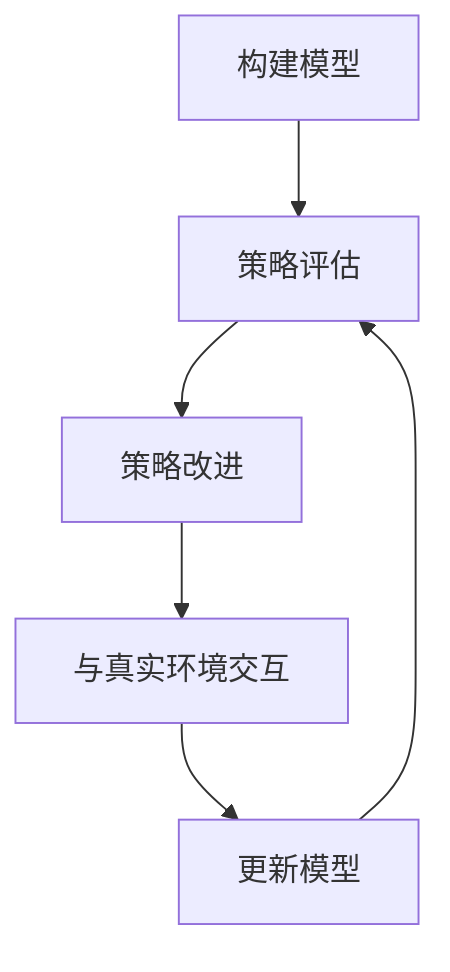

# 强化学习Reinforcement Learning中基于模拟的优化方法研讨

## 1.背景介绍

强化学习(Reinforcement Learning, RL)是机器学习的一个重要分支,旨在让智能体(Agent)通过与环境(Environment)的交互来学习如何采取最优策略(Policy),以最大化预期的长期累积奖励。与监督学习和无监督学习不同,强化学习没有提供标准答案,智能体需要通过试错来探索环境,并根据获得的奖励信号来调整策略。

基于模拟的优化方法是强化学习中的一种重要方法,它通过构建环境模型来近似真实环境,从而减少与真实环境交互的次数,加快学习过程。这种方法具有以下优点:

1. 减少与真实环境交互的成本和风险
2. 可以在安全的模拟环境中进行大量试验
3. 加快策略优化的收敛速度

然而,基于模拟的优化方法也面临一些挑战,如模型偏差、探索与利用权衡等。本文将深入探讨基于模拟的优化方法的原理、算法和应用,为读者提供全面的理解和实践指导。

## 2.核心概念与联系

### 2.1 马尔可夫决策过程(Markov Decision Process, MDP)

马尔可夫决策过程是强化学习的数学基础,它描述了智能体与环境之间的交互过程。一个MDP可以用一个五元组 $(S, A, P, R, \gamma)$ 来表示,其中:

- $S$ 是状态空间,表示环境可能的状态集合
- $A$ 是动作空间,表示智能体可以采取的动作集合
- $P(s' | s, a)$ 是状态转移概率,表示在状态 $s$ 下采取动作 $a$ 后,转移到状态 $s'$ 的概率
- $R(s, a, s')$ 是奖励函数,表示在状态 $s$ 下采取动作 $a$ 后,转移到状态 $s'$ 时获得的即时奖励
- $\gamma \in [0, 1)$ 是折扣因子,用于权衡即时奖励和长期累积奖励的重要性

智能体的目标是找到一个最优策略 $\pi^*(a|s)$,使得在该策略下的期望累积奖励最大化:

$$J(\pi) = \mathbb{E}_{\pi}\left[\sum_{t=0}^{\infty} \gamma^t r_t\right]$$

其中 $r_t$ 是在时间步 $t$ 获得的即时奖励。

### 2.2 模型与模型无关方法

在强化学习中,我们可以根据是否构建环境模型将算法分为基于模型(Model-Based)和无模型(Model-Free)两大类。

- 基于模型的方法首先学习环境的转移概率 $P(s' | s, a)$ 和奖励函数 $R(s, a, s')$,然后基于这个模型进行策略优化。
- 无模型的方法直接从与环境的交互中学习最优策略,不需要显式构建环境模型。

基于模拟的优化方法属于基于模型的范畴,它通过构建模型来近似真实环境,从而减少与真实环境交互的次数,加快学习过程。

## 3.核心算法原理具体操作步骤

基于模拟的优化方法通常包括以下几个核心步骤:

1. **构建模型**: 根据与真实环境的交互数据,学习环境的转移概率模型 $\hat{P}(s' | s, a)$ 和奖励模型 $\hat{R}(s, a, s')$。常用的模型学习方法包括高斯过程回归、核回归、神经网络等。

2. **策略评估**: 基于构建的环境模型,使用动态规划或蒙特卡罗方法评估当前策略 $\pi$ 在模型中的价值函数 $V^{\pi}(s)$ 或 $Q^{\pi}(s, a)$。

3. **策略改进**: 根据评估得到的价值函数,使用策略迭代或价值迭代等方法优化策略 $\pi$,得到更好的策略 $\pi'$。

4. **与真实环境交互**: 使用优化后的策略 $\pi'$ 与真实环境进行一定次数的交互,收集新的数据。

5. **更新模型**: 利用新收集的数据更新环境模型 $\hat{P}$ 和 $\hat{R}$。

6. **重复上述步骤**: 重复步骤2-5,直到策略收敛或达到预期性能。

这个过程可以用下面的流程图来描述:

在实际应用中,基于模拟的优化方法还需要解决一些关键问题,如模型偏差、探索与利用权衡等,我们将在后面章节中详细讨论。

## 4.数学模型和公式详细讲解举例说明

### 4.1 模型学习

构建环境模型是基于模拟的优化方法的关键步骤。常用的模型学习方法包括:

1. **高斯过程回归(Gaussian Process Regression, GPR)**: 高斯过程是一种非参数概率模型,可以用于回归任务。在强化学习中,GPR可以用于学习状态转移模型 $P(s' | s, a)$ 和奖励模型 $R(s, a, s')$。GPR的优点是可以提供不确定性估计,缺点是计算复杂度较高,难以应用于高维状态空间。

2. **核回归(Kernel Regression)**: 核回归是一种非参数回归方法,通过定义合适的核函数来拟合目标函数。在强化学习中,可以用核回归来学习状态转移模型和奖励模型。相比GPR,核回归计算复杂度较低,但无法提供不确定性估计。

3. **神经网络(Neural Network)**: 近年来,神经网络在模型学习中得到了广泛应用。通过设计合适的网络结构和损失函数,神经网络可以同时学习状态转移模型和奖励模型。神经网络模型具有强大的拟合能力,但需要大量的训练数据,并且存在过拟合的风险。

4. **概率神经网络(Probabilistic Neural Network)**: 概率神经网络是一种结合了神经网络和概率模型的方法,可以同时学习确定性的模型输出和不确定性估计。在强化学习中,概率神经网络可以用于学习状态转移模型和奖励模型,并提供模型不确定性信息。

无论采用何种模型学习方法,都需要从与真实环境的交互数据中学习。假设我们收集了一个数据集 $\mathcal{D} = \{(s_i, a_i, s_i', r_i)\}_{i=1}^N$,其中 $(s_i, a_i, s_i', r_i)$ 表示在状态 $s_i$ 下采取动作 $a_i$ 后,转移到状态 $s_i'$ 并获得即时奖励 $r_i$。我们可以将状态转移模型和奖励模型分别表示为:

$$\hat{P}(s' | s, a) = f_{\theta_P}(s, a, s')$$
$$\hat{R}(s, a, s') = f_{\theta_R}(s, a, s')$$

其中 $f_{\theta_P}$ 和 $f_{\theta_R}$ 是具有参数 $\theta_P$ 和 $\theta_R$ 的模型函数,可以是高斯过程、核函数或神经网络等。我们可以通过最小化以下损失函数来学习模型参数:

$$\mathcal{L}_P(\theta_P) = \sum_{i=1}^N \left\lVert \hat{P}(s_i' | s_i, a_i) - 1 \right\rVert^2$$
$$\mathcal{L}_R(\theta_R) = \sum_{i=1}^N \left\lVert \hat{R}(s_i, a_i, s_i') - r_i \right\rVert^2$$

通过优化上述损失函数,我们可以得到最优的模型参数 $\theta_P^*$ 和 $\theta_R^*$,从而构建出状态转移模型 $\hat{P}^*(s' | s, a)$ 和奖励模型 $\hat{R}^*(s, a, s')$。

### 4.2 策略评估

在基于模拟的优化方法中,我们需要基于构建的环境模型来评估当前策略的价值函数。常用的策略评估方法包括:

1. **动态规划(Dynamic Programming, DP)**: 动态规划是一种精确的策略评估方法,适用于小规模的MDP问题。对于基于模型的强化学习,我们可以使用值迭代(Value Iteration)或策略迭代(Policy Iteration)算法来计算最优价值函数或最优策略。

2. **蒙特卡罗方法(Monte Carlo Methods)**: 蒙特卡罗方法是一种基于采样的策略评估方法,通过在模型中进行多次模拟,估计当前策略的价值函数。蒙特卡罗方法的优点是无偏且易于实现,缺点是方差较大,需要大量的模拟轨迹。

3. **时序差分学习(Temporal Difference Learning, TD Learning)**: TD学习是一种结合了动态规划和蒙特卡罗方法的策略评估方法。TD学习通过引入自助更新(Bootstrapping)的思想,可以在模型中高效地估计价值函数,具有较低的方差和偏差。

假设我们已经构建了状态转移模型 $\hat{P}(s' | s, a)$ 和奖励模型 $\hat{R}(s, a, s')$,我们可以使用TD学习算法来估计当前策略 $\pi$ 的状态价值函数 $V^{\pi}(s)$。TD学习的更新规则如下:

$$V(s_t) \leftarrow V(s_t) + \alpha \left[r_t + \gamma V(s_{t+1}) - V(s_t)\right]$$

其中 $\alpha$ 是学习率, $\gamma$ 是折扣因子, $r_t$ 是在时间步 $t$ 获得的即时奖励, $s_{t+1}$ 是根据模型 $\hat{P}$ 采样得到的下一个状态。通过不断地应用上述更新规则,我们可以逐步改进状态价值函数的估计,直到收敛。

类似地,我们也可以使用TD学习来估计当前策略的动作价值函数 $Q^{\pi}(s, a)$,更新规则如下:

$$Q(s_t, a_t) \leftarrow Q(s_t, a_t) + \alpha \left[r_t + \gamma \max_{a'} Q(s_{t+1}, a') - Q(s_t, a_t)\right]$$

### 4.3 策略改进

在基于模拟的优化方法中,我们可以利用评估得到的价值函数来改进当前策略。常用的策略改进方法包括:

1. **贪婪策略改进(Greedy Policy Improvement)**: 贪婪策略改进是一种简单而有效的方法,它根据当前的价值函数选择在每个状态下获得最大期望回报的动作。对于状态价值函数 $V(s)$,贪婪策略 $\pi'$ 定义为:

$$\pi'(s) = \arg\max_{a} \sum_{s'} \hat{P}(s' | s, a) \left[\hat{R}(s, a, s') + \gamma V(s')\right]$$

对于动作价值函数 $Q(s, a)$,贪婪策略 $\pi'$ 定义为:

$$\pi'(s) = \arg\max_{a} Q(s, a)$$

2. **策略梯度方法(Policy Gradient Methods)**: 策略梯度方法是一种基于梯度下降的策略优化方法,通过计算策略的梯度来直接调整策略参数。对于参数化的策略 $\pi_{\theta}(a|s)$,我们可以计算策略梯度如下:

$$\nabla_{\theta} J(\theta) = \mathbb{E}_{\pi_{\theta}}\left[\sum_{t=0}^{\infty} \nabla_{\theta} \log \pi_{\theta}(a_t | s_t) Q^{\pi_{\theta}}(s_t, a_t)\right]$$

其中 $J(\theta)$ 是策略的期望累积奖励, $Q^{\pi_{\theta}}(s_t, a_t)$ 是在策略 $\pi_{\theta}$ 下的动作价值函数。通过沿着策略梯度的方向更新策略参数 $\theta$,我们可以逐步提高策略的期望累积奖励。

3