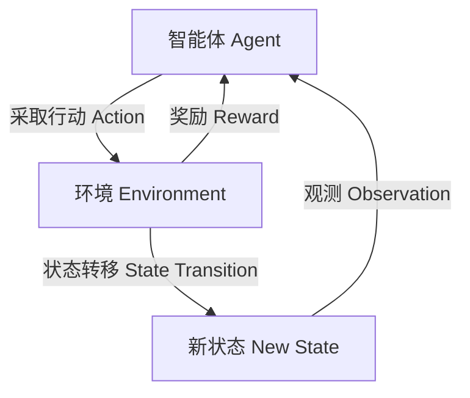

# 强化学习(Reinforcement Learning)在智能制造中的角色与价值

## 1.背景介绍

### 1.1 智能制造的兴起

随着人工智能(AI)和机器学习(ML)技术的不断发展,智能制造正在成为制造业的一股新兴力量。智能制造旨在通过将先进的AI和ML算法与传统制造过程相结合,提高生产效率、优化资源利用、降低成本并提高产品质量。在这种背景下,强化学习(Reinforcement Learning,RL)作为机器学习的一个重要分支,正在为智能制造带来革命性的变革。

### 1.2 强化学习的定义

强化学习是一种基于奖励或惩罚的机器学习范式,其中智能体(Agent)通过与环境(Environment)的交互来学习如何采取最优行动,从而最大化预期的长期回报。与监督学习和无监督学习不同,强化学习不需要提供标记数据,而是让智能体自主探索并从经验中学习。

## 2.核心概念与联系

### 2.1 强化学习的核心要素

强化学习系统通常由以下四个核心要素组成:

1. **智能体(Agent)**: 执行行动并与环境交互的决策实体。
2. **环境(Environment)**: 智能体所处的外部世界,智能体的行动会影响环境的状态。
3. **状态(State)**: 描述环境当前情况的一组观测值。
4. **奖励(Reward)**: 环境对智能体采取行动的反馈,用于指导智能体朝着目标方向学习。



### 2.2 强化学习与智能制造的联系

在智能制造中,强化学习可以应用于各种场景,例如:

- 机器人控制和路径规划
- 工厂调度和生产优化
- 预测性维护和故障诊断
- 供应链管理和库存优化

通过将强化学习应用于这些领域,智能制造系统可以自主学习并优化决策,从而提高生产效率、降低成本并提高产品质量。

## 3.核心算法原理具体操作步骤

强化学习算法的核心思想是通过探索和利用的平衡,逐步学习到一个最优策略(Optimal Policy),该策略能够指导智能体在各种状态下采取最佳行动。以下是一些常见的强化学习算法及其原理:

### 3.1 Q-Learning

Q-Learning是一种基于价值迭代(Value Iteration)的强化学习算法,它试图直接估计在给定状态下采取特定行动的价值函数Q(s,a)。算法步骤如下:

1. 初始化Q表格,所有Q(s,a)值设为0或随机值。
2. 对于每个episode:
    - 初始化起始状态s
    - 对于每个时间步:
        - 根据当前Q值选择行动a(通常使用ε-贪婪策略)
        - 执行行动a,获得奖励r和新状态s'
        - 更新Q(s,a)值:
          $$Q(s,a) \leftarrow Q(s,a) + \alpha[r + \gamma\max_{a'}Q(s',a') - Q(s,a)]$$
        - 将s更新为s'
3. 重复步骤2,直到收敛

其中,$\alpha$是学习率,$\gamma$是折现因子。

### 3.2 Sarsa

Sarsa是另一种基于策略迭代(Policy Iteration)的强化学习算法,它直接估计在给定状态下采取特定行动并按照当前策略继续的价值函数Q(s,a)。算法步骤如下:

1. 初始化Q表格和策略$\pi$
2. 对于每个episode:
    - 初始化起始状态s
    - 选择初始行动a,根据策略$\pi$
    - 对于每个时间步:
        - 执行行动a,获得奖励r和新状态s'
        - 选择新行动a',根据策略$\pi$
        - 更新Q(s,a)值:
          $$Q(s,a) \leftarrow Q(s,a) + \alpha[r + \gamma Q(s',a') - Q(s,a)]$$
        - 将s更新为s',a更新为a'
3. 重复步骤2,直到收敛

与Q-Learning相比,Sarsa在更新Q值时使用了实际采取的下一个行动,而不是最大化操作。

### 3.3 Deep Q-Network (DQN)

DQN是结合深度神经网络(Deep Neural Network)和Q-Learning的算法,它能够处理高维观测数据,并通过神经网络逼近Q函数。算法步骤如下:

1. 初始化神经网络Q,用于估计Q(s,a)值
2. 初始化目标网络Q',用于计算目标Q值
3. 初始化经验回放池D
4. 对于每个episode:
    - 初始化起始状态s
    - 对于每个时间步:
        - 根据当前Q网络选择行动a(通常使用ε-贪婪策略)
        - 执行行动a,获得奖励r和新状态s'
        - 将(s,a,r,s')存入经验回放池D
        - 从D中采样一批数据
        - 计算目标Q值:
          $$y = r + \gamma \max_{a'}Q'(s',a')$$
        - 优化Q网络,使Q(s,a)接近y
        - 每隔一定步骤将Q'更新为Q
5. 重复步骤4,直到收敛

DQN通过经验回放池和目标网络的引入,提高了算法的稳定性和收敛性能。

## 4.数学模型和公式详细讲解举例说明

### 4.1 马尔可夫决策过程(Markov Decision Process, MDP)

强化学习问题通常被形式化为马尔可夫决策过程(MDP),它是一种离散时间的随机控制过程。MDP可以用一个五元组$(S, A, P, R, \gamma)$来表示,其中:

- $S$是有限的状态集合
- $A$是有限的行动集合
- $P(s'|s,a)$是状态转移概率,表示在状态$s$下执行行动$a$后转移到状态$s'$的概率
- $R(s,a,s')$是奖励函数,表示在状态$s$下执行行动$a$并转移到状态$s'$时获得的奖励
- $\gamma \in [0,1)$是折现因子,用于权衡即时奖励和长期奖励的重要性

在MDP中,我们的目标是找到一个最优策略$\pi^*$,使得在任意初始状态$s_0$下,按照该策略执行时的期望总奖励最大:

$$\pi^* = \arg\max_\pi \mathbb{E}\left[\sum_{t=0}^\infty \gamma^t R(s_t, a_t, s_{t+1}) | s_0, \pi\right]$$

其中,$a_t \sim \pi(s_t)$表示在状态$s_t$下根据策略$\pi$选择行动$a_t$。

### 4.2 价值函数(Value Function)

为了找到最优策略,我们通常需要估计状态价值函数$V(s)$或行动价值函数$Q(s,a)$。状态价值函数$V(s)$表示在状态$s$下,按照某一策略$\pi$执行时的期望总奖励:

$$V^\pi(s) = \mathbb{E}_\pi\left[\sum_{t=0}^\infty \gamma^t R(s_t, a_t, s_{t+1}) | s_0 = s\right]$$

行动价值函数$Q(s,a)$表示在状态$s$下执行行动$a$,之后按照某一策略$\pi$执行时的期望总奖励:

$$Q^\pi(s,a) = \mathbb{E}_\pi\left[\sum_{t=0}^\infty \gamma^t R(s_t, a_t, s_{t+1}) | s_0 = s, a_0 = a\right]$$

$V^\pi$和$Q^\pi$之间存在如下关系:

$$V^\pi(s) = \sum_{a \in A} \pi(a|s)Q^\pi(s,a)$$
$$Q^\pi(s,a) = R(s,a) + \gamma \sum_{s' \in S} P(s'|s,a)V^\pi(s')$$

通过估计$V^\pi$或$Q^\pi$,我们可以找到最优策略$\pi^*$,使得$V^{\pi^*}(s) = \max_\pi V^\pi(s)$或$Q^{\pi^*}(s,a) = \max_\pi Q^\pi(s,a)$。

### 4.3 策略迭代(Policy Iteration)与价值迭代(Value Iteration)

策略迭代和价值迭代是两种常见的求解MDP的方法:

**策略迭代**包含两个步骤:

1. 策略评估(Policy Evaluation):对于给定的策略$\pi$,计算相应的$V^\pi$或$Q^\pi$
2. 策略改进(Policy Improvement):基于计算出的$V^\pi$或$Q^\pi$,更新策略$\pi$

重复上述两个步骤,直到收敛到最优策略$\pi^*$。

**价值迭代**则直接对$V^*$或$Q^*$进行迭代更新:

$$V^*(s) \leftarrow \max_a \left[R(s,a) + \gamma \sum_{s' \in S} P(s'|s,a)V^*(s')\right]$$
$$Q^*(s,a) \leftarrow R(s,a) + \gamma \sum_{s' \in S} P(s'|s,a)\max_{a'}Q^*(s',a')$$

直到$V^*$或$Q^*$收敛。这种方法计算效率更高,但需要知道MDP的完整信息(状态转移概率和奖励函数)。

## 5.项目实践:代码实例和详细解释说明

为了更好地理解强化学习算法,我们将通过一个简单的网格世界(Gridworld)示例来实现Q-Learning算法。在这个示例中,智能体需要在一个二维网格中找到目标位置。

### 5.1 环境设置

我们首先定义网格世界的环境:

```python
import numpy as np

# 网格大小
GRID_SIZE = 5

# 特殊状态
START = 0
GOAL = GRID_SIZE**2 - 1
OBSTACLES = [1, 3, 4, 5, 8, 10, 13, 17, 19, 21, 23]

# 奖励
REWARD = {
    GOAL: 1.0,
    START: 0.0
}
for obs in OBSTACLES:
    REWARD[obs] = -1.0

# 状态转移概率
def get_next_state(state, action):
    row = state // GRID_SIZE
    col = state % GRID_SIZE
    
    if action == 0: # 上
        next_state = max(state - GRID_SIZE, 0)
    elif action == 1: # 右
        next_state = min(state + 1, GRID_SIZE**2 - 1)
        if next_state // GRID_SIZE > row:
            next_state -= GRID_SIZE
    elif action == 2: # 下
        next_state = min(state + GRID_SIZE, GRID_SIZE**2 - 1)
    else: # 左
        next_state = max(state - 1, 0)
        if next_state // GRID_SIZE < row:
            next_state += GRID_SIZE
    
    return next_state
```

我们定义了网格大小、起始状态、目标状态、障碍物状态以及相应的奖励值。`get_next_state`函数根据当前状态和行动计算下一个状态。

### 5.2 Q-Learning实现

接下来,我们实现Q-Learning算法:

```python
import random

# 超参数
ALPHA = 0.1  # 学习率
GAMMA = 0.9  # 折现因子
EPSILON = 0.1  # 探索率

# Q表格初始化
Q = np.zeros((GRID_SIZE**2, 4))

# 训练
for episode in range(1000):
    state = START
    done = False
    
    while not done:
        # 选择行动
        if random.uniform(0, 1) < EPSILON:
            action = random.randint(0, 3)  # 探索
        else:
            action = np.argmax(Q[state])  # 利用
        
        # 执行行动
        next_state = get_next_state(state, action)
        reward = REWARD.get(next_state, 0.0)
        
        # 更新Q值
        Q[state, action] += ALPHA * (reward + GAMMA * np.max(Q[next_state]) - Q[state, action])
        
        state = next_state
        if state == GOAL:
            done = True

# 测试
state = START
while state != GOAL:
    action = np.argmax(Q[state])
    state = get_next_state(state, action)
    print(f"State: {state}")
```

我们首先初始化Q表格和超参数