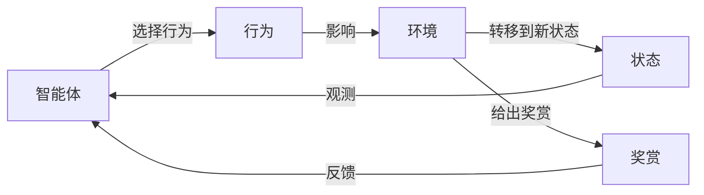

# 强化学习原理与代码实例讲解

## 1.背景介绍

### 1.1 什么是强化学习

强化学习(Reinforcement Learning, RL)是机器学习的一个重要分支,它研究如何基于环境反馈来学习最优策略,以实现给定目标。不同于监督学习需要大量标注数据,强化学习通过与环境的交互来获取经验,并根据获得的奖赏信号来调整策略,从而逐步优化决策序列。

强化学习的核心思想是让智能体(Agent)通过试错来学习,在与环境交互的过程中,智能体根据当前状态选择行为,环境会对这个行为给出反馈(奖赏或惩罚),智能体据此调整策略,最终学习到一个可以获得最大预期累积奖赏的最优策略。

### 1.2 强化学习的应用场景

强化学习在很多领域有广泛应用,尤其在决策序列优化问题中表现出色:

- 机器人控制
- 游戏AI
- 自动驾驶
- 资源管理
- 投资组合优化
- 对话系统
- ...

## 2.核心概念与联系

强化学习系统通常由以下几个核心要素组成:

### 2.1 智能体(Agent)

智能体是强化学习系统的决策主体,它根据当前状态选择行为,与环境交互并获得反馈。智能体的目标是学习一个最优策略,使得在给定环境下获得的长期累积奖赏最大化。

### 2.2 环境(Environment) 

环境是指智能体所处的外部世界,包括所有可能的状态和智能体可执行的行为。环境会根据智能体的行为给出相应的奖赏或惩罚,并将系统转移到下一个状态。

### 2.3 状态(State)

状态是对环境的数学抽象描述,通常用一个向量来表示。状态包含了智能体所需的全部信息,以便做出合理的决策。

### 2.4 行为(Action)

行为是智能体在当前状态下可执行的操作,会导致环境状态的转移。



### 2.5 策略(Policy)

策略是智能体在每个状态下选择行为的规则或映射函数,记为$\pi$。确定性策略将状态直接映射到行为,随机策略会给出每个行为的概率分布。

### 2.6 奖赏(Reward)

奖赏是环境对智能体行为的评价反馈,是一个标量值,可正可负。奖赏信号是强化学习的关键,它引导智能体朝着获取更高奖赏的方向优化策略。

### 2.7 价值函数(Value Function)

价值函数评估一个状态或状态-行为对在遵循某策略时的长期累积奖赏的期望值。状态价值函数$V^\pi(s)$表示从状态$s$开始遵循策略$\pi$所能获得的预期回报,而状态-行为价值函数$Q^\pi(s,a)$表示从状态$s$执行行为$a$,之后遵循策略$\pi$所能获得的预期回报。

### 2.8 折扣因子(Discount Factor)

由于未来的奖赏比当前奖赏重要性低,需要引入折扣因子$\gamma \in [0,1)$来衡量未来奖赏的重要程度。$\gamma$越大,智能体越重视远期奖赏。

## 3.核心算法原理具体操作步骤  

强化学习算法主要分为三大类:基于价值的算法、基于策略的算法和基于Actor-Critic的算法。我们以Q-Learning和Deep Q-Network(DQN)为例,介绍基于价值函数的算法原理和具体操作步骤。

### 3.1 Q-Learning算法

Q-Learning是一种基于价值迭代的强化学习算法,通过不断更新状态-行为价值函数$Q(s,a)$来逐步找到最优策略。其核心更新规则为:

$$Q(s_t,a_t) \leftarrow Q(s_t,a_t) + \alpha[r_t + \gamma\max_aQ(s_{t+1},a) - Q(s_t,a_t)]$$

其中$\alpha$为学习率,$\gamma$为折扣因子。算法步骤如下:

1. 初始化$Q(s,a)$为任意值
2. 对每个episode:
    - 初始化状态$s$
    - 对每个时间步:
        - 根据$\epsilon$-贪婪策略选择行为$a$
        - 执行行为$a$,观测奖赏$r$和新状态$s'$
        - 更新$Q(s,a)$值
        - $s \leftarrow s'$
    - 直到达到终止状态

### 3.2 Deep Q-Network (DQN)

传统Q-Learning使用表格存储Q值,无法应对高维状态空间。DQN算法通过使用神经网络来拟合Q函数,解决了高维状态的问题。DQN算法流程:

1. 初始化replay buffer D
2. 初始化Q网络参数$\theta$
3. 对每个episode:
    - 初始化状态$s$
    - 对每个时间步:
        - 根据$\epsilon$-贪婪策略选择行为$a=\max_aQ(s,a;\theta)$
        - 执行行为$a$,观测奖赏$r$和新状态$s'$  
        - 将$(s,a,r,s')$存入D
        - 从D采样batch数据
        - 计算目标Q值$y=r+\gamma\max_{a'}Q(s',a';\theta^-)$
        - 优化损失:$L=\mathbb{E}_{(s,a,r,s')\sim D}[(y-Q(s,a;\theta))^2]$
        - 每隔一定步数同步$\theta^-=\theta$
    - 直到达到终止状态

## 4.数学模型和公式详细讲解举例说明

### 4.1 马尔可夫决策过程(MDP)

强化学习问题通常建模为马尔可夫决策过程(Markov Decision Process, MDP)。MDP由一个五元组$(S, A, P, R, \gamma)$表示:

- $S$是有限状态集合
- $A$是有限行为集合  
- $P(s'|s,a)=\Pr(s_{t+1}=s'|s_t=s,a_t=a)$是状态转移概率
- $R(s,a)$是立即奖赏函数
- $\gamma \in [0,1)$是折扣因子

在MDP中,我们的目标是找到一个最优策略$\pi^*$,使得在任意初始状态$s_0$下,期望累积折扣奖赏最大化:

$$\pi^* = \arg\max_\pi \mathbb{E}_\pi[\sum_{t=0}^\infty \gamma^t R(s_t,a_t)|s_0]$$

### 4.2 Bellman方程

Bellman方程是解决MDP问题的关键,它将价值函数分解为两部分:立即奖赏和折扣的下一状态价值。对于状态价值函数$V^\pi(s)$:

$$V^\pi(s) = \mathbb{E}_\pi[R(s,a) + \gamma V^\pi(s')|s,\pi]$$

对于状态-行为价值函数$Q^\pi(s,a)$:  

$$Q^\pi(s,a) = \mathbb{E}_\pi[R(s,a) + \gamma \sum_{s'\in S}P(s'|s,a)V^\pi(s')|s,a,\pi]$$

最优价值函数$V^*(s)$和$Q^*(s,a)$满足贝尔曼最优方程:

$$V^*(s) = \max_a Q^*(s,a)$$
$$Q^*(s,a) = \mathbb{E}[R(s,a) + \gamma \max_{a'}Q^*(s',a')|s,a]$$

我们可以通过值迭代或策略迭代等方法求解贝尔曼方程,得到最优价值函数和最优策略。

### 4.3 时序差分学习

时序差分(Temporal Difference, TD)学习是一种结合了动态规划和Monte Carlo方法的技术,用于估计价值函数。TD误差被定义为:

$$\delta_t = r_t + \gamma V(s_{t+1}) - V(s_t)$$

我们可以通过最小化TD误差的方式来更新价值函数,TD学习的更新规则为:

$$V(s_t) \leftarrow V(s_t) + \alpha \delta_t$$

其中$\alpha$是学习率。Q-Learning算法实际上是在TD学习的基础上,对状态-行为价值函数Q进行估计和更新。

## 5.项目实践:代码实例和详细解释说明

为了加深对强化学习的理解,我们以经典的"冰湖环游"(FrozenLake)游戏为例,使用Q-Learning算法训练一个智能体通过这个游戏。游戏的目标是从起点安全到达终点,避免掉入冰洞。

### 5.1 导入相关库

```python
import numpy as np
import gym
import random
from collections import deque
```

### 5.2 创建Q-Learning Agent

```python
class QLearningAgent:
    def __init__(self, env, discount_factor=0.95, learning_rate=0.1, epsilon=1.0, epsilon_decay=0.995):
        self.env = env
        self.q_table = np.zeros(env.observation_space.n * env.action_space.n).reshape((env.observation_space.n, env.action_space.n))
        self.discount_factor = discount_factor
        self.learning_rate = learning_rate
        self.epsilon = epsilon
        self.epsilon_decay = epsilon_decay
        
    def choose_action(self, state):
        if random.uniform(0, 1) < self.epsilon:
            action = self.env.action_space.sample()  # Explore
        else:
            action = np.argmax(self.q_table[state, :])  # Exploit
        return action
    
    def learn(self, state, action, reward, next_state, done):
        q_value = self.q_table[state, action]
        next_max_q = np.max(self.q_table[next_state, :])
        td_error = reward + (1 - done) * self.discount_factor * next_max_q - q_value
        self.q_table[state, action] = q_value + self.learning_rate * td_error
        
        if done:
            self.epsilon = max(0.01, self.epsilon * self.epsilon_decay)
```

这段代码定义了一个Q-Learning Agent类,包含以下主要方法:

- `__init__`: 初始化Q表,以及相关参数如折扣因子、学习率、探索率等。
- `choose_action`: 根据当前状态,使用$\epsilon$-贪婪策略选择行为。
- `learn`: 根据TD学习规则,更新Q表中的Q值。

### 5.3 训练智能体

```python
env = gym.make('FrozenLake-v1')
agent = QLearningAgent(env)

num_episodes = 10000
for episode in range(num_episodes):
    state = env.reset()
    done = False
    
    while not done:
        action = agent.choose_action(state)
        next_state, reward, done, _ = env.step(action)
        agent.learn(state, action, reward, next_state, done)
        state = next_state
        
    if episode % 1000 == 0:
        print(f"Episode: {episode}, Epsilon: {agent.epsilon}")
```

这部分代码执行了10000次训练episode,每次episode中:

1. 重置环境,获取初始状态
2. 对于每个时间步:
    - 选择行为
    - 执行行为,获取奖赏和新状态
    - 更新Q表
    - 转移到新状态
3. 打印探索率的变化

### 5.4 测试智能体

```python
state = env.reset()
done = False
rewards = 0

while not done:
    action = np.argmax(agent.q_table[state, :])
    next_state, reward, done, _ = env.step(action)
    rewards += reward
    state = next_state
    env.render()
    
print(f"Total Rewards: {rewards}")
```

最后,我们测试训练好的智能体在游戏中的表现。代码逻辑是:

1. 重置环境,获取初始状态
2. 对于每个时间步:
    - 选择Q值最大的行为
    - 执行行为,获取奖赏和新状态
    - 累计奖赏
    - 转移到新状态
    - 渲染环境
3. 打印总奖赏

通过这个实例,我们可以更好地理解Q-Learning算法的工作原理和实现细节。

## 6.实际应用场景

强化学习在诸多领域有广泛应用,下面列举几个典型的应用场景:

### 6.1 游戏