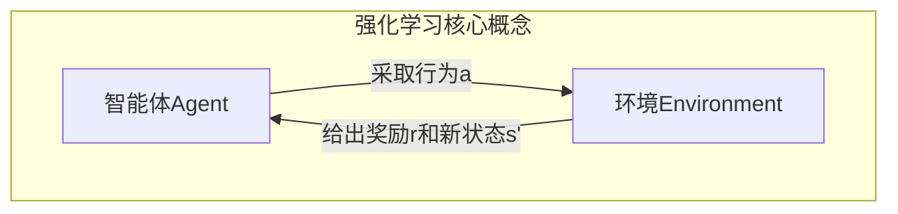
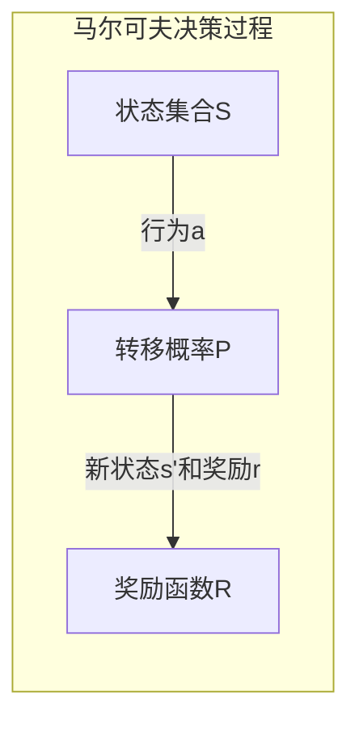
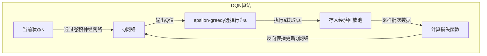

# 强化学习在农业中的应用：精准种植与病虫害防控

## 1.背景介绍

### 1.1 农业的重要性和挑战

农业是人类赖以生存的基础产业,为全球提供食物和其他农产品。然而,当前农业面临着诸多挑战,如气候变化、土地和水资源短缺、病虫害威胁等。这些挑战不仅影响农作物产量和质量,也威胁到全球粮食安全。

### 1.2 传统农业管理的局限性  

传统农业管理方式主要依赖农民的经验和人工操作,效率低下且难以应对复杂多变的环境。此外,由于农田环境的异质性,单一的管理策略难以适应不同区域的具体情况。

### 1.3 人工智能在农业中的应用前景

近年来,人工智能技术在农业领域的应用日益广泛,为实现精准农业管理提供了新的解决方案。其中,强化学习作为一种先进的机器学习范式,具有自主学习优化决策的能力,在农业生产的诸多环节展现出巨大的应用潜力。

## 2.核心概念与联系

### 2.1 强化学习概述

强化学习是机器学习的一个重要分支,它致力于让智能体(Agent)通过与环境的交互来学习如何采取最优策略,以maximizeize预期的累积奖励。强化学习的核心思想是"试错与奖惩",通过不断的探索和利用,智能体逐步优化其决策策略。



### 2.2 马尔可夫决策过程(MDP)

马尔可夫决策过程(Markov Decision Process, MDP)是强化学习问题的数学模型,用于描述智能体与环境之间的交互过程。MDP由以下几个要素组成:

- 状态集合 S
- 行为集合 A  
- 转移概率 P(s'|s,a)
- 奖励函数 R(s,a,s')



### 2.3 强化学习在农业中的应用

强化学习在农业领域有着广阔的应用前景,主要包括:

- 精准种植管理
- 病虫害智能防控  
- 农机自动化操作
- 农产品供应链优化

本文将重点探讨强化学习在精准种植和病虫害防控中的应用。

## 3.核心算法原理具体操作步骤  

### 3.1 Q-Learning算法

Q-Learning是强化学习中最经典和广泛使用的算法之一。它的核心思想是学习一个Q函数,用于评估在某个状态采取某个行为的价值,从而指导智能体做出最优决策。

Q-Learning算法的伪代码如下:

```
初始化 Q(s,a) = 0
重复(对每个episode):
    初始化状态 s
    重复(对每个步骤):  
        从 s 中选择行为 a,使用 epsilon-greedy 策略
        执行行为 a,观察奖励 r 和新状态 s'
        Q(s,a) = Q(s,a) + alpha * (r + gamma * max(Q(s',a')) - Q(s,a))
        s = s'
    直到 s 是终止状态
```

其中:

- Q(s,a)是状态-行为对的价值函数
- alpha是学习率
- gamma是折扣因子  
- epsilon-greedy策略平衡了探索和利用

### 3.2 Deep Q-Network (DQN)

传统的Q-Learning算法在处理大规模、高维状态空间时会遇到维数灾难的问题。Deep Q-Network (DQN)通过将深度神经网络引入Q函数的逼近,极大地提高了算法的泛化能力和表达能力。

DQN算法的核心思路是:

1. 使用深度卷积神经网络作为Q函数的逼近器
2. 使用经验回放池(Experience Replay)增强数据利用效率
3. 引入目标网络(Target Network)增强算法稳定性



### 3.3 策略梯度算法

除了基于价值函数的算法外,策略梯度算法是另一种重要的强化学习算法范式。策略梯度算法直接对智能体的策略函数进行参数化,并通过梯度上升的方式优化策略参数,使得预期累积奖励最大化。

REINFORCE算法是一种基本的策略梯度算法,其核心思想是:

1. 对策略函数 $\pi_\theta(a|s)$ 进行参数化,其中 $\theta$ 为可学习参数
2. 通过采样获得轨迹 $\tau = (s_0, a_0, r_0, s_1, a_1, r_1, ...)$
3. 计算轨迹的累积奖励 $R(\tau)$
4. 根据累积奖励更新策略参数 $\theta$:

$$\nabla_\theta J(\theta) = \mathbb{E}_{\tau \sim \pi_\theta}[R(\tau)\nabla_\theta \log \pi_\theta(\tau)]$$

### 3.4 Actor-Critic算法

Actor-Critic算法是策略梯度算法的一种变体,它将策略函数(Actor)和价值函数(Critic)结合起来进行优化。Actor决定在给定状态下采取何种行为,而Critic则评估Actor的决策质量,并指导Actor朝着更好的方向更新。

Actor-Critic算法的伪代码如下:

```
初始化 Actor网络 $\pi_\theta(a|s)$ 和 Critic网络 $V_w(s)$ 
重复(对每个episode):
    初始化状态 s
    重复(对每个步骤):
        从 Actor 中采样行为 a ~ $\pi_\theta(a|s)$
        执行行为 a,观察奖励 r 和新状态 s'
        计算优势函数 A = r + gamma * V_w(s') - V_w(s)
        更新 Critic 网络 w,使 V_w(s) 逼近 A  
        更新 Actor 网络 $\theta$,使 $\nabla_\theta J(\theta) = \mathbb{E}[A\nabla_\theta \log \pi_\theta(a|s)]$
        s = s'
    直到 s 是终止状态
```

Actor-Critic算法将策略优化和价值估计结合起来,可以实现更好的收敛性和样本利用效率。

## 4.数学模型和公式详细讲解举例说明

在强化学习中,常用的数学模型和公式包括:

### 4.1 贝尔曼方程

贝尔曼方程是强化学习中最基础的方程,它描述了在一个马尔可夫决策过程中,状态价值函数 $V(s)$ 和状态-行为价值函数 $Q(s,a)$ 之间的关系。

$$V(s) = \mathbb{E}_{a \sim \pi}[Q(s,a)]$$
$$Q(s,a) = R(s,a) + \gamma \mathbb{E}_{s' \sim P}[V(s')]$$

其中 $\gamma$ 是折扣因子,用于权衡即时奖励和长期奖励的权重。

### 4.2 Q-Learning更新规则

Q-Learning算法的核心更新规则如下:

$$Q(s,a) \leftarrow Q(s,a) + \alpha [r + \gamma \max_{a'}Q(s',a') - Q(s,a)]$$

其中 $\alpha$ 是学习率,控制着每次更新的步长。这个更新规则实现了贝尔曼方程的逼近,通过不断地试错和更新,最终可以收敛到最优的Q函数。

### 4.3 策略梯度定理

策略梯度定理为我们提供了优化策略参数的方法。对于任意可微的策略 $\pi_\theta(a|s)$,其目标函数的梯度可以表示为:

$$\nabla_\theta J(\theta) = \mathbb{E}_{\tau \sim \pi_\theta}[R(\tau)\nabla_\theta \log \pi_\theta(\tau)]$$

其中 $R(\tau)$ 是轨迹 $\tau$ 的累积奖励。通过采样获得的轨迹数据,我们可以根据上式对策略参数进行梯度上升,从而优化策略函数。

### 4.4 优势函数(Advantage Function)

在Actor-Critic算法中,我们引入了优势函数(Advantage Function)的概念,它衡量了采取某个行为相对于平均水平的优势程度:

$$A(s,a) = Q(s,a) - V(s)$$

优势函数可以用于替代累积奖励,从而减小梯度估计的方差,提高算法的稳定性。Actor-Critic算法的目标函数梯度可以表示为:

$$\nabla_\theta J(\theta) = \mathbb{E}_{\pi_\theta}[A(s,a)\nabla_\theta \log \pi_\theta(a|s)]$$

## 5.项目实践:代码实例和详细解释说明

为了更好地理解强化学习在农业中的应用,我们将通过一个具体的案例进行讲解和代码实现。

### 5.1 问题描述

假设我们有一个农场,需要对多个农田进行种植管理。每个农田的状态由土壤湿度、温度和光照等多个因素决定。我们的目标是找到一个最优的灌溉和施肥策略,以最大化农作物的产量,同时尽量节约水资源和肥料。

### 5.2 环境构建

我们首先构建一个模拟农田环境,包括状态转移和奖励函数的定义。

```python
import numpy as np

class FarmEnvironment:
    def __init__(self, num_fields):
        self.num_fields = num_fields
        self.state = np.random.uniform(0, 1, (num_fields, 3))  # 土壤湿度、温度、光照
        
    def step(self, action):
        # 执行灌溉和施肥操作
        new_state = self.state.copy()
        for i in range(self.num_fields):
            if action[i] == 0:  # 不做任何操作
                pass
            elif action[i] == 1:  # 灌溉
                new_state[i, 0] = min(1.0, new_state[i, 0] + 0.2)
            elif action[i] == 2:  # 施肥
                new_state[i, 1] = min(1.0, new_state[i, 1] + 0.2)
            elif action[i] == 3:  # 灌溉和施肥
                new_state[i, 0] = min(1.0, new_state[i, 0] + 0.2)
                new_state[i, 1] = min(1.0, new_state[i, 1] + 0.2)
        
        # 计算奖励
        reward = np.sum(new_state[:, 0] * new_state[:, 1] * new_state[:, 2])
        
        self.state = new_state
        return new_state, reward
```

在这个示例中,我们将农田状态简化为三个特征:土壤湿度、温度和光照。可以对每个农田执行四种操作:不做任何操作、灌溉、施肥或同时进行灌溉和施肥。奖励函数是所有农田的状态特征乘积之和,这样可以鼓励土壤湿度、温度和光照都处于合适的水平。

### 5.3 Deep Q-Network实现

接下来,我们使用Deep Q-Network (DQN)算法来训练一个智能体,学习最优的农场管理策略。

```python
import torch
import torch.nn as nn
import torch.optim as optim

class DQN(nn.Module):
    def __init__(self, state_dim, action_dim):
        super(DQN, self).__init__()
        self.fc1 = nn.Linear(state_dim, 64)
        self.fc2 = nn.Linear(64, action_dim)
        
    def forward(self, x):
        x = torch.relu(self.fc1(x))
        x = self.fc2(x)
        return x

# 超参数设置
state_dim = 3 * num_fields
action_dim = 4 ** num_fields
capacity = 10000
batch_size = 32
gamma = 0.99
epsilon = 1.0
epsilon_min = 0.01
epsilon