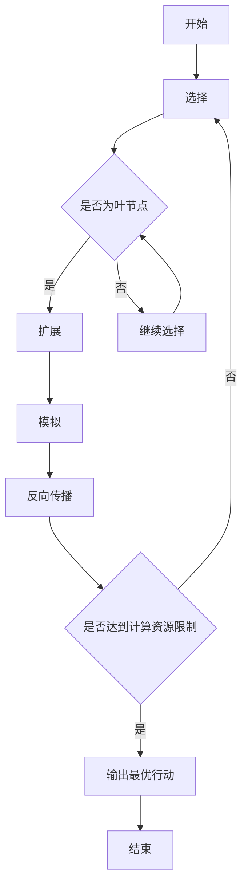

# 强化学习算法：蒙特卡洛树搜索 (Monte Carlo Tree Search) 原理与代码实例讲解

## 1. 背景介绍

### 1.1 强化学习概述

强化学习是机器学习的一个重要分支，它涉及到一个智能体(agent)如何在一个不确定的环境中采取行动,以最大化某种累积奖励或回报。与监督学习不同,强化学习没有提供正确的输入/输出对,而是必须通过试错来发现哪些行为会获得最佳奖励。强化学习的目标是找到一个最优策略,指导智能体在给定状态下采取何种行动。

### 1.2 蒙特卡洛树搜索(Monte Carlo Tree Search)介绍

蒙特卡洛树搜索(MCTS)是一种用于决策过程的框架,它结合了经典的蒙特卡洛随机模拟和高效的搜索树结构。MCTS已被广泛应用于棋类游戏(如国际象棋、围棋等)、机器人规划、自动驾驶决策等领域。相比于其他搜索算法,MCTS的优势在于它能够在有限的计算资源下,对庞大的决策空间进行高效搜索和评估。

## 2. 核心概念与联系

### 2.1 马尔可夫决策过程(Markov Decision Process, MDP)

马尔可夫决策过程是强化学习问题的数学框架。它由以下几个要素组成:

- 状态集合 $S$
- 行动集合 $A$
- 转移概率 $P(s' | s, a)$,表示在状态 $s$ 下执行行动 $a$ 后,转移到状态 $s'$ 的概率
- 奖励函数 $R(s, a, s')$,表示在状态 $s$ 下执行行动 $a$ 后,转移到状态 $s'$ 所获得的即时奖励

MCTS算法就是在这个MDP框架下,通过蒙特卡洛模拟和搜索树结构,来逼近最优策略。

### 2.2 多臂老虎机(Multi-Armed Bandit)问题

多臂老虎机问题是强化学习中一个经典的探索与利用权衡问题。假设有 $K$ 个拉杆,每次拉动一个拉杆都会获得一定的奖励,但每个拉杆的奖励分布是未知的。我们需要制定一个策略,在有限的尝试次数内,尽可能获得最大的累积奖励。

MCTS算法中的UCB(Upper Confidence Bound)公式,就借鉴了多臂老虎机问题中的探索与利用权衡思想。

## 3. 核心算法原理具体操作步骤

MCTS算法由四个基本步骤组成,按照"选择 - 扩展 - 模拟 - 反向传播"的循环进行,直到达到计算资源的限制。具体步骤如下:

### 3.1 选择(Selection)

从树根开始,递归地选择具有最高UCB值的子节点,直到遇到一个叶节点(没有未展开的子节点)。UCB公式如下:

$$
\text{UCB}(s, a) = \frac{Q(s, a)}{N(s, a)} + c \sqrt{\frac{2 \ln N(s)}{N(s, a)}}
$$

其中:

- $Q(s, a)$ 是状态 $s$ 下执行行动 $a$ 的平均奖励
- $N(s, a)$ 是状态 $s$ 下执行行动 $a$ 的访问次数
- $N(s)$ 是状态 $s$ 的总访问次数
- $c$ 是一个调节探索与利用权衡的常数

UCB公式的第一项 $Q(s, a)/N(s, a)$ 是利用项,表示选择历史上表现最好的行动。第二项 $c \sqrt{2 \ln N(s) / N(s, a)}$ 是探索项,它会鼓励选择访问次数较少的行动,以获取更多信息。

### 3.2 扩展(Expansion)

如果选择步骤遇到一个叶节点,则需要创建该节点的子节点,并将其加入到树中。通常会根据游戏规则或环境模型,生成所有可能的后继状态作为子节点。

### 3.3 模拟(Simulation)

从新扩展的节点开始,运行一个随机的模拟(rollout),直到达到终止状态。模拟的目的是获取一个无偏估计的奖励值,用于更新树中相应节点的统计数据。

### 3.4 反向传播(Backpropagation)

将模拟得到的奖励值沿着选择的路径向上传播,更新每个节点的统计数据 $Q(s, a)$ 和 $N(s, a)$。通常使用增量式更新:

$$
Q(s, a) \leftarrow Q(s, a) + \frac{1}{N(s, a)} \big(G - Q(s, a)\big)
$$

其中 $G$ 是模拟得到的最终奖励值。

重复上述四个步骤,直到达到计算资源的限制(如最大迭代次数或时间限制)。最后,选择根节点下访问次数最多的子节点对应的行动作为输出。

## 4. 数学模型和公式详细讲解举例说明

### 4.1 UCB公式推导

UCB(Upper Confidence Bound)公式源自于多臂老虎机问题,它提供了一种在探索与利用之间权衡的方法。我们先来看一个简单的例子。

假设有两个拉杆 $A$ 和 $B$,每次拉动都会获得一个奖励值,奖励值服从某个未知的分布。我们的目标是在有限的尝试次数内,尽可能获得最大的累积奖励。一种简单的策略是,始终选择历史上平均奖励最高的那个拉杆(利用)。但这种策略存在一个问题,就是如果一个拉杆的奖励分布实际上更高,但由于初始的几次尝试运气不好,导致它被忽视了。

为了解决这个问题,我们需要在利用和探索之间寻求一个平衡。UCB公式就提供了一种量化这种权衡的方法。对于每个拉杆 $a$,我们定义它的UCB值为:

$$
\text{UCB}(a) = \overline{X}_a + c \sqrt{\frac{2 \ln n}{N_a}}
$$

其中:

- $\overline{X}_a$ 是拉杆 $a$ 的平均奖励值,代表利用项
- $N_a$ 是拉杆 $a$ 被尝试的次数
- $n$ 是总的尝试次数
- $c$ 是一个调节探索与利用权衡的常数

第二项 $c \sqrt{2 \ln n / N_a}$ 就是探索项。当 $N_a$ 较小时,这一项较大,鼓励我们去探索尝试次数较少的拉杆;随着 $N_a$ 增大,这一项会逐渐减小,算法会倾向于利用历史上表现较好的拉杆。

通过选择具有最大UCB值的拉杆,我们就能在利用和探索之间达成一个动态平衡。UCB公式在多臂老虎机问题中已被证明是最优的(在一定的假设条件下)。

在MCTS算法中,UCB公式被推广到了树形结构,用于在树节点的选择过程中权衡利用和探索。具体来说,对于状态 $s$ 和行动 $a$,UCB值定义为:

$$
\text{UCB}(s, a) = \frac{Q(s, a)}{N(s, a)} + c \sqrt{\frac{2 \ln N(s)}{N(s, a)}}
$$

其中:

- $Q(s, a)$ 是状态 $s$ 下执行行动 $a$ 的平均奖励
- $N(s, a)$ 是状态 $s$ 下执行行动 $a$ 的访问次数
- $N(s)$ 是状态 $s$ 的总访问次数
- $c$ 是一个调节探索与利用权衡的常数

在选择步骤中,MCTS算法会递归地选择具有最高UCB值的子节点,直到遇到一个叶节点。这样就能在树的搜索过程中,兼顾利用历史信息和探索新的可能性。

### 4.2 反向传播公式推导

在MCTS算法的反向传播步骤中,我们需要根据模拟得到的奖励值,更新树中相应节点的统计数据 $Q(s, a)$ 和 $N(s, a)$。通常采用的是一种增量式更新方法:

$$
Q(s, a) \leftarrow Q(s, a) + \frac{1}{N(s, a)} \big(G - Q(s, a)\big)
$$

其中 $G$ 是模拟得到的最终奖励值。

这种更新方式实际上是在计算 $Q(s, a)$ 的指数移动平均值。我们来推导一下它的合理性。

假设在时刻 $t$,我们获得了一个新的奖励样本 $r_t$,需要将其合并到 $Q(s, a)$ 的估计中。根据概率论中的期望公式,我们有:

$$
\begin{aligned}
\mathbb{E}[R | s, a] &= \frac{1}{N(s, a)} \sum_{i=1}^{N(s, a)} r_i \\
&= \frac{1}{N(s, a)} \Big((N(s, a) - 1) Q(s, a) + r_t\Big) \\
&= Q(s, a) + \frac{1}{N(s, a)} \big(r_t - Q(s, a)\big)
\end{aligned}
$$

其中 $\mathbb{E}[R | s, a]$ 表示状态 $s$ 下执行行动 $a$ 的期望奖励值。

上式的最后一步等价于:

$$
Q(s, a) \leftarrow Q(s, a) + \frac{1}{N(s, a)} \big(r_t - Q(s, a)\big)
$$

这就是我们在反向传播时更新 $Q(s, a)$ 的公式。它可以被理解为:新的 $Q(s, a)$ 是旧的 $Q(s, a)$ 和新的奖励样本 $r_t$ 的加权平均,其中权重分别为 $\frac{N(s, a) - 1}{N(s, a)}$ 和 $\frac{1}{N(s, a)}$。

当 $N(s, a)$ 较小时,新的奖励样本 $r_t$ 会对 $Q(s, a)$ 的估计产生较大的影响;随着 $N(s, a)$ 增大,新的样本对 $Q(s, a)$ 的影响会逐渐减小。这种更新方式能够在利用历史数据和吸收新信息之间达成一个平衡。

需要注意的是,在实际应用中,我们通常会使用一个衰减因子 $\gamma$ 来衰减未来的奖励,从而计算累积的长期奖励。在这种情况下,反向传播公式变为:

$$
Q(s, a) \leftarrow Q(s, a) + \frac{1}{N(s, a)} \big(G - Q(s, a)\big)
$$

其中 $G$ 是模拟得到的累积奖励值,等于 $\sum_{t=0}^{\infty} \gamma^t r_t$。

## 5. 项目实践：代码实例和详细解释说明

为了更好地理解MCTS算法的实现细节,我们将通过一个简单的示例来讲解相关的代码。这个示例是基于Python语言和NumPy库实现的,它模拟了一个简化版的"连接四子棋"游戏。

### 5.1 游戏规则

我们考虑一个 $6 \times 7$ 的棋盘,两个玩家轮流在棋盘上放置棋子(分别用 1 和 -1 表示)。当任一玩家在横向、纵向或对角线上连成四个相同的棋子时,即获胜。如果棋盘满了但没有人获胜,则为平局。

### 5.2 代码实现

#### 5.2.1 游戏状态表示

我们使用一个 $6 \times 7$ 的 NumPy 数组来表示游戏状态,数组元素的值为 0(空