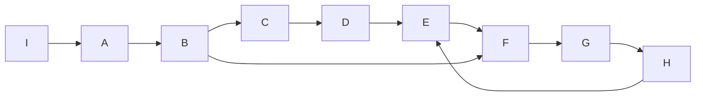

# 强连通分量算法的Python库NetworkX应用

## 1. 背景介绍

### 1.1 图论基础

图论是数学的一个分支,研究图这种数学结构的性质。图由顶点(Vertex)和边(Edge)组成,用来表示事物之间的关系。图可以是有向的或无向的,加权的或非加权的。图论在计算机科学、社会网络分析、生物学等领域有广泛应用。

### 1.2 连通性概念

在图论中,连通性是一个重要概念。如果从图中任意一个顶点出发,都能到达其他所有顶点,则称该图是连通图。对于有向图,如果任意两个顶点之间都存在一条有向路径,则称该有向图是强连通图。

### 1.3 强连通分量定义

强连通分量(Strongly Connected Components, SCCs)是有向图的极大强连通子图。"极大"的意思是再加入任何顶点和边,都不再满足强连通的性质。一个有向图的强连通分量构成了一个分割,图中每个顶点都恰好属于一个强连通分量。求解强连通分量在很多实际问题中有重要作用。

### 1.4 NetworkX库简介

NetworkX是一个用Python语言编写的图论算法库。它提供了简单易用的接口来创建、操作和研究复杂网络的结构、动力学和功能。NetworkX支持多种类型的图,包括有向图、无向图、多重图等。它内置了众多经典图算法的高效实现,如最短路径、最小生成树、网络中心性度量、社区发现等。

## 2. 核心概念与联系

### 2.1 有向图

有向图(Directed Graph)是边有方向的图。每条边表示顶点之间的单向关系,用有向边(弧)表示。有向图通常用来建模非对称关系,如网页之间的超链接、社交网络中的关注关系等。

### 2.2 可达性

在有向图中,如果存在一条从顶点u到顶点v的有向路径,则称v可达u。可达关系是传递的,即如果u可达v,v可达w,则u可达w。但可达关系不一定是对称的。

### 2.3 强连通

如果有向图中任意两个顶点u和v,u可达v且v可达u,则称该有向图是强连通的。换言之,图中任意两个顶点之间都存在一条有向路径。强连通是一种全局性质。

### 2.4 强连通分量

有向图的强连通分量是其极大强连通子图。图中每个顶点都属于且仅属于一个强连通分量。不同强连通分量之间可以通过有向边连接,但整个分量之间不存在强连通关系。求解强连通分量可以揭示有向图的结构特征。

### 2.5 概念联系 

下图展示了上述核心概念之间的联系:


## 3. 核心算法原理具体操作步骤

### 3.1 Kosaraju算法

求解强连通分量的经典算法是Kosaraju算法,由S.Rao Kosaraju在1978年提出。该算法基于两次深度优先搜索(DFS)实现。

#### 3.1.1 第一次DFS

1. 对原图G进行DFS,并记录每个顶点的完成时间(post-order)。
2. 将所有顶点按完成时间降序排列。

#### 3.1.2 图的转置

1. 构造原图G的转置图G^T。转置图将原图每条边的方向反转。

#### 3.1.3 第二次DFS  

1. 按照第一次DFS得到的顶点序列,对转置图G^T进行DFS。
2. 每次DFS搜索到的顶点集合形成一个强连通分量。

### 3.2 Tarjan算法

Tarjan算法是另一种常用的求强连通分量的算法,由Robert Tarjan在1972年发明。该算法只需对图进行一次DFS遍历。

#### 3.2.1 辅助数据结构

1. dfn[u]:顶点u的DFS序号。
2. low[u]:顶点u或u的子树能够追溯到的最早的栈中节点的次序号。
3. stack:存储顶点的栈。
4. in_stack:标记顶点是否在栈中。

#### 3.2.2 DFS遍历

1. 对每个未访问的顶点u,执行dfs(u)。

```python
def dfs(u):
    dfn[u] = low[u] = self.time
    self.time += 1
    stack.append(u)  
    in_stack[u] = True

    for v in G[u]:
        if dfn[v] == 0: 
            dfs(v)
            low[u] = min(low[u], low[v])
        elif in_stack[v]: 
            low[u] = min(low[u], dfn[v])

    if dfn[u] == low[u]:
        scc = []
        while stack and dfn[stack[-1]] >= dfn[u]:
            v = stack.pop()
            in_stack[v] = False
            scc.append(v)
        sccs.append(scc)
```

## 4. 数学模型和公式详细讲解举例说明

### 4.1 有向图的数学表示

有向图G=(V,E)由顶点集V和有向边集E组成。每条有向边e=(u,v)∈E表示从顶点u到顶点v的单向连接。有向图可以用邻接矩阵或邻接表表示。

- 邻接矩阵:用一个n×n的矩阵A表示有向图,其中n=|V|。如果存在有向边(i,j),则A[i][j]=1,否则为0。
- 邻接表:用一个长度为n的列表Adj表示有向图,其中Adj[i]存储从顶点i出发的所有有向边的终点顶点。

### 4.2 可达性的数学定义

设有向图G=(V,E),对于顶点u,v∈V,如果存在一个顶点序列(v_0,v_1,...,v_k),其中v_0=u,v_k=v,且对于i=0,1,...,k-1,(v_i,v_{i+1})∈E,则称v可达u,记作u→v。

### 4.3 强连通的数学定义

有向图G=(V,E)是强连通的,当且仅当对于任意两个顶点u,v∈V,都有u→v且v→u。即任意顶点之间都存在一条有向路径。

### 4.4 强连通分量的数学定义

有向图G=(V,E)的一个强连通分量是G的极大强连通子图G'=(V',E'),满足:

1. V'⊆V,E'⊆E 
2. G'是强连通图
3. ∀v∈V-V',G'+v不是强连通图

直观地,强连通分量是有向图中的"群岛",分量内部顶点可以互相到达,但分量之间不存在强连通关系。

### 4.5 举例说明

考虑下面这个有向图G:



该图有3个强连通分量:

- {A,B,C,D,E,F,G,H}
- {I} 
- {J}

分量{A,B,C,D,E,F,G,H}内部顶点两两可达,形成一个强连通子图。而分量{I}只能到达{A,B,C,D,E,F,G,H},反之不可达,因此是另一个强连通分量。顶点J与其他顶点都不可达,自成一个强连通分量。

## 5. 项目实践：代码实例和详细解释说明

下面我们使用NetworkX库来求解强连通分量,并给出Python代码实例。

### 5.1 创建有向图

```python
import networkx as nx

G = nx.DiGraph() 
G.add_edges_from([(1,2), (2,3), (3,1), (3,4), (4,5), (5,6), (6,4)])
```

这里我们创建了一个有向图G,并添加了一些有向边。

### 5.2 调用strongly_connected_components函数

```python
sccs = list(nx.strongly_connected_components(G))
print(sccs)
```

输出:

```
[[4, 5, 6], [1, 2, 3]]
```

NetworkX提供了现成的strongly_connected_components函数来求解强连通分量。该函数返回一个generator,每次yield一个强连通分量(顶点集合)。我们将结果转为list输出。

可以看到,该有向图有两个强连通分量:{4,5,6}和{1,2,3}。

### 5.3 可视化强连通分量

```python
pos = nx.spring_layout(G)
nx.draw_networkx_nodes(G, pos, node_size=500)
nx.draw_networkx_edges(G, pos, edgelist=G.edges(), edge_color='black')
nx.draw_networkx_labels(G, pos)

colors = ['r', 'g', 'b', 'y']
for i, scc in enumerate(sccs):
    color = colors[i % 4]
    subgraph = G.subgraph(scc)
    nx.draw_networkx_nodes(subgraph, pos, node_size=500, node_color=color)
    nx.draw_networkx_edges(subgraph, pos, edgelist=subgraph.edges(), edge_color=color, width=3)

plt.axis('off')
plt.show()
```

这段代码将强连通分量可视化。不同分量用不同颜色表示,边的粗细也有区分。可视化结果如下:


从图中可以清晰看出两个强连通分量。分量内部顶点之间有紧密的连接,但分量之间没有强连通关系。

## 6. 实际应用场景

### 6.1 社交网络分析

在社交网络中,用户之间的关注、好友关系可以建模为有向图。求解社交网络的强连通分量,可以发现紧密联系的用户群体,即社区结构。这对于社区发现、社交网络演化分析等任务非常有帮助。

### 6.2 网页排名

Google的PageRank算法就是基于网页之间的链接关系(有向图)来评估网页重要性的。其中一个重要步骤是找到强连通分量,并将图缩减为强连通分量的缩点图,然后在缩点图上进行随机游走计算网页的重要性得分。

### 6.3 程序流程分析

在程序静态分析中,控制流图(Control Flow Graph)是一种常用的程序表示。每个基本块是图的一个节点,块之间的跳转关系是有向边。通过求解控制流图的强连通分量,可以找到程序的自然循环结构,这对编译优化、漏洞检测等任务很有帮助。

### 6.4 电路设计

在电路设计中,电路元件之间的连接可以建模为有向图。元件之间的强连通分量对应电路的重要功能模块。找出强连通分量可以帮助工程师理解电路结构,指导电路优化。

## 7. 工具和资源推荐

- NetworkX官方文档:https://networkx.org/documentation/stable/index.html
- 图算法可视化网站:https://visualgo.net/en/graphds
- 图论教程:http://jeffe.cs.illinois.edu/teaching/algorithms/book/03-graphs.pdf
- Kosaraju算法和Tarjan算法的可视化演示:https://visualgo.net/en/scc
- Python图论算法实战:https://www.coursera.org/projects/python-graph-algorithms

## 8. 总结：未来发展趋势与挑战

图算法是计算机科学的一个重要分支,在诸多领域都有广泛应用。随着社交网络、知识图谱、生物网络等复杂网络数据的激增,对高效图算法的需求日益增长。以下是图算法未来的几个发展趋势:

1. 大规模图数据的并行处理。如何在分布式集群上高效处理亿级、十亿级节点的大图,是一个巨大挑战。
2. 图神经网络的兴起。将深度学习与图算法相结合,可以更好地挖掘图结构数据的特征,在图表示学习、节点分类、链路预测等任务上取得了很好的效果。
3. 动态图算法。很多实际网络都是动态演化的,如何设计适用于动态图的增量算法,是一个值得研究的问题。
4. 图算法的可解释性。图神经网络等复杂模型虽然效果好,但是可解释性较差。如何设计可解释的图算法,