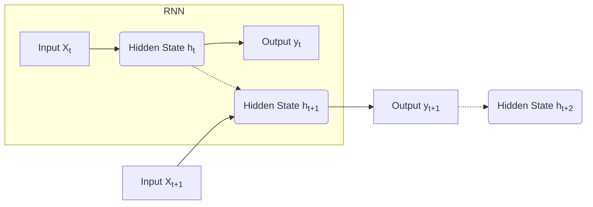

# 循环神经网络(Recurrent Neural Network)原理与代码实战案例讲解

## 1.背景介绍

### 1.1 神经网络简介

神经网络(Neural Network)是一种受生物神经系统启发而设计的机器学习模型,旨在模拟人脑对信息的处理方式。它由大量互相连接的节点(神经元)组成,这些节点可以接收输入数据,经过内部计算后传递给下一层节点,最终输出结果。神经网络具有自学习能力,通过反复训练调整连接权重,从而学习到输入和输出之间的映射关系。

### 1.2 循环神经网络的产生背景

传统的前馈神经网络(Feed-Forward Neural Network)在处理序列数据(如自然语言、语音、时间序列等)时存在局限性,因为它们无法很好地捕捉序列数据中的时间依赖关系。为了解决这一问题,循环神经网络(Recurrent Neural Network, RNN)应运而生。

循环神经网络是一种特殊类型的人工神经网络,它具有记忆能力,可以处理序列数据。与前馈神经网络不同,RNN在隐藏层中引入了循环连接,使得网络能够记住之前的状态,从而更好地捕捉序列数据中的长期依赖关系。

### 1.3 循环神经网络的应用场景

循环神经网络广泛应用于自然语言处理、语音识别、时间序列预测等领域。以下是一些典型的应用场景:

- 语言模型(Language Modeling)
- 机器翻译(Machine Translation)
- 语音识别(Speech Recognition)
- 图像字幕生成(Image Captioning)
- 时间序列预测(Time Series Prediction)
- 手写识别(Handwriting Recognition)

## 2.核心概念与联系

### 2.1 循环神经网络的基本结构

循环神经网络的基本结构如下所示:

在上图中,我们可以看到:

- 输入 $X_t$ 在时间步 $t$ 被传递给隐藏层。
- 隐藏层计算当前时间步的隐藏状态 $h_t$,这不仅取决于当前输入 $X_t$,还取决于前一时间步的隐藏状态 $h_{t-1}$。
- 隐藏状态 $h_t$ 被用于计算当前时间步的输出 $y_t$。
- 隐藏状态 $h_t$ 也被传递到下一时间步,用于计算下一时间步的隐藏状态 $h_{t+1}$。

这种循环结构使得 RNN 能够捕捉序列数据中的长期依赖关系,从而在处理序列数据时表现出色。

### 2.2 循环神经网络的前向传播

循环神经网络的前向传播过程可以表示为:

$$
\begin{aligned}
h_t &= f_W(x_t, h_{t-1}) \\
y_t &= g_V(h_t)
\end{aligned}
$$

其中:

- $x_t$ 是时间步 $t$ 的输入
- $h_t$ 是时间步 $t$ 的隐藏状态
- $y_t$ 是时间步 $t$ 的输出
- $f_W$ 是计算隐藏状态的函数,通常是一个非线性函数,如 tanh 或 ReLU
- $g_V$ 是计算输出的函数,例如对于分类任务可以使用 softmax 函数

$f_W$ 和 $g_V$ 分别由权重矩阵 $W$ 和 $V$ 参数化。在训练过程中,这些权重矩阵会不断更新,使得 RNN 能够学习到合适的映射关系。

### 2.3 循环神经网络的反向传播

与传统的前馈神经网络类似,循环神经网络也使用反向传播算法进行训练。但由于 RNN 的循环结构,反向传播过程需要通过时间步进行展开,这被称为"反向传播through time"(BPTT)。

在 BPTT 中,我们需要计算损失函数关于每个时间步的权重的梯度,并使用这些梯度来更新权重。由于隐藏状态在时间步之间存在依赖关系,因此每个时间步的梯度不仅依赖于当前时间步的误差,还依赖于后续时间步的误差。这种长期依赖关系可能会导致梯度消失或梯度爆炸的问题,从而影响 RNN 的训练效果。

为了缓解这一问题,研究人员提出了一些变体,如长短期记忆网络(LSTM)和门控循环单元(GRU),它们通过引入门控机制来更好地捕捉长期依赖关系。

## 3.核心算法原理具体操作步骤

### 3.1 简单循环神经网络(Simple RNN)

简单循环神经网络是最基本的 RNN 结构,它的隐藏层计算过程如下:

$$
\begin{aligned}
h_t &= \tanh(W_{hx} x_t + W_{hh} h_{t-1} + b_h) \\
y_t &= W_{yh} h_t + b_y
\end{aligned}
$$

其中:

- $x_t$ 是时间步 $t$ 的输入
- $h_t$ 是时间步 $t$ 的隐藏状态
- $y_t$ 是时间步 $t$ 的输出
- $W_{hx}$、$W_{hh}$、$W_{yh}$ 分别是输入到隐藏层、隐藏层到隐藏层和隐藏层到输出层的权重矩阵
- $b_h$、$b_y$ 分别是隐藏层和输出层的偏置向量

简单 RNN 的计算步骤如下:

1. 初始化隐藏状态 $h_0$,通常将其设置为全 0 向量。
2. 对于每个时间步 $t$:
   - 计算当前时间步的隐藏状态 $h_t$,它取决于当前输入 $x_t$ 和前一时间步的隐藏状态 $h_{t-1}$。
   - 使用 $h_t$ 计算当前时间步的输出 $y_t$。
3. 重复步骤 2,直到处理完整个序列。

虽然简单 RNN 能够捕捉序列数据中的一些依赖关系,但它在处理长序列时存在梯度消失或梯度爆炸的问题,这限制了它的性能。为了解决这一问题,研究人员提出了 LSTM 和 GRU 等变体。

### 3.2 长短期记忆网络(LSTM)

长短期记忆网络(Long Short-Term Memory, LSTM)是一种特殊的 RNN 结构,它通过引入门控机制来解决梯度消失和梯度爆炸的问题,从而更好地捕捉长期依赖关系。

LSTM 的核心思想是引入一个细胞状态(Cell State),它类似于传送带,可以将信息传递到序列的后续时间步。LSTM 还引入了三种门控机制:遗忘门(Forget Gate)、输入门(Input Gate)和输出门(Output Gate),用于控制细胞状态和隐藏状态的更新。

LSTM 的计算过程如下:

$$
\begin{aligned}
f_t &= \sigma(W_f [h_{t-1}, x_t] + b_f) & \text{(遗忘门)} \\
i_t &= \sigma(W_i [h_{t-1}, x_t] + b_i) & \text{(输入门)} \\
\tilde{C}_t &= \tanh(W_C [h_{t-1}, x_t] + b_C) & \text{(候选细胞状态)} \\
C_t &= f_t \odot C_{t-1} + i_t \odot \tilde{C}_t & \text{(细胞状态)} \\
o_t &= \sigma(W_o [h_{t-1}, x_t] + b_o) & \text{(输出门)} \\
h_t &= o_t \odot \tanh(C_t) & \text{(隐藏状态)}
\end{aligned}
$$

其中:

- $f_t$、$i_t$、$o_t$ 分别表示遗忘门、输入门和输出门
- $C_t$ 是细胞状态
- $\tilde{C}_t$ 是候选细胞状态
- $h_t$ 是隐藏状态
- $\sigma$ 是 sigmoid 激活函数
- $\odot$ 表示元素wise乘积

LSTM 的计算步骤如下:

1. 计算遗忘门 $f_t$,决定从前一细胞状态 $C_{t-1}$ 中保留和遗忘哪些信息。
2. 计算输入门 $i_t$ 和候选细胞状态 $\tilde{C}_t$,生成新的细胞状态的候选向量。
3. 根据遗忘门 $f_t$ 和输入门 $i_t$ 更新细胞状态 $C_t$。
4. 计算输出门 $o_t$,决定细胞状态 $C_t$ 中的哪些信息将被输出到隐藏状态 $h_t$。
5. 计算隐藏状态 $h_t$,作为当前时间步的输出。

通过引入门控机制,LSTM 能够更好地捕捉长期依赖关系,从而在处理长序列时表现优异。

### 3.3 门控循环单元(GRU)

门控循环单元(Gated Recurrent Unit, GRU)是另一种流行的 RNN 变体,它相对于 LSTM 结构更加简单,计算量也更小。GRU 通过引入重置门(Reset Gate)和更新门(Update Gate)来控制对前一时间步隐藏状态的组合方式。

GRU 的计算过程如下:

$$
\begin{aligned}
r_t &= \sigma(W_r [h_{t-1}, x_t] + b_r) & \text{(重置门)} \\
z_t &= \sigma(W_z [h_{t-1}, x_t] + b_z) & \text{(更新门)} \\
\tilde{h}_t &= \tanh(W_h [r_t \odot h_{t-1}, x_t] + b_h) & \text{(候选隐藏状态)} \\
h_t &= (1 - z_t) \odot h_{t-1} + z_t \odot \tilde{h}_t & \text{(隐藏状态)}
\end{aligned}
$$

其中:

- $r_t$ 是重置门
- $z_t$ 是更新门
- $\tilde{h}_t$ 是候选隐藏状态
- $h_t$ 是隐藏状态
- $\sigma$ 是 sigmoid 激活函数
- $\odot$ 表示元素wise乘积

GRU 的计算步骤如下:

1. 计算重置门 $r_t$,决定如何组合前一时间步的隐藏状态 $h_{t-1}$ 和当前输入 $x_t$ 来计算候选隐藏状态 $\tilde{h}_t$。
2. 计算更新门 $z_t$,决定隐藏状态 $h_t$ 将保留多少来自前一时间步的隐藏状态 $h_{t-1}$ 和多少来自候选隐藏状态 $\tilde{h}_t$。
3. 计算候选隐藏状态 $\tilde{h}_t$,作为当前时间步的潜在隐藏状态。
4. 根据更新门 $z_t$ 的值,将前一时间步的隐藏状态 $h_{t-1}$ 和候选隐藏状态 $\tilde{h}_t$ 进行线性组合,得到当前时间步的隐藏状态 $h_t$。

相比 LSTM,GRU 结构更加简单,计算量也更小,但在处理一些任务时,性能可能略差于 LSTM。

## 4.数学模型和公式详细讲解举例说明

在本节中,我们将详细讲解循环神经网络的数学模型和公式,并通过实例进行说明。

### 4.1 简单循环神经网络(Simple RNN)

简单 RNN 的数学模型如下:

$$
\begin{aligned}
h_t &= \tanh(W_{hx} x_t + W_{hh} h_{t-1} + b_h) \\
y_t &= W_{yh} h_t + b_y
\end{aligne