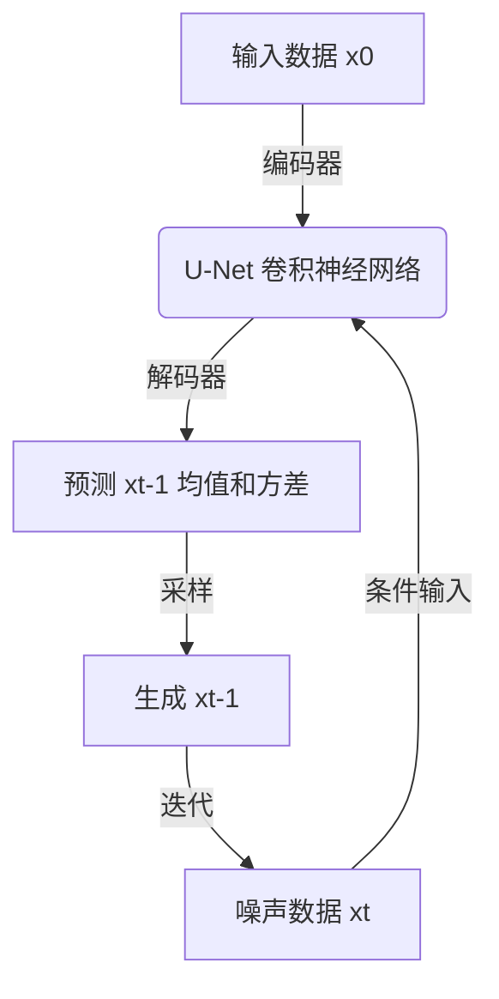

# 扩散模型Diffusion Model原理与代码实例讲解

## 1.背景介绍

### 1.1 生成式AI模型的兴起

近年来,生成式人工智能(Generative AI)模型在计算机视觉、自然语言处理等领域取得了令人瞩目的进展。与传统的判别式模型不同,生成式模型旨在从底层数据分布中学习并生成新的、有意义的样本,如图像、音频、文本等。这种新型模型的兴起,为人工智能系统赋予了更强大的创造力和表现力,极大拓展了AI的应用前景。

### 1.2 扩散模型(Diffusion Model)的崛起  

在生成式AI模型的大家族中,扩散模型(Diffusion Model)是一种新兴而极具潜力的生成模型范式。扩散模型通过学习从干净数据到噪声数据的反向过程,从而实现从噪声中生成高质量样本的能力。这种全新的生成模型思路,为图像、音频、3D数据等多模态数据的生成提供了一种强大而优雅的解决方案。

自2020年扩散模型的理论基础被系统提出以来,该模型在短短几年内就取得了突破性进展,在图像、语音、3D等多个领域展现出了卓越的生成性能,成为继变分自编码器(VAE)、生成对抗网络(GAN)之后,生成式AI研究的一个新的热点和前沿方向。

### 1.3 扩散模型的应用前景

扩散模型凭借其出色的生成质量和多模态生成能力,在诸多领域展现出了广阔的应用前景,主要包括但不限于:

- 计算机视觉: 生成逼真高分辨率图像、图像编辑和修复、图像超分辨率重建等
- 自然语言处理: 文本生成、机器翻译、对话系统等
- 音频处理: 语音合成、音乐生成、音频修复等
- 3D数据处理: 3D物体生成、3D场景构建等
- 科学计算: 分子结构设计、蛋白质结构预测等

随着模型算法和训练策略的不断完善,以及硬件算力的持续提升,扩散模型有望在更多领域发挥重要作用,推动人工智能技术的创新发展。

## 2.核心概念与联系

### 2.1 扩散过程(Forward Diffusion Process)

扩散过程是扩散模型的理论基础,其本质是一个将干净数据转化为噪声数据的过程。具体来说,给定一个干净的数据样本 x0,通过逐步添加高斯噪声,经过 T 个时间步骤,最终将 x0 完全破坏为纯噪声数据 xT。这个过程可以用马尔可夫链来描述:

$$
q\left(x_{t} | x_{t-1}\right)=\mathcal{N}\left(x_{t} ; \sqrt{1-\beta_{t}} x_{t-1}, \beta_{t} I\right)
$$

其中,βt 是方差系数,控制每一步添加噪声的量。整个过程可以表示为:

$$
q\left(x_{T} | x_{0}\right)=\prod_{t=1}^{T} q\left(x_{t} | x_{t-1}\right)
$$

扩散过程将干净数据 x0 转化为噪声数据 xT 的过程是已知的,因此我们可以从噪声数据 xT 出发,学习其反向过程,即生成过程,从而实现从噪声中生成高质量样本的目标。

### 2.2 生成过程(Reverse Diffusion Process)

生成过程的目标是学习从噪声数据 xT 生成干净数据 x0 的概率模型 pθ(x0|xT),其中 θ 是需要优化的模型参数。根据贝叶斯公式,我们有:

$$
p_{\theta}\left(x_{0} | x_{T}\right)=\frac{p_{\theta}\left(x_{T} | x_{0}\right) p(x_{0})}{p\left(x_{T}\right)}
$$

由于分母 p(xT) 与 x0 无关,因此我们只需要最大化 pθ(xT|x0)p(x0) 即可。进一步利用马尔可夫链的性质,我们可以将 pθ(xT|x0) 分解为:

$$
p_{\theta}\left(x_{T} | x_{0}\right)=\prod_{t=1}^{T} p_{\theta}\left(x_{t-1} | x_{t}, x_{0}\right)
$$

这里我们引入一个新的条件概率模型 pθ(xt-1|xt,x0),即从噪声数据 xt 和原始数据 x0 出发,预测上一个时间步的数据 xt-1。这个模型被称为扩散模型的核心,是整个生成过程的关键所在。

通过学习这个条件概率模型,我们就可以按照逆序生成每一个中间状态 xt,最终从噪声数据 xT 生成出干净的数据样本 x0。这个过程被称为反向扩散过程(Reverse Diffusion Process)。

### 2.3 扩散模型训练目标

为了学习条件概率模型 pθ(xt-1|xt,x0),我们需要最大化其对数似然:

$$
\mathbb{E}_{x_{0}, \epsilon} \log p_{\theta}\left(x_{0} | x_{T}\right)=\mathbb{E}_{x_{0}, \epsilon}\left[\log p_{\theta}\left(x_{T} | x_{0}\right)+\log p\left(x_{0}\right)\right]
$$

其中 ϵ 表示用于扩散过程的噪声序列。由于 p(x0) 与模型参数 θ 无关,因此我们只需要最大化第一项 pθ(xT|x0)。利用马尔可夫链的性质,我们可以将其分解为:

$$
\begin{aligned}
\log p_{\theta}\left(x_{T} | x_{0}\right) &=\sum_{t=1}^{T} \log p_{\theta}\left(x_{t-1} | x_{t}, x_{0}\right) \\
&=\sum_{t=1}^{T} \log \left[\frac{p_{\theta}\left(x_{t-1} | x_{t}, x_{0}\right) q\left(x_{t} | x_{t-1}\right)}{q\left(x_{t} | x_{t-1}\right)}\right] \\
&=\sum_{t=2}^{T} \log \left[\frac{p_{\theta}\left(x_{t-1} | x_{t}, x_{0}\right)}{q\left(x_{t-1} | x_{t}\right)}\right]
\end{aligned}
$$

这里我们引入了一个新的概率比值 pθ(xt-1|xt,x0)/q(xt-1|xt),被称为扩散模型的训练目标。实际上,这个比值描述了从噪声数据 xt 出发,生成上一个状态 xt-1 的概率,相对于扩散过程的概率的对数比值。通过最大化这个比值,我们就可以学习到一个高质量的生成模型 pθ(xt-1|xt,x0)。

### 2.4 扩散模型架构

扩散模型的核心架构是一个条件生成模型 pθ(xt-1|xt,x0),通常采用基于U-Net的卷积神经网络结构。该网络接受当前的噪声数据 xt 和原始数据 x0 作为输入,输出上一个时间步的数据 xt-1 的均值和方差,从而参数化 pθ(xt-1|xt,x0)。

在实际应用中,为了提高效率,人们通常采用随机采样的策略,即在训练时随机选择一个时间步 t,优化该时间步的损失函数。此外,还可以采用各种改进的训练策略,如级联训练、分层采样等,来进一步提升模型性能。

上图展示了扩散模型的基本架构。首先,原始数据 x0 和当前噪声数据 xt 被输入到基于 U-Net 的卷积神经网络中。网络的编码器部分提取数据的特征表示,而解码器部分则根据这些特征,预测上一个时间步 xt-1 的均值和方差。通过对均值和方差进行采样,我们可以得到 xt-1 的生成值。这个过程将反复迭代,直到最终生成出干净的数据样本 x0。

## 3.核心算法原理具体操作步骤

扩散模型的核心算法包括两个主要部分:训练过程和采样(生成)过程。我们将分别介绍这两个过程的具体原理和操作步骤。

### 3.1 训练过程

扩散模型的训练过程旨在学习条件概率模型 pθ(xt-1|xt,x0),其目标是最大化该模型相对于扩散过程 q(xt-1|xt) 的对数似然比。具体步骤如下:

1. **准备训练数据**: 从原始数据分布中采样一批样本 x0,作为训练集。

2. **生成扩散序列**: 对于每个训练样本 x0,通过扩散过程生成一系列噪声数据 {x1,x2,...,xT},其中 xT 是纯噪声数据。

3. **随机采样时间步**: 从扩散序列的时间步 t=1,2,...,T 中随机采样一个时间步 t。

4. **前向传播**: 将当前噪声数据 xt 和原始数据 x0 输入到扩散模型网络中,网络将预测上一个时间步 xt-1 的均值 μθ(xt,x0) 和方差 Σθ(xt,x0)。

5. **计算损失函数**: 根据预测的均值和方差,计算该时间步的损失函数,即最大化 pθ(xt-1|xt,x0)/q(xt-1|xt) 的对数似然比:

   $$
   \mathcal{L}_{t}=\mathbb{E}_{x_{0}, \epsilon}\left\|\epsilon-\epsilon_{\theta}\left(x_{t}, x_{0}\right)\right\|^{2}
   $$

   其中 ϵθ(xt,x0) 是根据网络预测的均值和方差重新参数化的噪声分布。

6. **反向传播和优化**: 计算损失函数相对于模型参数 θ 的梯度,并使用优化器(如 Adam)更新模型参数。

7. **重复训练**: 重复步骤 3-6,对训练集中的所有样本进行一次完整的迭代。

通过上述步骤的反复迭代训练,扩散模型将逐步学习到从噪声数据 xt 和原始数据 x0 生成上一个时间步 xt-1 的条件概率模型 pθ(xt-1|xt,x0)。

### 3.2 采样(生成)过程

经过训练后,我们可以利用学习到的扩散模型 pθ(xt-1|xt,x0) 从纯噪声数据 xT 出发,逐步生成出干净的数据样本 x0。采样过程的具体步骤如下:

1. **初始化噪声数据**: 从标准高斯分布中采样一个纯噪声数据 xT。

2. **迭代生成**: 对于 t=T,T-1,...,1,执行以下操作:
   - 将当前噪声数据 xt 和原始数据 x0(对于第一次迭代,x0 可以是任意常数或随机噪声)输入到扩散模型网络中。
   - 网络将预测上一个时间步 xt-1 的均值 μθ(xt,x0) 和方差 Σθ(xt,x0)。
   - 从均值和方差参数化的高斯分布中采样,得到 xt-1。

3. **输出生成样本**: 最终输出的 x0 即为从噪声数据生成的干净数据样本。

需要注意的是,在实际应用中,为了提高采样效率和质量,通常会采用一些改进的采样策略,如:

- **预测x0 (Predict x0)**: 在最后一步直接预测 x0,而不是逐步生成中间状态。
- **级联采样 (Ancestral Sampling)**: 将采样过程分为多个级联,每个级联只需生成部分时间步,可以大幅提高效率。
- **分层采样 (Stratified Sampling