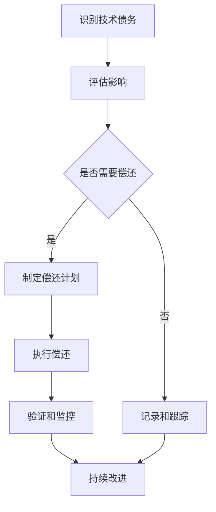

# 技术债务还清计划:重构代码,提升系统质量

## 1.背景介绍

随着时间的推移和业务需求的不断变化,软件系统往往会积累大量的技术债务。技术债务是指在软件开发过程中为了加快交付速度而做出的妥协,导致代码质量下降、架构设计不合理等问题。这些债务如果不及时偿还,将会越积越多,最终导致系统难以维护、扩展和优化。

因此,有必要制定一个技术债务还清计划,通过重构代码、优化架构等手段来提升系统质量,确保系统的可维护性、可扩展性和性能。

### 1.1 什么是技术债务

技术债务(Technical Debt)是一个源于软件开发领域的比喻,它描述了在软件开发过程中为了加快交付速度而做出的一些妥协和权衡。这些权衡可能包括:

- 编写低质量的代码
- 采用临时性的解决方案
- 忽略最佳实践和设计原则
- 缺乏文档和测试覆盖率

虽然这些妥协可以在短期内加快开发速度,但它们会积累技术债务,导致系统的质量、可维护性和可扩展性下降。就像金融债务一样,技术债务也需要偿还,否则会产生越来越高的"利息",最终导致系统难以维护和升级。

### 1.2 技术债务的危害

如果不及时偿还技术债务,它会给软件系统带来以下危害:

- **可维护性降低**: 代码质量差、缺乏文档和测试,使得代码难以理解和修改,维护成本越来越高。
- **扩展性降低**: 架构设计不合理,系统难以适应新的需求和技术变化,扩展性差。
- **性能下降**: 代码质量低下、架构设计不合理,导致系统性能逐渐下降。
- **风险增加**: 系统质量下降,bug数量增加,给系统稳定性和安全性带来风险。
- **开发效率降低**: 代码混乱、缺乏文档,新人很难快速上手,影响开发效率。

因此,及时偿还技术债务,提升系统质量是非常必要的。

## 2.核心概念与联系

### 2.1 技术债务的类型

技术债务可以分为以下几种类型:

1. **代码债务**: 指代码质量低下、缺乏测试覆盖、命名混乱等问题。
2. **架构债务**: 指架构设计不合理、缺乏模块化、耦合度高等问题。
3. **文档债务**: 指缺乏文档、文档过时或者质量低下的问题。
4. **测试债务**: 指缺乏自动化测试、测试覆盖率低下等问题。
5. **构建债务**: 指构建过程复杂、缺乏自动化、依赖管理混乱等问题。
6. **需求债务**: 指需求变更频繁、需求管理混乱等问题。

这些债务相互关联,共同影响着系统的质量和可维护性。

### 2.2 技术债务与重构的关系

重构(Refactoring)是一种用于提高代码质量、改善软件设计的技术手段。它通过对代码进行重新组织和优化,在不改变其外部行为的前提下,提高代码的可读性、可维护性和可扩展性。

重构是偿还技术债务的有效手段,它可以帮助我们:

1. **提高代码质量**: 通过重构,可以消除代码中的坏味道(Code Smells),如重复代码、过长方法、命名不当等,从而提高代码质量。
2. **优化架构设计**: 通过重构,可以改善架构设计,提高模块化程度、降低耦合度,从而提高系统的可扩展性和可维护性。
3. **增加测试覆盖率**: 在重构过程中,可以编写单元测试和集成测试,提高测试覆盖率,降低引入新缺陷的风险。
4. **完善文档**: 在重构过程中,可以更新和完善文档,使代码更易于理解和维护。

因此,重构是偿还技术债务、提升系统质量的关键手段。

### 2.3 技术债务与技术盈余

与技术债务相对应的是技术盈余(Technical Wealth)。技术盈余指的是那些提高代码质量、架构设计和可维护性的实践,如:

- 编写高质量、可读性强的代码
- 采用模块化、低耦合的架构设计
- 编写完善的文档和注释
- 实现高覆盖率的自动化测试
- 建立健全的构建和部署流程
- 实施有效的需求管理

这些实践虽然在短期内会增加一些开发成本,但从长远来看,它们能够提高系统的质量、可维护性和可扩展性,降低未来的维护成本,从而为项目积累技术盈余。

因此,在软件开发过程中,我们应该在偿还技术债务的同时,也努力积累技术盈余,从而提高系统的整体质量和生命周期。

## 3.核心算法原理具体操作步骤

### 3.1 技术债务管理流程

为了有效管理技术债务,我们需要建立一个完整的流程,包括以下步骤:



1. **识别技术债务**: 通过代码审查、架构评估、测试报告等手段,识别系统中存在的技术债务。
2. **评估影响**: 评估技术债务对系统质量、可维护性和性能的影响,确定优先级。
3. **决策是否偿还**: 根据影响程度和优先级,决定是否需要立即偿还该项技术债务。
4. **制定偿还计划**: 对于需要偿还的技术债务,制定详细的偿还计划,包括任务分解、时间安排、资源分配等。
5. **执行偿还**: 按照计划执行重构、优化等工作,偿还技术债务。
6. **验证和监控**: 通过测试、代码审查等手段,验证偿还效果,并持续监控新产生的技术债务。
7. **持续改进**: 根据验证结果和监控情况,持续优化债务管理流程,防止新债务的产生。
8. **记录和跟踪**: 对于暂时不需要偿还的技术债务,需要记录并持续跟踪,防止影响扩大。

### 3.2 技术债务偿还策略

在执行技术债务偿还时,我们可以采用以下几种策略:

1. **增量式偿还**: 在新功能开发或者Bug修复的过程中,顺便对相关代码进行重构和优化,逐步偿还技术债务。这种方式的优点是不需要专门拨出时间和资源,但缺点是进度较慢。

2. **集中式偿还**: 专门拨出一段时间(如几周或几个月),集中精力对系统进行全面的重构和优化,快速偿还技术债务。这种方式的优点是效率较高,但缺点是需要暂停新功能开发,投入较大。

3. **混合式偿还**: 结合增量式和集中式的优点,采取两种方式交替进行。在日常开发中进行增量式偿还,同时定期安排集中式偿还活动。

4. **外包式偿还**: 将重构和优化工作外包给第三方团队或者专家,利用外部资源快速偿还技术债务。这种方式的优点是可以利用外部专业力量,但缺点是成本较高,并且需要良好的知识传递。

不同的策略适用于不同的场景,我们需要根据具体情况选择合适的策略。通常情况下,采用混合式偿还是一个不错的选择。

## 4.数学模型和公式详细讲解举例说明

在技术债务管理过程中,我们可以借助一些数学模型和公式来量化和优化债务偿还过程。

### 4.1 技术债务利息公式

技术债务利息(Technical Debt Interest)是指由于未及时偿还技术债务而产生的额外成本和风险。我们可以使用下面的公式来估算技术债务利息:

$$
I = P \times R
$$

其中:

- $I$ 表示技术债务利息
- $P$ 表示技术债务本金,即偿还该债务需要投入的工作量
- $R$ 表示利率,即未偿还债务带来的额外成本和风险

利率 $R$ 可以根据以下因素来估算:

- 代码质量下降导致的维护成本增加
- 架构设计不合理导致的扩展成本增加
- 缺乏测试导致的缺陷修复成本增加
- 缺乏文档导致的知识传递成本增加
- 系统性能下降导致的运营成本增加
- 安全风险增加导致的潜在损失

通过估算技术债务利息,我们可以更好地评估偿还债务的紧迫程度和价值。

### 4.2 技术债务偿还模型

为了优化技术债务偿还过程,我们可以构建一个数学模型,将偿还过程视为一个优化问题。

假设我们有 $n$ 个技术债务项目 $D_1, D_2, \ldots, D_n$,每个债务项目都有对应的本金 $P_i$ 和利率 $R_i$。我们的目标是在有限的时间和资源约束下,选择合适的债务项目进行偿还,使得总体收益最大化。

我们可以将这个问题建模为一个整数规划问题:

$$
\max \sum_{i=1}^n x_i \cdot (P_i \times R_i)
$$

$$
\text{subject to: } \sum_{i=1}^n x_i \cdot C_i \leq B
$$

$$
x_i \in \{0, 1\}, \quad i = 1, 2, \ldots, n
$$

其中:

- $x_i$ 是一个二进制变量,表示是否偿还第 $i$ 个债务项目
- $C_i$ 表示偿还第 $i$ 个债务项目所需的成本
- $B$ 表示可用于偿还的总预算

通过求解这个整数规划问题,我们可以得到一个最优的偿还方案,在有限的预算约束下,最大化总体收益。

这个模型可以根据实际情况进行扩展和调整,例如考虑债务项目之间的依赖关系、引入时间约束等。通过数学建模,我们可以更加科学、合理地规划和优化技术债务偿还过程。

## 5.项目实践:代码实例和详细解释说明

在实际项目中,我们可以通过一些具体的实践来有效管理和偿还技术债务。下面是一些代码示例和详细解释。

### 5.1 代码重构示例

重构是偿还技术债务的关键手段之一。下面是一个简单的代码重构示例,展示如何通过重构提高代码质量。

**重构前**:

```java
public class Order {
    private String id;
    private String customerName;
    private String customerAddress;
    private List<Item> items;
    private double totalAmount;

    // 计算订单总金额的方法
    public void calculateTotalAmount() {
        double total = 0;
        for (Item item : items) {
            total += item.getPrice() * item.getQuantity();
        }
        this.totalAmount = total;
    }

    // 其他方法...
}

public class Item {
    private String name;
    private double price;
    private int quantity;

    // getter和setter方法...
}
```

上面的代码存在以下问题:

- `Order`类的职责过多,既负责存储订单数据,又负责计算总金额
- `calculateTotalAmount`方法的代码重复性高,如果需要计算折扣或税费,就需要在多个地方修改
- 缺乏单元测试,难以保证计算逻辑的正确性

**重构后**:

```java
public class Order {
    private String id;
    private String customerName;
    private String customerAddress;
    private List<Item> items;
    private double totalAmount;

    public double getTotalAmount() {
        return totalAmount;
    }

    public void setTotalAmount(double totalAmount) {
        this.totalAmount = totalAmount;
    }

    // 其他方法...
}

public class Item {
    private String name;
    private double price;
    private int quantity;