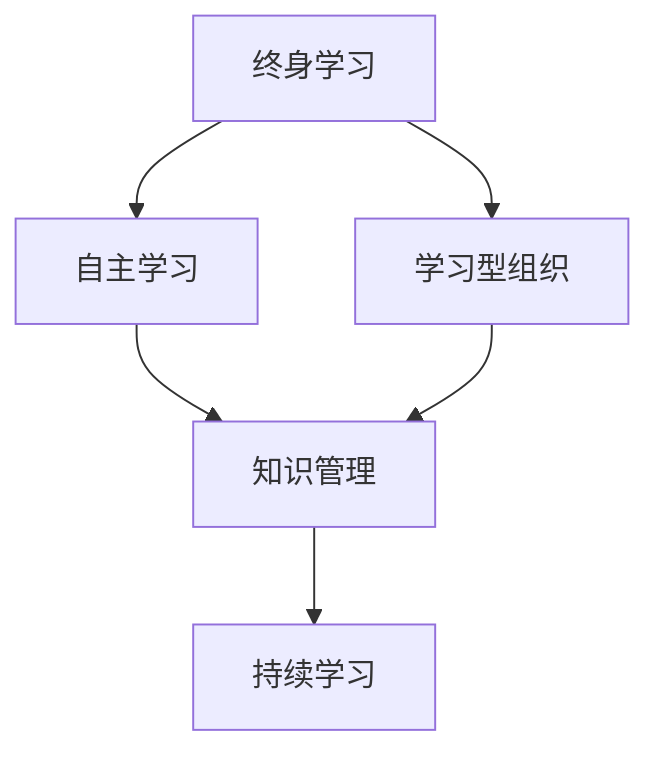

# 持续学习：不断学习新知识

## 1. 背景介绍

在当今快节奏的科技时代，知识和技能的更新速度前所未有。我们生活在一个瞬息万变的环境中,新的技术、新的理念和新的挑战层出不穷。为了跟上时代的步伐,保持竞争力,持续学习和不断获取新知识至关重要。无论你是一名学生、职场人士还是退休人员,持续学习都是一种必需的生活方式。

### 1.1 为什么持续学习如此重要?

- **保持专业知识与技能**: 各行各业的知识和技能都在不断更新和发展,如果停止学习,你很快就会落伍。持续学习可以确保你的专业知识和技能与时俱进,保持竞争力。

- **适应变革**: 技术的快速发展、商业模式的变革以及全球化等因素,都要求我们不断适应新的环境和挑战。持续学习可以帮助我们获得必要的知识和技能,以更好地应对变革。

- **个人成长**: 学习新事物不仅可以丰富我们的知识储备,还能开阔视野,培养创新思维,提高解决问题的能力。持续学习是个人成长和自我实现的关键。

- **职业发展**: 无论你是想获得晋升机会、转行还是创业,持续学习都是必不可少的。掌握新的知识和技能可以增强你的竞争力,开启更广阔的职业发展空间。

### 1.2 持续学习的挑战

尽管持续学习的重要性不言而喻,但它也面临着一些挑战:

- **时间管理**: 在工作、家庭和社交生活的压力下,很多人难以抽出时间专注于学习。

- **学习动机**: 一些人可能缺乏学习的内在动机,觉得学习是一种负担而非乐趣。

- **资源限制**: 获取优质的学习资源并非易事,尤其是对于一些专业领域或偏远地区的人们。

- **技术障碍**: 一些人可能对新技术感到陌生或畏惧,这会阻碍他们利用在线学习资源。

## 2. 核心概念与联系

### 2.1 终身学习(Lifelong Learning)

终身学习是一种理念,强调学习应该贯穿人的整个生命周期,而不仅限于传统的学校教育阶段。它包括了正规教育(如学校、大学)、非正规教育(如培训班、在职培训)以及非正式学习(如自学、实践等)。

终身学习的核心思想是:

- 学习是一个持续的过程,而不是一次性的事件。
- 学习不仅发生在学校,也发生在工作、家庭和社区中。
- 学习的动机来自个人的内在需求和外部环境的变化。
- 学习的方式多种多样,包括正式和非正式的方式。

### 2.2 自主学习(Self-Directed Learning)

自主学习是终身学习的重要组成部分,指的是个人主动识别自己的学习需求,制定学习目标和策略,选择合适的学习资源和方法,并对学习过程和结果进行监控和评估的过程。

自主学习的关键特征包括:

- 自我意识:了解自己的学习需求、优势和不足。
- 自我管理:制定学习计划,分配时间和资源。
- 自我监控:评估学习进度,并根据需要进行调整。
- 自我反思:思考学习过程中的经验教训,以改进未来的学习。

自主学习有助于培养终身学习的习惯和能力,使个人能够更好地适应不断变化的环境。

### 2.3 学习型组织(Learning Organization)

学习型组织是一种组织理念,强调整个组织应该致力于创造一种有利于学习的环境和文化,鼓励个人和团队持续学习,从而提高组织的创新能力和适应能力。

学习型组织的核心特征包括:

- 系统思维:将组织视为一个有机整体,认识到各部分之间的相互关系和影响。
- 个人主动学习:鼓励员工主动学习,提供必要的资源和支持。
- 团队学习:促进团队内部和跨团队的知识共享和协作学习。
- 共享愿景:建立组织的共同愿景,使员工的个人目标与组织目标保持一致。
- 思维模式:挑战传统的思维定式,培养开放和创新的思维方式。

学习型组织有助于组织保持持续的竞争优势,因为它能够快速适应变化,并不断创新和改进。

### 2.4 知识管理(Knowledge Management)

知识管理是指系统地识别、创造、存储、共享和应用组织内部和外部的知识,以实现组织目标的过程。它是持续学习的重要支撑,有助于组织有效利用现有知识,并创造新知识。

知识管理的主要流程包括:

1. **知识获取**: 从内部和外部渠道获取相关知识。
2. **知识组织**: 对获取的知识进行分类、结构化和存储。
3. **知识共享**: 在组织内部有效地传播和交流知识。
4. **知识应用**: 将知识应用于实际的业务流程和决策中。
5. **知识创新**: 基于现有知识,通过协作和创新产生新知识。

有效的知识管理有助于组织避免"重复发明轮子",提高工作效率,促进创新,并保持组织的学习能力。

### 2.5 核心概念之间的联系

上述四个核心概念紧密相连,共同构建了持续学习的理论基础和实践框架:

- **终身学习**是持续学习的根本理念,强调学习应该贯穿整个生命周期。
- **自主学习**是实现终身学习的关键能力,有助于个人主动获取新知识。
- **学习型组织**为持续学习提供了有利的环境和文化,促进组织内部的知识流动和创新。
- **知识管理**则是支撑持续学习的重要工具,确保组织内部的知识得到有效利用和创新。

这四个概念相辅相成,共同推动了持续学习在个人、团队和组织层面的落实和发展。

## 3. 核心算法原理具体操作步骤

持续学习作为一种理念和方法论,并没有特定的算法原理。但是,在实现持续学习的过程中,我们可以借鉴一些学习理论和技术,帮助我们更有效地获取、组织和应用新知识。

### 3.1 主动学习(Active Learning)

主动学习是一种以学习者为中心的教育理论,强调学习者应该主动参与学习过程,而不是被动地接受知识。它包括以下核心步骤:

1. **激发学习动机**: 通过提出有趣的问题、展示实际案例或创设情境等方式,激发学习者的好奇心和学习动机。

2. **探索和发现**: 鼓励学习者通过观察、实验、讨论等方式,主动探索和发现新知识。

3. **实践和应用**: 让学习者将所学知识应用于实际情况,并反思和总结经验教训。

4. **反馈和评估**: 教师或同伴提供及时的反馈,帮助学习者评估自己的学习进度和效果。

5. **持续改进**: 根据反馈和评估,调整学习策略,进行下一轮的主动学习。

主动学习有助于提高学习者的参与度、理解力和创新能力,是实现持续学习的有效方式。

### 3.2 微学习(Microlearning)

微学习是一种将学习内容分解为小块、易于消化的方式,利用碎片化的时间进行学习。它的核心步骤包括:

1. **确定学习目标**: 明确每个微学习单元的具体学习目标。

2. **设计微内容**: 将学习内容分解为短小、集中、易于理解的微内容,如短视频、互动式模块或知识卡片等。

3. **提供多种渠道**: 通过移动应用、在线平台、社交媒体等多种渠道,为学习者提供便捷的学习途径。

4. **鼓励积累和实践**: 鼓励学习者持续积累微内容,并将所学知识应用于实际情况中。

5. **跟踪和评估**: 跟踪学习者的学习进度和效果,提供反馈和建议。

微学习适合于现代人碎片化的生活方式,有助于培养持续学习的习惯,并提高学习效率。

### 3.3 社交学习(Social Learning)

社交学习强调通过与他人的互动和协作来促进学习。它的核心步骤包括:

1. **建立学习社区**: 创建线上或线下的学习社区,让有共同兴趣和目标的人们聚集在一起。

2. **分享和讨论**: 鼓励社区成员分享自己的知识和经验,并就感兴趣的主题进行讨论和探讨。

3. **协作学习**: 组织小组项目或协作活动,让成员通过合作完成任务,相互学习和提高。

4. **反思和总结**: 定期组织反思和总结环节,让成员分享学习心得和经验教训。

5. **持续发展**: 不断吸引新成员加入,扩大社区规模,促进知识的持续流动和创新。

社交学习利用了人与人之间的互动和协作,有助于知识的传播和创新,是实现持续学习的有力补充。

### 3.4 个性化学习(Personalized Learning)

个性化学习是根据每个学习者的独特需求、兴趣和学习风格,为其量身定制学习路径和方法。它的核心步骤包括:

1. **评估学习者**: 通过测试、调查或观察等方式,了解学习者的知识基础、学习偏好和目标。

2. **制定个性化计划**: 根据评估结果,为每个学习者制定个性化的学习计划,包括学习内容、进度和方法。

3. **提供适应性资源**: 提供多种形式的学习资源,如视频、互动模块、游戏化学习等,满足不同学习者的需求。

4. **实时跟踪和反馈**: 持续跟踪学习者的学习进度和效果,提供及时的反馈和建议。

5. **动态调整**: 根据学习者的表现和反馈,动态调整个性化计划,确保学习效果最大化。

个性化学习有助于提高学习者的参与度和学习效率,是实现持续学习的重要手段,尤其在在线学习和智能教育领域备受关注。

## 4. 数学模型和公式详细讲解举例说明

在持续学习的过程中,我们可以借助一些数学模型和公式来量化和优化学习效果。

### 4.1 遗忘曲线(Forgetting Curve)

遗忘曲线是一种描述人类遗忘过程的数学模型,由德国心理学家埃宾浩斯(Hermann Ebbinghaus)于1885年提出。它描述了人们在学习新知识后,如果不进行复习,知识将会以指数方式遗忘。

遗忘曲线可以用下面的公式表示:

$$
R = e^{-\frac{t}{s}}
$$

其中:

- $R$ 表示保留率,即在时间 $t$ 后仍然记住的知识比例。
- $t$ 表示从学习到测试的时间间隔。
- $s$ 是一个常数,表示遗忘的速率,不同的知识和个人有所不同。
- $e$ 是自然对数的底数,约等于2.718。

遗忘曲线告诉我们,要有效保持所学知识,必须进行适当的复习和强化。通过合理安排复习时间和频率,我们可以减缓遗忘的速度,提高持续学习的效果。

### 4.2 间隔重复(Spaced Repetition)

间隔重复是一种高效的记忆强化技术,它基于遗忘曲线的原理,通过在适当的时间间隔内重复复习,来巩固和加深记忆。

间隔重复的核心公式是:

$$
I_{n+1} = I_n \times f
$$

其中:

- $I_{n+1}$ 表