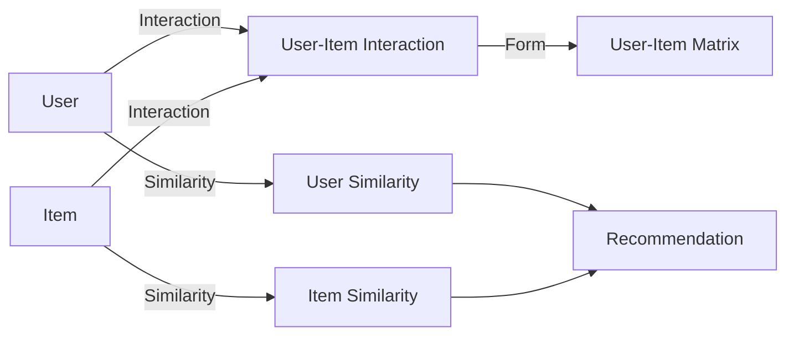

# 推荐系统原理与代码实战案例讲解

## 1. 背景介绍
### 1.1 什么是推荐系统
推荐系统是一种信息过滤系统,旨在预测用户对某个项目的"评分"或"偏好"。推荐系统已广泛应用于各个领域,如电子商务、社交网络、内容平台等,为用户提供个性化的推荐服务。

### 1.2 推荐系统的重要性
在信息过载的时代,推荐系统可以帮助用户快速发现感兴趣的内容,提高用户满意度和忠诚度。对于企业而言,推荐系统可以增加用户粘性、提升转化率和销售额,成为提升竞争力的关键因素。

### 1.3 推荐系统的发展历程
推荐系统的研究可以追溯到20世纪90年代中期。随着互联网的发展,推荐系统逐渐成为学术界和工业界的研究热点。近年来,深度学习等人工智能技术的进步,进一步推动了推荐系统的发展。

## 2. 核心概念与联系
### 2.1 用户(User)
用户是推荐系统服务的对象,通过分析用户的属性、行为、社交关系等信息,推荐系统可以对用户进行建模,从而提供个性化的推荐服务。

### 2.2 物品(Item) 
物品是推荐系统推荐的对象,可以是商品、文章、视频等各种类型的内容。物品通常具有一些属性,如类别、标签等,这些属性可以用于推荐系统的特征工程。

### 2.3 用户-物品交互(User-Item Interaction)
用户-物品交互是指用户对物品的行为,如点击、购买、评分等。这些交互数据是推荐系统的重要输入,通过分析用户-物品交互,可以发现用户的偏好和兴趣。

### 2.4 用户-物品矩阵(User-Item Matrix)
用户-物品矩阵是一种常见的推荐系统输入数据表示方式。矩阵的行表示用户,列表示物品,矩阵元素表示用户对物品的评分或交互情况。基于用户-物品矩阵,可以应用协同过滤等算法进行推荐。

### 2.5 相似度(Similarity)
相似度是推荐系统中的重要概念,用于衡量用户之间或物品之间的相似程度。常见的相似度计算方法有余弦相似度、皮尔逊相关系数等。通过计算相似度,可以找到相似的用户或物品,从而进行推荐。

### 概念联系图


## 3. 核心算法原理具体操作步骤
### 3.1 协同过滤(Collaborative Filtering)
#### 3.1.1 基于用户的协同过滤(User-based CF)
1. 计算用户之间的相似度矩阵
2. 根据相似用户的历史行为,为目标用户生成推荐列表

#### 3.1.2 基于物品的协同过滤(Item-based CF) 
1. 计算物品之间的相似度矩阵
2. 根据用户的历史行为,找到相似的物品,生成推荐列表

### 3.2 矩阵分解(Matrix Factorization)
1. 将用户-物品矩阵分解为用户隐向量矩阵和物品隐向量矩阵
2. 通过优化目标函数,学习用户和物品的隐向量表示
3. 用户和物品隐向量的内积作为预测评分,生成推荐列表

### 3.3 深度学习推荐模型
#### 3.3.1 神经协同过滤(Neural Collaborative Filtering)
1. 用户和物品通过Embedding层映射到低维向量
2. 用户向量和物品向量通过多层感知机(MLP)进行特征交互
3. 输出层预测用户-物品交互概率,生成推荐列表

#### 3.3.2 深度兴趣网络(Deep Interest Network)
1. 将用户的历史行为序列通过Embedding层映射为向量序列
2. 使用注意力机制聚合用户行为序列,生成用户兴趣向量
3. 用户兴趣向量与候选物品向量进行匹配,生成推荐列表

## 4. 数学模型和公式详细讲解举例说明
### 4.1 矩阵分解
矩阵分解的目标是将用户-物品评分矩阵 $R$ 分解为用户隐向量矩阵 $U$ 和物品隐向量矩阵 $V$,使得 $U$ 和 $V$ 的乘积近似等于 $R$:

$$R \approx U^T V$$

其中,$U \in \mathbb{R}^{k \times m}, V \in \mathbb{R}^{k \times n}$,$k$ 为隐向量维度,$m$ 为用户数,$n$ 为物品数。

矩阵分解的优化目标函数为:

$$\min_{U,V} \sum_{(i,j) \in R} (r_{ij} - u_i^T v_j)^2 + \lambda (||U||^2 + ||V||^2)$$

其中,$r_{ij}$ 为用户 $i$ 对物品 $j$ 的实际评分,$u_i$ 为用户 $i$ 的隐向量,$v_j$ 为物品 $j$ 的隐向量,$\lambda$ 为正则化系数。

通过梯度下降等优化算法,可以求解出 $U$ 和 $V$,从而得到用户和物品的隐向量表示。

### 4.2 神经协同过滤
神经协同过滤的核心思想是将用户ID和物品ID通过Embedding层映射到低维向量,再通过神经网络进行特征交互和匹配。

用户 $u$ 的Embedding向量 $e_u$ 和物品 $i$ 的Embedding向量 $e_i$ 计算如下:

$$e_u = Embedding(u), e_u \in \mathbb{R}^d$$
$$e_i = Embedding(i), e_i \in \mathbb{R}^d$$

其中,$d$ 为Embedding向量的维度。

用户向量 $e_u$ 和物品向量 $e_i$ 通过多层感知机(MLP)进行特征交互:

$$z = MLP(e_u, e_i) = \phi_L(...\phi_2(\phi_1(e_u, e_i)))$$

其中,$\phi_l$ 为第 $l$ 层MLP的激活函数。

最后,输出层通过Sigmoid函数预测用户-物品交互概率:

$$\hat{y}_{ui} = \sigma(h^T z)$$

其中,$h$ 为输出层权重向量,$\sigma$ 为Sigmoid函数。

模型的优化目标函数为:

$$\min_{\Theta} - \sum_{(u,i) \in R^+\cup R^-} (y_{ui} \log \hat{y}_{ui} + (1 - y_{ui}) \log (1 - \hat{y}_{ui})) + \lambda ||\Theta||^2$$

其中,$\Theta$ 为模型参数,$R^+$ 为正样本集合,$R^-$ 为负样本集合,$y_{ui}$ 为用户 $u$ 对物品 $i$ 的真实交互标签。

## 5. 项目实践：代码实例和详细解释说明
下面以Python为例,演示基于物品的协同过滤算法的实现:

```python
import numpy as np
from sklearn.metrics.pairwise import cosine_similarity

class ItemCF:
    def __init__(self, data, k=10):
        self.data = data
        self.k = k
        self.item_sim_matrix = self.calc_item_sim()
        
    def calc_item_sim(self):
        """计算物品相似度矩阵"""
        item_sim_matrix = cosine_similarity(self.data.T)
        return item_sim_matrix
    
    def recommend(self, user_id):
        """为用户生成推荐列表"""
        user_ratings = self.data[user_id]
        scores = self.item_sim_matrix.dot(user_ratings)
        item_indices = scores.argsort()[::-1][:self.k]
        return item_indices

# 示例数据
data = np.array([
    [4, 0, 0, 5, 1],
    [5, 0, 3, 4, 0],
    [3, 3, 0, 0, 2],
    [0, 0, 0, 0, 0],
    [1, 0, 2, 4, 0]
])

# 创建ItemCF对象
item_cf = ItemCF(data, k=3)

# 为用户0生成推荐列表
user_id = 0
recommendations = item_cf.recommend(user_id)
print(f"为用户{user_id}推荐的物品: {recommendations}")
```

代码说明:
1. `ItemCF`类的构造函数接受用户-物品评分矩阵`data`和推荐列表长度`k`,并调用`calc_item_sim()`方法计算物品相似度矩阵。

2. `calc_item_sim()`方法使用sklearn的`cosine_similarity()`函数计算物品之间的余弦相似度。

3. `recommend()`方法接受用户ID,通过用户的历史评分向量与物品相似度矩阵相乘,得到用户对每个物品的预测评分。然后对预测评分进行排序,取前`k`个物品作为推荐结果。

4. 示例代码创建了一个`ItemCF`对象,并为用户0生成推荐列表。

输出结果:
```
为用户0推荐的物品: [3 0 2]
```

## 6. 实际应用场景
推荐系统在各个领域都有广泛的应用,下面列举几个典型的应用场景:

### 6.1 电商平台商品推荐
电商平台利用推荐系统为用户推荐可能感兴趣的商品,提高用户的购买转化率和平台的销售额。如亚马逊、淘宝等电商平台。

### 6.2 视频网站内容推荐
视频网站通过分析用户的观看历史、点赞、收藏等行为,为用户推荐个性化的视频内容,增加用户粘性和观看时长。如YouTube、抖音等视频平台。

### 6.3 新闻资讯个性化推荐
新闻资讯平台根据用户的阅读历史、点击行为,推荐用户可能感兴趣的新闻文章,提高用户的阅读量和满意度。如今日头条、Google News等新闻平台。

### 6.4 音乐流媒体个性化电台
音乐流媒体平台通过分析用户的听歌历史、收藏、喜好等信息,为用户推荐个性化的歌曲和歌单,增强用户体验和付费意愿。如Spotify、网易云音乐等音乐平台。

## 7. 工具和资源推荐
以下是一些推荐系统相关的工具和资源:

### 7.1 开源推荐系统框架
- Apache Mahout: 基于Hadoop的分布式机器学习和数据挖掘库,包含多种推荐算法实现。
- LibRec: Java版本的推荐系统库,包含70多种推荐算法实现。
- Surprise: Python版本的推荐系统库,专注于协同过滤算法的实现和评估。

### 7.2 推荐系统数据集
- MovieLens: 电影评分数据集,包含多个不同规模的数据集。
- Netflix Prize: Netflix电影评分数据集,用于Netflix举办的推荐系统竞赛。
- Last.fm: 音乐收听数据集,包含用户对音乐的收听记录。

### 7.3 推荐系统学习资源
- 《推荐系统实践》: 项亮 著,详细介绍了推荐系统的原理、算法和实践。
- 《Recommender Systems Handbook》: Francesco Ricci等人 编著,推荐系统领域的权威参考书。
- Coursera推荐系统专项课程: Coursera平台上的推荐系统专项课程,包含多门相关课程。

## 8. 总结：未来发展趋势与挑战
推荐系统经过多年的发展,已经成为互联网信息服务的重要组成部分。未来,推荐系统还将面临以下发展趋势和挑战:

### 8.1 融合多模态数据
推荐系统需要融合文本、图像、视频等多模态数据,充分利用不同类型数据的信息,提高推荐精度和丰富度。

### 8.2 在线学习与实时推荐
传统的推荐系统通常采用离线训练的方式,无法