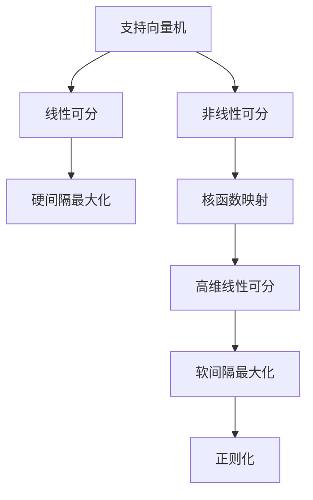

# 支持向量机 (Support Vector Machines, SVM) 原理与代码实例讲解

## 1.背景介绍

### 1.1 机器学习概述

机器学习是人工智能的一个重要分支,旨在使计算机能够从数据中自动分析获得规律,并利用规律对新数据进行预测或决策。机器学习算法通过学习已有数据,建立数学模型,然后利用模型对新数据进行预测或决策。

### 1.2 监督学习与无监督学习

机器学习算法可分为监督学习和无监督学习两大类:

- 监督学习(Supervised Learning)是从给定的训练数据中学习出一个函数,使得当新的输入数据到来时,可以根据学习到的函数对其进行预测或决策。常见的监督学习有分类(Classification)和回归(Regression)。
- 无监督学习(Unsupervised Learning)则是在没有事先标注的数据中自动发现数据的模式和规律。常见的无监督学习有聚类(Clustering)和关联规则挖掘(Association Rule Mining)。

支持向量机(Support Vector Machines, SVM)是一种监督学习算法,主要用于分类和回归分析。

### 1.3 支持向量机的发展历史

支持向量机最早由Vladimir Vapnik及其同事于1963年提出。1992年,Bernhard Boser、Isabelle Guyon和Vladimir Vapnik共同发表了一篇关于支持向量机的论文,首次将支持向量机推广到更高维的情况。1995年,John Platt提出了顺序最小优化(Sequential Minimal Optimization,SMO)算法来训练支持向量机。此后,支持向量机在机器学习领域得到了广泛应用。

## 2.核心概念与联系

### 2.1 支持向量机的基本概念

支持向量机的基本思想是:构造一个高维空间的超平面,将不同类别的数据点分隔开来,使得两类数据点到超平面的距离最大。超平面就是支持向量机的分类决策边界。离超平面最近的那些数据点称为支持向量(Support Vectors)。

### 2.2 函数间隔与几何间隔

对于线性可分的数据,支持向量机的目标是找到一个最优超平面,使得两类数据点的函数间隔(Functional Margin)最大。函数间隔指的是数据点到超平面的函数距离。几何间隔(Geometric Margin)是指数据点到超平面的几何距离。

### 2.3 线性支持向量机与非线性支持向量机

当训练数据线性可分时,可以使用线性支持向量机。当训练数据不可分或非线性可分时,需要使用非线性支持向量机。非线性支持向量机通过核函数(Kernel Function)将数据映射到高维空间,使得在高维空间中线性可分。

### 2.4 软间隔与正则化

对于一些噪声数据或离群点,硬间隔的最大间隔分类面可能会过拟合。软间隔(Soft Margin)最大化允许一些数据点位于分类面的错误一侧,从而获得更好的泛化能力。软间隔需要引入正则化(Regularization)参数C,用于权衡最大间隔与误分类点的影响。

## 3.核心算法原理具体操作步骤  

### 3.1 线性支持向量机

对于线性可分的数据,支持向量机的目标是找到一个最优超平面,使得两类数据点的函数间隔最大。假设训练数据集为 $\{(x_1,y_1),(x_2,y_2),...,(x_n,y_n)\}$,其中 $x_i \in \mathbb{R}^d$ 为 $d$ 维向量, $y_i \in \{+1,-1\}$ 为类别标记。

最优超平面可以表示为:

$$w^Tx + b = 0$$

其中 $w$ 为权重向量, $b$ 为偏置项。分类决策函数为:

$$f(x) = \text{sign}(w^Tx + b)$$

求解最优超平面等价于求解以下凸二次规划问题:

$$
\begin{aligned}
&\underset{w,b}{\text{min}} &&\frac{1}{2}||w||^2\\
&\text{subject to} &&y_i(w^Tx_i+b) \geq 1, &&i=1,2,...,n
\end{aligned}
$$

该优化问题可以通过拉格朗日乘子法求解,得到对偶问题:

$$
\begin{aligned}
&\underset{\alpha}{\text{max}} &&L(\alpha)=\sum_{i=1}^n\alpha_i-\frac{1}{2}\sum_{i,j=1}^n\alpha_i\alpha_jy_iy_jx_i^Tx_j\\
&\text{subject to} &&\sum_{i=1}^n\alpha_iy_i=0\\
&&&0\leq \alpha_i\leq C,&&i=1,2,...,n
\end{aligned}
$$

其中 $\alpha_i$ 为拉格朗日乘子, $C$ 为惩罚参数。

### 3.2 非线性支持向量机

对于非线性可分的数据,支持向量机需要通过核函数 $\phi(x)$ 将数据映射到高维特征空间,使得在高维空间中线性可分。

在高维特征空间中,最优超平面为:

$$w^T\phi(x) + b = 0$$

对偶问题变为:

$$
\begin{aligned}
&\underset{\alpha}{\text{max}} &&L(\alpha)=\sum_{i=1}^n\alpha_i-\frac{1}{2}\sum_{i,j=1}^n\alpha_i\alpha_jy_iy_j\phi(x_i)^T\phi(x_j)\\
&\text{subject to} &&\sum_{i=1}^n\alpha_iy_i=0\\
&&&0\leq \alpha_i\leq C,&&i=1,2,...,n
\end{aligned}
$$

引入核函数 $K(x_i,x_j)=\phi(x_i)^T\phi(x_j)$,对偶问题可以简化为:

$$
\begin{aligned}
&\underset{\alpha}{\text{max}} &&L(\alpha)=\sum_{i=1}^n\alpha_i-\frac{1}{2}\sum_{i,j=1}^n\alpha_i\alpha_jy_iy_jK(x_i,x_j)\\
&\text{subject to} &&\sum_{i=1}^n\alpha_iy_i=0\\
&&&0\leq \alpha_i\leq C,&&i=1,2,...,n
\end{aligned}
$$

常用的核函数有线性核、多项式核、高斯核(RBF核)等。

### 3.3 SMO算法

序列最小优化(Sequential Minimal Optimization, SMO)算法是一种高效求解支持向量机对偶问题的算法。SMO算法的基本思路是:

1. 将对偶问题分解为多个较小的二次规划子问题
2. 每次只优化两个变量,其余变量保持不变
3. 重复上述过程,直至收敛

SMO算法避免了计算整个核矩阵,大大减少了内存开销,并且可以有效利用缓存,提高计算效率。

## 4.数学模型和公式详细讲解举例说明

### 4.1 线性支持向量机

假设线性可分的训练数据集为 $\{(x_1,y_1),(x_2,y_2),...,(x_n,y_n)\}$,其中 $x_i \in \mathbb{R}^2$ 为二维向量, $y_i \in \{+1,-1\}$ 为类别标记。我们希望找到一个超平面 $w^Tx + b = 0$ 将两类数据点分开,并使得两类数据点到超平面的距离最大。

对于任意一个数据点 $(x_i, y_i)$,如果被正确分类,则应满足:

$$y_i(w^Tx_i + b) \geq 1$$

上式两边同时除以 $||w||$,得到:

$$y_i\left(\frac{w^Tx_i}{||w||} + \frac{b}{||w||}\right) \geq \frac{1}{||w||}$$

令 $w^* = \frac{w}{||w||}$, $b^* = \frac{b}{||w||}$,上式可以写为:

$$y_i(w^{*T}x_i + b^*) \geq \frac{1}{||w||}$$

其中 $\frac{1}{||w||}$ 就是函数间隔(Functional Margin)。几何间隔(Geometric Margin)是函数间隔在 $w$ 方向上的投影,即 $\frac{1}{||w||}$。因此,最大化函数间隔等价于最大化几何间隔。

综上所述,求解线性支持向量机的最优超平面等价于求解以下凸二次规划问题:

$$
\begin{aligned}
&\underset{w,b}{\text{min}} &&\frac{1}{2}||w||^2\\
&\text{subject to} &&y_i(w^Tx_i+b) \geq 1, &&i=1,2,...,n
\end{aligned}
$$

该优化问题可以通过拉格朗日乘子法求解,得到对偶问题:

$$
\begin{aligned}
&\underset{\alpha}{\text{max}} &&L(\alpha)=\sum_{i=1}^n\alpha_i-\frac{1}{2}\sum_{i,j=1}^n\alpha_i\alpha_jy_iy_jx_i^Tx_j\\
&\text{subject to} &&\sum_{i=1}^n\alpha_iy_i=0\\
&&&0\leq \alpha_i\leq C,&&i=1,2,...,n
\end{aligned}
$$

其中 $\alpha_i$ 为拉格朗日乘子, $C$ 为惩罚参数。

对偶问题的解 $\alpha^*$ 可以用来恢复原始问题的解 $w^*$ 和 $b^*$:

$$
w^*=\sum_{i=1}^n\alpha_i^*y_ix_i
$$

$$
b^*=y_j-\sum_{i=1}^n\alpha_i^*y_ix_i^Tx_j
$$

其中 $j$ 是任意一个支持向量的下标。最终的分类决策函数为:

$$
f(x)=\text{sign}(w^{*T}x+b^*)
$$

### 4.2 非线性支持向量机

对于非线性可分的数据,我们可以通过核函数 $\phi(x)$ 将数据映射到高维特征空间,使得在高维空间中线性可分。

在高维特征空间中,最优超平面为:

$$w^T\phi(x) + b = 0$$

对偶问题变为:

$$
\begin{aligned}
&\underset{\alpha}{\text{max}} &&L(\alpha)=\sum_{i=1}^n\alpha_i-\frac{1}{2}\sum_{i,j=1}^n\alpha_i\alpha_jy_iy_j\phi(x_i)^T\phi(x_j)\\
&\text{subject to} &&\sum_{i=1}^n\alpha_iy_i=0\\
&&&0\leq \alpha_i\leq C,&&i=1,2,...,n
\end{aligned}
$$

引入核函数 $K(x_i,x_j)=\phi(x_i)^T\phi(x_j)$,对偶问题可以简化为:

$$
\begin{aligned}
&\underset{\alpha}{\text{max}} &&L(\alpha)=\sum_{i=1}^n\alpha_i-\frac{1}{2}\sum_{i,j=1}^n\alpha_i\alpha_jy_iy_jK(x_i,x_j)\\
&\text{subject to} &&\sum_{i=1}^n\alpha_iy_i=0\\
&&&0\leq \alpha_i\leq C,&&i=1,2,...,n
\end{aligned}
$$

常用的核函数有:

- 线性核: $K(x_i,x_j)=x_i^Tx_j$
- 多项式核: $K(x_i,x_j)=(x_i^Tx_j+c)^d$
- 高斯核(RBF核): $K(x_i,x_j)=\exp(-\gamma||x_i-x_j||^2)$

其中 $c$、$d$ 和 $\gamma$ 为核函数的参数。

对偶问题的解 $\alpha^*$ 可以用来计算分类决策函数:

$$
f(x)=\text{sign}\left(\sum_{i=1}^n\alpha_i^*y_iK(x_i,x)+b^*\right)
$$

其中 $b^