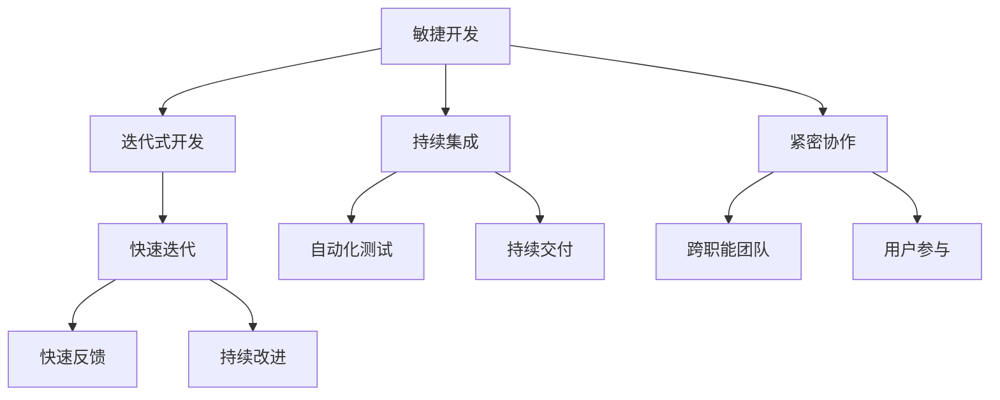

# 敏捷开发与快速迭代原理与代码实战案例讲解

## 1.背景介绍

### 1.1 软件开发的挑战

在当今快节奏的商业环境中,软件开发面临着许多挑战。需求频繁变更、技术快速迭代、市场竞争激烈等因素,要求软件团队能够快速响应,提高开发效率,确保高质量的交付。传统的瀑布式开发模式由于过于僵化和缺乏灵活性,难以适应这种动态的环境。

### 1.2 敏捷开发的兴起

为了应对这些挑战,敏捷开发(Agile Development)作为一种新的软件开发方法论应运而生。敏捷开发强调迭代式开发、持续交付和紧密协作,旨在提高开发团队的响应能力和适应能力。它通过一系列原则、实践和价值观,帮助团队更好地管理需求变更、控制风险并提高软件质量。

### 1.3 快速迭代的重要性

在敏捷开发中,快速迭代(Rapid Iteration)是一个关键概念。它指的是以短周期(通常为1-4周)进行持续的开发、测试和交付,从而实现快速反馈和持续改进。快速迭代有助于降低风险、提高质量,并确保软件能够及时满足不断变化的需求。

## 2.核心概念与联系



敏捷开发是一个广泛的概念,包含了多个核心原则和实践。其中,迭代式开发、持续集成、紧密协作是三大支柱:

1. **迭代式开发**:将整个项目划分为多个短周期的迭代,每个迭代都包含需求分析、设计、编码、测试和交付等活动。这样可以更好地控制风险,及时获取反馈并进行调整。
2. **持续集成**:通过自动化构建、测试和部署,实现代码的持续集成,从而提高软件质量并加快交付速度。
3. **紧密协作**:鼓励跨职能团队成员(开发人员、测试人员、产品经理等)紧密协作,共同参与项目的各个阶段,提高效率和沟通质量。

快速迭代作为迭代式开发的核心,是实现快速反馈和持续改进的关键。通过短周期的迭代,团队可以及时获取用户反馈,并根据反馈进行改进,从而不断优化产品。同时,快速迭代也有助于控制风险,因为每个迭代都是一个可交付的增量,降低了项目失败的风险。

持续集成和自动化测试则是支持快速迭代的重要实践。它们确保了每次迭代都能交付高质量的软件,并为持续交付奠定了基础。

最后,紧密协作和用户参与也是敏捷开发的核心。通过跨职能团队的协作,可以提高沟通效率,减少误解;而用户参与则确保了开发团队能够真正理解并满足用户需求。

## 3.核心算法原理具体操作步骤

虽然敏捷开发并不依赖于特定的算法,但它确实包含了一些核心原则和实践,这些原则和实践可以被视为一种"算法",指导团队如何高效地进行软件开发。以下是敏捷开发的核心原理及具体操作步骤:

### 3.1 迭代式开发

1. **规划迭代**:根据产品路线图和优先级,确定每个迭代要完成的功能和目标。
2. **制定冲刺计划**:团队共同商议并确定本次迭代的具体任务和工作量。
3. **每日站立会议**:团队每天进行短暂的会议,跟踪进度、识别障碍并协调工作。
4. **开发和测试**:开发人员编写代码,测试人员执行测试,确保质量。
5. **迭代回顾**:迭代结束时,团队回顾本次迭代,总结经验教训。
6. **重复上述步骤**:根据反馈和新需求,规划下一个迭代。

### 3.2 持续集成和交付

1. **版本控制**:使用版本控制系统(如Git)管理代码。
2. **自动化构建**:配置自动化构建工具(如Jenkins),在每次代码提交时自动编译和打包。
3. **自动化测试**:编写和执行自动化测试用例,包括单元测试、集成测试和端到端测试。
4. **持续部署**:将通过测试的代码自动部署到测试/生产环境。
5. **监控和反馈**:监控生产环境,收集用户反馈,作为下一次迭代的输入。

### 3.3 紧密协作和用户参与

1. **跨职能团队**:组建包含开发人员、测试人员、产品经理等角色的团队。
2. **用户故事**:以用户故事的形式收集和管理需求。
3. **产品负责人**:指定一名产品负责人,代表用户利益,确定需求优先级。
4. **用户参与**:邀请用户参与需求评审、测试和反馈。
5. **回顾会议**:定期召开回顾会议,讨论问题并持续改进流程。

通过遵循这些核心原理和操作步骤,敏捷团队可以高效地交付高质量的软件,快速响应需求变化,并不断优化开发流程。

## 4.数学模型和公式详细讲解举例说明

虽然敏捷开发本身并不直接涉及复杂的数学模型,但在项目管理和过程优化方面,一些数学概念和公式仍然有助于量化和优化开发流程。以下是一些常见的数学模型和公式:

### 4.1 经验燃尽图(Burn-down Chart)

经验燃尽图是敏捷开发中常用的一种可视化工具,用于跟踪迭代或冲刺的进度。它将剩余工作量与时间进行对比,帮助团队了解是否按计划进行。

燃尽图的基本公式如下:

$$
剩余工作量 = 初始工作量 - 已完成工作量
$$

其中,初始工作量是指迭代或冲刺开始时的总工作量,已完成工作量是指截止当前时间已经完成的工作量。

通过绘制燃尽图,团队可以及时发现偏离计划的情况,并采取相应的措施进行调整。

### 4.2 团队速率(Team Velocity)

团队速率是衡量团队在一个迭代或冲刺中完成工作量的指标。它通常以故事点(Story Point)作为单位,反映了团队在特定时间内的交付能力。

计算团队速率的公式如下:

$$
团队速率 = \frac{本次迭代完成的故事点数}{迭代时间(周或月)}
$$

通过持续跟踪和计算团队速率,团队可以更好地预测和规划未来的工作量,从而提高交付效率。

### 4.3 技术债务(Technical Debt)

技术债务是指为了快速交付而做出的一些妥协或权衡,导致代码质量下降或架构复杂化。这种债务会随着时间的推移而累积,最终可能导致开发效率下降和维护成本增加。

计算技术债务的公式如下:

$$
技术债务 = \sum_{i=1}^{n} 债务项目_i
$$

其中,每个债务项目都有一个相应的权重或成本,代表了偿还该债务所需的工作量。

通过持续跟踪和优先偿还技术债务,团队可以保持代码质量和架构的健康状态,从而提高长期的开发效率和可维护性。

### 4.4 其他数学模型

除了上述模型外,敏捷开发中还可以应用其他数学概念和模型,如:

- **蒙特卡罗模拟**:用于评估风险和不确定性,帮助做出更好的决策。
- **统计过程控制(SPC)**:通过统计方法监控和控制软件开发过程,提高质量和可预测性。
- **队列理论**:用于优化工作流程,减少等待时间和瓶颈。

总的来说,数学模型和公式为敏捷开发提供了量化和优化的工具,有助于团队更好地管理和改进开发流程。

## 5.项目实践:代码实例和详细解释说明

为了更好地理解敏捷开发的实践,我们将通过一个简单的示例项目来演示如何应用敏捷原则和实践。该项目是一个简单的在线商店,允许用户浏览和购买商品。

### 5.1 项目设置

首先,我们组建一个跨职能的敏捷团队,包括:

- 产品负责人(Product Owner):负责管理产品待办事项(Product Backlog)和确定需求优先级。
- Scrum Master:负责推进敏捷流程,协调团队并消除障碍。
- 开发人员:负责编写代码和单元测试。
- 测试人员:负责编写和执行集成测试和端到端测试。

接下来,我们使用敏捷工具(如Jira)来管理产品待办事项和冲刺计划。

### 5.2 迭代开发

我们将整个项目划分为多个迭代(Sprint),每个迭代持续2周。在每个迭代开始时,团队会召开冲刺计划会议,从产品待办事项中选择高优先级的用户故事,并将它们分解为可交付的任务。

以下是第一个迭代的用户故事示例:

```
作为一名买家,我希望能够浏览商品列表,以便选择感兴趣的商品。

场景:
  给定:我在商店主页
  当:我查看商品列表
  那么:我应该看到所有可用商品的名称、价格和图片

接受标准:
  - 商品列表显示所有可用商品
  - 每个商品都显示名称、价格和图片
  - 商品列表可以分页显示
```

开发人员会根据这些用户故事编写代码,测试人员则编写相应的测试用例。在迭代期间,团队会每天进行短暂的站立会议,跟踪进度并协调工作。

### 5.3 持续集成和交付

为了支持快速迭代,我们建立了自动化的持续集成和交付流水线。具体步骤如下:

1. 开发人员将代码提交到Git版本控制系统。
2. Jenkins自动化构建服务器监测到代码提交,自动拉取代码并进行编译和打包。
3. 构建成功后,自动触发单元测试和代码质量检查。
4. 如果单元测试通过,则自动部署到测试环境,并触发集成测试和端到端测试。
5. 如果所有测试都通过,则自动部署到生产环境。

以下是一个简单的Java单元测试示例,用于测试商品列表功能:

```java
import org.junit.Test;
import static org.junit.Assert.assertEquals;

public class ProductListTest {
    @Test
    public void testGetProducts() {
        ProductList productList = new ProductList();
        List<Product> products = productList.getProducts();
        
        // 断言商品列表不为空
        assertNotNull(products);
        
        // 断言商品列表包含特定商品
        boolean containsBook = false;
        for (Product product : products) {
            if (product.getName().equals("Book")) {
                containsBook = true;
                break;
            }
        }
        assertTrue(containsBook);
    }
}
```

通过自动化的持续集成和交付流程,我们可以快速将新功能交付给用户,并确保代码质量。

### 5.4 用户参与和反馈

在每个迭代结束时,我们会邀请用户参与产品演示,获取他们的反馈。根据用户反馈,我们可以调整产品待办事项的优先级,或者添加新的用户故事。

例如,在第一个迭代结束后,我们收到了以下反馈:

```
反馈1:我希望能够按类别过滤商品列表。
反馈2:商品详情页面缺少评论和评分信息。
```

基于这些反馈,我们将相应的用户故事添加