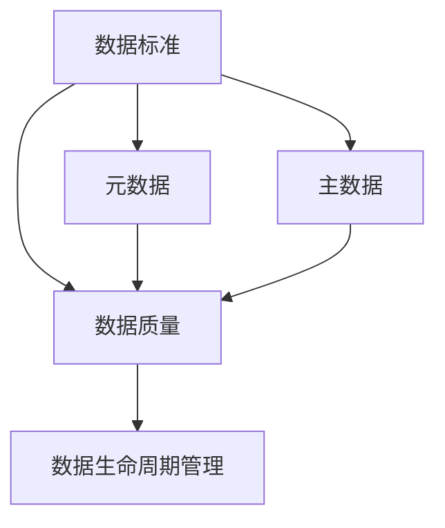
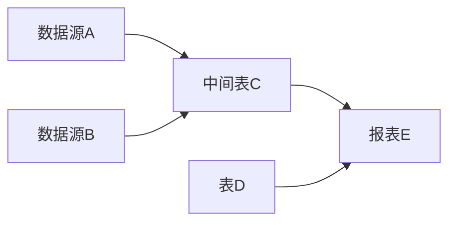

# 数据治理 原理与代码实例讲解

## 1.背景介绍

随着数字化转型的不断深入，企业每天产生和积累的数据量呈现爆炸式增长。如何有效地管理和利用这些海量数据，已经成为企业提升核心竞争力的关键因素之一。数据治理应运而生，它旨在通过一系列的原则、策略、流程、标准和工具，来规范数据管理，提高数据质量，实现数据资产的价值最大化。

### 1.1 数据治理的重要性

在当今数据驱动的商业环境下，高质量的数据对于企业的决策制定、业务运营和风险管控至关重要。然而，许多企业面临着数据孤岛、数据冗余、数据不一致等问题，导致数据难以有效利用。数据治理通过建立统一的数据标准、规范数据管理流程、明确数据权责，可以有效解决这些问题，提升数据的可用性、准确性和安全性。

### 1.2 数据治理的目标

数据治理的主要目标包括：

- 提高数据质量：通过数据标准化、数据清洗等手段，提高数据的准确性、完整性和一致性。
- 促进数据共享：打破数据孤岛，实现跨部门、跨系统的数据共享和集成。
- 保障数据安全：建立数据访问控制和数据保护机制，防止数据泄露和非法访问。
- 提升数据价值：通过数据分析和挖掘，充分发掘数据的商业价值，支撑业务决策和创新。

### 1.3 数据治理的挑战

实施数据治理面临诸多挑战，主要包括：

- 组织文化：数据治理需要全员参与，需要转变传统的数据管理思维和工作方式。
- 数据复杂性：企业数据来源多样、格式复杂，数据治理需要兼顾不同类型数据的特点。
- 技术支撑：数据治理需要强大的技术平台和工具支撑，如元数据管理、数据质量管理等。
- 数据治理体系：需要建立完善的数据治理组织架构、制度流程和绩效考核体系。

## 2.核心概念与联系

### 2.1 数据治理的核心概念

#### 2.1.1 数据标准

数据标准是指对数据的定义、格式、取值范围等进行统一规范，以保证数据的一致性和可比性。常见的数据标准包括数据元、数据字典、编码规则等。

#### 2.1.2 元数据

元数据是描述数据的数据，记录了数据的属性、结构、来源、变更等信息。元数据是数据治理的基础，通过元数据管理可以实现数据溯源、影响分析等功能。

#### 2.1.3 数据质量

数据质量是指数据在完整性、准确性、一致性、及时性等方面满足业务需求的程度。数据质量管理是数据治理的重点，需要制定数据质量标准、开展数据质量评估和持续改进。

#### 2.1.4 主数据

主数据是指企业核心业务实体的关键属性数据，如客户、产品、供应商等。主数据管理旨在建立统一、标准、高质量的主数据，为业务运营提供可靠的数据基础。

#### 2.1.5 数据生命周期

数据生命周期是指数据从产生到消亡的全过程，包括数据采集、存储、处理、应用、归档和销毁等阶段。数据治理需要覆盖数据全生命周期，对各个阶段的数据实施有效管控。

### 2.2 核心概念之间的联系

数据标准是数据治理的基石，为各项数据管理活动提供统一的规范和标准。元数据是数据资产管理的核心，通过元数据可以实现数据溯源、血缘分析、影响分析等数据治理功能。数据质量管理贯穿数据治理的始终，需要围绕主数据开展，覆盖数据全生命周期。

下图展示了数据治理的核心概念之间的联系：



## 3.核心算法原理具体操作步骤

### 3.1 数据质量评估算法

数据质量评估是数据治理的重要环节，需要选择合适的评估指标和算法。常见的数据质量评估指标包括：

- 完整性：数据记录的完整程度，可以用缺失值率来衡量。
- 准确性：数据与真实世界的符合程度，可以通过抽样检验来评估。
- 一致性：不同数据源或系统之间数据的一致程度，可以用一致性检查规则来评估。
- 及时性：数据更新的及时程度，可以用数据时效性来衡量。

下面以缺失值率的计算为例，介绍数据质量评估的具体步骤：

1. 确定评估对象：选择需要评估完整性的数据表或字段。
2. 计算缺失值数量：统计数据表或字段中空值、NULL值、特殊字符等缺失值的数量。
3. 计算总记录数：统计数据表或字段的总记录数。
4. 计算缺失值率：缺失值率=缺失值数量/总记录数。
5. 评估结果判断：根据预设的阈值判断缺失值率是否超标，并进行原因分析和改进措施制定。

### 3.2 数据清洗算法

数据清洗是提高数据质量的重要手段，常见的数据清洗算法包括：

- 异常值检测：利用统计学方法（如3σ原则）或机器学习算法（如隔离森林）识别异常值。
- 缺失值填充：根据业务规则或统计学方法（如均值、中位数）对缺失值进行填充。
- 不一致值修正：根据标准值对照表或相似度算法（如编辑距离）对不一致值进行修正。

下面以异常值检测中的3σ原则为例，介绍其具体步骤：

1. 计算数据均值：$\mu=\frac{\sum_{i=1}^n x_i}{n}$
2. 计算数据标准差：$\sigma=\sqrt{\frac{\sum_{i=1}^n (x_i-\mu)^2}{n}}$
3. 确定异常值上下限：$[\mu-3\sigma, \mu+3\sigma]$
4. 识别异常值：超出上下限的数据点即为异常值。
5. 处理异常值：根据业务需求，可以选择删除异常值或进行进一步分析。

## 4.数学模型和公式详细讲解举例说明

### 4.1 数据血缘分析模型

数据血缘是指数据从源头到当前状态的演变过程，反映了数据的来龙去脉。数据血缘分析可以用有向无环图（DAG）来建模，节点表示数据实体或处理过程，边表示数据流向。

假设有如下数据处理流程：数据源A和B经过ETL处理后生成中间表C，表C与表D进行关联生成报表E。其数据血缘图可以表示为：



通过数据血缘分析，可以实现数据溯源、影响分析等功能。例如，如果报表E的数据出现问题，可以通过血缘图追踪到上游的数据源A、B和中间表C，进而定位问题根源。

### 4.2 数据质量评分模型

为了量化评估数据质量，可以建立数据质量评分模型。假设选择了完整性、准确性、一致性三个指标，每个指标的权重分别为0.3、0.5、0.2。定义单个指标的得分为：

$$
S_i=\begin{cases}
1, & Q_i\geq T_i\\
\frac{Q_i}{T_i}, & Q_i < T_i
\end{cases}
$$

其中，$S_i$ 为第 $i$ 个指标的得分，$Q_i$ 为第 $i$ 个指标的实际值，$T_i$ 为第 $i$ 个指标的阈值。

则数据质量总评分为：

$$
S=\sum_{i=1}^n W_i \cdot S_i
$$

其中，$W_i$ 为第 $i$ 个指标的权重，$\sum_{i=1}^n W_i=1$。

举例来说，某数据表的完整性为95%，准确性为98%，一致性为90%，阈值分别为98%、100%、95%。则各指标得分为：

$$
S_1=\frac{95\%}{98\%}=0.97, S_2=\frac{98\%}{100\%}=0.98, S_3=\frac{90\%}{95\%}=0.95
$$

数据质量总评分为：

$$
S=0.3 \times 0.97 + 0.5 \times 0.98 + 0.2 \times 0.95 = 0.97
$$

## 5.项目实践：代码实例和详细解释说明

下面以Python为例，演示数据治理中的几个常见任务。

### 5.1 数据探索与分析

使用Pandas库对数据进行探索和分析，以了解数据的基本情况。

```python
import pandas as pd

# 读取数据文件
df = pd.read_csv('data.csv')

# 查看数据前几行
print(df.head())

# 查看数据基本信息
print(df.info())

# 查看数据统计信息
print(df.describe())

# 检查缺失值
print(df.isnull().sum())
```

### 5.2 数据质量评估

计算数据的完整性、准确性等质量指标。

```python
# 计算缺失值率
missing_rate = df.isnull().sum() / len(df)
print(missing_rate)

# 计算值分布
value_dist = df['column'].value_counts(normalize=True)
print(value_dist)

# 检查取值范围
if (df['column'] < 0).any() or (df['column'] > 100).any():
    print('Value out of range!')
```

### 5.3 数据清洗

对缺失值、异常值等进行处理，提高数据质量。

```python
# 删除缺失值过多的列
df.drop(columns=['column1', 'column2'], inplace=True)

# 缺失值填充
df.fillna(df.mean(), inplace=True)

# 异常值处理
df = df[(df['column'] >= 0) & (df['column'] <= 100)]

# 数据格式转换
df['column'] = pd.to_datetime(df['column'])
```

### 5.4 数据标准化

按照数据标准对数据进行规范化处理。

```python
# 字符串转小写
df['column'] = df['column'].str.lower()

# 日期格式标准化
df['date'] = pd.to_datetime(df['date']).dt.strftime('%Y-%m-%d')

# 字符串替换
df['column'] = df['column'].str.replace(' ', '_')
```

### 5.5 元数据管理

使用元数据表记录数据的属性信息。

```python
# 创建元数据表
metadata = pd.DataFrame(columns=['table_name', 'column_name', 'data_type', 'description'])

# 添加元数据记录
metadata = metadata.append({
    'table_name': 'sales',
    'column_name': 'amount',
    'data_type': 'float',
    'description': '销售金额'
}, ignore_index=True)

# 保存元数据表
metadata.to_csv('metadata.csv', index=False)
```

## 6.实际应用场景

数据治理在各行各业都有广泛应用，下面列举几个典型场景：

### 6.1 金融行业

银行、保险等金融机构需要管理海量的客户数据、交易数据，对数据质量和安全性要求极高。通过数据治理，可以实现客户信息的统一管理、交易数据的准确对账、风险数据的实时监控等，提高数据管理效率和风险管控能力。

### 6.2 电商行业

电商平台需要处理大量的商品数据、订单数据、用户行为数据，数据来源和格式复杂多样。通过数据治理，可以建立统一的商品主数据、订单主数据，提高数据的一致性和可用性；通过数据标准化和数据清洗，可以提高搜索、推荐等算法的效果；通过数据血缘分析，可以优化数据处理流程，提高数据处理效率。

### 6.3 制造业

制造企业需要管理研发、