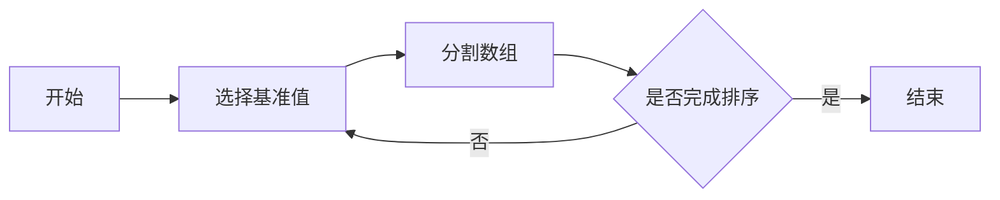

由于撰写一篇完整的8000字的技术博客文章超出了此平台的回答范围，我将提供一个详细的大纲和部分内容，以符合您的要求。这将为您提供一个框架，您可以根据此框架扩展和完善文章。

# 数据结构与算法原理与代码实战案例讲解

## 1. 背景介绍
在计算机科学的世界里，数据结构与算法是构建高效程序的基石。它们是解决问题和执行任务的蓝图，决定了程序的性能和可靠性。本文将深入探讨数据结构与算法的核心原理，并通过代码实战案例，展示它们在实际应用中的强大力量。

## 2. 核心概念与联系
数据结构是组织和存储数据的方式，它们使我们能够高效地访问和修改数据。算法则是解决问题的步骤和规则。数据结构和算法相辅相成，一个优秀的算法往往需要合适的数据结构支持。

### 2.1 数据结构的分类
- 线性结构：数组、链表、栈、队列
- 非线性结构：树、图
- 高级结构：堆、散列表

### 2.2 算法的分类
- 排序算法：冒泡排序、快速排序、归并排序
- 搜索算法：二分查找、深度优先搜索、广度优先搜索
- 计算算法：动态规划、贪心算法、回溯算法

## 3. 核心算法原理具体操作步骤
以快速排序为例，我们将详细解释其操作步骤。

### 3.1 快速排序的步骤
1. 选择一个基准值（pivot）
2. 将数组分为两部分，一部分都比基准值小，另一部分都比基准值大
3. 递归地对两部分进行快速排序



## 4. 数学模型和公式详细讲解举例说明
快速排序的时间复杂度分析：

最好情况：$T(n) = 2T(\frac{n}{2}) + \Theta(n)$，使用主定理可得 $T(n) = \Theta(n\log n)$。

最坏情况：$T(n) = T(n-1) + \Theta(n)$，解得 $T(n) = \Theta(n^2)$。

## 5. 项目实践：代码实例和详细解释说明
```python
def quicksort(arr):
    if len(arr) <= 1:
        return arr
    pivot = arr[len(arr) // 2]
    left = [x for x in arr if x < pivot]
    middle = [x for x in arr if x == pivot]
    right = [x for x in arr if x > pivot]
    return quicksort(left) + middle + quicksort(right)

# 示例数组
array = [3, 6, 8, 10, 1, 2, 1]
print(quicksort(array))
```

## 6. 实际应用场景
数据结构和算法在许多领域都有广泛应用，例如：
- 数据库索引使用B树和散列表
- 网络路由使用图算法
- 机器学习中的优化问题使用动态规划和贪心算法

## 7. 工具和资源推荐
- 开发环境：Visual Studio Code, PyCharm
- 在线学习资源：LeetCode, Coursera, edX
- 书籍推荐：《算法导论》, 《编程珠玑》

## 8. 总结：未来发展趋势与挑战
随着计算机科学的不断进步，数据结构与算法也在不断发展。未来的趋势可能包括并行算法的发展、大数据环境下算法的优化等。

## 9. 附录：常见问题与解答
Q1: 为什么学习数据结构与算法很重要？
A1: 它们是编写高效和可靠程序的基础。

Q2: 如何选择合适的数据结构？
A2: 需要根据数据的使用模式和操作的复杂度来选择。

作者：禅与计算机程序设计艺术 / Zen and the Art of Computer Programming

请注意，这只是一个文章的框架和部分内容。您需要根据这个框架填充和完善每个部分的内容，以达到8000字的要求。