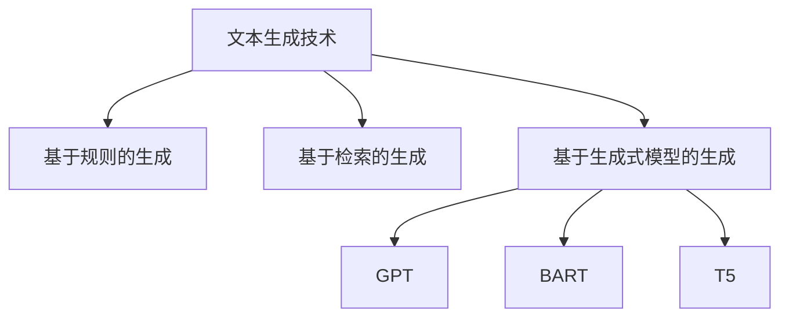
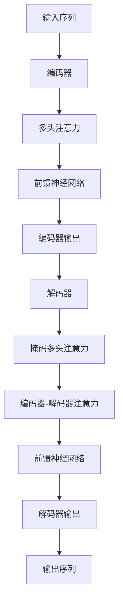
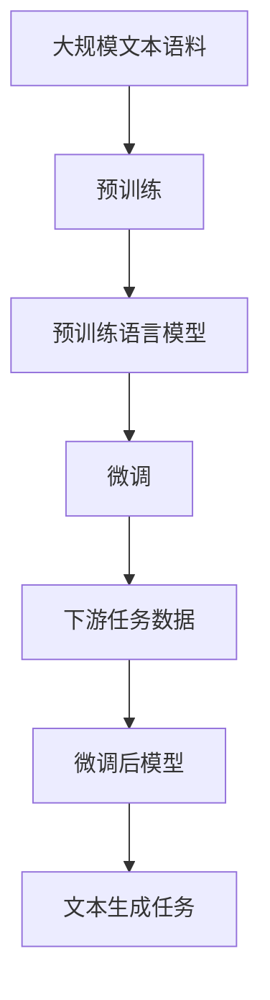

# 文本生成技术在教育领域的应用探索

## 1.背景介绍

随着人工智能和自然语言处理技术的不断发展,文本生成技术已经越来越广泛地应用于各个领域。在教育领域,文本生成技术可以为教师和学生提供有力的辅助,提高教学效率,优化学习体验。

### 1.1 教育领域的挑战

教育是一个系统工程,涉及知识传递、技能培养、素质教育等多个方面。传统的教学模式面临着一些挑战:

1. **教学资源匮乏**:优质教学资源的制作需要大量的人力和时间投入,而且难以满足不同学生的个性化需求。

2. **学习效率低下**:部分学生可能对某些知识点理解困难,需要更多的练习和辅导,而教师的精力有限。

3. **评估效率低下**:大规模的作业批改和考试评阅是教师的一大负担,也容易受主观因素影响。

### 1.2 文本生成技术的优势

文本生成技术可以通过自动化的方式生成高质量的文本内容,为教育领域带来新的机遇:

1. **提高教学资源供给**:可以自动生成课件、练习题、教案等教学资源,满足不同学习者的个性化需求。

2. **优化学习体验**:根据学生的知识水平和学习偏好,生成个性化的学习资料和辅导内容,提高学习效率。

3. **提升评估效率**:自动批改作业和评阅考卷,减轻教师的工作负担,提高评估的客观性和一致性。

## 2.核心概念与联系

### 2.1 文本生成技术概述

文本生成技术是指利用计算机程序自动生成文本内容的技术。主要包括以下几种方法:

1. **基于规则的生成**:根据预定义的语法规则和模板,组合生成文本。

2. **基于检索的生成**:从预先构建的语料库中检索相关片段,拼接生成新的文本。

3. **基于生成式模型的生成**:使用机器学习模型(如神经网络)直接生成新的文本。

其中,基于生成式模型的文本生成技术是当前研究的热点,代表性模型包括GPT、BART、T5等,具有更强的生成能力和泛化性能。



### 2.2 教育领域的应用场景

文本生成技术在教育领域的主要应用场景包括:

1. **教学资源生成**:自动生成课件、教案、练习题、测试题等教学资源。

2. **个性化学习辅助**:根据学生的知识水平和学习偏好,生成个性化的学习资料和辅导内容。

3. **自动批改和评测**:自动批改作业、评阅考卷,减轻教师的工作负担。

4. **智能问答系统**:构建基于文本生成的智能问答系统,为学生提供及时的答疑解惑。

5. **写作辅助**:辅助学生进行文书写作,提供修改建议和优化内容。

## 3.核心算法原理具体操作步骤  

基于生成式模型的文本生成技术通常采用序列到序列(Seq2Seq)的模型架构,包括编码器(Encoder)和解码器(Decoder)两个主要部分。编码器将输入序列编码为隐藏状态表示,解码器根据隐藏状态生成目标输出序列。

### 3.1 Transformer模型

Transformer是一种全新的基于注意力机制的Seq2Seq模型,不依赖于循环神经网络(RNN),能够更好地捕捉长距离依赖关系,在诸多自然语言处理任务上表现优异。其核心组件包括多头注意力机制和位置编码。



1. **编码器**:将输入序列进行位置编码,然后通过多头注意力机制和前馈神经网络层进行编码,得到编码器输出。

2. **解码器**:接收编码器输出和解码器输入(可能包含特殊标记),通过掩码多头注意力机制捕捉解码器输入的内部依赖关系,再通过编码器-解码器注意力机制融合编码器输出的信息,最后经过前馈神经网络层得到解码器输出。

3. **生成输出**:解码器输出经过线性层和softmax层生成每个位置的词汇概率分布,根据概率采样或贪婪搜索得到最终输出序列。

### 3.2 生成式预训练模型

生成式预训练模型(如GPT、BART、T5等)是在大规模无监督文本数据上预训练的语言模型,具有强大的文本生成能力。通过在下游任务数据上进行少量微调,即可将预训练模型应用于特定的文本生成任务。



1. **预训练**:在海量无监督文本数据上训练语言模型,学习通用的语言知识和模式。

2. **微调**:在特定的下游任务数据上对预训练模型进行少量微调,使其适应具体的文本生成任务。

3. **生成**:微调后的模型可用于生成符合任务需求的目标文本,如课件生成、作文修改等。

通过迁移学习的方式,预训练模型可以快速适应新的文本生成任务,显著提高了模型的泛化能力和生成质量。

## 4.数学模型和公式详细讲解举例说明

### 4.1 Transformer注意力机制

Transformer模型中的多头注意力机制是捕捉输入序列元素之间长距离依赖关系的关键。给定查询(Query)向量$\boldsymbol{q}$、键(Key)向量$\boldsymbol{k}$和值(Value)向量$\boldsymbol{v}$,注意力机制的计算过程如下:

$$\mathrm{Attention}(\boldsymbol{q}, \boldsymbol{k}, \boldsymbol{v}) = \mathrm{softmax}\left(\frac{\boldsymbol{q}\boldsymbol{k}^\top}{\sqrt{d_k}}\right)\boldsymbol{v}$$

其中,$d_k$是键向量的维度,用于缩放点积的值,防止过大的值导致softmax函数饱和。

多头注意力机制将注意力计算过程分别在不同的子空间中执行,最后将各个子空间的结果拼接起来,从而捕捉不同子空间的依赖关系:

$$\mathrm{MultiHead}(\boldsymbol{Q}, \boldsymbol{K}, \boldsymbol{V}) = \mathrm{Concat}(\mathrm{head}_1, \dots, \mathrm{head}_h)\boldsymbol{W}^O$$
$$\mathrm{head}_i = \mathrm{Attention}(\boldsymbol{Q}\boldsymbol{W}_i^Q, \boldsymbol{K}\boldsymbol{W}_i^K, \boldsymbol{V}\boldsymbol{W}_i^V)$$

其中,$\boldsymbol{W}_i^Q$、$\boldsymbol{W}_i^K$、$\boldsymbol{W}_i^V$和$\boldsymbol{W}^O$是可学习的线性变换矩阵。

通过注意力机制,Transformer模型可以自适应地捕捉输入序列中任意两个元素之间的依赖关系,而不受距离的限制,从而更好地建模长距离依赖。

### 4.2 生成式预训练模型损失函数

生成式预训练模型通常采用自回归(Auto-Regressive)的方式生成文本,即在生成每个新词时,都会利用之前生成的内容作为条件。因此,预训练模型的目标是最大化生成序列的条件概率:

$$\mathcal{L}_\theta = -\mathbb{E}_{x \sim D}\left[\sum_{t=1}^T \log P_\theta(x_t | x_{<t})\right]$$

其中,$x$是目标序列,$D$是训练数据的分布,$\theta$是模型参数,$T$是序列长度。

为了加速训练过程和提高模型性能,预训练模型通常采用以下策略:

1. **掩码语言模型(Masked Language Modeling, MLM)**: 随机掩码部分输入tokens,并以最大化掩码tokens的条件概率作为预训练目标。

2. **次序预测(Next Sentence Prediction, NSP)**: 判断两个句子是否为连续的句子对,以捕捉上下文的全局一致性。

3. **多任务学习**: 在预训练过程中同时优化多个辅助任务的损失函数,如token类型预测、span预测等,提高模型的泛化能力。

通过上述策略,预训练模型可以在大规模无监督数据上学习丰富的语言知识,为下游的文本生成任务提供有力的基础。

## 5.项目实践:代码实例和详细解释说明

以下是使用Hugging Face的Transformers库进行文本生成的Python代码示例,基于BART模型生成课件内容:

```python
from transformers import BartForConditionalGeneration, BartTokenizer

# 加载预训练模型和分词器
model = BartForConditionalGeneration.from_pretrained('facebook/bart-large-cnn')
tokenizer = BartTokenizer.from_pretrained('facebook/bart-large-cnn')

# 定义输入和输出文本
article = "本章介绍Python基础语法,包括变量、数据类型、控制流程等内容。"
summary = "Python基础语法课件"

# 对输入进行编码
inputs = tokenizer([article], max_length=1024, return_tensors='pt')
# 生成输出
summary_ids = model.generate(inputs['input_ids'], num_beams=4, max_length=200, early_stopping=True)
# 解码输出
summary_text = tokenizer.batch_decode(summary_ids, skip_special_tokens=True, clean_up_tokenization_spaces=False)[0]

print(f"输入: {article}")
print(f"期望输出: {summary}")
print(f"生成输出: {summary_text}")
```

代码解释:

1. 导入BART模型和分词器,并加载预训练权重。

2. 定义输入文本(article)和期望输出(summary),用于指导模型生成课件内容。

3. 使用分词器对输入文本进行编码,得到模型可接受的张量表示。

4. 调用模型的generate()方法生成输出序列,设置生成参数如beam search尺寸、最大长度等。

5. 使用分词器将输出序列解码为文本形式。

6. 打印输入文本、期望输出和生成输出,以检查生成质量。

上述代码展示了如何使用Hugging Face的Transformers库进行文本生成任务。根据实际需求,可以调整模型、数据和生成参数,以获得更好的生成效果。

## 6.实际应用场景

文本生成技术在教育领域的应用场景非常广泛,包括但不限于以下几个方面:

### 6.1 教学资源生成

利用文本生成技术,可以自动生成多种教学资源,如课件、教案、练习题、测试题等,极大缓解了教师的工作压力。例如,根据教学大纲和知识点,生成相应的课件内容和习题;根据学生的知识水平,生成个性化的练习题库等。

### 6.2 个性化学习辅助

通过分析学生的学习数据和知识掌握情况,文本生成模型可以生成个性化的学习资料和辅导内容,提高学习效率。例如,为学有余力的学生生成拓展性的学习材料;为学习困难的学生生成重点难点解析等。

### 6.3 自动批改和评测

利用文本生成技术,可以自动批改作业、评阅考卷,减轻教师的工作负担,提高评估的客观性和一致性。例如,根据参考