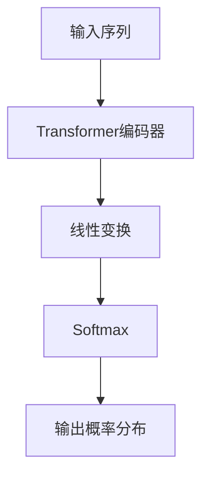

## 1. 背景介绍

自然语言处理（NLP）是人工智能领域的一个重要分支，它涉及到计算机如何理解和处理人类语言。文本生成是NLP中的一个重要任务，它可以用于自动摘要、机器翻译、对话系统等领域。GPT（Generative Pre-trained Transformer）是一种基于Transformer的预训练语言模型，由OpenAI团队提出。GPT模型在文本生成任务中表现出色，成为了NLP领域的研究热点。

本文将介绍如何构建GPT模型并完成文本生成任务，包括核心概念、算法原理、数学模型、代码实例、实际应用场景、工具和资源推荐、未来发展趋势和常见问题解答等方面。

## 2. 核心概念与联系

### 2.1 Transformer

Transformer是一种基于自注意力机制的神经网络模型，由Google团队提出。它在机器翻译任务中表现出色，成为了NLP领域的重要突破。Transformer模型由编码器和解码器两部分组成，其中编码器用于将输入序列转换为隐藏表示，解码器用于将隐藏表示转换为输出序列。

### 2.2 预训练语言模型

预训练语言模型是指在大规模语料库上进行无监督学习，学习出通用的语言表示，然后在特定任务上进行微调。预训练语言模型可以减少特定任务上的数据需求，提高模型的泛化能力。

### 2.3 GPT模型

GPT模型是一种基于Transformer的预训练语言模型，由OpenAI团队提出。GPT模型采用单向的Transformer编码器，输入为文本序列，输出为下一个单词的概率分布。GPT模型在大规模语料库上进行预训练，然后在特定任务上进行微调，可以用于文本生成、文本分类、问答系统等领域。

## 3. 核心算法原理具体操作步骤

### 3.1 GPT模型结构

GPT模型采用单向的Transformer编码器，输入为文本序列，输出为下一个单词的概率分布。GPT模型的结构如下图所示：



其中，输入序列经过Transformer编码器得到隐藏表示，然后经过线性变换和Softmax函数得到下一个单词的概率分布。

### 3.2 GPT模型训练

GPT模型采用无监督学习的方式进行预训练，目标是最大化下一个单词的概率。具体来说，GPT模型采用语言模型的方式进行训练，即给定前面的单词序列，预测下一个单词的概率分布。GPT模型采用自回归的方式进行训练，即每次预测下一个单词时，都将前面的单词作为输入。

GPT模型的训练过程可以分为两个阶段：预训练和微调。预训练阶段采用大规模语料库进行训练，微调阶段采用特定任务的数据进行微调。

### 3.3 GPT模型生成

GPT模型生成的过程是给定前面的单词序列，预测下一个单词的概率分布，然后根据概率分布随机生成下一个单词，再将生成的单词加入到序列中，重复上述过程直到生成指定长度的文本。

## 4. 数学模型和公式详细讲解举例说明

### 4.1 Transformer模型

Transformer模型的核心是自注意力机制，它可以计算输入序列中每个位置与其他位置的相关性，从而得到每个位置的隐藏表示。Transformer模型的自注意力机制可以表示为以下公式：

$$
Attention(Q,K,V)=softmax(\frac{QK^T}{\sqrt{d_k}})V
$$

其中，$Q$、$K$、$V$分别表示查询、键、值，$d_k$表示键的维度。自注意力机制的计算过程可以分为三个步骤：计算查询与键的相似度，进行归一化，计算加权和。

### 4.2 GPT模型

GPT模型的核心是Transformer编码器，它可以将输入序列转换为隐藏表示。GPT模型的输出可以表示为以下公式：

$$
P(w_i|w_1,w_2,...,w_{i-1})=softmax(W_{out}h_i+b_{out})
$$

其中，$w_i$表示第$i$个单词，$h_i$表示第$i$个位置的隐藏表示，$W_{out}$和$b_{out}$表示线性变换的参数。

## 5. 项目实践：代码实例和详细解释说明

### 5.1 数据准备

本文以中文新闻语料库为例，介绍如何使用GPT模型进行文本生成。首先需要下载中文新闻语料库，并将其转换为文本文件。代码如下：

```python
import os
import json

def convert_to_text(input_dir, output_file):
    with open(output_file, 'w', encoding='utf-8') as f:
        for file_name in os.listdir(input_dir):
            file_path = os.path.join(input_dir, file_name)
            with open(file_path, 'r', encoding='utf-8') as f1:
                data = json.load(f1)
                for item in data:
                    f.write(item['content'] + '\n')
```

### 5.2 模型训练

使用Hugging Face提供的transformers库可以方便地构建和训练GPT模型。代码如下：

```python
from transformers import GPT2Tokenizer, GPT2LMHeadModel, TextDataset, DataCollatorForLanguageModeling, Trainer, TrainingArguments

tokenizer = GPT2Tokenizer.from_pretrained('gpt2')
model = GPT2LMHeadModel.from_pretrained('gpt2')

train_dataset = TextDataset(tokenizer=tokenizer, file_path='train.txt', block_size=128)
data_collator = DataCollatorForLanguageModeling(tokenizer=tokenizer, mlm=False)
training_args = TrainingArguments(output_dir='./results', num_train_epochs=1, per_device_train_batch_size=16, save_steps=10000, save_total_limit=2)
trainer = Trainer(model=model, args=training_args, train_dataset=train_dataset, data_collator=data_collator)
trainer.train()
```

### 5.3 模型生成

使用训练好的GPT模型可以生成指定长度的文本。代码如下：

```python
input_text = '今天天气很好'
input_ids = tokenizer.encode(input_text, return_tensors='pt')
output = model.generate(input_ids, max_length=50, do_sample=True)
output_text = tokenizer.decode(output[0], skip_special_tokens=True)
print(output_text)
```

## 6. 实际应用场景

GPT模型可以应用于文本生成、文本分类、问答系统等领域。例如，可以使用GPT模型生成新闻标题、自动生成代码、生成对话等。

## 7. 工具和资源推荐

- transformers：Hugging Face提供的transformers库，可以方便地构建和训练GPT模型。
- 中文新闻语料库：可以用于训练中文GPT模型。
- GPT-2模型：可以用于生成更长、更复杂的文本。

## 8. 总结：未来发展趋势与挑战

GPT模型在文本生成任务中表现出色，成为了NLP领域的研究热点。未来，随着数据量的增加和模型的优化，GPT模型的性能将进一步提升。同时，GPT模型也面临着一些挑战，例如如何解决生成的文本不准确、不连贯等问题。

## 9. 附录：常见问题与解答

Q: GPT模型如何解决生成的文本不准确、不连贯等问题？

A: GPT模型可以采用多样性抽样、温度抽样等技术来增加生成的多样性，同时也可以采用文本重构、文本连贯性评估等技术来提高生成的准确性和连贯性。