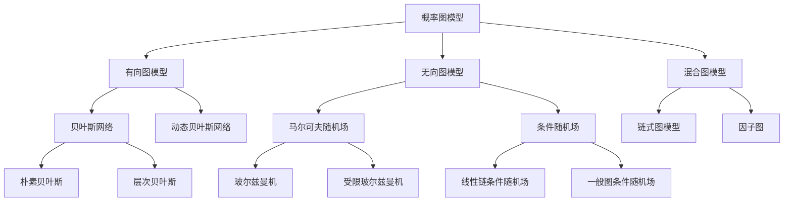

# 概率图模型原理与代码实战案例讲解

## 1. 背景介绍
### 1.1 概率图模型的起源与发展
### 1.2 概率图模型在人工智能领域的重要性
### 1.3 概率图模型的应用场景

## 2. 核心概念与联系
### 2.1 概率论基础
#### 2.1.1 随机变量
#### 2.1.2 概率分布
#### 2.1.3 条件概率与贝叶斯定理
### 2.2 图论基础
#### 2.2.1 有向图与无向图
#### 2.2.2 路径与环
#### 2.2.3 树与森林
### 2.3 概率图模型的分类
#### 2.3.1 有向图模型(贝叶斯网络)
#### 2.3.2 无向图模型(马尔可夫随机场)
#### 2.3.3 混合图模型
### 2.4 概率图模型的表示
#### 2.4.1 因子分解
#### 2.4.2 条件独立性
#### 2.4.3 图模型的参数化

## 3. 核心算法原理具体操作步骤
### 3.1 精确推断算法
#### 3.1.1 变量消除法
#### 3.1.2 信念传播算法
#### 3.1.3 Junction Tree算法
### 3.2 近似推断算法  
#### 3.2.1 Loopy Belief Propagation
#### 3.2.2 平均场近似
#### 3.2.3 Markov Chain Monte Carlo (MCMC)
### 3.3 参数学习算法
#### 3.3.1 最大似然估计
#### 3.3.2 最大后验估计
#### 3.3.3 期望最大化算法(EM)

## 4. 数学模型和公式详细讲解举例说明
### 4.1 有向图模型的联合概率分布
### 4.2 无向图模型的联合概率分布
### 4.3 条件随机场(CRF)模型 
### 4.4 隐马尔可夫模型(HMM)
### 4.5 主题模型(Topic Model)

## 5. 项目实践：代码实例和详细解释说明
### 5.1 使用Python实现朴素贝叶斯分类器
### 5.2 使用R语言实现隐马尔可夫模型
### 5.3 使用Julia语言实现主题模型LDA
### 5.4 使用C++实现条件随机场序列标注
### 5.5 使用MATLAB实现因子分解机推荐系统

## 6. 实际应用场景
### 6.1 自然语言处理中的应用
#### 6.1.1 词性标注
#### 6.1.2 命名实体识别  
#### 6.1.3 句法分析
### 6.2 计算机视觉中的应用
#### 6.2.1 图像分割
#### 6.2.2 目标检测
#### 6.2.3 语义分割
### 6.3 生物信息学中的应用
#### 6.3.1 基因调控网络推断
#### 6.3.2 蛋白质结构预测
#### 6.3.3 疾病诊断与预后预测

## 7. 工具和资源推荐
### 7.1 概率图模型工具包
#### 7.1.1 Dlib
#### 7.1.2 OpenGM
#### 7.1.3 LibDAI
### 7.2 相关书籍推荐
#### 7.2.1 Probabilistic Graphical Models: Principles and Techniques
#### 7.2.2 Bayesian Reasoning and Machine Learning
#### 7.2.3 Machine Learning: A Probabilistic Perspective
### 7.3 在线课程资源
#### 7.3.1 Coursera: Probabilistic Graphical Models
#### 7.3.2 edX: Probabilistic Graphical Models
#### 7.3.3 Stanford CS228: Probabilistic Graphical Models

## 8. 总结：未来发展趋势与挑战
### 8.1 概率图模型的研究前沿
### 8.2 深度学习与概率图模型的结合
### 8.3 可解释性与因果推断
### 8.4 计算效率与大规模学习

## 9. 附录：常见问题与解答
### 9.1 为什么要使用概率图模型?
### 9.2 有向图与无向图的区别是什么?
### 9.3 如何选择合适的推断算法?
### 9.4 概率图模型能否处理连续变量?
### 9.5 概率图模型的局限性有哪些?



概率图模型是人工智能和机器学习领域一个重要的数学框架,它融合了概率论和图论,用于表示和推断复杂系统中变量之间的概率依赖关系。概率图模型在自然语言处理、计算机视觉、生物信息学等诸多领域都有广泛应用。

概率图模型的核心思想是通过将复杂的联合概率分布分解为一组局部因子的乘积,从而简化了概率分布的表示和推断。根据图模型中边的方向性,概率图模型可分为有向图模型(如贝叶斯网络)、无向图模型(如马尔可夫随机场)以及混合图模型。

有向图模型使用有向无环图来表示变量之间的依赖关系,其联合概率分布可以表示为:

$$
P(X_1,\dots,X_n) = \prod_{i=1}^n P(X_i|Pa(X_i))
$$

其中$Pa(X_i)$表示$X_i$的父节点集合。一个经典的有向图模型是朴素贝叶斯分类器,它假设特征变量在给定类别变量的条件下是条件独立的。

无向图模型使用无向图来表示变量之间的依赖关系,其联合概率分布定义为:

$$
P(X_1,\dots,X_n) = \frac{1}{Z} \prod_{C} \psi_C(X_C) 
$$

其中$C$为无向图的最大团,$\psi_C$为定义在最大团上的势函数,$Z$为归一化常数。一个常见的无向图模型是马尔可夫随机场,它常用于图像分割、语义标注等结构化预测任务。

概率图模型的推断任务是在已知部分变量的情况下,计算其他变量的条件概率分布。常用的精确推断算法包括变量消除法、信念传播算法等,近似推断算法包括循环信念传播、平均场近似、MCMC等。参数学习则是在给定数据的情况下,估计图模型的参数,常用的方法有最大似然估计、最大后验估计、EM算法等。

下面通过一个简单的朴素贝叶斯文本分类的例子,来说明如何使用Python实现概率图模型:

```python
import numpy as np

class NaiveBayes:
    def __init__(self, num_classes, num_features):
        self.num_classes = num_classes
        self.num_features = num_features
        self.prior = np.zeros(num_classes)
        self.likelihood = np.zeros((num_classes, num_features))

    def fit(self, X, y):
        for c in range(self.num_classes):
            X_c = X[y == c]
            self.prior[c] = len(X_c) / len(X)
            self.likelihood[c] = (X_c.sum(axis=0) + 1) / (X_c.sum() + self.num_features)

    def predict(self, X):
        log_posterior = np.log(self.prior) + X @ np.log(self.likelihood).T
        return np.argmax(log_posterior, axis=1)
        
# 训练模型
nb = NaiveBayes(num_classes=2, num_features=1000)
nb.fit(X_train, y_train)

# 测试模型
y_pred = nb.predict(X_test)
accuracy = (y_pred == y_test).mean()
```

以上代码实现了一个简单的朴素贝叶斯文本分类器。首先我们定义了`NaiveBayes`类,在`fit`方法中,我们估计了先验概率$P(y)$和似然概率$P(x_i|y)$。在`predict`方法中,我们利用贝叶斯定理计算后验概率$P(y|x)$,并选择后验概率最大的类别作为预测结果。

概率图模型在实际应用中还有很多值得探索的问题,例如如何设计高效的推断算法、如何处理带隐变量的图模型、如何将深度学习与概率图模型相结合等。此外,概率图模型在可解释性、因果推断等方面的研究也备受关注。

总之,概率图模型为理解和推断复杂系统提供了一种原则性的方法,其简洁优雅的理论框架和广泛的应用前景,使其成为人工智能领域一个重要的研究方向。深入学习概率图模型的理论与应用,将为我们从事智能系统的设计和开发提供重要的指导。

作者：禅与计算机程序设计艺术 / Zen and the Art of Computer Programming