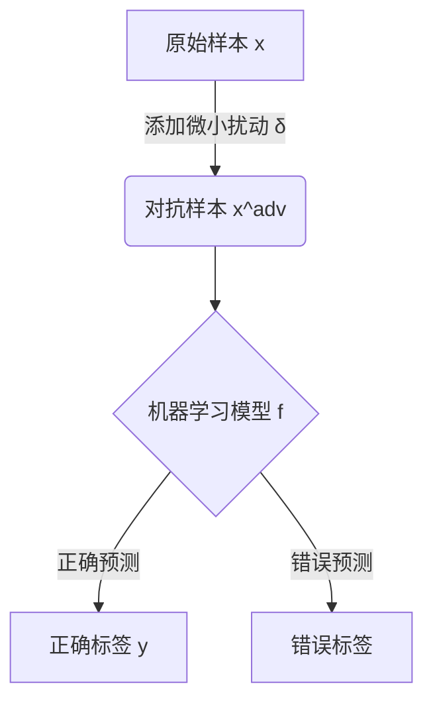
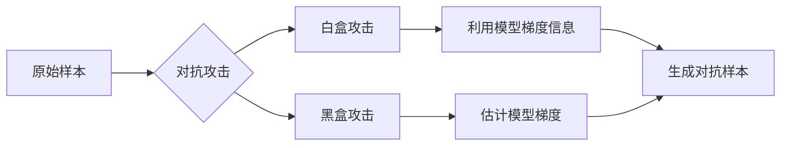
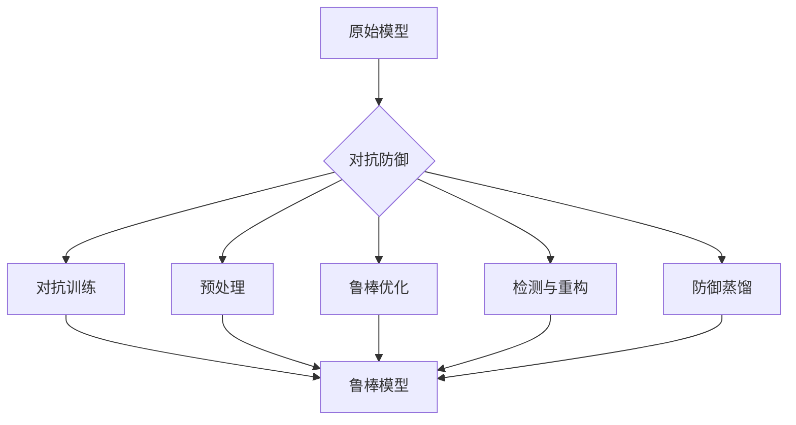

# 模型安全与对抗攻防原理与代码实战案例讲解

## 1. 背景介绍

### 1.1 人工智能模型的广泛应用

近年来,人工智能(AI)技术飞速发展,各种基于深度学习的AI模型在计算机视觉、自然语言处理、语音识别等领域取得了令人瞩目的成就。这些AI模型正被广泛应用于无人驾驶、智能助理、医疗诊断等各个领域,极大地提高了工作效率,优化了人类的生活体验。

### 1.2 模型安全性问题的凸显

然而,随着AI模型的不断普及,其安全性问题也日益凸显。研究人员发现,即使是经过精心训练的AI模型,也可能被精心设计的对抗样本(Adversarial Examples)所攻击和欺骗。这些对抗样本通过添加人眼难以察觉的微小扰动,就能够误导AI模型做出完全错误的预测,从而导致严重的安全隐患。

### 1.3 对抗攻防的重要性

因此,确保AI模型的鲁棒性和安全性,抵御对抗样本攻击,已经成为AI领域的一个重要课题。这不仅关乎AI系统的可靠性和可信度,也与人们的生命财产安全息息相关。为此,研究人员提出了多种对抗攻防技术,旨在增强AI模型的鲁棒性,提高其对对抗样本的防御能力。

## 2. 核心概念与联系

### 2.1 对抗样本(Adversarial Examples)

对抗样本是指在原始输入数据(如图像、音频或文本)中添加了特殊的扰动,使得AI模型对其做出错误的预测,但这种扰动对人类感知来说却是微乎其微的。形式化地定义如下:

对于一个已训练的机器学习模型 $f: \mathcal{X} \rightarrow \mathcal{Y}$,给定一个原始样本 $x \in \mathcal{X}$,其对应的正确标签为 $y = f(x)$。一个对抗样本 $x^{adv}$ 满足以下条件:

$$
x^{adv} = x + \delta, \quad \text{where } \|\delta\|_p \leq \epsilon
$$

$$
f(x^{adv}) \neq y
$$

其中, $\delta$ 表示添加的扰动, $\|\cdot\|_p$ 表示某种范数(如 $l_\infty$ 范数), $\epsilon$ 是一个小常数,用于限制扰动的大小。第二个条件表明,尽管扰动很小,但足以使模型对扰动后的样本 $x^{adv}$ 做出错误的预测。

### 2.2 对抗攻击(Adversarial Attacks)

对抗攻击是指生成对抗样本的过程,旨在欺骗AI模型做出错误的预测。根据攻击者对模型的了解程度,可分为白盒攻击(White-box Attack)和黑盒攻击(Black-box Attack)两种类型:

- **白盒攻击**: 攻击者完全了解目标模型的结构和参数,可以根据模型的梯度信息生成对抗样本。常见的白盒攻击方法包括快速梯度符号法(FGSM)、投射梯度下降法(PGD)等。

- **黑盒攻击**: 攻击者无法获取目标模型的内部信息,只能通过查询模型的输出结果来估计梯度,并生成对抗样本。常见的黑盒攻击方法包括基于转移的攻击(Transfer-based Attack)、基于优化的攻击(Optimization-based Attack)等。

### 2.3 对抗防御(Adversarial Defenses)

为了提高AI模型对对抗样本的鲁棒性,研究人员提出了多种对抗防御策略,主要分为以下几类:

1. **对抗训练(Adversarial Training)**: 在训练过程中,将对抗样本纳入训练数据,迫使模型学习对抗扰动,从而提高鲁棒性。

2. **预处理(Preprocessing)**: 对输入数据进行预处理,如去噪、压缩等,以减小对抗扰动的影响。

3. **鲁棒优化(Robust Optimization)**: 修改模型的损失函数或正则项,使模型在训练时更加关注对抗扰动。

4. **检测与重构(Detection and Reconstruction)**: 检测输入数据是否存在对抗扰动,并对检测到的对抗样本进行重构。

5. **防御蒸馏(Defensive Distillation)**: 利用知识蒸馏技术,将一个鲁棒模型的知识迁移到另一个模型中,提高目标模型的鲁棒性。

## 3. 核心算法原理具体操作步骤

在本节,我们将介绍两种常见的对抗攻击算法和一种对抗防御算法的具体原理和操作步骤。

### 3.1 快速梯度符号法(FGSM)

快速梯度符号法(Fast Gradient Sign Method, FGSM)是一种经典的白盒对抗攻击算法,它通过计算损失函数关于输入数据的梯度,并沿着梯度的方向添加扰动,生成对抗样本。具体步骤如下:

1. 给定一个原始样本 $x$ 及其标签 $y$,以及一个已训练的分类模型 $f$。

2. 计算损失函数 $J(x, y)$ 关于输入 $x$ 的梯度 $\nabla_x J(x, y)$。

3. 计算扰动 $\delta = \epsilon \cdot \text{sign}(\nabla_x J(x, y))$,其中 $\epsilon$ 是扰动的大小,通常取一个较小的常数值。

4. 生成对抗样本 $x^{adv} = x + \delta$。

算法的关键在于利用梯度的符号信息来确定扰动的方向,使得扰动能够最大程度地增加损失函数的值,从而误导模型的预测。FGSM算法的优点是计算高效,缺点是扰动较大,对抗性能有限。

### 3.2 投射梯度下降法(PGD)

投射梯度下降法(Projected Gradient Descent, PGD)是一种更加强大的对抗攻击算法,它通过多次迭代,逐步调整扰动的大小和方向,生成更加有效的对抗样本。算法步骤如下:

1. 给定一个原始样本 $x$ 及其标签 $y$,以及一个已训练的分类模型 $f$。初始化对抗样本 $x^{adv}_0 = x$。

2. 对于第 $i$ 次迭代 $(i=1, 2, \ldots, N)$:
    
    a. 计算损失函数 $J(x^{adv}_{i-1}, y)$ 关于输入 $x^{adv}_{i-1}$ 的梯度 $\nabla_{x^{adv}_{i-1}} J(x^{adv}_{i-1}, y)$。
    
    b. 计算扰动 $\delta_i = \alpha \cdot \text{sign}(\nabla_{x^{adv}_{i-1}} J(x^{adv}_{i-1}, y))$,其中 $\alpha$ 是扰动步长。
    
    c. 更新对抗样本 $x^{adv}_i = \text{Proj}_{x+S}(x^{adv}_{i-1} + \delta_i)$,其中 $\text{Proj}_{x+S}(\cdot)$ 是一个投影函数,用于将扰动后的样本投影回原始样本 $x$ 的邻域 $S$。
    
3. 最终的对抗样本为 $x^{adv} = x^{adv}_N$。

PGD算法通过多次迭代,逐步优化扰动,从而生成更加有效的对抗样本。它的关键在于投影步骤,确保生成的对抗样本位于原始样本的邻域内,避免扰动过大。PGD算法的优点是对抗性能强,缺点是计算复杂度较高。

### 3.3 对抗训练(Adversarial Training)

对抗训练是一种常见的对抗防御策略,它的基本思想是在训练过程中,将对抗样本纳入训练数据,迫使模型学习对抗扰动,从而提高鲁棒性。具体步骤如下:

1. 给定一个训练数据集 $\mathcal{D} = \{(x_i, y_i)\}_{i=1}^N$,以及一个初始化的模型 $f_\theta$,其中 $\theta$ 表示模型参数。

2. 对于每个小批量训练数据 $\{(x_j, y_j)\}_{j=1}^B$:
    
    a. 生成对抗样本 $\{x_j^{adv}\}_{j=1}^B$,可以使用FGSM、PGD等对抗攻击算法。
    
    b. 计算原始样本和对抗样本的总损失:
    
    $$
    \mathcal{L}(\theta) = \sum_{j=1}^B \left[ J(f_\theta(x_j), y_j) + \lambda \cdot J(f_\theta(x_j^{adv}), y_j) \right]
    $$
    
    其中 $\lambda$ 是一个超参数,用于平衡原始样本和对抗样本的损失。
    
    c. 计算总损失 $\mathcal{L}(\theta)$ 关于模型参数 $\theta$ 的梯度,并使用优化算法(如SGD)更新模型参数。
    
3. 重复步骤2,直到模型收敛。

对抗训练的关键在于将对抗样本纳入训练过程,迫使模型学习对抗扰动,从而提高鲁棒性。然而,这种方法也存在一些缺陷,如计算复杂度高、训练时间长、可能导致模型在正常样本上的性能下降等。

## 4. 数学模型和公式详细讲解举例说明

在上一节中,我们介绍了几种核心算法的原理和步骤,其中涉及到一些数学模型和公式。在本节,我们将对这些公式进行更加详细的讲解和举例说明。

### 4.1 对抗样本的数学定义

对抗样本的数学定义如下:

$$
x^{adv} = x + \delta, \quad \text{where } \|\delta\|_p \leq \epsilon
$$

$$
f(x^{adv}) \neq y
$$

其中, $x$ 是原始样本, $y$ 是其正确标签, $f$ 是机器学习模型, $\delta$ 是添加的扰动, $\|\cdot\|_p$ 表示某种范数(如 $l_\infty$ 范数), $\epsilon$ 是一个小常数,用于限制扰动的大小。

第一个条件限制了扰动的大小,确保扰动对人眼来说是微乎其微的。第二个条件表明,尽管扰动很小,但足以使模型对扰动后的样本 $x^{adv}$ 做出错误的预测。

**举例说明**:

假设我们有一个图像分类模型 $f$,用于识别手写数字。给定一张手写数字图像 $x$,其正确标签为 $y=7$,即该图像代表数字7。现在,我们希望生成一个对抗样本 $x^{adv}$,使得模型 $f$ 对其做出错误的预测,即 $f(x^{adv}) \neq 7$。

我们可以添加一个微小的扰动 $\delta$,使得 $\|\delta\|_\infty \leq \epsilon$ (其中 $\epsilon$ 是一个很