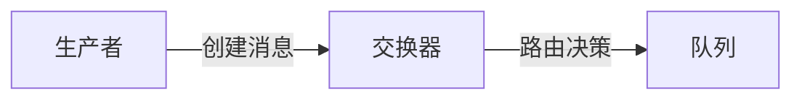
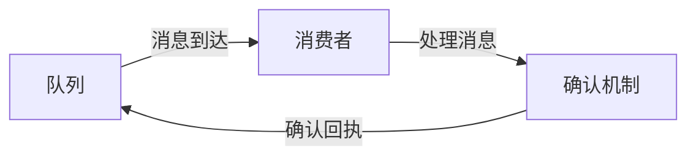

# 消息队列 原理与代码实例讲解

## 1. 背景介绍

在现代软件架构中，系统间的解耦和异步处理已成为提高可扩展性、可靠性和效率的关键。消息队列（Message Queue，MQ）作为一种中间件，承担着在分布式系统中传递消息的重要角色。它允许应用程序和服务在不直接连接的情况下进行通信，从而实现了松耦合和高度的灵活性。

## 2. 核心概念与联系

### 2.1 消息和队列
- **消息（Message）**：在消息队列中传递的数据单元，通常包含消息体和消息头。
- **队列（Queue）**：消息的有序集合，遵循先进先出（FIFO）原则。

### 2.2 生产者和消费者
- **生产者（Producer）**：创建并发送消息到消息队列的实体。
- **消费者（Consumer）**：从消息队列接收并处理消息的实体。

### 2.3 交换器和绑定
- **交换器（Exchange）**：决定消息路由到哪些队列的组件。
- **绑定（Binding）**：定义交换器和队列之间的关系。

### 2.4 消息确认和持久化
- **消息确认（Acknowledgment）**：消费者处理完消息后通知消息队列的机制。
- **持久化（Persistence）**：确保消息不会因为系统故障而丢失的机制。

## 3. 核心算法原理具体操作步骤

### 3.1 消息发送流程


1. 生产者创建消息。
2. 生产者将消息发送到交换器。
3. 交换器根据路由规则将消息发送到一个或多个队列。

### 3.2 消息接收流程


1. 消费者监听队列。
2. 队列将消息发送给消费者。
3. 消费者处理消息。
4. 消费者发送确认回执给队列。

## 4. 数学模型和公式详细讲解举例说明

在消息队列的上下文中，我们可以使用排队理论中的数学模型来描述和分析系统的行为。一个基本的模型是M/M/1队列，其中到达率（λ）和服务率（μ）都遵循泊松分布。

$$
L = \frac{\lambda}{\mu - \lambda}
$$

其中，$L$ 是系统中的平均消息数量。这个公式帮助我们理解系统的负载和处理能力。

## 5. 项目实践：代码实例和详细解释说明

以RabbitMQ为例，以下是一个简单的生产者和消费者实现：

```python
# 生产者代码
import pika

connection = pika.BlockingConnection(pika.ConnectionParameters('localhost'))
channel = connection.channel()

channel.queue_declare(queue='hello')

channel.basic_publish(exchange='',
                      routing_key='hello',
                      body='Hello World!')
print(" [x] Sent 'Hello World!'")
connection.close()
```

```python
# 消费者代码
import pika

def callback(ch, method, properties, body):
    print(f" [x] Received {body}")

connection = pika.BlockingConnection(pika.ConnectionParameters('localhost'))
channel = connection.channel()

channel.queue_declare(queue='hello')

channel.basic_consume(queue='hello',
                      auto_ack=True,
                      on_message_callback=callback)

print(' [*] Waiting for messages. To exit press CTRL+C')
channel.start_consuming()
```

## 6. 实际应用场景

消息队列广泛应用于电子商务、金融服务、物联网、日志收集等领域，用于订单处理、支付交易、设备状态更新、日志处理等。

## 7. 工具和资源推荐

- **RabbitMQ**：广泛使用的开源消息队列系统。
- **Apache Kafka**：高吞吐量的分布式流处理平台。
- **Amazon SQS**：托管的消息队列服务，适用于AWS用户。

## 8. 总结：未来发展趋势与挑战

消息队列技术将继续向着更高的可靠性、更强的可扩展性和更低的延迟发展。挑战包括处理大数据流、保证数据一致性和系统监控。

## 9. 附录：常见问题与解答

- **Q1**: 消息队列如何保证消息不丢失？
- **A1**: 通过消息持久化和确认机制来保证。

- **Q2**: 如何处理消息重复？
- **A2**: 可以通过消息去重策略，如使用唯一标识符。

- **Q3**: 消息队列的性能瓶颈在哪里？
- **A3**: 可能在网络IO、磁盘IO或消息处理速度上。

作者：禅与计算机程序设计艺术 / Zen and the Art of Computer Programming