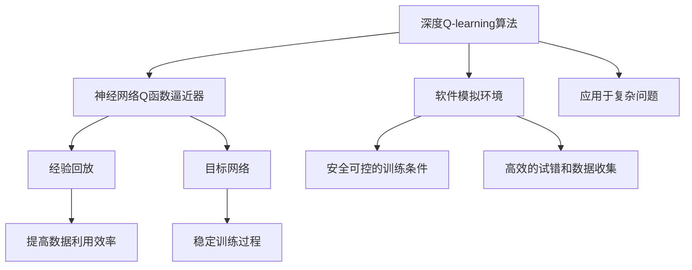
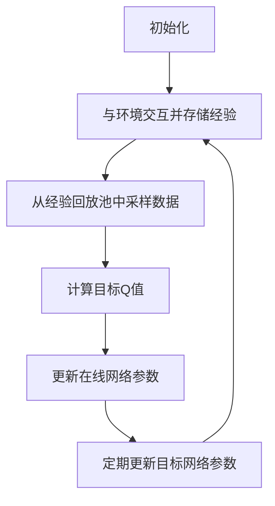

# 深度 Q-learning：利用软件模拟环境进行训练

## 1.背景介绍

在人工智能和机器学习领域中,强化学习(Reinforcement Learning)是一种非常有趣和实用的范式。与监督学习不同,强化学习的目标是让智能体(Agent)通过与环境(Environment)的交互来学习如何采取最优行为策略,以最大化预期的累积奖励。

Q-learning是强化学习中最著名和最广泛使用的算法之一。它是一种基于价值(Value-based)的强化学习算法,旨在通过学习状态-行为对(State-Action Pair)的价值函数Q(s,a),从而获得最优策略。传统的Q-learning算法使用表格(Table)来存储和更新Q值,但当状态空间和行为空间变大时,这种方法就变得效率低下且不切实际。

深度Q-learning(Deep Q-learning,简称DQN)则是将深度神经网络(Deep Neural Network)引入Q-learning,用于估计Q值函数。通过利用神经网络的强大的非线性拟合能力,DQN可以有效地处理高维状态空间和连续行为空间,从而使Q-learning算法能够应用于更加复杂的问题。

软件模拟环境是训练和评估强化学习算法的理想选择。与真实环境相比,模拟环境可以提供安全、可控和高效的训练条件,同时避免了在真实环境中进行试错所带来的高昂代价。通过精心设计的模拟环境,我们可以模拟各种复杂的情况,并为智能体提供丰富的交互体验。

本文将详细介绍深度Q-learning算法的原理、实现细节以及在软件模拟环境中进行训练的过程。我们将探讨DQN如何通过经验回放(Experience Replay)和目标网络(Target Network)等技术来提高训练稳定性和收敛性。此外,我们还将分享一些实用的技巧和最佳实践,以帮助读者更好地理解和应用深度Q-learning。

## 2.核心概念与联系

### 2.1 Q-learning

Q-learning是一种基于价值的强化学习算法,其核心思想是通过学习状态-行为对(s,a)的价值函数Q(s,a),从而获得最优策略π*。Q(s,a)表示在状态s下采取行为a,之后能够获得的预期累积奖励。

Q-learning算法的更新规则如下:

$$Q(s_t, a_t) \leftarrow Q(s_t, a_t) + \alpha \Big(r_t + \gamma \max_{a'}Q(s_{t+1}, a') - Q(s_t, a_t)\Big)$$

其中:
- $\alpha$ 是学习率
- $\gamma$ 是折现因子
- $r_t$ 是在时刻t获得的即时奖励
- $\max_{a'}Q(s_{t+1}, a')$ 是在下一状态s_{t+1}下,所有可能行为a'中Q值的最大值,代表了最优预期累积奖励。

通过不断更新Q值,Q-learning算法最终会收敛到最优Q函数,从而获得最优策略。

### 2.2 深度神经网络

深度神经网络(Deep Neural Network,DNN)是一种强大的机器学习模型,具有非线性拟合能力和自动特征提取能力。它由多层神经元组成,每一层都对输入进行非线性变换,从而逐步提取出更高层次的特征表示。

在深度Q-learning中,我们使用深度神经网络来逼近Q函数,即:

$$Q(s, a; \theta) \approx Q^*(s, a)$$

其中$\theta$是神经网络的参数,通过训练来优化这些参数,使得神经网络输出的Q值尽可能接近真实的最优Q值函数。

### 2.3 经验回放(Experience Replay)

在传统的Q-learning算法中,我们只使用当前的状态-行为对(s_t,a_t)及其相关数据(r_t,s_{t+1})来更新Q值。然而,这种在线更新方式存在一些缺陷:

1. 数据利用效率低:每个样本只被使用一次
2. 相关性:连续的样本之间存在强相关性,会影响训练的收敛性

为了解决这些问题,DQN引入了经验回放(Experience Replay)的技术。我们将智能体与环境交互过程中产生的状态转换(s_t,a_t,r_t,s_{t+1})存储在经验回放池(Replay Buffer)中。在训练时,我们从经验回放池中随机采样一批数据(称为回放批次,Replay Batch),并使用这些数据来更新神经网络的参数。

经验回放技术带来了以下好处:

1. 提高了数据利用效率,因为每个样本可以被重复使用多次
2. 打破了样本之间的相关性,提高了训练的稳定性和收敛性
3. 支持离线训练,无需与环境进行实时交互

### 2.4 目标网络(Target Network)

在DQN中,我们使用两个神经网络:

1. 在线网络(Online Network):用于根据当前状态输出Q值,并在训练过程中不断更新参数
2. 目标网络(Target Network):用于计算目标Q值,其参数是在线网络参数的复制,并且会定期进行更新

目标网络的引入是为了解决Q-learning算法中的非稳定性问题。在传统的Q-learning中,我们使用当前的Q值来估计下一状态的最大Q值,这可能会导致不稳定的训练过程,因为目标值(Target Value)会随着Q值的更新而不断变化。

通过使用目标网络,我们可以将目标值的计算与在线网络的更新过程分离开来。目标网络的参数是在线网络参数的复制,并且只会定期进行更新(例如每隔一定步骤或一定次数的训练后)。这种分离机制提高了训练的稳定性,并有助于算法的收敛。

### 2.5 软件模拟环境

软件模拟环境是一种虚拟的、可控的环境,用于模拟真实世界中的情况和条件。在强化学习领域,软件模拟环境扮演着非常重要的角色,因为它们提供了安全、高效和可重复的训练条件。

一个良好设计的软件模拟环境应该具备以下特点:

1. **真实性**:能够准确地模拟真实世界中的物理规律、环境条件和约束
2. **可配置性**:允许用户自定义环境参数、初始条件和目标任务
3. **可视化**:提供直观的可视化界面,方便观察和分析智能体的行为
4. **高效性**:支持快速模拟和大量数据采集,加速训练过程
5. **可重复性**:确保在相同条件下,模拟结果是可重复的,有利于调试和比较不同算法

通过与软件模拟环境的交互,智能体可以学习各种复杂的任务和策略,而无需直接在真实环境中进行试错,从而避免了潜在的风险和高昂的代价。

## 3.核心算法原理具体操作步骤

深度Q-learning算法的核心思想是使用深度神经网络来逼近Q函数,从而解决传统Q-learning在高维状态空间和连续行为空间下的局限性。算法的具体步骤如下:

1. **初始化**:
   - 创建一个深度神经网络作为在线网络(Online Network),用于估计Q值
   - 创建一个与在线网络结构相同的目标网络(Target Network),初始化参数与在线网络相同
   - 创建一个经验回放池(Replay Buffer),用于存储智能体与环境交互过程中产生的状态转换

2. **与环境交互并存储经验**:
   - 根据当前状态s_t,使用在线网络输出所有可能行为的Q值
   - 根据一定的策略(如ε-贪婪策略)选择行为a_t
   - 在环境中执行选择的行为a_t,获得下一状态s_{t+1}和即时奖励r_t
   - 将状态转换(s_t,a_t,r_t,s_{t+1})存储到经验回放池中

3. **从经验回放池中采样数据**:
   - 从经验回放池中随机采样一批数据,构成回放批次(Replay Batch)

4. **计算目标Q值**:
   - 对于回放批次中的每个样本(s_j,a_j,r_j,s_{j+1}):
     - 使用在线网络计算下一状态s_{j+1}下所有可能行为的Q值
     - 选择Q值最大的行为a'_{j+1},即a'_{j+1} = argmax_a Q(s_{j+1}, a; θ)
     - 计算目标Q值y_j = r_j + γ * Q(s_{j+1}, a'_{j+1}; θ^-)
       - 其中θ^-是目标网络的参数,用于计算稳定的目标值

5. **更新在线网络参数**:
   - 计算损失函数,例如均方误差损失:
     $$L = \frac{1}{N}\sum_{j=1}^N (y_j - Q(s_j, a_j; \theta))^2$$
   - 使用优化算法(如梯度下降)最小化损失函数,更新在线网络参数θ

6. **定期更新目标网络参数**:
   - 每隔一定步骤或一定次数的训练后,将目标网络的参数更新为当前在线网络的参数:
     $$\theta^- \leftarrow \theta$$

7. **重复步骤2-6**,直到算法收敛或达到预期的性能水平。

在实际应用中,我们还可以引入一些技巧和改进,如优先经验回放(Prioritized Experience Replay)、双重Q-learning(Double Q-learning)等,以进一步提高算法的性能和稳定性。

## 4.数学模型和公式详细讲解举例说明

在深度Q-learning算法中,我们使用深度神经网络来逼近Q函数,即:

$$Q(s, a; \theta) \approx Q^*(s, a)$$

其中$\theta$是神经网络的参数,通过训练来优化这些参数,使得神经网络输出的Q值尽可能接近真实的最优Q值函数Q*。

### 4.1 损失函数

为了训练神经网络,我们需要定义一个损失函数(Loss Function),用于衡量神经网络输出的Q值与目标Q值之间的差异。常用的损失函数是均方误差损失(Mean Squared Error Loss):

$$L(\theta) = \mathbb{E}_{(s, a, r, s')\sim D}\Big[(y - Q(s, a; \theta))^2\Big]$$

其中:
- D是经验回放池,包含了智能体与环境交互过程中产生的状态转换(s,a,r,s')
- y是目标Q值,根据贝尔曼方程计算:
  $$y = r + \gamma \max_{a'} Q(s', a'; \theta^-)$$
  - $\theta^-$是目标网络的参数,用于计算稳定的目标值

通过最小化损失函数L(θ),我们可以使神经网络输出的Q值逼近目标Q值,从而逼近最优Q函数Q*。

### 4.2 优化算法

为了最小化损失函数,我们需要使用优化算法来更新神经网络的参数θ。常用的优化算法包括:

1. **梯度下降(Gradient Descent)**:
   $$\theta \leftarrow \theta - \alpha \nabla_\theta L(\theta)$$
   其中α是学习率,∇θL(θ)是损失函数关于参数θ的梯度。

2. **随机梯度下降(Stochastic Gradient Descent, SGD)**:
   在每次迭代中,我们只使用一个或一小批样本来计算梯度,而不是使用整个数据集。这种方法可以加快训练速度,但可能会导致更高的方差。

3. **Adam优化器(Adam