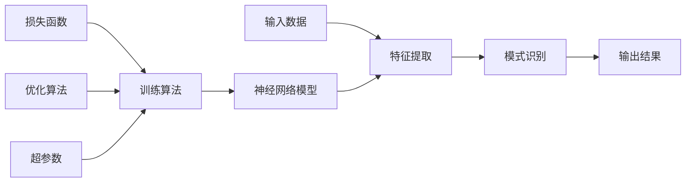

# 深度学习基础原理与代码实战案例讲解

## 1. 背景介绍

在过去的几十年里,人工智能领域取得了长足的进步,尤其是深度学习的兴起,使得机器能够学习复杂的模式和特征,解决了许多传统方法难以解决的问题。深度学习是机器学习的一个子领域,它借鉴了人脑神经网络的结构和工作原理,通过构建多层神经网络模型,对输入数据进行特征提取和模式识别。

### 1.1 深度学习的发展历程

深度学习的理论基础可以追溯到20世纪80年代,当时的神经网络研究为后来的深度学习奠定了基础。但是,由于计算能力和数据量的限制,神经网络一直难以取得突破性进展。直到近年来,大数据时代的到来,海量的数据为训练深度神经网络提供了充足的素材,同时,硬件计算能力的飞速提升,特别是GPU的广泛应用,使得训练深度神经网络成为可能。

2012年,深度学习在ImageNet大规模视觉识别挑战赛上取得了巨大成功,从此掀起了深度学习的热潮。随后,深度学习在语音识别、自然语言处理、机器翻译等领域也取得了突破性进展,成为人工智能领域最炙手可热的技术。

### 1.2 深度学习的应用前景

深度学习已经广泛应用于计算机视觉、自然语言处理、语音识别、推荐系统等多个领域,并取得了卓越的成绩。未来,随着算法的不断优化和硬件计算能力的提升,深度学习的应用前景将更加广阔。

在医疗健康领域,深度学习可以用于医学影像分析、疾病诊断和药物研发等。在自动驾驶领域,深度学习是实现环境感知、决策规划和控制的关键技术。在金融领域,深度学习可以用于风险管理、欺诈检测和量化交易等。此外,深度学习还有望在气象预报、能源优化、智能安防等领域发挥重要作用。

## 2. 核心概念与联系

深度学习涉及多个核心概念,这些概念相互关联,共同构建了深度学习的理论基础和实现框架。



### 2.1 神经网络模型

神经网络模型是深度学习的核心,它由多层神经元组成,每一层都对输入数据进行特征提取和转换,最终输出结果。常见的神经网络模型包括:

- 前馈神经网络 (Feedforward Neural Network, FNN)
- 卷积神经网络 (Convolutional Neural Network, CNN)
- 循环神经网络 (Recurrent Neural Network, RNN)
- 长短期记忆网络 (Long Short-Term Memory, LSTM)
- 门控循环单元 (Gated Recurrent Unit, GRU)

不同的神经网络模型适用于不同的任务,如图像处理、序列数据处理等。

### 2.2 训练算法

训练算法是指用于调整神经网络权重的算法,以使模型能够从训练数据中学习到有用的模式和特征。常见的训练算法包括:

- 反向传播算法 (Backpropagation)
- 随机梯度下降 (Stochastic Gradient Descent, SGD)
- 动量优化 (Momentum Optimization)
- 自适应优化算法 (Adaptive Optimization Algorithms)

训练算法的选择和配置对模型性能有很大影响。

### 2.3 损失函数

损失函数用于衡量模型预测值与真实值之间的差异,是训练算法优化的目标函数。常见的损失函数包括:

- 均方误差 (Mean Squared Error, MSE)
- 交叉熵损失 (Cross-Entropy Loss)
- 铰链损失 (Hinge Loss)

不同的任务需要选择合适的损失函数。

### 2.4 优化算法

优化算法用于更新神经网络的权重,以最小化损失函数。常见的优化算法包括:

- 随机梯度下降 (Stochastic Gradient Descent, SGD)
- 动量优化 (Momentum Optimization)
- 自适应梯度算法 (Adaptive Gradient Algorithms)
  - AdaGrad
  - RMSProp
  - Adam

优化算法的选择和配置对模型收敛速度和性能有重要影响。

### 2.5 超参数

超参数是指在训练过程中需要手动设置的参数,如学习率、批量大小、epochs数量等。超参数的选择对模型性能有很大影响,通常需要进行大量实验来确定最佳值。

## 3. 核心算法原理具体操作步骤

深度学习的核心算法是反向传播算法,它用于计算神经网络中每个权重的梯度,并根据梯度值更新权重,使模型能够从训练数据中学习到有用的模式和特征。

反向传播算法的具体操作步骤如下:

1. **前向传播**: 将输入数据传递到神经网络的第一层,并逐层计算每个神经元的输出值,直到最后一层输出预测结果。

2. **计算损失**: 使用预测结果和真实标签,计算损失函数的值。

3. **反向传播**: 从输出层开始,计算每个神经元的误差,并将误差传递到上一层,重复这个过程直到第一层。在这个过程中,计算每个权重的梯度。

4. **更新权重**: 使用优化算法,根据计算出的梯度值更新每个权重。

5. **重复迭代**: 重复步骤1到4,直到模型收敛或达到预设的迭代次数。

下面是反向传播算法的伪代码:

```python
# 初始化权重
初始化网络权重 W, b

# 训练循环
for epoch in range(num_epochs):
    # 遍历训练数据
    for x, y in train_data:
        # 前向传播
        y_hat = forward(x, W, b)
        
        # 计算损失
        loss = loss_function(y, y_hat)
        
        # 反向传播
        gradients = backward(loss)
        
        # 更新权重
        W, b = optimizer.step(gradients)
```

在实际应用中,反向传播算法还涉及一些技巧和优化策略,如梯度裁剪、dropout regularization等,以提高模型的性能和泛化能力。

## 4. 数学模型和公式详细讲解举例说明

深度学习中涉及许多数学模型和公式,这些公式描述了神经网络的结构、计算过程和优化目标。本节将详细讲解一些核心公式,并给出具体的例子说明。

### 4.1 神经网络计算

神经网络的计算过程可以用矩阵运算来表示。假设一个全连接层的输入为 $\mathbf{x}$,权重矩阵为 $\mathbf{W}$,偏置向量为 $\mathbf{b}$,则该层的输出 $\mathbf{y}$ 可以表示为:

$$\mathbf{y} = f(\mathbf{W}\mathbf{x} + \mathbf{b})$$

其中 $f$ 是激活函数,常用的激活函数包括 ReLU、Sigmoid 和 Tanh 等。

例如,对于一个输入维度为 3,输出维度为 2 的全连接层,输入向量为 $\mathbf{x} = [1, 2, 3]^T$,权重矩阵为:

$$\mathbf{W} = \begin{bmatrix}
    0.1 & 0.2 & 0.3 \\
    0.4 & 0.5 & 0.6
\end{bmatrix}$$

偏置向量为 $\mathbf{b} = [0.1, 0.2]^T$,激活函数为 ReLU,则该层的输出为:

$$\begin{aligned}
\mathbf{y} &= \text{ReLU}(\mathbf{W}\mathbf{x} + \mathbf{b}) \\
           &= \text{ReLU}\left(\begin{bmatrix}
                0.1 & 0.2 & 0.3 \\
                0.4 & 0.5 & 0.6
            \end{bmatrix}
            \begin{bmatrix}
                1 \\ 2 \\ 3
            \end{bmatrix} +
            \begin{bmatrix}
                0.1 \\ 0.2
            \end{bmatrix}\right) \\
           &= \text{ReLU}\left(\begin{bmatrix}
                1.5 \\ 4.1
            \end{bmatrix}\right) \\
           &= \begin{bmatrix}
                1.5 \\ 4.1
            \end{bmatrix}
\end{aligned}$$

### 4.2 损失函数

损失函数用于衡量模型预测值与真实值之间的差异,是训练算法优化的目标函数。常见的损失函数包括均方误差 (MSE) 和交叉熵损失 (Cross-Entropy Loss)。

#### 4.2.1 均方误差 (MSE)

均方误差常用于回归任务,它计算预测值与真实值之间的平方差的平均值。对于一个包含 $N$ 个样本的数据集,均方误差的公式为:

$$\text{MSE} = \frac{1}{N}\sum_{i=1}^{N}(y_i - \hat{y}_i)^2$$

其中 $y_i$ 是第 $i$ 个样本的真实值, $\hat{y}_i$ 是模型对该样本的预测值。

例如,假设一个回归模型对于输入 $[1, 2, 3]$,真实输出为 $[2, 4, 6]$,模型预测输出为 $[1.9, 3.8, 5.7]$,则均方误差为:

$$\text{MSE} = \frac{1}{3}\left[(2 - 1.9)^2 + (4 - 3.8)^2 + (6 - 5.7)^2\right] = 0.07$$

#### 4.2.2 交叉熵损失 (Cross-Entropy Loss)

交叉熵损失常用于分类任务,它衡量模型预测概率分布与真实概率分布之间的差异。对于一个包含 $N$ 个样本的数据集,二分类任务的交叉熵损失公式为:

$$\text{CrossEntropy} = -\frac{1}{N}\sum_{i=1}^{N}\left[y_i\log(\hat{y}_i) + (1 - y_i)\log(1 - \hat{y}_i)\right]$$

其中 $y_i$ 是第 $i$ 个样本的真实标签 (0 或 1), $\hat{y}_i$ 是模型对该样本预测为正类的概率。

例如,假设一个二分类模型对于输入 $[x_1, x_2, x_3]$,真实标签为 $[1, 0, 1]$,模型预测概率为 $[0.8, 0.2, 0.7]$,则交叉熵损失为:

$$\begin{aligned}
\text{CrossEntropy} &= -\frac{1}{3}\left[\log(0.8) + \log(0.8) + \log(0.3)\right] \\
                    &= 0.916
\end{aligned}$$

### 4.3 优化算法

优化算法用于更新神经网络的权重,以最小化损失函数。常见的优化算法包括随机梯度下降 (SGD) 和自适应梯度算法 (如 Adam)。

#### 4.3.1 随机梯度下降 (SGD)

随机梯度下降是一种简单而有效的优化算法,它通过计算损失函数关于权重的梯度,并沿着梯度的反方向更新权重。对于一个权重矩阵 $\mathbf{W}$,梯度为 $\nabla_\mathbf{W}L$,学习率为 $\eta$,则权重的更新公式为:

$$\mathbf{W}_{t+1} = \mathbf{W}_t - \eta \nabla_\mathbf{W}L$$

例如,假设一个全连接层的权重矩阵为:

$$\mathbf{W} = \begin{bmatrix}
    0.1 & 0.2 \\
    0.3 & 0.4
\end{bmatrix}$$

梯度为:

$$\nabla_\mathbf{W}L = \begin{bmatrix}
    0.01 & 0.02 \\
    0.03 & 0.04
\end{bmatrix}$$

学习率为 $\eta = 0.01$,则更新后的权重矩阵为:

$$\