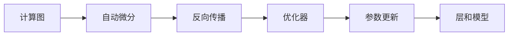
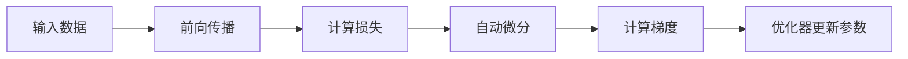

# 深度学习框架原理与代码实战案例讲解

## 1. 背景介绍
随着人工智能的飞速发展，深度学习已成为推动技术革新的核心力量。深度学习框架作为构建和训练模型的基石，其设计原理和实现机制对于开发者至关重要。本文旨在深入探讨深度学习框架的内部原理，并通过代码实战案例，帮助读者更好地理解和应用这些框架。

## 2. 核心概念与联系
深度学习框架的核心概念包括计算图、自动微分、优化器、层和模型。计算图是深度学习中的基础，它定义了数据流和操作的图结构。自动微分则是实现反向传播的关键技术。优化器负责根据梯度更新模型参数。层和模型是构建神经网络的基本单元。



## 3. 核心算法原理具体操作步骤
深度学习的核心算法原理是反向传播算法。操作步骤包括前向传播计算损失，通过自动微分计算梯度，最后利用优化器更新参数。



## 4. 数学模型和公式详细讲解举例说明
以多层感知机为例，数学模型可以表示为：

$$
f(x) = \sigma(W_2 \cdot \sigma(W_1 \cdot x + b_1) + b_2)
$$

其中，$W_1, W_2$ 是权重矩阵，$b_1, b_2$ 是偏置项，$\sigma$ 是激活函数。通过链式法则，我们可以计算出损失函数对每个参数的梯度。

## 5. 项目实践：代码实例和详细解释说明
以TensorFlow为例，构建一个简单的多层感知机模型：

```python
import tensorflow as tf

# 定义模型
model = tf.keras.Sequential([
    tf.keras.layers.Dense(128, activation='relu'),
    tf.keras.layers.Dense(10, activation='softmax')
])

# 编译模型
model.compile(optimizer='adam',
              loss='sparse_categorical_crossentropy',
              metrics=['accuracy'])

# 训练模型
model.fit(x_train, y_train, epochs=5)
```

这段代码首先定义了一个序列模型，添加了两个全连接层，然后编译模型并进行训练。

## 6. 实际应用场景
深度学习框架广泛应用于图像识别、语音识别、自然语言处理等领域。例如，在自动驾驶中，深度学习模型可以用于车辆检测和路径规划。

## 7. 工具和资源推荐
推荐的深度学习框架包括TensorFlow、PyTorch和Keras。在线资源如arXiv和GitHub提供了大量的研究论文和开源代码。

## 8. 总结：未来发展趋势与挑战
深度学习框架未来的发展趋势包括更高效的计算性能、更友好的用户接口和更强大的自动化能力。挑战则包括模型解释性、数据隐私和安全性问题。

## 9. 附录：常见问题与解答
Q1: 如何选择合适的深度学习框架？
A1: 需要考虑框架的性能、社区支持、文档完整性等因素。

Q2: 如何提高模型的训练效率？
A2: 可以通过模型剪枝、量化和分布式训练等技术来提高效率。

作者：禅与计算机程序设计艺术 / Zen and the Art of Computer Programming