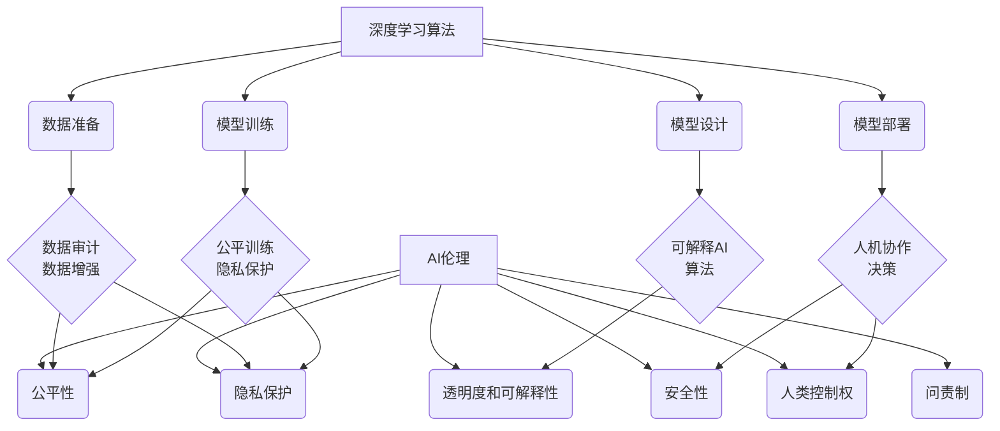

# 深度学习算法中的AI伦理风险与防范措施

## 1.背景介绍

### 1.1 人工智能的发展与影响

人工智能(AI)技术在过去几十年里取得了长足的进步,尤其是深度学习算法的兴起,使得AI系统在语音识别、图像处理、自然语言处理等领域展现出超人的能力。AI不仅深刻影响着科技行业,也逐渐渗透到我们生活的方方面面,从智能家居到无人驾驶,从医疗诊断到金融投资,AI的应用正在重塑着人类社会。

### 1.2 AI伦理的重要性

然而,人工智能的快速发展也引发了一系列伦理道德问题的担忧。AI系统作为由算法驱动的"黑匣子",其决策过程缺乏透明度,存在潜在的偏见和歧视风险。此外,AI的不当使用可能会侵犯隐私权、危及就业、加剧不平等等。因此,在开发和部署AI系统时,我们必须重视AI伦理,确保AI的发展符合人类的价值观和伦理准则。

## 2.核心概念与联系

### 2.1 AI伦理的核心原则

AI伦理涉及多个层面,包括算法公平性、隐私保护、透明度和可解释性、人工智能安全性、人工智能对就业的影响等。其核心原则可概括为:

1. **公平性(Fairness)**: AI系统应该公平对待所有个人,避免基于种族、性别、年龄等因素的歧视。
2. **隐私保护(Privacy)**: AI系统在处理个人数据时,应尊重并保护个人隐私。
3. **透明度和可解释性(Transparency & Explainability)**: AI系统的决策过程应该具有透明度,其决策的原因和依据应该可解释。
4. **安全性(Safety)**: AI系统应确保对人类和环境的安全,防止意外伤害。
5. **人类控制权(Human Control)**: AI系统应受到人类的适当控制和监管,不应完全自主运行。
6. **问责制(Accountability)**: AI系统的开发者和使用者应对其行为和决策负责。

### 2.2 AI伦理与深度学习算法

深度学习是当前人工智能领域最为成功的技术之一,但也存在一些潜在的伦理风险。例如,由于深度学习模型是在大规模数据集上训练的,如果训练数据存在偏差,那么模型的预测结果也可能带有偏见。此外,深度学习模型通常是一个"黑匣子",很难解释其内部决策过程,这违背了透明度和可解释性的原则。

为了应对这些风险,我们需要在算法设计、数据准备、模型训练和模型部署等各个环节中融入AI伦理的考量。例如,通过数据审计和数据增强来消除训练数据中的偏差;采用可解释的AI技术(如注意力机制)提高模型的透明度;引入人机协作的方式,将人类置于AI决策过程之中等。



通过将AI伦理融入深度学习算法的各个环节,我们可以最大限度地降低伦理风险,确保AI系统的发展符合人类价值观。

## 3.核心算法原理具体操作步骤

### 3.1 公平机器学习

公平机器学习(Fair Machine Learning)旨在消除算法中的潜在偏见,确保机器学习模型的预测结果是公平和无歧视的。常见的公平机器学习算法包括:

1. **预处理算法(Pre-processing Algorithms)**
   - 通过数据转换或重新加权来消除训练数据中的偏差
   - 例如,对于性别分类任务,可以对男性和女性样本进行重新采样,使两类样本数量相等

2. **就地算法(In-processing Algorithms)** 
   - 在模型训练过程中引入公平性约束
   - 例如,在损失函数中加入公平性惩罚项,使模型在优化准确性的同时也优化公平性指标

3. **后处理算法(Post-processing Algorithms)**
   - 在模型预测之后,对预测结果进行校正以提高公平性
   - 例如,对于信用评分任务,可以为不同人群设置不同的阈值,从而消除偏差

公平机器学习算法的具体实现步骤如下:

1. **定义公平性指标**
   - 确定要优化的公平性指标,如统计率简单(Statistical Parity)、等机会(Equal Opportunity)等
2. **数据审计**
   - 对训练数据进行审计,识别潜在的偏差来源
3. **选择算法**
   - 根据任务特点和公平性需求,选择合适的公平机器学习算法
4. **模型训练与评估**
   - 在训练过程中融入公平性约束,并在验证集上评估模型的公平性表现
5. **模型调优**
   - 根据评估结果,调整算法超参数或采取其他措施提高模型的公平性
6. **持续监控**
   - 在模型部署后,持续监控其预测结果,及时发现和缓解新的偏差问题

### 3.2 隐私保护技术

深度学习算法通常需要大量的个人数据进行训练,因此隐私保护是一个重要的伦理考量。常见的隐私保护技术包括:

1. **联邦学习(Federated Learning)**
   - 在多个设备(如手机)上分别训练模型,然后将模型参数聚合在服务器端,避免直接传输原始数据
   - 具体步骤:
     1) 服务器向每个设备发送初始模型参数
     2) 每个设备使用本地数据训练模型,得到新的模型参数
     3) 设备将模型参数更新发送回服务器
     4) 服务器聚合所有设备的模型参数更新
     5) 重复以上步骤,直到模型收敛

2. **差分隐私(Differential Privacy)**
   - 在数据处理过程中引入噪声,使得单个记录的存在与否对最终结果的影响很小
   - 常用于隐私保护的数据发布、机器学习模型训练等场景
   - 具体步骤:
     1) 计算查询函数的敏感度(对单个记录的最大影响)
     2) 根据隐私预算和敏感度,确定需要引入的噪声水平
     3) 在查询结果上添加噪声,得到隐私保护后的结果

3. **同态加密(Homomorphic Encryption)**
   - 在加密数据上直接进行计算,无需解密
   - 允许在不解密的情况下对加密数据进行深度学习模型训练
   - 具体步骤:
     1) 客户端对本地数据进行同态加密
     2) 将加密数据上传到服务器
     3) 服务器在加密数据上进行模型训练
     4) 训练完成后,服务器将加密模型发送回客户端
     5) 客户端解密模型,得到最终模型

通过采用这些隐私保护技术,我们可以在保护个人隐私的同时,利用大规模数据训练高质量的深度学习模型。

## 4.数学模型和公式详细讲解举例说明

### 4.1 公平性指标

在公平机器学习中,我们通常使用一些数学指标来量化模型的公平性。下面介绍两个常用的公平性指标:

1. **统计率简单(Statistical Parity)** 

统计率简单要求模型对不同人群的正面结果比例相等。设有两个人群A和B,用$\hat{Y}$表示模型的预测结果(二元变量,正面结果为1,负面结果为0),则统计率简单可以用下式表示:

$$P(\hat{Y}=1|A) = P(\hat{Y}=1|B)$$

2. **等机会(Equal Opportunity)**

等机会要求模型对不同人群中的合格个体(Ground Truth为正面结果)的正面预测比例相等。设$Y$表示Ground Truth,则等机会可以用下式表示:

$$P(\hat{Y}=1|A,Y=1) = P(\hat{Y}=1|B,Y=1)$$

以信用评分为例,统计率简单要求不同人群获得贷款的比例相等;而等机会则要求对于那些实际上有能力偿还贷款的人,不同人群获得贷款的比例相等。

### 4.2 隐私保护中的噪声机制

差分隐私通常采用拉普拉斯机制或高斯机制在查询结果上添加噪声,以实现隐私保护。

1. **拉普拉斯机制**

对于查询函数$f$,其$\ell_1$敏感度为:

$$\Delta f = \max_{D_1,D_2}||f(D_1)-f(D_2)||_1$$

其中$D_1$和$D_2$是相邻数据集(只有一条记录不同)。

拉普拉斯机制通过在查询结果$f(D)$上添加拉普拉斯噪声$Lap(\Delta f/\epsilon)$来实现$\epsilon$-差分隐私,其概率密度函数为:

$$Lap(x|\mu,b) = \frac{1}{2b}e^{-\frac{|x-\mu|}{b}}$$

其中$b = \Delta f/\epsilon$是拉普拉斯分布的尺度参数。

2. **高斯机制**

高斯机制通过添加高斯噪声$\mathcal{N}(0,\sigma^2)$来实现$(\alpha,\epsilon)$-差分隐私,其概率密度函数为:

$$\mathcal{N}(x|\mu,\sigma^2) = \frac{1}{\sqrt{2\pi\sigma^2}}e^{-\frac{(x-\mu)^2}{2\sigma^2}}$$

其中$\sigma$与$\epsilon$和$\Delta f$相关,通常需要通过数值计算或查表得到。

高斯机制相比拉普拉斯机制具有更高的计算效率,但需要查询函数$f$满足$\ell_2$敏感度有限的条件。

通过在查询结果上添加适当的噪声,差分隐私可以有效保护个人隐私,同时尽可能保留数据的统计特性,为机器学习模型训练提供隐私保护。

## 5.项目实践:代码实例和详细解释说明

### 5.1 公平机器学习实例:成人人口收入预测

我们以成人人口收入预测任务为例,探讨如何使用公平机器学习算法消除基于性别的偏见。此任务的目标是根据个人的年龄、教育程度、工作类型等特征,预测其年收入是否超过50,000美元。

我们将使用Python中的`aif360`库,这是一个由IBM开发的开源工具包,提供了多种公平机器学习算法。具体步骤如下:

1. **加载数据集**

```python
from aif360.datasets import BinaryLabelDataset
dataset_orig = BinaryLabelDataset(df, label_names=['income-per-year'],
                                  protected_attribute_names=['sex'])
```

2. **定义公平性指标**

我们选择统计率简单作为公平性指标。

```python
metric_orig = aif360.metrics.StatisticalParityDifference()
metric_orig.load_data(dataset_orig)
metric_value_orig = metric_orig.compute()
print(f"Original statistical parity difference: {metric_value_orig:.4f}")
```

3. **训练公平模型**

我们使用预处理算法`Reweighing`对训练数据进行重新加权,以消除性别偏差。

```python
from aif360.algorithms.preprocessing import Reweighing

RW = Reweighing(unprivileged_groups=[{'sex': 1}],
                privileged_groups=[{'sex': 0}])
dataset_trans = RW.fit_transform(dataset_orig)
```

接着,我们在转换后的数据集上训练逻辑回归模型。

```python
from sklearn.linear_model import LogisticRegression

model = LogisticRegression(solver='liblinear')