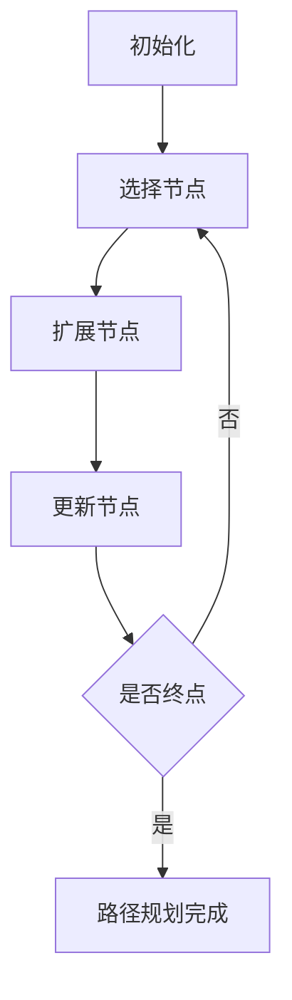
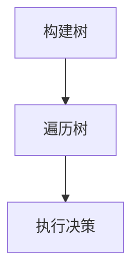
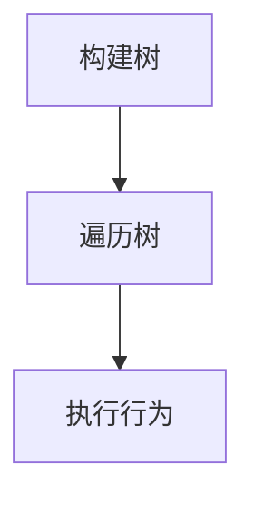
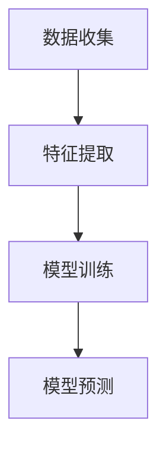
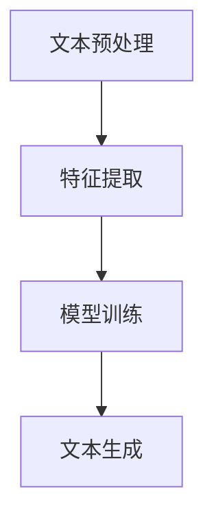

# 游戏AI：激发创新的大模型应用

## 1.背景介绍

在过去的几十年里，游戏人工智能（AI）经历了从简单的规则引擎到复杂的机器学习模型的巨大飞跃。随着计算能力的提升和数据量的增加，AI在游戏中的应用变得越来越广泛和复杂。特别是近年来，大模型（如GPT-3、BERT等）的出现，为游戏AI带来了前所未有的创新机会。这些大模型不仅能够处理复杂的自然语言任务，还能在游戏设计、角色行为、玩家互动等方面提供新的解决方案。

## 2.核心概念与联系

### 2.1 游戏AI的定义与分类

游戏AI是指在电子游戏中模拟智能行为的技术。根据功能和应用场景，游戏AI可以分为以下几类：

- **路径规划**：用于角色在游戏世界中找到最优路径。
- **决策树**：用于角色在特定情境下做出决策。
- **行为树**：用于复杂行为的分层管理。
- **机器学习**：用于角色学习和适应玩家行为。
- **自然语言处理（NLP）**：用于角色与玩家的自然语言互动。

### 2.2 大模型的定义与特点

大模型是指具有大量参数和复杂结构的深度学习模型，通常用于处理复杂的任务，如自然语言理解、图像识别等。大模型的特点包括：

- **高参数量**：通常包含数亿到数十亿个参数。
- **多任务能力**：能够处理多种类型的任务。
- **高精度**：在许多任务上表现出色，接近或超过人类水平。

### 2.3 游戏AI与大模型的联系

大模型在游戏AI中的应用主要体现在以下几个方面：

- **自然语言处理**：用于角色与玩家的对话系统。
- **行为预测**：用于预测玩家行为，提供个性化体验。
- **内容生成**：用于生成游戏剧情、任务和场景。

## 3.核心算法原理具体操作步骤

### 3.1 路径规划算法

路径规划是游戏AI中最基本的功能之一，常用的算法包括A*算法和Dijkstra算法。以下是A*算法的具体操作步骤：

1. **初始化**：将起点加入开放列表，设置起点的G值为0，H值为起点到终点的估算距离。
2. **选择节点**：从开放列表中选择F值最小的节点作为当前节点。
3. **扩展节点**：将当前节点的相邻节点加入开放列表，计算每个相邻节点的G值、H值和F值。
4. **更新节点**：如果相邻节点已经在开放列表中，检查新的G值是否更小，如果是，则更新该节点的G值和父节点。
5. **终止条件**：如果当前节点是终点，路径规划完成；否则，重复步骤2-4。



### 3.2 决策树算法

决策树用于角色在特定情境下做出决策，以下是决策树的具体操作步骤：

1. **构建树**：根据游戏规则和情境构建决策树。
2. **遍历树**：从根节点开始，根据当前情境遍历决策树。
3. **执行决策**：到达叶子节点后，执行相应的决策。



### 3.3 行为树算法

行为树用于复杂行为的分层管理，以下是行为树的具体操作步骤：

1. **构建树**：根据角色行为构建行为树。
2. **遍历树**：从根节点开始，按顺序遍历行为树。
3. **执行行为**：到达叶子节点后，执行相应的行为。



### 3.4 机器学习算法

机器学习用于角色学习和适应玩家行为，以下是机器学习的具体操作步骤：

1. **数据收集**：收集玩家行为数据。
2. **特征提取**：从数据中提取特征。
3. **模型训练**：使用特征数据训练模型。
4. **模型预测**：使用训练好的模型预测玩家行为。



### 3.5 自然语言处理算法

自然语言处理用于角色与玩家的自然语言互动，以下是自然语言处理的具体操作步骤：

1. **文本预处理**：对输入文本进行分词、去停用词等预处理。
2. **特征提取**：从预处理后的文本中提取特征。
3. **模型训练**：使用特征数据训练模型。
4. **文本生成**：使用训练好的模型生成响应文本。



## 4.数学模型和公式详细讲解举例说明

### 4.1 A*算法的数学模型

A*算法的核心是通过启发式函数 $h(n)$ 估算从当前节点 $n$ 到目标节点的最短路径。其公式为：

$$
f(n) = g(n) + h(n)
$$

其中：
- $f(n)$ 是当前节点的总估计成本。
- $g(n)$ 是从起点到当前节点的实际成本。
- $h(n)$ 是从当前节点到目标节点的估计成本。

### 4.2 决策树的数学模型

决策树的核心是通过信息增益或基尼系数来选择最优分裂点。信息增益的公式为：

$$
IG(D, A) = H(D) - \sum_{v \in Values(A)} \frac{|D_v|}{|D|} H(D_v)
$$

其中：
- $IG(D, A)$ 是属性 $A$ 对数据集 $D$ 的信息增益。
- $H(D)$ 是数据集 $D$ 的熵。
- $D_v$ 是属性 $A$ 取值为 $v$ 的子集。

### 4.3 行为树的数学模型

行为树的核心是通过节点的状态来控制行为的执行。节点的状态可以是成功、失败或运行中。行为树的公式为：

$$
S(n) = \begin{cases} 
\text{Success} & \text{if all children succeed} \\
\text{Failure} & \text{if any child fails} \\
\text{Running} & \text{if any child is running}
\end{cases}
$$

### 4.4 机器学习的数学模型

机器学习的核心是通过损失函数来优化模型参数。常用的损失函数包括均方误差（MSE）和交叉熵损失。均方误差的公式为：

$$
MSE = \frac{1}{n} \sum_{i=1}^{n} (y_i - \hat{y}_i)^2
$$

其中：
- $n$ 是样本数量。
- $y_i$ 是真实值。
- $\hat{y}_i$ 是预测值。

### 4.5 自然语言处理的数学模型

自然语言处理的核心是通过词嵌入和序列模型来处理文本数据。词嵌入的公式为：

$$
\mathbf{v}_w = \frac{1}{|C(w)|} \sum_{c \in C(w)} \mathbf{v}_c
$$

其中：
- $\mathbf{v}_w$ 是词 $w$ 的词向量。
- $C(w)$ 是词 $w$ 的上下文词集合。
- $\mathbf{v}_c$ 是上下文词 $c$ 的词向量。

## 5.项目实践：代码实例和详细解释说明

### 5.1 路径规划代码实例

以下是使用A*算法进行路径规划的Python代码实例：

```python
import heapq

def a_star(start, goal, h):
    open_list = []
    heapq.heappush(open_list, (0, start))
    came_from = {}
    g_score = {start: 0}
    f_score = {start: h(start, goal)}

    while open_list:
        _, current = heapq.heappop(open_list)

        if current == goal:
            return reconstruct_path(came_from, current)

        for neighbor in get_neighbors(current):
            tentative_g_score = g_score[current] + distance(current, neighbor)
            if neighbor not in g_score or tentative_g_score < g_score[neighbor]:
                came_from[neighbor] = current
                g_score[neighbor] = tentative_g_score
                f_score[neighbor] = g_score[neighbor] + h(neighbor, goal)
                heapq.heappush(open_list, (f_score[neighbor], neighbor))

    return None

def reconstruct_path(came_from, current):
    path = [current]
    while current in came_from:
        current = came_from[current]
        path.append(current)
    path.reverse()
    return path

def get_neighbors(node):
    # 返回节点的邻居节点
    pass

def distance(node1, node2):
    # 返回两个节点之间的距离
    pass

def heuristic(node, goal):
    # 启发式函数
    pass
```

### 5.2 决策树代码实例

以下是使用决策树进行分类的Python代码实例：

```python
from sklearn.tree import DecisionTreeClassifier
from sklearn.datasets import load_iris
from sklearn.model_selection import train_test_split
from sklearn.metrics import accuracy_score

# 加载数据集
data = load_iris()
X = data.data
y = data.target

# 划分训练集和测试集
X_train, X_test, y_train, y_test = train_test_split(X, y, test_size=0.2, random_state=42)

# 训练决策树模型
clf = DecisionTreeClassifier()
clf.fit(X_train, y_train)

# 预测
y_pred = clf.predict(X_test)

# 计算准确率
accuracy = accuracy_score(y_test, y_pred)
print(f'Accuracy: {accuracy}')
```

### 5.3 行为树代码实例

以下是使用行为树进行角色行为管理的Python代码实例：

```python
class Node:
    def run(self):
        raise NotImplementedError

class Sequence(Node):
    def __init__(self, children):
        self.children = children

    def run(self):
        for child in self.children:
            status = child.run()
            if status != 'Success':
                return status
        return 'Success'

class Selector(Node):
    def __init__(self, children):
        self.children = children

    def run(self):
        for child in self.children:
            status = child.run()
            if status != 'Failure':
                return status
        return 'Failure'

class Action(Node):
    def __init__(self, action):
        self.action = action

    def run(self):
        return self.action()

def action1():
    print('Action 1')
    return 'Success'

def action2():
    print('Action 2')
    return 'Failure'

# 构建行为树
tree = Sequence([Action(action1), Selector([Action(action2), Action(action1)])])

# 执行行为树
tree.run()
```

### 5.4 机器学习代码实例

以下是使用机器学习进行玩家行为预测的Python代码实例：

```python
import numpy as np
from sklearn.model_selection import train_test_split
from sklearn.ensemble import RandomForestClassifier
from sklearn.metrics import accuracy_score

# 生成模拟数据
X = np.random.rand(1000, 10)
y = np.random.randint(2, size=1000)

# 划分训练集和测试集
X_train, X_test, y_train, y_test = train_test_split(X, y, test_size=0.2, random_state=42)

# 训练随机森林模型
clf = RandomForestClassifier()
clf.fit(X_train, y_train)

# 预测
y_pred = clf.predict(X_test)

# 计算准确率
accuracy = accuracy_score(y_test, y_pred)
print(f'Accuracy: {accuracy}')
```

### 5.5 自然语言处理代码实例

以下是使用自然语言处理进行角色对话系统的Python代码实例：

```python
from transformers import GPT2LMHeadModel, GPT2Tokenizer

# 加载模型和分词器
model_name = 'gpt2'
model = GPT2LMHeadModel.from_pretrained(model_name)
tokenizer = GPT2Tokenizer.from_pretrained(model_name)

def generate_response(prompt):
    inputs = tokenizer.encode(prompt, return_tensors='pt')
    outputs = model.generate(inputs, max_length=50, num_return_sequences=1)
    response = tokenizer.decode(outputs[0], skip_special_tokens=True)
    return response

# 测试对话系统
prompt = "你好，请问你叫什么名字？"
response = generate_response(prompt)
print(response)
```

## 6.实际应用场景

### 6.1 游戏设计

大模型在游戏设计中的应用主要体现在以下几个方面：

- **剧情生成**：通过大模型生成丰富多样的游戏剧情。
- **任务生成**：通过大模型生成具有挑战性的游戏任务。
- **场景生成**：通过大模型生成逼真的游戏场景。

### 6.2 角色行为

大模型在角色行为中的应用主要体现在以下几个方面：

- **行为预测**：通过大模型预测玩家行为，提供个性化体验。
- **行为学习**：通过大模型学习玩家行为，提升角色智能。
- **行为管理**：通过大模型管理角色行为，提升游戏体验。

### 6.3 玩家互动

大模型在玩家互动中的应用主要体现在以下几个方面：

- **对话系统**：通过大模型实现角色与玩家的自然语言互动。
- **情感分析**：通过大模型分析玩家情感，提供个性化服务。
- **推荐系统**：通过大模型推荐游戏内容，提升玩家满意度。

## 7.工具和资源推荐

### 7.1 开发工具

- **Unity**：一款强大的游戏开发引擎，支持多平台发布。
- **Unreal Engine**：一款高性能的游戏开发引擎，适用于大型游戏项目。
- **Godot**：一款开源的游戏开发引擎，适用于中小型游戏项目。

### 7.2 AI工具

- **TensorFlow**：一款开源的机器学习框架，支持多种深度学习模型。
- **PyTorch**：一款开源的深度学习框架，支持动态计算图。
- **OpenAI GPT**：一款强大的自然语言处理模型，适用于对话系统和文本生成。

### 7.3 数据资源

- **Kaggle**：一个数据科学竞赛平台，提供丰富的数据集和竞赛项目。
- **UCI Machine Learning Repository**：一个机器学习数据集库，提供多种类型的数据集。
- **OpenAI Gym**：一个强化学习环境库，提供多种强化学习环境。

## 8.总结：未来发展趋势与挑战

### 8.1 未来发展趋势

- **多模态AI**：未来的游戏AI将不仅限于单一模态，而是能够处理多种模态的数据，如文本、图像、音频等。
- **个性化体验**：未来的游戏AI将更加注重个性化体验，通过大模型预测和适应玩家行为，提供定制化的游戏内容。
- **实时学习**：未来的游戏AI将具备实时学习能力，能够在游戏过程中不断学习和适应玩家行为。

### 8.2 挑战

- **计算资源**：大模型的训练和推理需要大量的计算资源，如何高效利用计算资源是一个重要挑战。
- **数据隐私**：大模型的训练需要大量的数据，如何保护玩家的数据隐私是一个重要挑战。
- **模型解释性**：大模型的复杂性使得其解释性较差，如何提高模型的解释性是一个重要挑战。

## 9.附录：常见问题与解答

### 9.1 大模型在游戏AI中的应用有哪些优势？

大模型在游戏AI中的应用具有以下优势：

- **高精度**：大模型在许多任务上表现出色，接近或超过人类水平。
- **多任务能力**：大模型能够处理多种类型的任务，如自然语言理解、图像识别等。
- **自动化**：大模型能够自动生成游戏剧情、任务和场景，减少开发者的工作量。

### 9.2 如何选择合适的AI工具和资源？

选择合适的AI工具和资源需要考虑以下几个因素：

- **项目需求**：根据项目的具体需求选择合适的工具和资源。
- **技术能力**：根据团队的技术能力选择合适的工具和资源。
- **预算**：根据项目的预算选择合适的工具和资源。

### 9.3 如何应对大模型在游戏AI应用中的挑战？

应对大模型在游戏AI应用中的挑战需要采取以下措施：

- **优化计算资源**：通过分布式计算、模型压缩等技术优化计算资源的利用。
- **保护数据隐私**：通过数据加密、差分隐私等技术保护玩家的数据隐私。
- **提高模型解释性**：通过可视化、解释性模型等技术提高模型的解释性。

---

作者：禅与计算机程序设计艺术 / Zen and the Art of Computer Programming