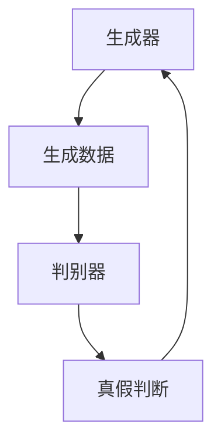
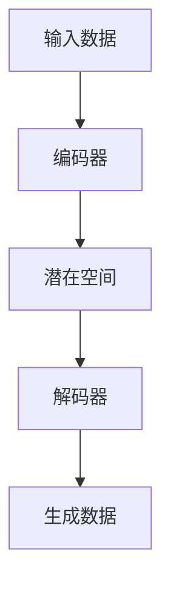
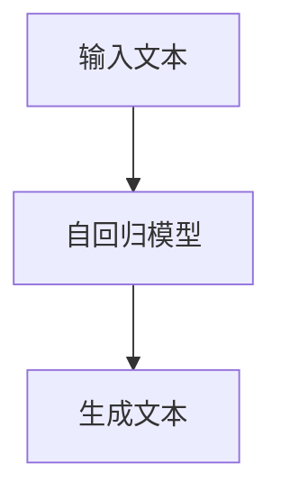

# 生成式人工智能 (Generative AI)

## 1.背景介绍

生成式人工智能（Generative AI）是人工智能领域的一个重要分支，旨在通过学习数据的分布来生成新的、类似的数据。与传统的判别式模型不同，生成式模型不仅能够进行分类和预测，还能够生成新的数据样本。生成式AI的应用范围广泛，包括图像生成、文本生成、音乐创作等。

生成式AI的兴起得益于深度学习技术的快速发展，尤其是生成对抗网络（GANs）、变分自编码器（VAEs）和自回归模型（如GPT-3）的出现。这些技术不仅在学术界引起了广泛关注，也在工业界得到了广泛应用。

## 2.核心概念与联系

### 2.1 生成对抗网络（GANs）

生成对抗网络由Ian Goodfellow等人在2014年提出，主要由生成器（Generator）和判别器（Discriminator）两个神经网络组成。生成器负责生成新的数据样本，而判别器则负责区分这些样本是真实的还是生成的。两者通过对抗训练不断提升各自的能力。



### 2.2 变分自编码器（VAEs）

变分自编码器是一种概率生成模型，通过编码器将输入数据映射到潜在空间，再通过解码器从潜在空间生成新的数据样本。VAEs的核心在于引入了变分推断，使得模型能够生成多样性更高的数据。



### 2.3 自回归模型

自回归模型通过逐步生成数据的每一个部分，常用于文本生成任务。GPT-3是其中的代表，通过大量的预训练数据，能够生成高质量的自然语言文本。



## 3.核心算法原理具体操作步骤

### 3.1 生成对抗网络（GANs）

1. 初始化生成器和判别器的参数。
2. 从真实数据集中采样一批数据。
3. 从潜在空间中采样一批随机噪声。
4. 生成器生成一批假数据。
5. 判别器对真实数据和假数据进行分类，计算损失。
6. 更新判别器的参数以最大化分类准确率。
7. 更新生成器的参数以最小化判别器的分类准确率。
8. 重复步骤2-7，直到生成器生成的数据足够逼真。

### 3.2 变分自编码器（VAEs）

1. 初始化编码器和解码器的参数。
2. 将输入数据通过编码器映射到潜在空间，得到均值和方差。
3. 从潜在空间中采样潜在变量。
4. 将潜在变量通过解码器生成数据。
5. 计算重构损失和KL散度损失。
6. 更新编码器和解码器的参数以最小化总损失。
7. 重复步骤2-6，直到生成的数据足够逼真。

### 3.3 自回归模型

1. 初始化模型参数。
2. 输入部分数据，模型生成下一个数据点。
3. 将生成的数据点作为输入，继续生成下一个数据点。
4. 重复步骤2-3，直到生成完整的数据序列。
5. 计算生成数据与真实数据的损失。
6. 更新模型参数以最小化损失。
7. 重复步骤2-6，直到生成的数据足够逼真。

## 4.数学模型和公式详细讲解举例说明

### 4.1 生成对抗网络（GANs）

GANs的目标是通过对抗训练，使生成器生成的数据分布尽可能接近真实数据分布。其损失函数定义如下：

$$
\min_G \max_D V(D, G) = \mathbb{E}_{x \sim p_{data}(x)}[\log D(x)] + \mathbb{E}_{z \sim p_z(z)}[\log(1 - D(G(z)))]
$$

其中，$G$表示生成器，$D$表示判别器，$p_{data}(x)$表示真实数据分布，$p_z(z)$表示潜在空间的分布。

### 4.2 变分自编码器（VAEs）

VAEs通过最大化似然估计来训练模型，其目标函数为：

$$
\mathcal{L} = \mathbb{E}_{q(z|x)}[\log p(x|z)] - KL(q(z|x) || p(z))
$$

其中，$q(z|x)$表示编码器，$p(x|z)$表示解码器，$KL$表示KL散度。

### 4.3 自回归模型

自回归模型通过最大化条件概率来生成数据，其目标函数为：

$$
\mathcal{L} = \sum_{t=1}^T \log p(x_t | x_{<t})
$$

其中，$x_t$表示第$t$个数据点，$x_{<t}$表示$t$之前的所有数据点。

## 5.项目实践：代码实例和详细解释说明

### 5.1 生成对抗网络（GANs）

以下是一个简单的GANs实现示例，使用PyTorch框架：

```python
import torch
import torch.nn as nn
import torch.optim as optim
from torchvision import datasets, transforms

# 定义生成器
class Generator(nn.Module):
    def __init__(self):
        super(Generator, self).__init__()
        self.main = nn.Sequential(
            nn.Linear(100, 256),
            nn.ReLU(True),
            nn.Linear(256, 512),
            nn.ReLU(True),
            nn.Linear(512, 1024),
            nn.ReLU(True),
            nn.Linear(1024, 784),
            nn.Tanh()
        )

    def forward(self, x):
        return self.main(x)

# 定义判别器
class Discriminator(nn.Module):
    def __init__(self):
        super(Discriminator, self).__init__()
        self.main = nn.Sequential(
            nn.Linear(784, 1024),
            nn.LeakyReLU(0.2, inplace=True),
            nn.Linear(1024, 512),
            nn.LeakyReLU(0.2, inplace=True),
            nn.Linear(512, 256),
            nn.LeakyReLU(0.2, inplace=True),
            nn.Linear(256, 1),
            nn.Sigmoid()
        )

    def forward(self, x):
        return self.main(x)

# 初始化模型和优化器
G = Generator()
D = Discriminator()
criterion = nn.BCELoss()
optimizerG = optim.Adam(G.parameters(), lr=0.0002)
optimizerD = optim.Adam(D.parameters(), lr=0.0002)

# 训练模型
for epoch in range(100):
    for i, (data, _) in enumerate(dataloader):
        # 训练判别器
        real_data = data.view(-1, 784)
        real_label = torch.ones(real_data.size(0), 1)
        fake_label = torch.zeros(real_data.size(0), 1)
        output = D(real_data)
        loss_real = criterion(output, real_label)
        noise = torch.randn(real_data.size(0), 100)
        fake_data = G(noise)
        output = D(fake_data.detach())
        loss_fake = criterion(output, fake_label)
        lossD = loss_real + loss_fake
        optimizerD.zero_grad()
        lossD.backward()
        optimizerD.step()

        # 训练生成器
        output = D(fake_data)
        lossG = criterion(output, real_label)
        optimizerG.zero_grad()
        lossG.backward()
        optimizerG.step()

    print(f'Epoch [{epoch+1}/100], Loss D: {lossD.item()}, Loss G: {lossG.item()}')
```

### 5.2 变分自编码器（VAEs）

以下是一个简单的VAEs实现示例，使用PyTorch框架：

```python
import torch
import torch.nn as nn
import torch.optim as optim
from torchvision import datasets, transforms

# 定义编码器
class Encoder(nn.Module):
    def __init__(self):
        super(Encoder, self).__init__()
        self.fc1 = nn.Linear(784, 400)
        self.fc21 = nn.Linear(400, 20)
        self.fc22 = nn.Linear(400, 20)

    def forward(self, x):
        h1 = torch.relu(self.fc1(x))
        return self.fc21(h1), self.fc22(h1)

# 定义解码器
class Decoder(nn.Module):
    def __init__(self):
        super(Decoder, self).__init__()
        self.fc3 = nn.Linear(20, 400)
        self.fc4 = nn.Linear(400, 784)

    def forward(self, z):
        h3 = torch.relu(self.fc3(z))
        return torch.sigmoid(self.fc4(h3))

# 定义VAE模型
class VAE(nn.Module):
    def __init__(self):
        super(VAE, self).__init__()
        self.encoder = Encoder()
        self.decoder = Decoder()

    def reparameterize(self, mu, logvar):
        std = torch.exp(0.5*logvar)
        eps = torch.randn_like(std)
        return mu + eps*std

    def forward(self, x):
        mu, logvar = self.encoder(x)
        z = self.reparameterize(mu, logvar)
        return self.decoder(z), mu, logvar

# 初始化模型和优化器
vae = VAE()
optimizer = optim.Adam(vae.parameters(), lr=0.001)

# 训练模型
for epoch in range(100):
    for i, (data, _) in enumerate(dataloader):
        data = data.view(-1, 784)
        recon_batch, mu, logvar = vae(data)
        recon_loss = nn.functional.binary_cross_entropy(recon_batch, data, reduction='sum')
        kld_loss = -0.5 * torch.sum(1 + logvar - mu.pow(2) - logvar.exp())
        loss = recon_loss + kld_loss
        optimizer.zero_grad()
        loss.backward()
        optimizer.step()

    print(f'Epoch [{epoch+1}/100], Loss: {loss.item()}')
```

### 5.3 自回归模型

以下是一个简单的自回归文本生成模型实现示例，使用PyTorch框架：

```python
import torch
import torch.nn as nn
import torch.optim as optim
from torchtext.legacy import data, datasets

# 定义模型
class RNNModel(nn.Module):
    def __init__(self, vocab_size, embed_size, hidden_size, num_layers):
        super(RNNModel, self).__init__()
        self.embed = nn.Embedding(vocab_size, embed_size)
        self.rnn = nn.LSTM(embed_size, hidden_size, num_layers, batch_first=True)
        self.fc = nn.Linear(hidden_size, vocab_size)

    def forward(self, x, hidden):
        x = self.embed(x)
        out, hidden = self.rnn(x, hidden)
        out = self.fc(out.reshape(out.size(0)*out.size(1), out.size(2)))
        return out, hidden

# 初始化模型和优化器
vocab_size = len(TEXT.vocab)
embed_size = 128
hidden_size = 256
num_layers = 2
model = RNNModel(vocab_size, embed_size, hidden_size, num_layers)
optimizer = optim.Adam(model.parameters(), lr=0.001)
criterion = nn.CrossEntropyLoss()

# 训练模型
for epoch in range(100):
    hidden = None
    for i, batch in enumerate(train_iter):
        data, target = batch.text, batch.target
        output, hidden = model(data, hidden)
        loss = criterion(output, target.view(-1))
        optimizer.zero_grad()
        loss.backward()
        optimizer.step()

    print(f'Epoch [{epoch+1}/100], Loss: {loss.item()}')
```

## 6.实际应用场景

### 6.1 图像生成

生成式AI在图像生成领域有着广泛的应用。例如，GANs可以生成高质量的图像，应用于艺术创作、广告设计等领域。VAEs则可以用于图像的压缩和重构，提高图像传输效率。

### 6.2 文本生成

自回归模型在文本生成领域表现出色，尤其是在自然语言处理任务中。GPT-3等模型可以生成高质量的文章、对话，应用于智能客服、内容创作等领域。

### 6.3 音乐创作

生成式AI还可以用于音乐创作，通过学习大量的音乐数据，生成新的音乐作品。GANs和VAEs在这一领域都有应用，能够生成不同风格的音乐。

### 6.4 医疗诊断

生成式AI在医疗领域也有重要应用。例如，通过生成医学图像，辅助医生进行诊断；通过生成药物分子结构，辅助药物研发。

## 7.工具和资源推荐

### 7.1 开源框架

- **TensorFlow**：谷歌开发的开源深度学习框架，支持生成式AI模型的训练和部署。
- **PyTorch**：Facebook开发的开源深度学习框架，广泛应用于学术研究和工业界。
- **Keras**：基于TensorFlow的高级神经网络API，简化了生成式AI模型的开发。

### 7.2 数据集

- **MNIST**：手写数字数据集，常用于图像生成任务的入门练习。
- **CIFAR-10**：包含10类图像的数据集，常用于图像生成和分类任务。
- **IMDB**：电影评论数据集，常用于文本生成和情感分析任务。

### 7.3 在线资源

- **arXiv**：提供最新的生成式AI研究论文，帮助了解前沿技术。
- **GitHub**：开源代码库，包含大量生成式AI项目和代码示例。
- **Coursera**：提供生成式AI相关的在线课程，适合初学者和进阶学习者。

## 8.总结：未来发展趋势与挑战

生成式AI在过去几年中取得了显著进展，但仍面临许多挑战。未来的发展趋势包括：

### 8.1 模型的可解释性

当前的生成式AI模型大多是黑箱模型，难以解释其生成过程。未来需要发展可解释的生成式AI模型，增强其透明度和可信度。

### 8.2 数据隐私保护

生成式AI需要大量的数据进行训练，如何在保护数据隐私的前提下进行模型训练是一个重要挑战。联邦学习等技术可能是解决这一问题的方向。

### 8.3 多模态生成

当前的生成式AI模型大多专注于单一模态的数据生成，未来需要发展能够生成多模态数据的模型，例如同时生成图像和文本。

### 8.4 实时生成

生成式AI在实时生成任务中仍存在性能瓶颈，未来需要优化模型结构和算法，提高生成速度和效率。

## 9.附录：常见问题与解答

### 9.1 生成式AI与判别式AI的区别是什么？

生成式AI通过学习数据的分布来生成新的数据样本，而判别式AI则通过学习数据的特征进行分类和预测。生成式AI不仅能够进行分类和预测，还能够生成新的数据样本。

### 9.2 GANs和VAEs的主要区别是什么？

GANs通过生成器和判别器的对抗训练生成数据，而VAEs通过编码器和解码器的变分推断生成数据。GANs生成的数据质量通常较高，但训练过程不稳定；VAEs生成的数据多样性较高，但质量相对较低。

### 9.3 如何选择合适的生成式AI模型？

选择生成式AI模型需要根据具体应用场景和数据特点进行。例如，GANs适合生成高质量的图像，VAEs适合生成多样性高的数据，自回归模型适合生成序列数据（如文本）。

### 9.4 生成式AI模型的训练需要注意哪些问题？

生成式AI模型的训练需要注意数据预处理、模型参数初始化、损失函数选择等问题。此外，生成式AI模型的训练过程通常较为复杂，需要进行大量的超参数调优。

### 9.5 生成式AI的未来发展方向是什么？

生成式AI的未来发展方向包括模型的可解释性、数据隐私保护、多模态生成和实时生成等。随着技术的不断进步，生成式AI将在更多领域得到应用。

---

作者：禅与计算机程序设计艺术 / Zen and the Art of Computer Programming