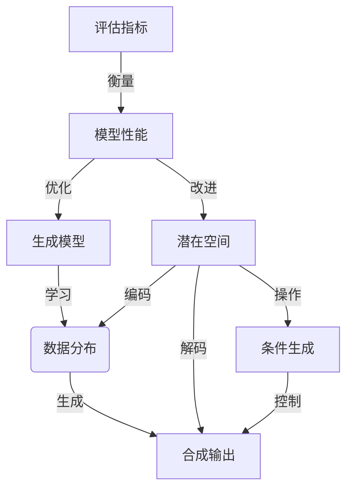

# 生成式人工智能 (Generative AI)

## 1. 背景介绍

人工智能(AI)已经成为当今科技领域最热门的话题之一。在过去几年中,AI的发展取得了长足的进步,尤其是在机器学习和深度学习等领域。然而,传统的AI系统大多被设计用于识别、分类和预测等任务,而生成式人工智能(Generative AI)则是一种全新的范式,旨在让机器能够像人类一样创造出新的、有意义的内容。

生成式AI是指使用人工智能算法从数据中学习模式,并基于这些模式生成新的、合成的输出,如图像、音频、文本等。这种技术已经在多个领域取得了令人瞩目的成就,如艺术创作、内容生成、语音合成等,展现出巨大的应用潜力。

### 1.1 生成式AI的兴起

生成式AI的兴起主要源于以下几个原因:

1. **数据量的激增**: 随着互联网和移动设备的普及,大量的数字化数据被创造和存储,为训练生成式AI模型提供了丰富的素材。

2. **计算能力的提高**: 现代GPU和TPU等专用硬件的出现,大幅提升了训练复杂深度学习模型的计算能力。

3. **深度学习算法的进步**: 生成对抗网络(GAN)、变分自编码器(VAE)、transformer等新型深度学习架构的出现,为生成式AI提供了强大的技术支撑。

4. **应用需求的驱动**: 内容创作、虚拟现实、人机交互等领域对生成式AI技术的需求不断增长,推动了该领域的快速发展。

### 1.2 生成式AI的挑战

尽管生成式AI取得了令人瞩目的进展,但它也面临着一些重大挑战:

1. **数据质量**: 训练数据的质量直接影响生成式AI模型的性能,如何获取高质量、多样化的训练数据是一大挑战。

2. **模型可解释性**: 许多生成式AI模型是黑箱模型,缺乏可解释性,难以理解其内部工作机制。

3. **模型稳定性**: 生成式模型容易受到噪声和微小扰动的影响,导致生成结果的不稳定性。

4. **伦理和隐私问题**: 生成式AI可能被滥用于生成虚假信息、侵犯隐私等,需要建立相应的伦理和法律框架。

5. **计算资源需求**: 训练大型生成式AI模型需要大量的计算资源,这对于普通用户和小型组织来说是一大挑战。

## 2. 核心概念与联系

生成式AI涉及多个核心概念,这些概念相互关联,共同构建了生成式AI的理论和技术基础。

### 2.1 生成模型

生成模型(Generative Model)是生成式AI的核心,它旨在从训练数据中学习数据分布的潜在模式,并基于这些模式生成新的、合成的输出。常见的生成模型包括:

1. **生成对抗网络(GAN)**: 由一个生成器网络和一个判别器网络组成,通过对抗训练的方式,生成器网络学习生成逼真的合成数据,而判别器网络则试图区分真实数据和合成数据。

2. **变分自编码器(VAE)**: 将输入数据编码为潜在空间的低维表示,然后从该潜在空间中采样并解码生成新的输出。

3. **自回归模型(Autoregressive Model)**: 基于序列数据(如文本或音频)的条件概率建模,通过预测每个时间步的条件概率分布来生成新序列。

4. **流模型(Flow Model)**: 使用可逆的变换将简单分布(如高斯分布)映射到复杂的数据分布,从而生成新的数据样本。

5. **扩散模型(Diffusion Model)**: 通过学习从噪声到数据的反向过程,实现从纯噪声生成高质量样本的能力。

这些生成模型在不同的应用场景中具有各自的优势和局限性,需要根据具体任务选择合适的模型。

### 2.2 潜在空间

许多生成式AI模型都涉及潜在空间(Latent Space)的概念。潜在空间是一个低维的连续向量空间,用于编码输入数据的关键特征。通过对潜在空间进行采样和解码,可以生成新的合成输出。

潜在空间的性质对生成式AI模型的性能有着重要影响。一个良好的潜在空间应该具有以下特点:

1. **结构化**: 潜在空间中相似的向量应该对应相似的输出,从而捕捉数据的内在结构。

2. **连续性**: 潜在空间应该是连续的,这样通过对潜在向量进行平滑插值,就可以生成平滑过渡的输出。

3. **可解释性**: 潜在空间的各个维度应该对应输出的某些语义特征,从而提高模型的可解释性。

4. **编码能力**: 潜在空间应该具有足够的表达能力,能够有效地编码输入数据的关键信息。

设计和优化潜在空间是生成式AI研究的一个重要方向,直接影响着模型的生成质量和可解释性。

### 2.3 条件生成

除了无条件生成之外,生成式AI模型还可以实现条件生成(Conditional Generation),即根据给定的条件或约束生成满足特定要求的输出。条件生成极大地扩展了生成式AI的应用范围,使其能够更好地满足实际需求。

常见的条件生成任务包括:

1. **文本续写**: 给定一段文本,生成与之相关且自然流畅的后续内容。

2. **图像编辑**: 根据用户的文本或草图输入,生成符合要求的图像。

3. **风格迁移**: 将一种风格(如艺术家的绘画风格)迁移到另一种内容(如照片)上。

4. **控制生成**: 通过调节潜在空间中的特定维度,控制生成输出的某些属性。

5. **多模态生成**: 基于一种模态(如文本)生成另一种模态(如图像或音频)的输出。

条件生成需要在训练过程中将条件信息融入模型,通常采用条件注意力机制、条件批归一化等技术。合理利用条件信息可以显著提高生成质量和控制能力。

### 2.4 评估指标

评估生成式AI模型的性能是一个具有挑战性的问题。由于生成式AI模型的输出通常是开放的、多样化的,因此很难使用传统的监督学习指标(如准确率或F1分数)来衡量模型的性能。

常见的生成式AI评估指标包括:

1. **对数似然(Log-likelihood)**: 衡量模型对训练数据的拟合程度,值越高表示模型更好地捕捉了数据分布。

2. **Inception分数(Inception Score)**: 针对生成图像质量的评估指标,结合了图像质量和多样性两个方面。

3. **FID分数(Fréchet Inception Distance)**: 衡量生成图像与真实图像之间的统计差异,值越小表示生成图像质量越高。

4. **BLEU分数(Bilingual Evaluation Understudy)**: 针对生成文本质量的评估指标,通过与参考文本进行n-gram匹配计算得分。

5. **人工评估**: 由人类评估者根据特定标准(如逼真度、连贯性等)对生成输出进行主观评分。

6. **对抗评估**: 训练一个discriminator模型来区分真实数据和生成数据,discriminator的性能可以反映生成模型的质量。

7. **度量学习(Metric Learning)**: 通过学习输入和输出之间的距离度量,将相似的输入映射到相似的输出,从而评估生成质量。

由于生成式AI的输出具有多样性和主观性,因此评估指标的选择和设计仍然是一个值得深入研究的问题。

### 2.5 核心概念关系

上述核心概念相互关联,共同构建了生成式AI的理论和技术框架。生成模型是生成式AI的核心,通过从训练数据中学习数据分布,实现对新数据的生成。潜在空间则为生成模型提供了一种有效的数据表示方式,捕捉输入数据的关键特征,并支持通过对潜在向量的操作实现条件生成和控制生成。评估指标则用于衡量生成式AI模型的性能,指导模型的优化和改进。

生成式AI的发展离不开这些核心概念的共同推进,它们相互促进、相辅相成,推动着生成式AI技术的不断进步和应用拓展。

## 3. 核心算法原理具体操作步骤

生成式AI涉及多种核心算法,这些算法在原理和具体操作步骤上存在一定差异,但都旨在从数据中学习模式,并基于这些模式生成新的、合成的输出。本节将重点介绍两种广为人知的生成式AI算法:生成对抗网络(GAN)和变分自编码器(VAE)。

### 3.1 生成对抗网络(GAN)

#### 3.1.1 原理

生成对抗网络(Generative Adversarial Networks, GAN)是一种通过对抗训练的方式实现生成模型的框架。它包含两个神经网络:生成器(Generator)和判别器(Discriminator)。

生成器的目标是从随机噪声中生成逼真的合成数据样本,以欺骗判别器。而判别器则试图区分生成器生成的合成数据和真实数据,从而提高对生成数据的判别能力。生成器和判别器相互对抗,相互驱动,最终达到一种动态平衡,使生成器能够生成逼真的数据样本。

这种对抗训练过程可以形式化为一个min-max游戏,生成器和判别器分别试图最小化和最大化以下目标函数:

$$\min_G \max_D V(D, G) = \mathbb{E}_{x \sim p_\text{data}(x)}[\log D(x)] + \mathbb{E}_{z \sim p_z(z)}[\log (1 - D(G(z)))]$$

其中,$ p_\text{data}(x) $表示真实数据的分布,$ p_z(z) $表示随机噪声的分布,$ G(z) $表示生成器从噪声$ z $生成的合成数据样本,$ D(x) $表示判别器对数据$ x $为真实数据的判别概率。

通过交替优化生成器和判别器的目标函数,可以达到生成器生成的数据无法被判别器区分的状态,此时生成器就学会了捕捉真实数据分布的本质特征。

#### 3.1.2 具体操作步骤

1. **准备训练数据**: 收集并预处理用于训练GAN模型的真实数据集,如图像、文本等。

2. **定义网络架构**: 设计生成器和判别器的神经网络架构,通常采用卷积神经网络(CNN)或者全连接网络。

3. **初始化模型参数**: 使用随机初始化或预训练的方式初始化生成器和判别器的参数。

4. **训练循环**:
    - 从噪声分布$ p_z(z) $中采样一批噪声$ z $,将其输入生成器$ G $生成一批合成数据$ G(z) $。
    - 从真实数据集中采样一批真实数据$ x $。
    - 更新判别器$ D $的参数,使其能够较好地区分真实数据$ x $和生成数据$ G(z) $,即最大化$ \mathbb{E}_{x \sim p_\text{data}(x)}[\log D(x)] + \mathbb{E}_{z \sim p_z(z)}[\log (1 - D(G(z)))] $。
    - 更新生成器$ G $的参数,使其生成的数据$ G(z) $能够更好地欺骗判别器$ D $,即最小化$ \mathbb{E}_{z \sim p_z(z)}[\log (1 - D(G(z)))] $。
    - 重复上述步骤,直到模型收敛