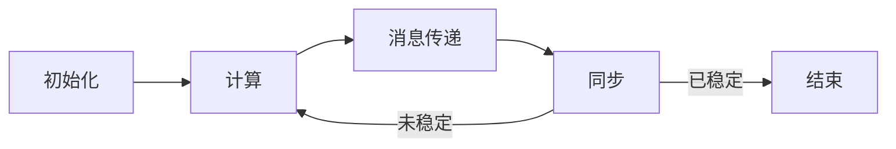

# 电力系统优化:Pregel处理电网大数据

## 1. 背景介绍
随着全球能源需求的增长，电力系统的规模和复杂性也在不断增加。电网大数据的处理成为了电力系统优化中的一个关键问题。传统的数据处理方法在面对海量、高维度和实时性要求的电网数据时显得力不从心。因此，如何有效地处理和分析电网大数据，以提高电力系统的运行效率和可靠性，已经成为了电力行业和信息技术领域共同关注的热点。

## 2. 核心概念与联系
在电力系统优化中，Pregel作为一种大规模图处理框架，为处理电网大数据提供了新的思路。Pregel采用了基于顶点的编程模型，能够很好地适应电网的拓扑结构，并通过分布式计算来处理大规模数据集。Pregel的核心概念包括顶点、边、消息传递和迭代计算，这些概念与电力系统中的节点、连接线、信息流和状态更新等元素相对应。

## 3. 核心算法原理具体操作步骤
Pregel算法的操作步骤通常包括初始化、计算、消息传递和同步四个阶段。在初始化阶段，每个顶点被赋予一个初始值。在计算阶段，每个顶点根据自身的值和接收到的消息来更新状态。在消息传递阶段，顶点可以向其他顶点发送消息。在同步阶段，系统会检查是否所有顶点的状态都已经稳定，如果没有，则继续进行下一轮的计算。



## 4. 数学模型和公式详细讲解举例说明
在Pregel框架中，电力系统可以被建模为一个图$G=(V,E)$，其中$V$是顶点集合，代表电网中的节点，$E$是边集合，代表连接节点的输电线。每个顶点$v \in V$都有一个状态值$x_v$，以及一个计算函数$f_v$。在每一轮迭代中，顶点$v$的新状态值$x'_v$由下面的公式计算得出：

$$
x'_v = f_v(x_v, M_v)
$$

其中，$M_v$是在当前轮迭代中接收到的消息集合。通过不断迭代，直到所有顶点的状态值收敛，即可得到电力系统的最优状态。

## 5. 项目实践：代码实例和详细解释说明
在实际项目中，我们可以使用Apache Giraph，这是一个基于Pregel模型的开源图处理框架。以下是一个简单的Pregel程序示例，用于计算电网中节点的最短路径：

```java
public class ShortestPathVertex extends BasicComputation<
    LongWritable, DoubleWritable, FloatWritable, DoubleWritable> {
  @Override
  public void compute(
      Vertex<LongWritable, DoubleWritable, FloatWritable> vertex,
      Iterable<DoubleWritable> messages) {
    if (getSuperstep() == 0) {
      vertex.setValue(new DoubleWritable(Double.MAX_VALUE));
    }
    double minDist = isSource(vertex) ? 0d : Double.MAX_VALUE;
    for (DoubleWritable message : messages) {
      minDist = Math.min(minDist, message.get());
    }
    if (minDist < vertex.getValue().get()) {
      vertex.setValue(new DoubleWritable(minDist));
      for (Edge<LongWritable, FloatWritable> edge : vertex.getEdges()) {
        double distance = minDist + edge.getValue().get();
        sendMessage(edge.getTargetVertexId(), new DoubleWritable(distance));
      }
    }
    vertex.voteToHalt();
  }

  private boolean isSource(Vertex<LongWritable, DoubleWritable, FloatWritable> vertex) {
    // Define the logic to determine the source vertex
  }
}
```

在这个示例中，我们定义了一个`ShortestPathVertex`类，它继承自`BasicComputation`。在每一轮迭代中，每个顶点都会接收到消息，更新自己的状态值，并向邻居顶点发送新的消息。

## 6. 实际应用场景
Pregel框架在电力系统优化中的应用场景包括但不限于电网状态估计、故障检测与定位、电网拓扑分析等。通过Pregel框架，可以有效地处理和分析电网中的大规模数据，从而提高电力系统的运行效率和可靠性。

## 7. 工具和资源推荐
对于希望深入了解和应用Pregel框架的开发者，以下是一些推荐的工具和资源：
- Apache Giraph：基于Pregel模型的图处理框架。
- Google Cloud Dataflow：支持Pregel-like模型的批量和流数据处理服务。
- Pregel论文：Google发表的原始Pregel论文，详细介绍了Pregel模型的设计和实现。

## 8. 总结：未来发展趋势与挑战
随着电力系统的不断发展，电网大数据的处理将面临更多的挑战，如数据规模的进一步增长、实时性要求的提高等。Pregel框架作为一种有效的图处理工具，其未来的发展趋势将更加注重性能优化、实时处理能力以及更好的容错机制。同时，如何将Pregel框架与其他大数据技术相结合，以适应电力系统优化的多样化需求，也是未来研究的重要方向。

## 9. 附录：常见问题与解答
Q1: Pregel框架适用于哪些类型的图数据处理？
A1: Pregel框架适用于大规模的稀疏图数据处理，特别是那些需要迭代计算和消息传递的图算法。

Q2: Pregel模型如何保证计算的可扩展性？
A2: Pregel模型通过分布式计算和顶点划分来实现可扩展性，每个顶点的计算都是独立的，可以并行执行。

Q3: 在Pregel模型中，如何处理顶点之间的依赖关系？
A3: Pregel模型通过消息传递机制来处理顶点之间的依赖关系，顶点可以在迭代计算中向其他顶点发送和接收消息。

作者：禅与计算机程序设计艺术 / Zen and the Art of Computer Programming