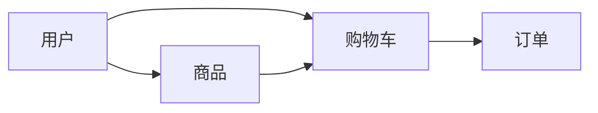

## 1.背景介绍

在当今的互联网时代，电脑配件网络购物系统已经成为了人们购买电脑配件的重要渠道。然而，设计和实现一个高效、安全、用户友好的电脑配件网络购物系统并不是一件容易的事情。本文将详细介绍如何设计和实现一个电脑配件网络购物系统。

## 2.核心概念与联系

在设计和实现电脑配件网络购物系统时，我们需要理解和掌握以下几个核心概念和它们之间的联系：

- **用户**：用户是网络购物系统的使用者，他们可以浏览商品、添加商品到购物车、提交订单等。
- **商品**：商品是用户在网络购物系统中可以购买的物品，每个商品都有自己的名称、价格、库存等信息。
- **购物车**：购物车是用户在网络购物系统中临时存放想要购买的商品的地方。
- **订单**：订单是用户提交购物车后生成的，包含了用户购买的商品信息和总价等。

这些核心概念之间的联系可以用下面的Mermaid流程图表示：



## 3.核心算法原理具体操作步骤

设计和实现电脑配件网络购物系统的核心算法主要包括以下几个步骤：

1. **用户注册和登录**：用户需要先注册并登录才能使用网络购物系统。我们需要设计一个安全的用户注册和登录系统，保护用户的个人信息。
2. **商品浏览和搜索**：用户可以浏览和搜索商品。我们需要设计一个高效的商品浏览和搜索系统，让用户能快速找到自己想要的商品。
3. **添加商品到购物车**：用户可以将自己想要的商品添加到购物车。我们需要设计一个用户友好的购物车系统，让用户能方便地管理自己的购物车。
4. **提交订单**：用户可以提交购物车生成订单。我们需要设计一个可靠的订单系统，保证用户的订单能正确无误地生成。

## 4.数学模型和公式详细讲解举例说明

在设计和实现电脑配件网络购物系统时，我们需要用到一些数学模型和公式。例如，计算订单总价的公式如下：

$$
\text{订单总价} = \sum_{i=1}^{n} \text{商品价格}_i \times \text{商品数量}_i
$$

其中，$n$ 是订单中的商品种类数量，$\text{商品价格}_i$ 是第 $i$ 种商品的价格，$\text{商品数量}_i$ 是第 $i$ 种商品的数量。

## 5.项目实践：代码实例和详细解释说明

下面我们来看一个具体的代码实例。这个代码实例实现了用户添加商品到购物车的功能：

```python
class ShoppingCart(object):
    def __init__(self):
        self.items = []

    def add_item(self, item, quantity):
        self.items.append({
            'item': item,
            'quantity': quantity
        })

class User(object):
    def __init__(self):
        self.cart = ShoppingCart()

    def add_to_cart(self, item, quantity):
        self.cart.add_item(item, quantity)
```

在这个代码实例中，我们定义了一个 `ShoppingCart` 类来表示购物车，一个 `User` 类来表示用户。用户可以通过 `add_to_cart` 方法将商品添加到购物车。

## 6.实际应用场景

电脑配件网络购物系统在很多实际应用场景中都有广泛的应用，例如：

- **电脑配件零售商**：电脑配件零售商可以通过电脑配件网络购物系统来销售自己的商品，提高销售效率。
- **电脑配件制造商**：电脑配件制造商可以通过电脑配件网络购物系统来直接销售自己的商品，节省中间环节。
- **消费者**：消费者可以通过电脑配件网络购物系统来购买自己需要的电脑配件，节省购物时间。

## 7.工具和资源推荐

在设计和实现电脑配件网络购物系统时，以下几个工具和资源可能会对你有所帮助：

- **Python**：Python 是一种简单易学的编程语言，非常适合用来实现网络购物系统。
- **Django**：Django 是一个基于 Python 的开源 web 开发框架，可以帮助你快速地开发出一个完整的网络购物系统。
- **MySQL**：MySQL 是一个开源的关系型数据库管理系统，可以用来存储和管理网络购物系统的数据。

## 8.总结：未来发展趋势与挑战

随着互联网技术的不断发展，电脑配件网络购物系统的设计和实现也面临着新的挑战和机遇。例如，如何保护用户的个人信息、如何提高系统的性能、如何提升用户的购物体验等，都是我们需要去思考和解决的问题。

## 9.附录：常见问题与解答

1. **问题**：如何保护用户的个人信息？
   **答案**：我们可以通过加密用户的个人信息、使用安全的用户认证系统等方式来保护用户的个人信息。

2. **问题**：如何提高系统的性能？
   **答案**：我们可以通过优化数据库查询、使用缓存等方式来提高系统的性能。

3. **问题**：如何提升用户的购物体验？
   **答案**：我们可以通过优化用户界面、提供个性化的商品推荐等方式来提升用户的购物体验。

作者：禅与计算机程序设计艺术 / Zen and the Art of Computer Programming