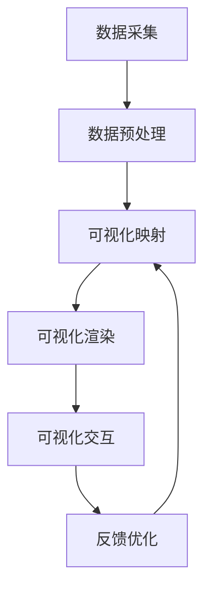

# 疫情通报的可视化分析呈现

## 1.背景介绍

### 1.1 疫情爆发及其影响

2019年底，一种新型冠状病毒在中国武汉爆发,迅速蔓延至全球各地,导致了一场前所未有的公共卫生危机。这种被命名为"COVID-19"的疾病不仅严重威胁着人们的生命安全,而且对全球经济、社会运行和日常生活造成了巨大冲击。为了控制疫情蔓延,各国政府采取了严格的防控措施,如封锁城市、限制人员流动、关闭公共场所等,这些措施虽然在一定程度上遏制了病毒传播,但也给人们的生活和工作带来了诸多不便。

### 1.2 疫情数据的重要性

在这场前所未有的公共卫生危机中,及时、准确的疫情数据对于制定有效的防控策略至关重要。政府部门需要实时了解疫情发展趋势,以便采取相应的应对措施;医疗机构需要掌握病例分布情况,以合理调配医疗资源;普通民众也需要了解所在地区的疫情状况,以保护自身安全。然而,疫情数据的种类繁多、数量庞大,单纯依赖表格或文字很难直观地呈现其中蕴含的信息,因此需要借助可视化技术将这些数据转化为图表、地图等形式,以帮助决策者和公众更好地理解和利用这些信息。

### 1.3 可视化技术的重要作用

可视化技术能够将抽象的数据转化为直观的图形表现形式,使人们更容易理解和分析数据中蕴含的信息和规律。在疫情防控过程中,可视化技术可以发挥以下重要作用:

1. 直观展示疫情发展趋势和分布情况,帮助决策者制定科学的防控策略。
2. 清晰呈现医疗资源分布状况,为资源调配提供决策依据。
3. 向公众传递及时、准确的疫情信息,提高民众的防护意识。
4. 支持对疫情数据进行多维度分析,发现潜在的规律和趋势。
5. 促进跨部门、跨地区的数据共享和协作,提高防控工作的协同效率。

综上所述,可视化技术在疫情防控中扮演着重要角色,是疫情数据分析和信息传递的有力工具。本文将重点介绍疫情数据可视化的核心概念、关键技术,并探讨其在实际应用中的案例和挑战。

## 2.核心概念与联系

### 2.1 数据可视化概述

数据可视化(Data Visualization)是指利用计算机图形学和图像处理技术,将抽象的数据转化为直观的图形表现形式,以帮助人们更好地理解和分析数据中蕴含的信息和规律。数据可视化技术广泛应用于科学计算、商业智能、金融分析等多个领域。

在疫情防控场景中,可视化技术主要用于将疫情相关的数据(如确诊病例数、死亡率、医疗资源分布等)转化为图表、地图等形式,以支持决策分析和信息传递。常见的可视化方式包括折线图、柱状图、饼图、散点图、热力图、地理信息系统(GIS)等。

### 2.2 可视化流程

数据可视化的基本流程包括以下几个关键步骤:

1. **数据采集**:从各种数据源(如政府部门、医疗机构、新闻媒体等)收集相关的疫情数据,包括确诊病例、死亡病例、康复病例、医疗资源分布等信息。
2. **数据预处理**:对采集到的原始数据进行清洗、转换、整合等处理,将其转化为可视化系统可识别的结构化格式。
3. **可视化映射**:根据可视化目标和数据特征,选择合适的可视化方式(如折线图、柱状图、地图等),并将数据映射到相应的视觉元素上(如点、线、面、颜色等)。
4. **可视化渲染**:利用计算机图形学技术,将可视化映射结果渲染成最终的图形输出,如静态图像或交互式可视化界面。
5. **可视化交互**:为用户提供交互操作,如缩放、平移、过滤、钻取等,以支持数据的多维度探索和分析。

该流程并非一次性完成,而是一个迭代优化的过程。根据用户需求和数据变化,可能需要反复调整可视化映射和渲染策略,以获得更加清晰、高效的可视化效果。



### 2.3 可视化设计原则

为了实现高效、直观的数据可视化效果,需要遵循以下几个基本设计原则:

1. **简洁性**:避免在可视化图形中包含过多的视觉元素和无关信息,保持整体设计简洁清晰。
2. **一致性**:在同一个可视化系统中,保持视觉元素的表示方式一致,避免引起用户的混淆。
3. **直观性**:充分利用人类视觉系统的感知能力,使用直观的视觉映射方式,帮助用户快速理解数据信息。
4. **层次性**:根据数据的重要程度和关联关系,在可视化图形中体现出合理的层次结构和焦点区域。
5. **交互性**:提供丰富的交互操作,支持用户对数据进行多维度的探索和分析。

遵循这些设计原则,可以提高可视化系统的用户体验,增强数据分析和决策支持的效率。

## 3.核心算法原理具体操作步骤

### 3.1 数据预处理算法

在进行可视化之前,需要对原始数据进行预处理,以确保数据的完整性、一致性和可用性。常见的数据预处理算法包括:

1. **缺失值处理**:填充或删除缺失的数据项,以避免对可视化结果造成干扰。
2. **异常值检测**:识别并处理数据中的异常值,如由于人为操作或设备故障导致的错误数据。
3. **数据清洗**:去除数据中的噪声和无关信息,如格式错误、重复记录等。
4. **数据转换**:将原始数据转换为可视化系统可识别的结构化格式,如JSON、CSV等。
5. **数据整合**:将来自不同数据源的相关数据进行整合,形成统一的数据集。

以缺失值处理为例,常用的算法包括:

1. **删除法**:直接删除包含缺失值的数据项或记录。
2. **均值插补法**:用数据的均值替换缺失值。
3. **最近邻插补法**:用相邻数据项的值替换缺失值。
4. **回归插补法**:基于其他变量的值,通过回归模型预测缺失值。

具体采用哪种算法,需要根据数据的特点和可视化目标进行权衡。

### 3.2 可视化映射算法

可视化映射是将数据映射到视觉元素的过程,是可视化系统的核心部分。常见的可视化映射算法包括:

1. **笛卡尔坐标映射**:将数据映射到二维或三维笛卡尔坐标系中,形成散点图、折线图、柱状图等。
2. **极坐标映射**:将数据映射到极坐标系中,形成饼图、玫瑰图等。
3. **地理映射**:将数据映射到地理坐标系中,形成地图可视化。
4. **树状映射**:将层次结构数据映射到树状图或者节点链接图中。
5. **像素映射**:将数据映射到像素级别,形成密度图、热力图等。

以笛卡尔坐标映射为例,常用的算法包括:

1. **等间距缩放**:将数据线性缩放到坐标系的范围内。
2. **对数缩放**:将数据按对数尺度缩放到坐标系的范围内,适用于数据范围变化较大的情况。
3. **分段缩放**:将数据分成多个区间,分别进行不同的缩放映射。

除了坐标映射,还需要将数据映射到其他视觉元素,如颜色、大小、形状等,以增强可视化效果。常用的颜色映射算法包括:

1. **序列颜色映射**:将数据映射到有序的颜色序列,如彩虹色、黑白渐变等。
2. **发散颜色映射**:将数据映射到以中性颜色为中心的发散颜色序列,适用于正负值的对比显示。
3. **分类颜色映射**:将数据映射到离散的颜色集合,适用于分类数据的可视化。

### 3.3 可视化渲染算法

可视化渲染是将可视化映射结果转化为最终的图形输出,涉及计算机图形学和图像处理等技术。常见的可视化渲染算法包括:

1. **矢量图形渲染**:将可视化元素表示为一系列几何图形,如线条、多边形等,并使用矢量图形渲染算法进行绘制。
2. **光栅图形渲染**:将可视化元素离散为像素级别,并使用光栅图形渲染算法进行绘制,如扫描线算法、反走样算法等。
3. **体数据渲染**:针对三维体数据(如CT、MRI等医学影像数据)进行体渲染,常用算法包括射线投射法、切面渲染法等。
4. **标注渲染**:在可视化图形中添加标注信息,如坐标轴标签、图例等,以增强可读性。

以矢量图形渲染为例,常用的算法包括:

1. **Bresenham算法**:用于高效绘制直线和圆弧等基本图形。
2. **多边形填充算法**:如扫描线填充算法、种子填充算法等,用于填充多边形区域。
3. **抗锯齿算法**:如高斯模糊、FreeType等,用于提高渲染质量,减少锯齿效应。

除了基本的渲染算法,还需要考虑可视化交互的实现,如缩放、平移、选择、联动等操作,这些通常依赖于图形用户界面(GUI)库和事件处理机制。

## 4.数学模型和公式详细讲解举例说明

在疫情数据可视化中,常常需要借助数学模型和公式来描述和预测疫情的发展趋势,以及评估防控措施的效果。下面将介绍几种常用的数学模型和公式,并给出具体的应用示例。

### 4.1 SIR 模型

SIR 模型是描述传染病传播规律的经典数学模型,其核心思想是将总人口分为三类:易感人群(Susceptible)、感染人群(Infected)和康复人群(Recovered),并使用一组微分方程来描述这三类人群数量的动态变化。SIR 模型的基本形式如下:

$$
\begin{aligned}
\frac{dS}{dt} &= -\beta SI \\
\frac{dI}{dt} &= \beta SI - \gamma I \\
\frac{dR}{dt} &= \gamma I
\end{aligned}
$$

其中:

- $S(t)$ 表示时刻 $t$ 时易感人群的数量
- $I(t)$ 表示时刻 $t$ 时感染人群的数量
- $R(t)$ 表示时刻 $t$ 时康复人群的数量
- $\beta$ 是传播率参数,反映了病毒的传播能力
- $\gamma$ 是康复率参数,反映了感染者康复的速率

通过对 SIR 模型进行数值求解,我们可以模拟疫情在不同参数条件下的发展趋势,并预测疫情的高峰期、持续时间等关键指标。例如,下图展示了一个典型的 SIR 模型模拟结果,其中橙色曲线表示感染人群的变化趋势:

```mermaid
graph TD
    A[SIR模型] --> B[数值求解]
    B --> C[疫情发展趋势模拟]
    C --> D[预测高峰期和持续时间]