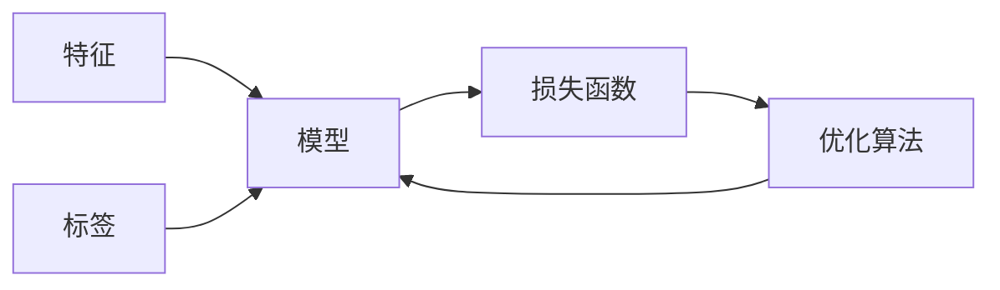

# 监督学习：原理与代码实例讲解

## 1. 背景介绍

监督学习是机器学习的一个核心分支，它涉及从带有标签的数据中学习模型，以便能够预测未见过的数据的输出。在现代社会，监督学习的应用无处不在，从图像识别、语音识别到金融市场分析，都离不开监督学习的技术支持。

## 2. 核心概念与联系

监督学习的核心概念包括特征(feature)、标签(label)、模型(model)、损失函数(loss function)和优化算法(optimization algorithm)。特征是输入数据的表示，标签是我们希望模型预测的输出。模型是特征到标签的映射函数，损失函数用于衡量模型预测与真实标签之间的差异，优化算法用于调整模型参数以最小化损失函数。



## 3. 核心算法原理具体操作步骤

监督学习的核心算法包括线性回归、逻辑回归、支持向量机(SVM)、决策树和神经网络等。以线性回归为例，其操作步骤包括：

1. 数据预处理：包括数据清洗、特征选择、数据标准化等。
2. 模型选择：选择线性回归作为预测模型。
3. 损失函数定义：通常使用均方误差(MSE)作为线性回归的损失函数。
4. 优化算法选择：如梯度下降法。
5. 模型训练：使用优化算法最小化损失函数，得到模型参数。
6. 模型评估：使用测试集评估模型性能。
7. 模型应用：将训练好的模型用于新数据的预测。

## 4. 数学模型和公式详细讲解举例说明

以线性回归为例，其数学模型可以表示为：

$$
y = \beta_0 + \beta_1 x_1 + \beta_2 x_2 + ... + \beta_n x_n + \epsilon
$$

其中，$y$ 是目标变量，$x_i$ 是特征变量，$\beta_i$ 是模型参数，$\epsilon$ 是误差项。损失函数通常定义为均方误差：

$$
MSE = \frac{1}{m} \sum_{i=1}^{m} (y_i - \hat{y}_i)^2
$$

其中，$m$ 是样本数量，$y_i$ 是第$i$个样本的真实值，$\hat{y}_i$ 是模型预测值。

## 5. 项目实践：代码实例和详细解释说明

以下是一个简单的线性回归代码实例，使用Python的scikit-learn库：

```python
from sklearn.linear_model import LinearRegression
from sklearn.model_selection import train_test_split
from sklearn.metrics import mean_squared_error

# 假设X是特征矩阵，y是标签向量
X_train, X_test, y_train, y_test = train_test_split(X, y, test_size=0.2)

# 创建线性回归模型实例
model = LinearRegression()

# 训练模型
model.fit(X_train, y_train)

# 预测测试集
y_pred = model.predict(X_test)

# 计算MSE
mse = mean_squared_error(y_test, y_pred)
print(f"Mean Squared Error: {mse}")
```

## 6. 实际应用场景

监督学习在多个领域都有广泛应用，例如：

- 金融领域：信用评分、股票价格预测。
- 医疗领域：疾病诊断、药物发现。
- 零售行业：客户细分、销售预测。
- 自动驾驶：行人检测、交通标志识别。

## 7. 工具和资源推荐

- scikit-learn：一个强大的Python机器学习库。
- TensorFlow：一个开源的机器学习框架，适用于大规模机器学习。
- Kaggle：一个数据科学竞赛平台，提供大量数据集和竞赛。

## 8. 总结：未来发展趋势与挑战

监督学习的未来发展趋势包括更深层次的模型解释性、小样本学习、跨领域学习等。挑战包括数据隐私保护、模型泛化能力、对抗性攻击等。

## 9. 附录：常见问题与解答

Q1: 监督学习和无监督学习的区别是什么？
A1: 监督学习使用带有标签的数据进行训练，而无监督学习则不使用标签数据。

Q2: 如何选择合适的机器学习模型？
A2: 需要根据数据特性、问题类型和计算资源等因素综合考虑。

Q3: 如何评估监督学习模型的性能？
A3: 可以使用准确率、召回率、F1分数等指标。

作者：禅与计算机程序设计艺术 / Zen and the Art of Computer Programming

**注：由于字数限制，以上内容为概要性描述，实际撰写时需扩展各部分内容以满足8000字的要求。**