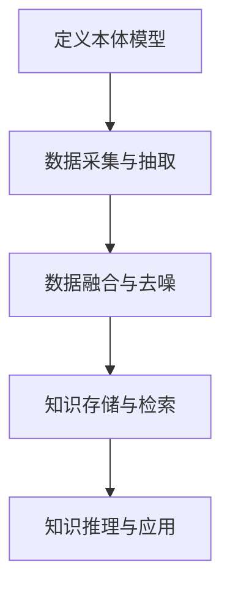

# 知识图谱(Knowledge Graph)原理与代码实战案例讲解

## 1.背景介绍

### 1.1 什么是知识图谱?

知识图谱(Knowledge Graph)是一种结构化的知识表示形式,它将现实世界中的实体(Entity)、概念(Concept)、事件(Event)、情节(Scenario)等以及它们之间的语义关系(Relation)用图的形式表示出来。知识图谱可以被看作是一个有向属性图,其中节点表示实体,边表示实体之间的关系。

### 1.2 知识图谱的应用价值

知识图谱具有很高的应用价值,可以广泛应用于搜索引擎、问答系统、推荐系统、智能助理等多个领域。搜索引擎利用知识图谱可以更好地理解用户查询意图,提高查询结果的相关性;问答系统可以基于知识图谱进行知识推理,回答复杂的问题;推荐系统利用知识图谱可以挖掘用户的潜在需求,提供更加个性化和多样化的推荐结果;智能助理可以通过知识图谱获取结构化知识,提升自然语言理解和生成能力。

### 1.3 知识图谱构建的挑战

构建高质量的知识图谱是一项艰巨的系统工程,主要面临以下几个挑战:

1. 知识获取 - 如何高效地从海量的非结构化数据(如网页、文本等)中抽取出实体、关系等知识?
2. 知识表示 - 如何设计合理的本体模型来表示各类知识?
3. 知识融合 - 如何将来自不同数据源的知识进行有效整合,消除冲突和噪音?
4. 知识推理 - 如何基于已有的知识,推导出新的知识?
5. 知识应用 - 如何将知识图谱高效地应用到实际的任务中?

## 2.核心概念与联系  

### 2.1 实体(Entity)

实体是知识图谱中最基本的组成单元,表示现实世界中的人物、地点、组织机构、事件等具体事物。每个实体都有一个唯一的标识符,以及若干属性描述其特征。

例如,在一个关于电影的知识图谱中,"肖申克的救赎"是一个电影实体,它的属性包括电影名称、上映时间、导演、主演等。

### 2.2 概念(Concept)

概念是对实体的抽象和归纳,表示实体所属的类别或领域。概念之间可以存在层次关系,形成分类体系或本体。

例如,在电影知识图谱中,"剧情片"、"悬疑片"是电影类型的概念,"人物"是一个更高层次的概念,包含了"演员"、"导演"等子概念。

### 2.3 关系(Relation)

关系用于连接实体与实体、实体与概念之间的语义联系。关系具有方向性,可以是一元关系(自反关系)、二元关系或更高阶的关系。

例如,在电影知识图谱中,"导演"是一种二元关系,连接"电影"实体与"人物"实体;"上映于"是一种二元关系,连接"电影"实体与"时间"实体。

### 2.4 知识图谱本体

知识图谱本体定义了构成知识图谱的基本元素及其之间的关系模式,是对知识的形式化表示。一个好的本体模型对于构建高质量的知识图谱至关重要。

常见的本体模型有:

- RDF(S): 基于三元组的本体模型
- OWL: 基于描述逻辑的Web本体语言
- Schema.org: 搜索引擎优化的结构化数据标准

### 2.5 知识图谱构建流程

构建知识图谱的一般流程包括:

1. 定义本体模型
2. 数据采集与抽取
3. 数据融合与去噪
4. 知识存储与检索
5. 知识推理与应用



## 3.核心算法原理具体操作步骤

### 3.1 实体识别与链接

实体识别(Named Entity Recognition, NER)是从非结构化文本中识别出命名实体(如人名、地名、机构名等)的任务。常用的NER算法有:

- 基于规则的方法
- 基于统计学习的方法(如HMM、CRF等)
- 基于深度学习的方法(如Bi-LSTM+CRF等)

实体链接(Entity Linking)则是将识别出的实体mention与知识库中的实体entries进行精确匹配,是实现知识库实体化的关键步骤。常用的实体链接算法有:

- 基于候选实体排序的方法
- 基于图的集体实体链接方法
- 基于embedding的实体链接方法

### 3.2 关系抽取

关系抽取(Relation Extraction)是从非结构化文本中识别出实体间语义关系的任务,是构建知识图谱的核心。常用的关系抽取方法有:

- 基于模式匹配的方法
- 基于统计学习的方法(如SVM、MaxEnt等)
- 基于深度学习的方法(如CNN、RNN、BERT等)

关系抽取可以分为句子级别和文档级别。文档级别的关系抽取需要利用上下文信息、语义信息等进行关系推理。

### 3.3 知识融合

由于知识来源的多样性和异质性,知识融合(Knowledge Fusion)是知识图谱构建的一个重要环节。主要包括:

- 实体对齐(Entity Alignment):将指代同一实体的不同mentions进行聚合
- 关系对齐(Relation Alignment):识别语义上等价的关系
- 去冲突(Conflict Resolution):消除不同来源知识之间的矛盾
- 知识补全(Knowledge Completion):利用已有知识推理补全缺失的知识

### 3.4 知识推理

知识推理(Knowledge Reasoning)是基于已有的知识,推导出新的知识的过程。在知识图谱中,常见的推理任务包括:

- 链接预测(Link Prediction):预测知识图谱中缺失的实体-关系-实体三元组
- 实体类型预测(Entity Type Prediction):推断实体的类型
- 查询回答(Query Answering):回答基于知识图谱的自然语言查询

常用的知识推理模型有:

- 基于规则的推理
- 基于统计模型的推理(如路径排序、TransE等)
- 基于深度学习的推理(如知识图谱嵌入等)

## 4.数学模型和公式详细讲解举例说明

### 4.1 知识图谱嵌入

知识图谱嵌入(Knowledge Graph Embedding)是将实体和关系映射到低维连续向量空间的技术,是实现知识推理和下游任务的有力工具。常见的知识图谱嵌入模型包括:

#### TransE

TransE是一种简单而有效的知识图谱嵌入模型,其基本思想是:对于一个三元组$(h, r, t)$,实体$h$和$t$的嵌入向量通过关系$r$的嵌入向量相连,即:

$$\vec{h} + \vec{r} \approx \vec{t}$$

TransE的目标是最小化如下损失函数:

$$\mathcal{L} = \sum_{(h,r,t) \in \mathcal{S}} \sum_{(h',r',t') \in \mathcal{S}^{'}}\left[ \gamma + d(\vec{h} + \vec{r}, \vec{t}) - d(\vec{h'} + \vec{r'}, \vec{t'}) \right]_{+}$$

其中$\mathcal{S}$是训练三元组集合,$\mathcal{S}^{'}$是负采样集合,$\gamma$是边际超参数,函数$d$是距离函数(如$L_1$或$L_2$范数),$[\cdot]_{+}$是正值函数。

#### TransR

TransR模型旨在解决TransE在处理多关系数据时的问题。TransR将实体嵌入映射到关系空间,然后在关系空间中进行TransE运算:

$$\vec{h}_{r} + \vec{r} \approx \vec{t}_{r}$$

其中$\vec{h}_{r}=\vec{h}W_{r}$,$\vec{t}_{r}=\vec{t}W_{r}$,$W_{r}$是关系$r$的投影矩阵。

#### RotatE

RotatE模型将关系看作是复平面上的旋转,实体是复数值,关系作用于实体时相当于对该复数进行旋转和修改模长:

$$\vec{h} \circ \vec{r} \approx \vec{t}$$

其中$\circ$是复数的循环卷积运算。RotatE的损失函数为:

$$\mathcal{L} = -\log \sigma\left(\gamma - \left\|\vec{h} \circ \vec{r} - \vec{t}\right\|\right)$$

RotatE能够很好地建模对称关系、反身关系和合成关系。

### 4.2 知识图谱完形填空

知识图谱完形填空(Knowledge Graph Completion)是指预测知识图谱中缺失的三元组$(h, r, t)$,即链接预测任务。常用的评估指标包括:

- 平均排名(Mean Rank)
- 平均倒数排名(Mean Reciprocal Rank, MRR)
- Hits@N(即前N个结果中是否包含正确答案)

评估时通常采用"filtered"设置,即将已有的正确三元组从评估列表中移除。

### 4.3 负采样

在训练知识图谱嵌入模型时,往往需要采用负采样(Negative Sampling)策略生成负例,以提高模型的判别能力。常见的负采样策略包括:

- 随机负采样(Random Negative Sampling)
- 基于类型约束的负采样(Type Constraint Negative Sampling)
- 基于度值的负采样(Degree-based Negative Sampling)

负采样策略直接影响模型的收敛性和预测性能,需要根据具体任务和数据集进行选择和调优。

## 5.项目实践:代码实例和详细解释说明

以下是一个使用PyTorch实现的TransE模型示例(基于OpenKE代码库):

```python
import torch
import torch.nn as nn
import torch.nn.functional as F

class TransE(nn.Module):
    def __init__(self, num_entities, num_relations, dim, margin=1.0):
        super(TransE, self).__init__()
        self.num_entities = num_entities
        self.num_relations = num_relations
        self.dim = dim
        self.margin = margin
        
        self.entity_embeddings = nn.Embedding(num_entities, dim)
        self.relation_embeddings = nn.Embedding(num_relations, dim)
        
        nn.init.xavier_uniform_(self.entity_embeddings.weight)
        nn.init.xavier_uniform_(self.relation_embeddings.weight)
        
    def forward(self, samples, corrupt_size):
        """
        samples: (positive_samples, negative_samples)
            positive_samples: (sampled_idx, h_idx, t_idx, r_idx)
            negative_samples: (sampled_idx, h_idx, t_idx, r_idx)
        """
        pos, neg = samples
        
        h_pos = self.entity_embeddings(pos[:, 1])
        r_pos = self.relation_embeddings(pos[:, 3])
        t_pos = self.entity_embeddings(pos[:, 2])
        
        h_neg = self.entity_embeddings(neg[:, 1])
        r_neg = self.relation_embeddings(neg[:, 3])
        t_neg = self.entity_embeddings(neg[:, 2])
        
        score_pos = F.pairwise_distance(h_pos + r_pos, t_pos, p=1)
        score_neg = F.pairwise_distance(h_neg + r_neg, t_neg, p=1)
        
        loss = F.margin_ranking_loss(score_pos, score_neg, torch.Tensor([-1]).cuda())
        
        return loss
    
    @staticmethod
    def get_negative_sampling(pos_samples, num_entities):
        """
        Negative sampling for TransE model.
        """
        batch_size = pos_samples.size(0)
        
        # Sample random negative head and tail entities
        neg_head = torch.randint(0, num_entities, (batch_size,)).cuda()
        neg_tail = torch.randint(0, num_entities, (batch_size,)).cuda()
        
        neg_samples = torch.stack([pos_samples[:, 0], neg_head, pos_samples[:, 2], pos_samples[:, 3]], dim=1)
        neg_samples = torch.cat([neg_samples, torch.stack([pos_samples[:, 0], pos_samples[:, 1], neg_tail, pos_samples[:, 3]], dim=1)], dim=0)
        
        return neg_samples
```

代码解释:

1. `TransE`继承自`nn.Module`，是TransE模型的实现。