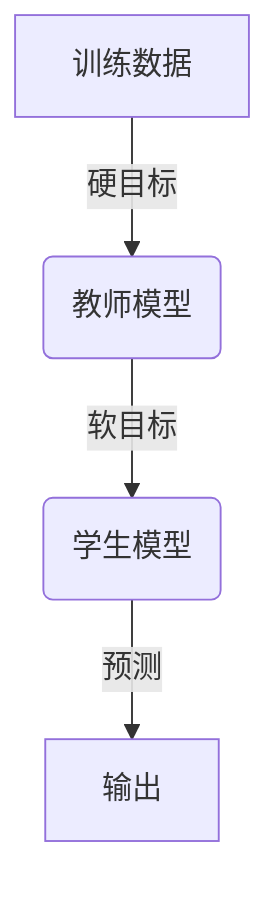

# 知识蒸馏 (Knowledge Distillation) 原理与代码实例讲解

## 1.背景介绍

### 1.1 深度神经网络的挑战

深度神经网络在计算机视觉、自然语言处理等领域取得了巨大的成功,但是训练这些大型神经网络需要大量的计算资源和能耗。例如,谷歌的BERT模型包含1.09亿个参数,在TPU上训练需要消耗大量的计算资源和能源。此外,将这些庞大的模型部署到移动设备或嵌入式系统上也面临着挑战,因为它们的内存、计算能力和电池寿命都有限。

### 1.2 知识蒸馏的概念

为了解决上述问题,知识蒸馏(Knowledge Distillation)作为一种模型压缩和加速的技术应运而生。知识蒸馏的思想是利用一个大型的教师模型(Teacher Model)来指导一个小型的学生模型(Student Model)学习,使得学生模型在保持较高精度的同时,大大减小了模型的大小和计算复杂度。

## 2.核心概念与联系  

### 2.1 软目标和硬目标

在传统的模型训练中,我们通常使用硬目标(Hard Targets),即期望模型输出与真实标签完全匹配。而在知识蒸馏中,我们引入了软目标(Soft Targets),即教师模型对每个输入样本的输出概率分布。

软目标能够提供更加细致的类内样本信息,而硬目标只能给出类别标签。通过学习教师模型的软目标,学生模型可以获得更丰富的知识,从而提高泛化能力。

### 2.2 模型压缩

知识蒸馏可以看作是一种模型压缩技术,目的是将一个大型复杂模型(教师模型)的知识迁移到一个小型高效的模型(学生模型)上。这种压缩过程可以大大减小模型的计算复杂度和内存占用,同时尽可能保持模型的精度。

### 2.3 教师-学生框架

知识蒸馏采用了教师-学生(Teacher-Student)框架。教师模型通常是一个大型的深度神经网络,经过大量数据和计算资源训练得到。而学生模型则是一个小型高效的网络,通过学习教师模型的输出来获取知识。



## 3.核心算法原理具体操作步骤

知识蒸馏的核心算法步骤如下:

1. **训练教师模型**: 使用大量的计算资源和训练数据,训练一个大型的深度神经网络作为教师模型。教师模型应具有较高的精度和泛化能力。

2. **获取教师模型的软目标**: 对于每个输入样本,让教师模型进行前向传播,获取其输出的概率分布,即软目标。软目标通常使用温度参数 $T$ 对 logits 进行缩放,公式如下:

   $$q_i = \frac{\exp(z_i/T)}{\sum_j \exp(z_j/T)}$$

   其中 $z_i$ 是教师模型对第 $i$ 类的 logits 输出, $q_i$ 是相应的软目标概率。较高的温度 $T$ 会使概率分布更加平滑。

3. **构建学生模型**: 设计一个小型高效的神经网络作为学生模型。学生模型的结构可以根据具体任务和资源约束进行调整。

4. **训练学生模型**: 使用教师模型的软目标和训练数据,训练学生模型。损失函数通常是学生模型输出与教师模型软目标之间的交叉熵,加上一个硬目标损失项(如标签的交叉熵损失),形式如下:

   $$\mathcal{L} = (1-\alpha)\mathcal{L}_\text{hard} + \alpha\mathcal{L}_\text{soft}$$

   其中 $\mathcal{L}_\text{hard}$ 是硬目标损失, $\mathcal{L}_\text{soft}$ 是软目标损失, $\alpha$ 是两者的权重系数。

5. **模型微调**: 在知识蒸馏后,可以对学生模型进行进一步的微调,以提高其在特定任务上的性能。

通过上述步骤,学生模型可以从教师模型那里学习到丰富的知识,同时大幅减小了模型的大小和计算复杂度。

## 4.数学模型和公式详细讲解举例说明

### 4.1 软目标的计算

教师模型的软目标是知识蒸馏的关键。对于一个给定的输入样本 $x$,教师模型会输出一个 logits 向量 $\mathbf{z} = (z_1, z_2, \dots, z_K)$,其中 $K$ 是类别数。然后,我们使用温度参数 $T$ 对 logits 进行缩放,得到软目标概率分布 $\mathbf{q} = (q_1, q_2, \dots, q_K)$:

$$q_i = \frac{\exp(z_i/T)}{\sum_j \exp(z_j/T)}$$

较高的温度 $T$ 会使概率分布更加平滑,从而提供更多的类内样本信息。例如,对于一张狗的图像,教师模型可能会给出如下的软目标分布:

```
T = 1:   [0.99, 0.001, 0.0001, ...]
T = 2:   [0.88, 0.06,  0.03,    ...]
T = 10:  [0.37, 0.31,  0.18,    ...]
```

可以看到,当 $T$ 增大时,概率分布变得更加平滑,第二类和第三类的概率也相对较高。这种平滑的概率分布能够为学生模型提供更丰富的知识。

### 4.2 损失函数

知识蒸馏的损失函数包括两个部分:硬目标损失和软目标损失。硬目标损失是传统的交叉熵损失,用于保证学生模型在ground-truth标签上的准确性。软目标损失则是学生模型输出与教师模型软目标之间的交叉熵,用于传递教师模型的知识。

具体地,对于一个输入样本 $x$ 和它的标签 $y$,硬目标损失为:

$$\mathcal{L}_\text{hard}(x, y) = -\log P(y|x)$$

其中 $P(y|x)$ 是学生模型对正确标签的预测概率。

软目标损失则是学生模型输出 $P(x)$ 与教师模型软目标 $Q(x)$ 之间的交叉熵:

$$\mathcal{L}_\text{soft}(x) = -\sum_i Q_i(x) \log P_i(x)$$

最终的损失函数是两者的加权和:

$$\mathcal{L} = (1-\alpha)\mathcal{L}_\text{hard} + \alpha\mathcal{L}_\text{soft}$$

其中 $\alpha$ 是一个超参数,用于平衡两个损失项的重要性。一般而言,在知识蒸馏的早期,我们会给予软目标损失较高的权重,以便学生模型能够快速学习教师模型的知识。随着训练的进行,我们会逐渐增加硬目标损失的权重,以提高学生模型在ground-truth标签上的准确性。

## 5.项目实践: 代码实例和详细解释说明

为了更好地理解知识蒸馏的原理,我们将通过一个实际的代码示例来演示如何对MNIST手写数字识别任务进行知识蒸馏。我们将使用PyTorch框架,教师模型为一个大型的卷积神经网络,学生模型为一个小型的全连接网络。

### 5.1 导入必要的库

```python
import torch
import torch.nn as nn
import torch.nn.functional as F
import torch.optim as optim
from torchvision import datasets, transforms
```

### 5.2 定义教师模型

```python
class TeacherModel(nn.Module):
    def __init__(self):
        super(TeacherModel, self).__init__()
        self.conv1 = nn.Conv2d(1, 32, 3, 1)
        self.conv2 = nn.Conv2d(32, 64, 3, 1)
        self.dropout1 = nn.Dropout2d(0.25)
        self.dropout2 = nn.Dropout2d(0.5)
        self.fc1 = nn.Linear(9216, 128)
        self.fc2 = nn.Linear(128, 10)

    def forward(self, x):
        x = self.conv1(x)
        x = F.relu(x)
        x = self.conv2(x)
        x = F.max_pool2d(x, 2)
        x = self.dropout1(x)
        x = torch.flatten(x, 1)
        x = self.fc1(x)
        x = F.relu(x)
        x = self.dropout2(x)
        x = self.fc2(x)
        output = F.log_softmax(x, dim=1)
        return output
```

### 5.3 定义学生模型

```python
class StudentModel(nn.Module):
    def __init__(self):
        super(StudentModel, self).__init__()
        self.fc1 = nn.Linear(784, 128)
        self.fc2 = nn.Linear(128, 64)
        self.fc3 = nn.Linear(64, 10)

    def forward(self, x):
        x = x.view(-1, 784)
        x = F.relu(self.fc1(x))
        x = F.relu(self.fc2(x))
        x = self.fc3(x)
        output = F.log_softmax(x, dim=1)
        return output
```

### 5.4 训练教师模型

```python
teacher_model = TeacherModel()
optimizer = optim.SGD(teacher_model.parameters(), lr=0.01, momentum=0.9)
criterion = nn.NLLLoss()

for epoch in range(10):
    train_loss = 0.0
    for batch_idx, (data, target) in enumerate(train_loader):
        optimizer.zero_grad()
        output = teacher_model(data)
        loss = criterion(output, target)
        loss.backward()
        optimizer.step()
        train_loss += loss.item()
    print(f'Epoch: {epoch} Train Loss: {train_loss / len(train_loader):.6f}')
```

### 5.5 知识蒸馏

```python
student_model = StudentModel()
optimizer = optim.SGD(student_model.parameters(), lr=0.01, momentum=0.9)
temperature = 20.0
alpha = 0.7

for epoch in range(10):
    train_loss = 0.0
    for batch_idx, (data, target) in enumerate(train_loader):
        optimizer.zero_grad()
        student_output = student_model(data)
        teacher_output = teacher_model(data)

        # 计算软目标
        teacher_prob = F.softmax(teacher_output / temperature, dim=1)

        # 计算损失函数
        hard_loss = criterion(student_output, target)
        soft_loss = nn.KLDivLoss(reduction='batchmean')(F.log_softmax(student_output / temperature, dim=1), teacher_prob)
        loss = alpha * soft_loss + (1 - alpha) * hard_loss

        loss.backward()
        optimizer.step()
        train_loss += loss.item()
    print(f'Epoch: {epoch} Train Loss: {train_loss / len(train_loader):.6f}')
```

在上述代码中,我们首先定义了教师模型和学生模型。然后,我们训练教师模型以获得较高的精度。接下来,我们进行知识蒸馏,其中包括以下几个关键步骤:

1. 使用温度参数 `temperature` 计算教师模型的软目标概率分布 `teacher_prob`。
2. 计算硬目标损失 `hard_loss` 和软目标损失 `soft_loss`。
3. 根据超参数 `alpha` 对两个损失项进行加权求和,得到最终的损失函数 `loss`。
4. 反向传播并优化学生模型的参数。

通过上述步骤,学生模型可以从教师模型那里学习到丰富的知识,同时保持较小的模型大小和计算复杂度。

## 6.实际应用场景

知识蒸馏技术在多个领域都有广泛的应用,包括:

### 6.1 移动设备和嵌入式系统

在移动设备和嵌入式系统中,内存、计算能力和电池寿命都是宝贵的资源。通过知识蒸馏,我们可以将大型的深度神经网络压缩到一个小型高效的模型,从而满足这些资源受限环境的需求。例如,谷歌在移动设备上部署语音识别和图像分类模型时,都使用了知识蒸馏技术。

### 6.2 云端服务

在云端服务中,模型的大小和计算复杂度直接影响到服务的成本和响应时间。通过