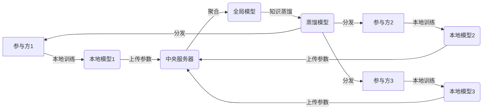

# 知识蒸馏在联邦学习中的角色

## 1.背景介绍
### 1.1 联邦学习的兴起
随着人工智能技术的快速发展,越来越多的行业开始应用机器学习和深度学习技术来解决实际问题。然而,由于数据隐私和安全的限制,很多时候不同机构之间无法直接共享数据。为了解决这一问题,联邦学习(Federated Learning)应运而生。联邦学习允许多个参与方在不共享原始数据的情况下,协同训练机器学习模型。

### 1.2 联邦学习面临的挑战  
尽管联邦学习为解决数据孤岛问题提供了一种可行的方案,但在实际应用中仍然面临诸多挑战:
1. 通信效率低下:参与方之间需要频繁交换模型参数,导致通信开销大。
2. 设备性能差异:不同参与方的硬件配置和计算能力差异较大,导致训练效率低下。
3. 数据分布不均衡:不同参与方的数据量和分布差异较大,导致模型性能不佳。

### 1.3 知识蒸馏技术的引入
为了应对联邦学习面临的挑战,研究者们开始将知识蒸馏(Knowledge Distillation)技术引入到联邦学习中。知识蒸馏最初是用于模型压缩的一种技术,其核心思想是利用教师模型(Teacher Model)的知识来指导学生模型(Student Model)的训练。通过这种方式,可以将复杂模型的知识"蒸馏"到一个更加简单和高效的模型中。

## 2.核心概念与联系
### 2.1 联邦学习
联邦学习是一种分布式机器学习范式,允许多个参与方在不共享原始数据的情况下协同训练模型。其核心思想是每个参与方在本地利用自己的数据训练模型,然后将模型参数上传到中央服务器进行聚合,得到全局模型,再将全局模型分发给各个参与方进行下一轮本地训练。通过多轮迭代,最终得到一个性能良好的全局模型。

### 2.2 知识蒸馏
知识蒸馏是一种模型压缩技术,其目标是将一个复杂的教师模型的知识转移到一个更加简单的学生模型中。具体来说,就是利用教师模型的输出作为"软目标"(Soft Target)来指导学生模型的训练。相比于传统的"硬目标"(Hard Target,即真实标签),软目标包含了更多的信息,能够更好地刻画数据的内在结构和类别之间的相似性。

### 2.3 二者的结合
将知识蒸馏应用到联邦学习中,可以从以下几个方面来改善联邦学习的性能:
1. 降低通信开销:利用知识蒸馏可以将复杂的全局模型压缩为更加简单的模型,从而减少参数量和通信开销。 
2. 缓解设备性能差异:利用知识蒸馏可以将全局模型适配到不同的设备上,从而缓解设备间的性能差异。
3. 解决数据不均衡问题:利用知识蒸馏可以将不同参与方的知识进行融合,从而缓解数据分布不均衡的问题。

下图展示了知识蒸馏在联邦学习中的应用流程:



## 3.核心算法原理具体操作步骤
联邦学习中的知识蒸馏算法主要分为以下几个步骤:

### 3.1 本地训练
每个参与方利用本地数据训练自己的模型,得到本地模型参数。这一步与标准的联邦学习一致。

### 3.2 参数上传和聚合
各个参与方将本地模型参数上传到中央服务器,服务器对这些参数进行聚合(如取平均),得到全局模型。

### 3.3 知识蒸馏
服务器利用知识蒸馏技术,将全局模型的知识提取到一个蒸馏模型中。具体来说,就是利用全局模型的输出作为软目标,蒸馏模型的输出作为学生模型,通过最小化两者的差异来训练蒸馏模型。
蒸馏过程的目标函数可以表示为:

$$
L_{distill} = \alpha L_{CE}(y, p_s) + (1-\alpha) L_{KL}(p_t, p_s)
$$

其中,$L_{CE}$是交叉熵损失,$y$是真实标签,$p_s$是学生模型的输出概率分布;$L_{KL}$是KL散度,$p_t$是教师模型的输出概率分布,$\alpha$是平衡两种损失的权重系数。

### 3.4 模型分发
服务器将蒸馏后的模型分发给各个参与方,作为下一轮本地训练的初始模型。

算法流程如下:

```
初始化:随机初始化全局模型参数
for each round t = 1, 2, ... do
    for each client k = 1, 2, ... K do in parallel
        从服务器下载最新的全局模型
        利用本地数据对全局模型进行微调,得到本地模型
        将本地模型参数上传到服务器
    end for
    服务器聚合K个本地模型,得到新的全局模型
    利用知识蒸馏技术,将全局模型蒸馏为更加简单的蒸馏模型
    将蒸馏模型分发给各个客户端
end for
```

## 4.数学模型和公式详细讲解举例说明
知识蒸馏的核心是利用教师模型的"软目标"来指导学生模型的训练。相比于传统的one-hot编码的硬目标,软目标包含了更多的信息。

具体来说,假设教师模型和学生模型的输出分别为$p_t$和$p_s$,它们都是一个$n$维的概率向量,表示样本属于每一个类别的概率。软目标是将$p_t$经过一个温度参数$T$的softmax函数处理得到:

$$
q_i = \frac{exp(z_i/T)}{\sum_j exp(z_j/T)}
$$

其中,$z_i$是教师模型输出的第$i$个元素的logit值。温度参数$T$用于控制软化的程度,当$T=1$时,软目标退化为标准的softmax函数;当$T>1$时,软目标会变得更加"软",概率分布更加平滑。

在训练过程中,学生模型的目标是最小化其输出$p_s$与软目标$q$之间的差异。通常使用KL散度来衡量这种差异:

$$
L_{KL}(q,p_s) = \sum_i q_i \log \frac{q_i}{p_{s,i}}
$$

此外,为了让学生模型也能够很好地拟合硬目标,通常还会加入一项交叉熵损失:

$$
L_{CE}(y,p_s) = -\sum_i y_i \log p_{s,i}
$$

其中,$y$是样本的真实标签的one-hot编码。

因此,知识蒸馏的总体损失函数就是两种损失的加权和:

$$
L_{distill} = \alpha L_{CE}(y, p_s) + (1-\alpha) L_{KL}(q, p_s)
$$

通过调节$\alpha$的大小,可以控制学生模型在拟合硬目标和软目标之间的权衡。

举个例子,假设一个图像分类任务有10个类别,教师模型对一个样本的输出概率为:
$p_t = [0.5, 0.2, 0.1, 0.05, 0.05, 0.02, 0.02, 0.02, 0.02, 0.02]$

如果温度参数$T=1$,那么对应的软目标就是:
$q = [0.5, 0.2, 0.1, 0.05, 0.05, 0.02, 0.02, 0.02, 0.02, 0.02]$

如果温度参数$T=2$,那么软目标变为:
$q = [0.32, 0.18, 0.12, 0.08, 0.08, 0.04, 0.04, 0.04, 0.04, 0.04]$

可以看到,增大温度参数会让概率分布变得更加平滑。学生模型的目标就是去拟合这个软化后的目标概率分布,从而学习到教师模型的"知识"。

## 5.项目实践：代码实例和详细解释说明
下面是一个利用PyTorch实现联邦学习中知识蒸馏的简单示例:

```python
import torch
import torch.nn as nn
import torch.nn.functional as F
import torch.optim as optim
from torch.utils.data import DataLoader, Dataset

# 定义教师模型
class TeacherModel(nn.Module):
    def __init__(self):
        super(TeacherModel, self).__init__()
        self.fc1 = nn.Linear(28*28, 128)
        self.fc2 = nn.Linear(128, 10)
        
    def forward(self, x):
        x = x.view(-1, 28*28)
        x = F.relu(self.fc1(x))
        x = self.fc2(x)
        return x

# 定义学生模型  
class StudentModel(nn.Module):
    def __init__(self):
        super(StudentModel, self).__init__()
        self.fc1 = nn.Linear(28*28, 64)
        self.fc2 = nn.Linear(64, 10)
        
    def forward(self, x):
        x = x.view(-1, 28*28)
        x = F.relu(self.fc1(x))
        x = self.fc2(x)
        return x

# 定义蒸馏损失函数
def distillation_loss(y, logits_s, logits_t, T, alpha):
    loss_CE = F.cross_entropy(logits_s, y)
    
    p_s = F.log_softmax(logits_s/T, dim=1)
    p_t = F.softmax(logits_t/T, dim=1)
    loss_KL = nn.KLDivLoss()(p_s, p_t) * (T**2)
    
    return alpha * loss_CE + (1-alpha) * loss_KL

# 定义联邦学习中的客户端
class Client:
    def __init__(self, dataset, idxs):
        self.dataset = dataset
        self.idxs = idxs
        self.model = StudentModel()
        
    def train(self, teacher_model, T, alpha):
        dataloader = DataLoader(DatasetSplit(self.dataset, self.idxs), batch_size=64, shuffle=True)
        optimizer = optim.Adam(self.model.parameters(), lr=0.001)
        
        for batch_idx, (data, target) in enumerate(dataloader):
            optimizer.zero_grad()
            logits_s = self.model(data)
            with torch.no_grad():
                logits_t = teacher_model(data)
            loss = distillation_loss(target, logits_s, logits_t, T, alpha)
            loss.backward()
            optimizer.step()
            
        return self.model.state_dict()

# 定义服务器端的聚合函数
def aggregate(client_weights):
    global_weights = client_weights[0]
    for key in global_weights.keys():
        for i in range(1, len(client_weights)):
            global_weights[key] += client_weights[i][key]
        global_weights[key] = torch.div(global_weights[key], len(client_weights))
    return global_weights

# 定义数据集分割
class DatasetSplit(Dataset):
    def __init__(self, dataset, idxs):
        self.dataset = dataset
        self.idxs = list(idxs)

    def __len__(self):
        return len(self.idxs)

    def __getitem__(self, item):
        image, label = self.dataset[self.idxs[item]]
        return image, label

# 联邦学习主流程
def main():
    # 加载数据集,这里以MNIST为例
    transform = transforms.Compose([transforms.ToTensor(), transforms.Normalize((0.1307,), (0.3081,))])
    dataset_train = datasets.MNIST('./data', train=True, download=True, transform=transform)
    
    # 初始化客户端
    clients = []
    for i in range(10):
        idxs = range(i*6000, (i+1)*6000)
        clients.append(Client(dataset_train, idxs))
        
    # 初始化教师模型和温度参数
    teacher_model = TeacherModel()
    T = 5
    alpha = 0.5
    
    #