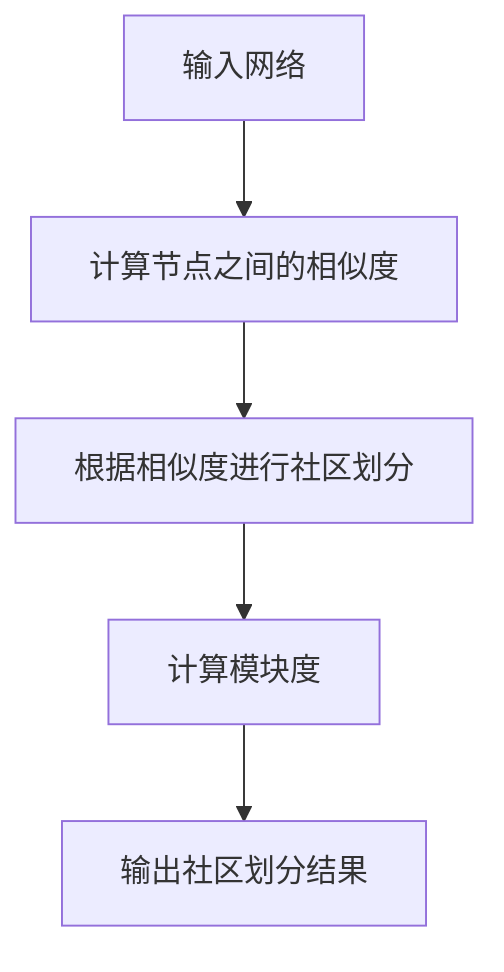

## 1.背景介绍

社区发现是复杂网络分析的重要任务之一，它旨在发现网络中的紧密连接的节点集合，这些集合被称为社区。在社交网络、生物网络、传播网络等许多领域，社区发现都有着广泛的应用。社区发现的目标是寻找网络中的社区结构，即找到一种网络划分方法，使得同一社区内的节点之间连接紧密，不同社区的节点之间连接稀疏。这种划分可以帮助我们理解网络的组织结构，揭示网络的功能模块，预测节点的属性和行为，以及指导网络设计和优化。

## 2.核心概念与联系

社区发现的核心概念包括社区、模块度、社区划分等。

- 社区：在网络中，社区是一组节点，它们之间的连接比与网络中其他节点的连接更紧密。社区的存在反映了网络的聚集性质，即网络中存在一些节点集合，它们之间的连接比较密集，而与其他节点的连接比较稀疏。

- 模块度：模块度是衡量网络划分质量的一个重要指标，它反映了社区内部的连接密度和社区之间的连接稀疏度。模块度越大，说明社区划分的质量越高。

- 社区划分：社区划分是将网络的节点划分为若干个社区，使得同一社区内的节点之间连接紧密，不同社区的节点之间连接稀疏。

社区发现的基本过程可以用以下的 Mermaid 流程图表示：



## 3.核心算法原理具体操作步骤

社区发现的核心算法包括基于模块度优化的算法、基于标签传播的算法、基于动态模型的算法等。这里我们以基于模块度优化的算法为例，介绍其具体的操作步骤。

1. 初始化：将每个节点作为一个社区，计算网络的模块度。

2. 社区合并：遍历所有的社区对，计算合并每对社区后的模块度增益，选择模块度增益最大的社区对进行合并。

3. 更新模块度：根据合并后的社区划分，更新网络的模块度。

4. 判断终止条件：如果模块度不再增加或增加的幅度小于预设的阈值，算法终止；否则，返回第2步。

## 4.数学模型和公式详细讲解举例说明

模块度是衡量社区划分质量的一个重要指标，其定义如下：

$$ Q = \frac{1}{2m} \sum_{i,j} (A_{ij} - \frac{k_i k_j}{2m}) \delta(c_i, c_j) $$

其中，$m$ 是网络的边数，$A_{ij}$ 是节点 $i$ 和节点 $j$ 之间的连接权重，$k_i$ 和 $k_j$ 分别是节点 $i$ 和节点 $j$ 的度，$c_i$ 和 $c_j$ 分别是节点 $i$ 和节点 $j$ 所在的社区，$\delta(c_i, c_j)$ 是一个指示函数，当 $c_i = c_j$ 时取值为1，否则取值为0。

模块度反映了社区内部的连接密度和社区之间的连接稀疏度，模块度越大，说明社区划分的质量越高。

## 5.项目实践：代码实例和详细解释说明

下面我们以Python的networkx库为例，介绍如何进行社区发现。

首先，我们需要创建一个网络，并添加一些边。

```python
import networkx as nx
G = nx.Graph()
G.add_edges_from([(1, 2), (1, 3), (2, 3), (3, 4), (4, 5), (4, 6), (5, 6)])
```

然后，我们可以使用networkx提供的社区发现算法进行社区划分。

```python
from networkx.algorithms import community
communities = community.greedy_modularity_communities(G)
for community in communities:
    print(community)
```

这段代码将输出网络的社区划分结果，每个社区是一个节点集合。

## 6.实际应用场景

社区发现在许多领域都有广泛的应用，例如：

- 社交网络分析：通过社区发现，我们可以找到社交网络中的兴趣群体，进行精准的信息推荐和广告投放。

- 生物网络分析：通过社区发现，我们可以找到生物网络中的功能模块，理解生物系统的组织结构和功能机制。

- 传播网络分析：通过社区发现，我们可以找到传播网络中的关键节点和传播路径，有效地控制信息的传播。

## 7.工具和资源推荐

社区发现的工具和资源主要包括以下几类：

- 网络分析库：如Python的networkx库、C++的igraph库等，它们提供了丰富的网络分析算法，包括社区发现、网络度量计算、网络可视化等功能。

- 数据集：如Stanford Large Network Dataset Collection、UCI Network Data Repository等，它们提供了大量的真实网络数据，可以用于社区发现的实验和研究。

- 教程和书籍：如《Networks, Crowds, and Markets: Reasoning About a Highly Connected World》、《Network Science》等，它们详细介绍了网络分析的基本概念、主要方法和典型应用。

## 8.总结：未来发展趋势与挑战

社区发现是一个活跃的研究领域，它面临着许多挑战和机遇。

- 挑战：随着网络规模的增大和网络动态性的增强，社区发现的计算复杂度和实时性要求越来越高。此外，如何定义和评价社区，如何解决社区发现的不确定性和稳定性问题，也是需要深入研究的问题。

- 机遇：社区发现在许多领域都有广泛的应用，它可以帮助我们理解网络的组织结构，揭示网络的功能模块，预测节点的属性和行为，以及指导网络设计和优化。随着网络科学、数据科学、人工智能等领域的发展，社区发现将有更多的应用场景和研究方向。

## 9.附录：常见问题与解答

1. 什么是社区？

   在网络中，社区是一组节点，它们之间的连接比与网络中其他节点的连接更紧密。社区的存在反映了网络的聚集性质，即网络中存在一些节点集合，它们之间的连接比较密集，而与其他节点的连接比较稀疏。

2. 什么是模块度？

   模块度是衡量网络划分质量的一个重要指标，它反映了社区内部的连接密度和社区之间的连接稀疏度。模块度越大，说明社区划分的质量越高。

3. 如何进行社区发现？

   社区发现的基本过程包括计算节点之间的相似度、根据相似度进行社区划分、计算模块度等步骤。社区发现的核心算法包括基于模块度优化的算法、基于标签传播的算法、基于动态模型的算法等。

作者：禅与计算机程序设计艺术 / Zen and the Art of Computer Programming