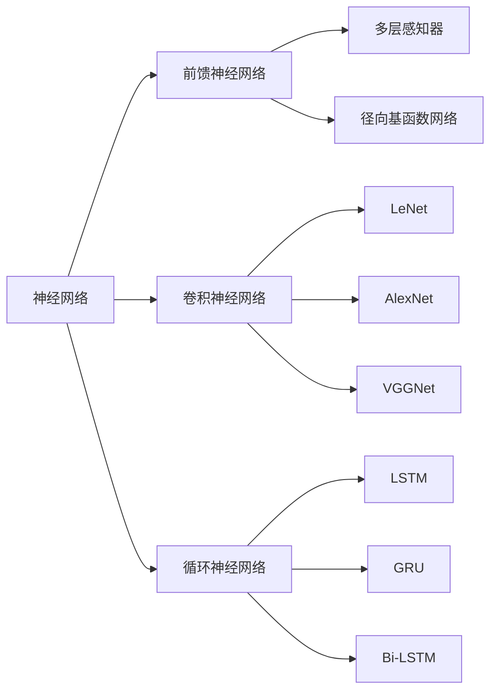

# 神经网络与社会影响：科技如何塑造未来

## 1. 背景介绍
### 1.1 人工智能的发展历程
#### 1.1.1 早期人工智能的探索
#### 1.1.2 机器学习的兴起
#### 1.1.3 深度学习的突破

### 1.2 神经网络技术的崛起
#### 1.2.1 神经网络的起源与发展
#### 1.2.2 神经网络的应用领域
#### 1.2.3 神经网络的社会影响

### 1.3 科技发展与社会变革
#### 1.3.1 科技进步推动社会发展
#### 1.3.2 科技革命带来的机遇与挑战
#### 1.3.3 科技伦理与社会责任

## 2. 核心概念与联系
### 2.1 神经网络的基本概念
#### 2.1.1 神经元模型
#### 2.1.2 激活函数
#### 2.1.3 网络结构

### 2.2 神经网络的学习机制
#### 2.2.1 监督学习
#### 2.2.2 非监督学习  
#### 2.2.3 强化学习

### 2.3 神经网络与其他学科的联系
#### 2.3.1 神经科学启发
#### 2.3.2 统计学基础
#### 2.3.3 优化理论支撑



## 3. 核心算法原理具体操作步骤
### 3.1 反向传播算法
#### 3.1.1 前向传播
#### 3.1.2 损失函数
#### 3.1.3 反向传播
#### 3.1.4 参数更新

### 3.2 卷积神经网络
#### 3.2.1 卷积层
#### 3.2.2 池化层  
#### 3.2.3 全连接层
#### 3.2.4 CNN架构设计

### 3.3 循环神经网络
#### 3.3.1 RNN基本结构
#### 3.3.2 LSTM单元
#### 3.3.3 GRU单元
#### 3.3.4 双向RNN

## 4. 数学模型和公式详细讲解举例说明
### 4.1 感知机模型
感知机是神经网络的基础，它接收多个输入信号，产生单个二值输出。数学模型如下：

$$
y = f(\sum_{i=1}^n w_i x_i + b)
$$

其中，$x_i$ 是输入信号，$w_i$ 是权重，$b$ 是偏置，$f$ 是激活函数，常用的有 Sigmoid 函数：

$$
f(x) = \frac{1}{1 + e^{-x}}
$$

### 4.2 损失函数
神经网络通过最小化损失函数来学习最优参数。常用的损失函数有均方误差（MSE）和交叉熵损失（Cross-entropy）。

MSE 损失函数：

$$
L(y, \hat{y}) = \frac{1}{n} \sum_{i=1}^n (y_i - \hat{y}_i)^2
$$

交叉熵损失函数：

$$
L(y, \hat{y}) = -\sum_{i=1}^n y_i \log(\hat{y}_i)
$$

其中，$y$ 是真实标签，$\hat{y}$ 是预测值。

### 4.3 优化算法
神经网络通过优化算法来最小化损失函数，更新网络参数。常用的优化算法有梯度下降法（GD）、随机梯度下降法（SGD）和自适应矩估计（Adam）。

GD 算法：

$$
\theta := \theta - \eta \cdot \nabla_\theta J(\theta)
$$

SGD 算法：

$$
\theta := \theta - \eta \cdot \nabla_\theta J(\theta; x^{(i)}, y^{(i)})
$$

Adam 算法：

$$
\begin{aligned}
m_t &:= \beta_1 m_{t-1} + (1 - \beta_1) g_t \\
v_t &:= \beta_2 v_{t-1} + (1 - \beta_2) g_t^2 \\
\hat{m}_t &:= \frac{m_t}{1 - \beta_1^t} \\
\hat{v}_t &:= \frac{v_t}{1 - \beta_2^t} \\
\theta_t &:= \theta_{t-1} - \frac{\eta}{\sqrt{\hat{v}_t} + \epsilon} \hat{m}_t
\end{aligned}
$$

其中，$\theta$ 是网络参数，$\eta$ 是学习率，$g_t$ 是梯度，$m_t$ 和 $v_t$ 分别是梯度的一阶矩和二阶矩估计，$\beta_1$ 和 $\beta_2$ 是衰减率，$\epsilon$ 是平滑项。

## 5. 项目实践：代码实例和详细解释说明
### 5.1 手写数字识别
利用 MNIST 数据集，构建一个简单的多层感知器（MLP）神经网络，实现手写数字识别。

```python
import numpy as np
from keras.datasets import mnist
from keras.models import Sequential
from keras.layers import Dense
from keras.utils import to_categorical

# 加载 MNIST 数据集
(train_images, train_labels), (test_images, test_labels) = mnist.load_data()

# 数据预处理
train_images = train_images.reshape((60000, 28 * 28))
train_images = train_images.astype('float32') / 255
test_images = test_images.reshape((10000, 28 * 28))
test_images = test_images.astype('float32') / 255
train_labels = to_categorical(train_labels)
test_labels = to_categorical(test_labels)

# 构建 MLP 模型
model = Sequential()
model.add(Dense(512, activation='relu', input_shape=(28 * 28,)))
model.add(Dense(10, activation='softmax'))

# 编译模型
model.compile(optimizer='rmsprop',
              loss='categorical_crossentropy',
              metrics=['accuracy'])

# 训练模型
model.fit(train_images, train_labels, epochs=5, batch_size=128)

# 评估模型
test_loss, test_acc = model.evaluate(test_images, test_labels)
print('Test accuracy:', test_acc)
```

代码解释：
1. 加载 MNIST 数据集，包含 60,000 个训练样本和 10,000 个测试样本。
2. 对数据进行预处理，将图像像素值归一化到 [0, 1] 范围，并将标签转换为独热编码。
3. 构建一个简单的 MLP 模型，包含一个隐藏层（512 个神经元）和一个输出层（10 个神经元）。
4. 编译模型，指定优化器、损失函数和评估指标。
5. 训练模型，设置训练轮数和批量大小。
6. 在测试集上评估模型性能，输出测试准确率。

### 5.2 情感分析
利用 IMDB 电影评论数据集，构建一个基于 LSTM 的情感分析模型，判断评论的情感倾向（正面或负面）。

```python
from keras.datasets import imdb
from keras.models import Sequential
from keras.layers import Embedding, LSTM, Dense
from keras.preprocessing import sequence

max_features = 10000
maxlen = 500
batch_size = 32

# 加载 IMDB 数据集
(x_train, y_train), (x_test, y_test) = imdb.load_data(num_words=max_features)

# 数据预处理
x_train = sequence.pad_sequences(x_train, maxlen=maxlen)
x_test = sequence.pad_sequences(x_test, maxlen=maxlen)

# 构建 LSTM 模型
model = Sequential()
model.add(Embedding(max_features, 32))
model.add(LSTM(32))
model.add(Dense(1, activation='sigmoid'))

# 编译模型
model.compile(optimizer='rmsprop',
              loss='binary_crossentropy',
              metrics=['acc'])

# 训练模型
model.fit(x_train, y_train,
          epochs=10,
          batch_size=batch_size,
          validation_data=(x_test, y_test))

# 评估模型
score = model.evaluate(x_test, y_test, batch_size=batch_size)
print('Test loss:', score[0])
print('Test accuracy:', score[1])
```

代码解释：
1. 加载 IMDB 数据集，包含 25,000 个训练评论和 25,000 个测试评论。
2. 对数据进行预处理，将评论序列化并填充到固定长度。
3. 构建一个基于 LSTM 的情感分析模型，包含词嵌入层、LSTM 层和全连接输出层。
4. 编译模型，指定优化器、损失函数和评估指标。
5. 训练模型，设置训练轮数、批量大小和验证数据。
6. 在测试集上评估模型性能，输出测试损失和准确率。

## 6. 实际应用场景
### 6.1 计算机视觉
#### 6.1.1 图像分类
#### 6.1.2 目标检测
#### 6.1.3 语义分割
#### 6.1.4 人脸识别

### 6.2 自然语言处理
#### 6.2.1 文本分类
#### 6.2.2 情感分析
#### 6.2.3 机器翻译
#### 6.2.4 命名实体识别

### 6.3 推荐系统
#### 6.3.1 协同过滤
#### 6.3.2 基于内容的推荐
#### 6.3.3 混合推荐

### 6.4 医疗健康
#### 6.4.1 医学影像分析
#### 6.4.2 药物发现
#### 6.4.3 疾病诊断与预测

## 7. 工具和资源推荐
### 7.1 深度学习框架
#### 7.1.1 TensorFlow
#### 7.1.2 PyTorch
#### 7.1.3 Keras

### 7.2 数据集资源
#### 7.2.1 ImageNet
#### 7.2.2 COCO
#### 7.2.3 WikiText
#### 7.2.4 UCI 机器学习库

### 7.3 学习资料
#### 7.3.1 在线课程
#### 7.3.2 教材书籍
#### 7.3.3 研究论文
#### 7.3.4 开源项目

## 8. 总结：未来发展趋势与挑战
### 8.1 神经网络的发展趋势
#### 8.1.1 模型架构创新
#### 8.1.2 训练策略优化
#### 8.1.3 硬件加速技术

### 8.2 社会影响与挑战
#### 8.2.1 就业结构变革
#### 8.2.2 隐私与安全问题
#### 8.2.3 算法公平性
#### 8.2.4 人工智能治理

### 8.3 未来展望
#### 8.3.1 人机协作
#### 8.3.2 普惠人工智能
#### 8.3.3 可解释性与可信赖性
#### 8.3.4 跨领域融合创新

## 9. 附录：常见问题与解答
### 9.1 神经网络与传统机器学习方法的区别？
### 9.2 如何选择合适的神经网络架构？
### 9.3 训练神经网络时常见的问题和解决方法？
### 9.4 神经网络的可解释性问题如何解决？
### 9.5 如何平衡神经网络的性能和计算效率？

作者：禅与计算机程序设计艺术 / Zen and the Art of Computer Programming