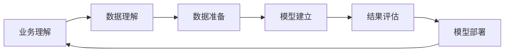

# 第八章：挖掘数据背后的故事：数据分析技巧

## 1. 背景介绍
### 1.1 大数据时代的数据分析
#### 1.1.1 海量数据的挑战与机遇  
#### 1.1.2 数据分析在各行各业的应用
#### 1.1.3 数据分析师的角色与职责

### 1.2 数据分析的目标与价值
#### 1.2.1 洞察隐藏在数据背后的模式与趋势
#### 1.2.2 数据驱动决策与业务优化
#### 1.2.3 数据分析助力企业创新发展

## 2. 核心概念与联系
### 2.1 数据分析的基本概念
#### 2.1.1 数据类型与数据结构
#### 2.1.2 数据预处理与数据清洗 
#### 2.1.3 特征工程与特征选择

### 2.2 数据分析的关键步骤  
#### 2.2.1 问题定义与分析目标确定
#### 2.2.2 数据采集与数据整合
#### 2.2.3 探索性数据分析(EDA)
#### 2.2.4 数据建模与算法选择
#### 2.2.5 模型评估与结果解释

### 2.3 数据分析思维与方法论
#### 2.3.1 数据分析的系统性思维 
#### 2.3.2 数据分析的创新性思维
#### 2.3.3 CRISP-DM方法论



## 3. 核心算法原理与具体操作步骤
### 3.1 数据预处理技术
#### 3.1.1 数据清洗与噪声处理
##### 3.1.1.1 缺失值处理
##### 3.1.1.2 异常值检测与处理
##### 3.1.1.3 数据去重与数据规范化

#### 3.1.2 数据集成与数据变换  
##### 3.1.2.1 数据合并与数据连接
##### 3.1.2.2 数据聚合与数据透视
##### 3.1.2.3 数据编码与哑变量处理

### 3.2 特征工程技术
#### 3.2.1 特征构建与特征提取
##### 3.2.1.1 衍生特征构建
##### 3.2.1.2 领域知识驱动的特征构建 
##### 3.2.1.3 自动特征提取

#### 3.2.2 特征选择与降维
##### 3.2.2.1 过滤法特征选择
##### 3.2.2.2 包裹法特征选择
##### 3.2.2.3 嵌入法特征选择
##### 3.2.2.4 PCA降维

### 3.3 数据建模与机器学习算法
#### 3.3.1 监督学习算法
##### 3.3.1.1 线性回归与逻辑回归
##### 3.3.1.2 决策树与随机森林
##### 3.3.1.3 支持向量机
##### 3.3.1.4 神经网络与深度学习

#### 3.3.2 无监督学习算法 
##### 3.3.2.1 K-means聚类
##### 3.3.2.2 层次聚类
##### 3.3.2.3 DBSCAN密度聚类
##### 3.3.2.4 关联规则挖掘

#### 3.3.3 模型评估与优化
##### 3.3.3.1 交叉验证
##### 3.3.3.2 网格搜索与随机搜索 
##### 3.3.3.3 学习曲线与验证曲线
##### 3.3.3.4 模型融合与集成学习

## 4. 数学模型和公式详细讲解举例说明
### 4.1 线性回归模型
线性回归是一种常用的有监督学习算法,它通过拟合一个线性模型来建立特征与目标变量之间的关系。给定一组训练数据 $\{(x_1,y_1),...,(x_n,y_n)\}$,其中 $x_i \in \mathbb{R}^d$ 是第 $i$ 个样本的特征向量,$y_i \in \mathbb{R}$ 是对应的目标值。线性回归的目标是学习一个线性函数:

$$f(x) = w^Tx + b$$

其中 $w \in \mathbb{R}^d$ 是权重向量,$b \in \mathbb{R}$ 是偏置项。通过最小化均方误差损失函数来求解最优的 $w$ 和 $b$:

$$\min_{w,b} \frac{1}{n} \sum_{i=1}^n (f(x_i) - y_i)^2$$

求解该优化问题可以使用梯度下降法,迭代更新 $w$ 和 $b$ 直至收敛。

举例说明:假设我们要预测房价,已知房屋面积(平方米)和房价(万元)的一组数据:

| 面积 | 100 | 120 | 150 | 200 | 250 |
|---|---|---|---|---|---|
| 房价 | 100 | 120 | 150 | 180 | 200 |

我们可以用线性回归模型来拟合面积和房价的关系:

$$price = w * area + b$$

通过最小化均方误差损失函数,求得最优的 $w$ 和 $b$,得到拟合的线性模型为:

$$price = 0.76 * area + 24$$

该模型可以用来预测新房屋的价格。例如,一个面积为180平米的房子,预测价格为:

$$price = 0.76 * 180 + 24 = 160.8$$

即约为160.8万元。这就是用线性回归模型进行预测的简单示例。

### 4.2 逻辑回归模型
逻辑回归是一种常用的分类算法,它将线性回归的输出结果转化为一个概率值,然后根据概率值来预测样本的类别。在二分类问题中,逻辑回归模型的假设函数为:

$$h_{\theta}(x) = \frac{1}{1+e^{-\theta^Tx}}$$

其中 $\theta$ 是待学习的参数向量。对于给定的样本 $x$,该函数输出 $x$ 为正例的概率。

逻辑回归通过最大化似然函数来求解最优参数。对于二分类问题,似然函数为:

$$L(\theta) = \prod_{i=1}^n (h_{\theta}(x^{(i)}))^{y^{(i)}} (1-h_{\theta}(x^{(i)}))^{1-y^{(i)}}$$

其中 $y^{(i)} \in \{0,1\}$ 是第 $i$ 个样本的真实标签。最大化 $L(\theta)$ 等价于最小化负对数似然损失函数:

$$J(\theta) = -\frac{1}{n} \sum_{i=1}^n [y^{(i)} \log h_{\theta}(x^{(i)}) + (1-y^{(i)}) \log (1-h_{\theta}(x^{(i)}))]$$

通过梯度下降法求解最小化 $J(\theta)$ 的 $\theta$ 即可得到逻辑回归模型。

举例说明:假设我们要预测一个学生是否被大学录取,已知学生的考试成绩和录取结果的一组数据:

| 考试成绩 | 85 | 78 | 92 | 68 | 87 | 79 | 72 | 95 | 66 | 83 |
|---|---|---|---|---|---|---|---|---|---|---|
| 录取结果 | 1 | 0 | 1 | 0 | 1 | 0 | 0 | 1 | 0 | 1 |

我们用逻辑回归模型来预测录取结果,模型为:

$$h_{\theta}(x) = \frac{1}{1+e^{-(\theta_0+\theta_1x)}}$$

其中 $x$ 为考试成绩。通过最小化负对数似然损失函数,求得 $\theta_0=−13, \theta_1=0.18$。则逻辑回归模型为:

$$h_{\theta}(x) = \frac{1}{1+e^{-(-13+0.18x)}}$$

该模型可以用来预测新学生的录取概率。例如,一个考试成绩为90分的学生,被录取的概率为:

$$h_{\theta}(90) = \frac{1}{1+e^{-(-13+0.18*90)}} = 0.82$$

即有82%的概率被录取。这就是用逻辑回归模型进行分类预测的简单示例。

## 5. 项目实践：代码实例和详细解释说明
下面以Python语言为例,演示如何使用Scikit-learn库实现线性回归和逻辑回归模型。

### 5.1 线性回归代码实例

```python
from sklearn.linear_model import LinearRegression
from sklearn.model_selection import train_test_split

# 准备数据
X = [[100], [120], [150], [200], [250]]  
y = [100, 120, 150, 180, 200]

# 划分训练集和测试集
X_train, X_test, y_train, y_test = train_test_split(X, y, test_size=0.2, random_state=42)

# 创建线性回归模型
model = LinearRegression()

# 训练模型
model.fit(X_train, y_train)

# 预测测试集
y_pred = model.predict(X_test)

# 输出模型参数
print("Coefficients:", model.coef_)  
print("Intercept:", model.intercept_)

# 评估模型
print("Mean squared error: %.2f" % mean_squared_error(y_test, y_pred))
print("Coefficient of determination: %.2f" % r2_score(y_test, y_pred))
```

代码说明:

1. 导入所需的库,包括LinearRegression用于线性回归,train_test_split用于划分训练集和测试集。
2. 准备数据,X为房屋面积,y为对应的房价。
3. 使用train_test_split划分训练集和测试集,test_size指定测试集比例,random_state指定随机种子以保证可复现性。
4. 创建LinearRegression模型对象。
5. 使用fit方法在训练集上训练模型。
6. 使用predict方法在测试集上进行预测。
7. 输出模型学习到的参数,包括系数和截距项。
8. 使用mean_squared_error和r2_score评估模型在测试集上的性能。

### 5.2 逻辑回归代码实例

```python
from sklearn.linear_model import LogisticRegression
from sklearn.model_selection import train_test_split
from sklearn.metrics import accuracy_score

# 准备数据
X = [[85], [78], [92], [68], [87], [79], [72], [95], [66], [83]]
y = [1, 0, 1, 0, 1, 0, 0, 1, 0, 1]

# 划分训练集和测试集 
X_train, X_test, y_train, y_test = train_test_split(X, y, test_size=0.2, random_state=42)

# 创建逻辑回归模型
model = LogisticRegression()

# 训练模型
model.fit(X_train, y_train)

# 预测测试集
y_pred = model.predict(X_test)

# 输出模型参数
print("Coefficients:", model.coef_)
print("Intercept:", model.intercept_)

# 评估模型
print("Accuracy: %.2f" % accuracy_score(y_test, y_pred))
```

代码说明:

1. 导入所需的库,包括LogisticRegression用于逻辑回归,accuracy_score用于计算准确率。
2. 准备数据,X为考试成绩,y为对应的录取结果。
3. 划分训练集和测试集。
4. 创建LogisticRegression模型对象。
5. 在训练集上训练模型。
6. 在测试集上进行预测。
7. 输出模型参数。
8. 使用accuracy_score评估模型在测试集上的分类准确率。

以上代码演示了如何使用Scikit-learn库快速实现线性回归和逻辑回归模型,并在给定数据集上进行训练、预测和评估的完整过程。通过调整模型超参数、特征工程等可以进一步优化模型性能。

## 6. 实际应用场景
数据分析技术在各行各业都有广泛应用,下面列举几个典型场景:

### 6.1 客户流失预测
电信、银行等行业常面临客户流失问题。通过收集客户的各项属性数据,如账单、通话记录、交易频率等,建立分类模型预测客户是否可能流失。提前识别高风险客户,有助于开展针对性的营销挽留。

### 6.2 产品推荐
电商平台、视频网站等通过分析用户的历史行为数据,构建推荐系统,为用户个性化推荐商