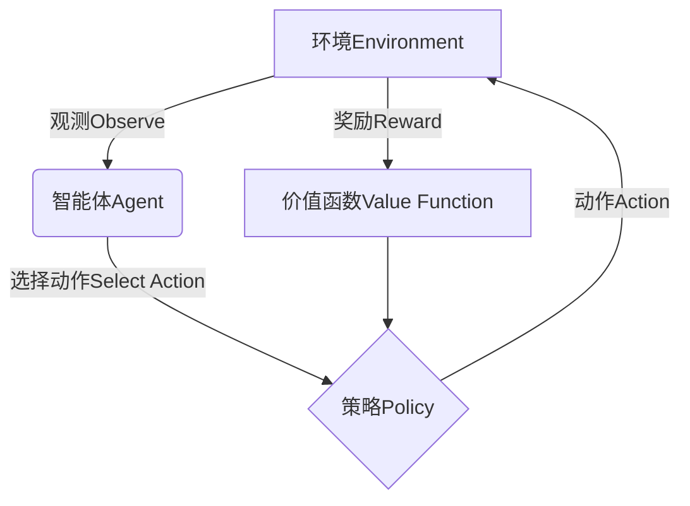

# **策略梯度算法在农业智能决策中的应用**

## 1.背景介绍

### 1.1 农业生产中的挑战

农业是人类赖以生存的基础产业,对于确保粮食安全和可持续发展至关重要。然而,农业生产面临诸多挑战,例如气候变化、土地资源degradation、病虫害等。这些挑战导致农作物产量和质量的波动,给农民的收入带来巨大风险。

### 1.2 智能决策系统的需求

为了应对上述挑战,提高农业生产的效率和可持续性,亟需引入智能决策系统来辅助农民做出明智的决策。传统的经验主导的决策方式已难以适应复杂多变的环境,因此需要利用人工智能技术构建智能化决策支持系统。

### 1.3 策略梯度算法在智能决策中的作用

策略梯度算法是强化学习领域的一种重要算法,它可以直接对策略进行优化,从而学习到最优策略。由于农业决策过程具有连续控制、高维状态空间等特点,策略梯度算法在该领域具有天然的优势和广阔的应用前景。

## 2.核心概念与联系

### 2.1 强化学习概述

强化学习是机器学习的一个重要分支,它研究如何基于环境反馈来学习最优策略,以最大化长期累积奖励。它包括四个核心要素:

- 环境(Environment)
- 状态(State) 
- 动作(Action)
- 奖励(Reward)

智能体与环境进行交互,在每个时刻观测当前状态,根据策略选择动作,环境转移到新状态并给出对应奖励。目标是学习一个最优策略,使长期累积奖励最大化。



### 2.2 策略梯度算法概述

策略梯度算法是强化学习中直接对策略进行优化的一类算法。它通过计算策略相对于奖励的梯度,并沿着梯度方向更新策略参数,从而找到最优策略。

策略梯度算法的优点是:

1. 可直接对连续控制问题进行优化
2. 可处理高维状态空间
3. 收敛性理论保证

其核心思想是使用随机梯度上升法来最大化期望奖励:

$$J(\theta) = \mathbb{E}_{\pi_\theta}[R] = \sum_s d^\pi(s) \sum_a \pi_\theta(a|s)R(s,a)$$

其中$\theta$为策略参数,$\pi_\theta$为当前策略,$d^\pi(s)$为在策略$\pi$下状态$s$的稳态分布概率,$R(s,a)$为在状态$s$执行动作$a$获得的奖励。

### 2.3 策略梯度算法在农业决策中的应用

农业决策往往涉及连续控制(如灌溉量、施肥量等)和高维状态空间(气象、土壤、作物生长等多种因素),正是策略梯度算法的有利应用场景。通过构建强化学习环境,设计合理的状态、动作和奖励机制,利用策略梯度算法可以学习得到最优的农业决策策略,从而指导农民实施精准高效的农业生产实践。

## 3.核心算法原理具体操作步骤

策略梯度算法的核心在于如何有效计算策略梯度,并基于梯度信息对策略参数进行更新。具体操作步骤如下:

1. **初始化策略参数**

   首先需要初始化策略参数$\theta$,通常使用小的随机值或预训练的参数值。

2. **采集轨迹(Trajectory)**

   根据当前策略$\pi_\theta$在环境中采集一批状态-动作-奖励的轨迹数据$\{(s_t, a_t, r_t)\}_{t=1}^T$。

3. **计算策略梯度估计**

   利用采集到的轨迹数据,计算策略梯度的无偏估计$\hat{g}$:

   $$\hat{g} = \frac{1}{T}\sum_{t=1}^T\nabla_\theta\log\pi_\theta(a_t|s_t)R_t$$

   其中$R_t$为从时刻$t$开始的累积未来奖励,可使用各种方法估计,如蒙特卡罗返回(Monte-Carlo Return)、时序差分(Temporal Difference)等。

4. **梯度上升更新策略参数**

   使用某种优化算法(如随机梯度上升SGD),沿着梯度方向更新策略参数:

   $$\theta \leftarrow \theta + \alpha\hat{g}$$

   其中$\alpha$为学习率。

5. **重复步骤2-4**

   重复执行采集轨迹、计算梯度、更新参数的过程,直至策略收敛或达到预期性能。

需要注意的是,为了减小梯度估计的方差,提高算法稳定性,通常会采用各种方差减小技术,如基线(Baseline)、优势估计(Advantage Estimation)等。

## 4.数学模型和公式详细讲解举例说明

### 4.1 策略梯度定理

策略梯度算法的理论基础是著名的"策略梯度定理"(Policy Gradient Theorem),它建立了策略梯度与价值函数梯度之间的关系:

$$\nabla_\theta J(\theta) = \mathbb{E}_{\pi_\theta}[\nabla_\theta\log\pi_\theta(a|s)Q^{\pi_\theta}(s,a)]$$

其中$Q^{\pi_\theta}(s,a)$为在策略$\pi_\theta$下执行动作$a$从状态$s$开始的长期累积奖励。该定理说明,只要我们能够估计出$Q^{\pi_\theta}(s,a)$,就可以计算出期望奖励的无偏梯度估计,并沿着梯度方向更新策略参数,从而找到最优策略。

### 4.2 蒙特卡罗策略梯度算法(REINFORCE)

REINFORCE算法是最基本的策略梯度算法,它使用蒙特卡罗返回(Monte-Carlo Return)来无偏估计$Q^{\pi_\theta}(s,a)$。对于一个轨迹$\{(s_t, a_t, r_t)\}_{t=1}^T$,蒙特卡罗返回定义为:

$$G_t = \sum_{k=t}^T\gamma^{k-t}r_k$$

其中$\gamma\in(0,1]$为折现因子。则策略梯度的无偏估计为:

$$\hat{g} = \frac{1}{T}\sum_{t=1}^T\nabla_\theta\log\pi_\theta(a_t|s_t)G_t$$

REINFORCE算法虽然简单,但存在高方差问题,因此在实践中通常需要配合基线(Baseline)或其他方差减小技术使用。

### 4.3 Actor-Critic算法

为了进一步减小策略梯度估计的方差,我们可以使用Actor-Critic架构。Actor指策略模型,用于生成动作;Critic指价值函数模型,用于评估动作的质量。

具体来说,Critic模型学习状态价值函数$V^{\pi_\theta}(s)$或动作价值函数$Q^{\pi_\theta}(s,a)$,并将其作为基线减小方差:

$$\hat{g} = \frac{1}{T}\sum_{t=1}^T\nabla_\theta\log\pi_\theta(a_t|s_t)(G_t - V^{\pi_\theta}(s_t))$$

或

$$\hat{g} = \frac{1}{T}\sum_{t=1}^T\nabla_\theta\log\pi_\theta(a_t|s_t)(Q^{\pi_\theta}(s_t,a_t) - V^{\pi_\theta}(s_t))$$

这种方式被称为优势估计(Advantage Estimation),可以显著降低方差,提高算法性能。

Actor-Critic架构结合了策略梯度和时序差分(TD)学习的优点,是目前应用最广泛的策略梯度算法之一。

### 4.4 决策理论与策略梯度算法

决策理论是一个跨学科的研究领域,旨在为复杂环境下的决策提供理论基础和方法论。策略梯度算法与决策理论存在内在联系:

- 马尔可夫决策过程(MDP)是强化学习的数学基础,也是决策理论的核心模型之一。
- 策略梯度算法致力于学习最优决策策略,与决策理论的目标一致。
- 许多决策理论概念(如期望效用、后续奖励等)在策略梯度算法中有直接对应。

通过将决策理论与策略梯度算法相结合,我们可以为复杂决策问题(如农业决策)提供更加可解释、可信赖的解决方案。

## 5.项目实践:代码实例和详细解释说明

为了更好地理解策略梯度算法在农业决策中的应用,我们将通过一个具体的项目实践案例进行讲解。假设我们需要为一个农场设计一个智能灌溉决策系统,以最大化农作物产量并节约用水。

### 5.1 构建强化学习环境

我们首先需要构建一个模拟农场环境,包括作物生长模型、土壤湿度模型、天气模型等。这些模型的输入是农民的灌溉决策,输出是作物的生长状态、土壤湿度等环境状态,以及相应的奖励(如产量、用水量等)。

为简化问题,我们假设农场只种植一种作物,每天只能做一次灌溉决策。状态由作物生长阶段、土壤湿度和天气情况等因素组成;动作是当天的灌溉量(如0~100升);奖励是产量与用水量的加权组合。

```python
import gym
from gym import spaces
import numpy as np

class FarmEnv(gym.Env):
    def __init__(self):
        # 状态空间: [作物生长阶段(0-1), 土壤湿度(0-1), 天气(0-雨天/1-晴天)]
        self.observation_space = spaces.Box(low=0, high=1, shape=(3,), dtype=np.float32)
        
        # 动作空间: 灌溉量(0-100升)
        self.action_space = spaces.Box(low=0, high=100, shape=(1,), dtype=np.float32)
        
        # 初始化状态
        self.state = np.array([0.0, 0.5, 1.0])  # 初始生长阶段0.0,土壤湿度0.5,晴天
        
        # 其他参数
        self.crop_model = ...  # 作物生长模型
        self.soil_model = ...  # 土壤湿度模型
        self.weather_model = ...  # 天气模型
        
    def step(self, action):
        # 执行动作(灌溉)
        irrigation = action[0]
        
        # 更新环境状态
        growth = self.crop_model(self.state, irrigation)
        soil_moisture = self.soil_model(self.state, irrigation)
        weather = self.weather_model()
        self.state = np.array([growth, soil_moisture, weather])
        
        # 计算奖励
        yield = yield_function(growth)
        water_cost = water_cost_function(irrigation)
        reward = yield * 10 - water_cost  # 产量权重10,用水成本权重1
        
        # 返回状态、奖励、是否结束、额外信息
        return self.state, reward, done, {}
        
    def reset(self):
        # 重置环境状态
        self.state = np.array([0.0, 0.5, 1.0])
        return self.state
```

### 5.2 实现策略梯度算法

接下来,我们使用PyTorch实现一个简单的Actor-Critic策略梯度算法,用于学习最优灌溉策略。

```python
import torch
import torch.nn as nn
from torch.distributions import Normal

class Actor(nn.Module):
    def __init__(self, state_dim, action_dim):
        super(Actor, self).__init__()
        self.fc1 = nn.Linear(state_dim, 64)
        self.fc2 = nn.Linear(64, 64)
        self.fc3 = nn.Linear(64, action_dim)
        
    def forward(self, state):
        x = torch.relu(self.fc1(state))
        x = torch.relu(self.fc2(x))
        action_mean = self.fc3(x)
        return action_mean

class Critic(nn.Module):
    def __init__(self, state_dim):
        super(Critic, self).__init__()
        self.fc1 = nn.Linear(state_dim, 64)
        self.fc2 = nn.Linear(64,