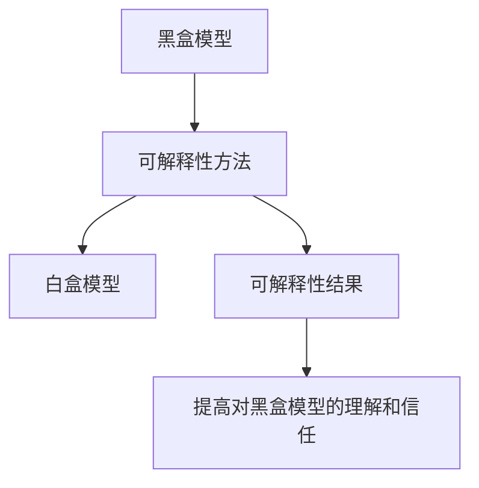

# 精确率与模型解释性：理解黑盒模型

## 1. 背景介绍
### 1.1 人工智能与黑盒模型
人工智能技术的快速发展，尤其是深度学习的兴起，使得越来越多的黑盒模型被应用于各个领域。这些模型在图像识别、自然语言处理、语音识别等任务上取得了令人瞩目的成绩，甚至在某些任务上已经超越了人类的表现。然而，黑盒模型的内部工作机制对于人类来说是不透明的，这使得我们难以理解模型是如何做出决策的，也无法解释模型的预测结果。

### 1.2 模型可解释性的重要性
模型可解释性对于人工智能的发展至关重要。首先，可解释性有助于我们理解模型的决策过程，从而提高对模型的信任度。其次，可解释性可以帮助我们发现模型中的偏差和错误，进而改进模型的性能。此外，在某些领域如医疗诊断、金融风控等，模型的决策必须是可解释和可审计的，以满足法律法规的要求。

### 1.3 精确率与可解释性的权衡
提高模型的精确率和可解释性是一对矛盾的目标。通常来说，越复杂的模型，如深度神经网络，其精确率越高，但可解释性越差；而越简单的模型，如决策树，其可解释性越好，但精确率可能较低。如何在精确率和可解释性之间取得平衡，是当前人工智能领域的一大挑战。

## 2. 核心概念与联系
### 2.1 黑盒模型
黑盒模型是指那些内部工作机制不透明的模型，如深度神经网络。这些模型接受输入数据，经过复杂的计算后输出预测结果，但我们无法直观地理解其内部的决策过程。

### 2.2 白盒模型
白盒模型是指那些内部工作机制透明的模型，如决策树、线性回归等。这些模型的决策过程是可以被人类理解和解释的。

### 2.3 模型可解释性
模型可解释性是指人类对模型决策过程的理解和解释能力。可解释性可以帮助我们理解模型是如何利用输入特征做出预测的，以及各个特征对预测结果的贡献程度。

### 2.4 模型精确率
模型精确率是指模型预测结果的准确程度。通常使用准确率、精确率、召回率、F1值等指标来衡量模型的精确率。

### 2.5 可解释性方法
可解释性方法是指那些用于解释黑盒模型的技术和算法，如LIME、SHAP、DeepLIFT等。这些方法可以帮助我们理解模型的决策过程，识别重要的特征，并生成人类可读的解释。

下图展示了黑盒模型、白盒模型、可解释性方法三者之间的关系：



## 3. 核心算法原理与具体操作步骤
### 3.1 LIME算法
LIME（Local Interpretable Model-agnostic Explanations）是一种用于解释黑盒模型的算法。其基本思想是在待解释样本附近的局部区域内，用一个简单的可解释模型（如线性模型）来近似黑盒模型的决策边界，从而得到该样本的局部解释。

LIME算法的具体操作步骤如下：
1. 在待解释样本附近的局部区域内，随机采样一定数量的扰动样本。
2. 对每个扰动样本，用黑盒模型进行预测，得到其预测概率。
3. 对扰动样本及其预测概率进行加权，权重与扰动程度成反比，即扰动越小的样本权重越大。
4. 用加权后的扰动样本来训练一个简单的可解释模型，如线性模型。
5. 从可解释模型中提取特征的权重，作为待解释样本的局部解释。

### 3.2 SHAP算法
SHAP（SHapley Additive exPlanations）是另一种用于解释黑盒模型的算法。其基本思想是将模型的预测结果分解为各个特征的贡献，每个特征的贡献由其Shapley值决定。Shapley值反映了该特征在所有可能的特征组合中的平均边际贡献。

SHAP算法的具体操作步骤如下：
1. 对于待解释样本，列举出所有可能的特征组合。
2. 对每个特征组合，计算加入该特征前后模型预测值的变化量，即该特征的边际贡献。
3. 对每个特征，计算其在所有特征组合中的平均边际贡献，即其Shapley值。
4. 将各个特征的Shapley值相加，得到待解释样本的预测值。每个特征的Shapley值即为其对预测结果的贡献。

### 3.3 DeepLIFT算法
DeepLIFT（Deep Learning Important FeaTures）是一种用于解释深度学习模型的算法。其基本思想是将神经网络每层的输出变化量分配到输入特征上，从而得到每个特征对最终预测结果的贡献。

DeepLIFT算法的具体操作步骤如下：
1. 定义一个参考输入，通常取训练集样本的均值。
2. 对于待解释样本，计算其与参考输入之间每个特征的差值。
3. 对神经网络的每一层，计算参考输入和待解释样本在该层的输出差值。
4. 将每层的输出差值分配到输入特征上，得到每个特征的贡献值。分配的原则是保持输入输出差值的比例不变。
5. 将所有层的特征贡献值相加，得到每个特征对最终预测结果的总贡献。

## 4. 数学模型与公式详解
### 4.1 LIME的数学模型
LIME算法的目标是找到一个局部的可解释模型$g$，使其在待解释样本$x$的邻域内尽可能地近似黑盒模型$f$。数学上，可以将其表示为以下优化问题：

$$\arg\min_{g\in G} L(f, g, \pi_x) + \Omega(g)$$

其中，$G$是所有可能的可解释模型的集合，$L$是衡量可解释模型$g$与黑盒模型$f$在样本$x$邻域内的不一致性的损失函数，$\pi_x$是以$x$为中心的局部分布，$\Omega$是可解释模型$g$的复杂度惩罚项。

通常，可以选择线性模型作为可解释模型$g$，即：

$$g(z') = w_g \cdot z'$$

其中，$z'$是样本$x$的扰动版本，$w_g$是线性模型的权重向量。

损失函数$L$可以定义为加权平方损失：

$$L(f, g, \pi_x) = \sum_{z,z'\in Z} \pi_x(z) (f(z)-g(z'))^2$$

其中，$Z$是扰动样本的集合，$\pi_x(z)$是扰动样本$z$的权重，与其与$x$的距离成反比。

复杂度惩罚项$\Omega$可以定义为权重向量的$L1$范数：

$$\Omega(g) = \lambda \|w_g\|_1$$

其中，$\lambda$是控制惩罚强度的超参数。

### 4.2 SHAP的数学模型
SHAP算法的核心是Shapley值的计算。对于特征$i$，其Shapley值$\phi_i$定义为：

$$\phi_i = \sum_{S\subseteq F\setminus\{i\}} \frac{|S|!(|F|-|S|-1)!}{|F|!} (f_S(x_S\cup\{i\})-f_S(x_S))$$

其中，$F$是所有特征的集合，$S$是$F$的子集，$f_S$是在特征子集$S$上训练的模型，$x_S$是样本$x$在特征子集$S$上的取值。

Shapley值$\phi_i$反映了特征$i$在所有可能的特征组合中的平均边际贡献。根据Shapley值的性质，有：

$$f(x) = \phi_0 + \sum_{i=1}^{|F|} \phi_i$$

其中，$\phi_0$是空集的Shapley值，通常取训练集样本的平均预测值。

### 4.3 DeepLIFT的数学模型
DeepLIFT算法的核心是将神经网络每层的输出变化量分配到输入特征上。对于第$l$层第$i$个神经元，其输出变化量$\Delta y_i^{(l)}$定义为：

$$\Delta y_i^{(l)} = y_i^{(l)}(x) - y_i^{(l)}(r)$$

其中，$x$是待解释样本，$r$是参考输入，$y_i^{(l)}(x)$和$y_i^{(l)}(r)$分别是样本$x$和参考输入$r$在第$l$层第$i$个神经元的输出值。

对于第$l$层第$i$个神经元，其输入特征$j$的贡献值$C_{\Delta y_i^{(l)} \Delta x_j}$定义为：

$$C_{\Delta y_i^{(l)} \Delta x_j} = \frac{w_{ij}^{(l)} \Delta x_j}{\sum_k w_{ik}^{(l)} \Delta x_k} \Delta y_i^{(l)}$$

其中，$w_{ij}^{(l)}$是第$l$层第$i$个神经元与其输入特征$j$之间的连接权重，$\Delta x_j$是特征$j$在样本$x$和参考输入$r$之间的差值。

将每层的特征贡献值递归传播到输入层，即可得到每个输入特征对最终预测结果的总贡献。

## 5. 项目实践：代码实例与详解
下面以LIME算法为例，给出其Python实现的关键代码及解释。

```python
import numpy as np
from sklearn.linear_model import Ridge

class LimeTabularExplainer:
    def __init__(self, training_data, mode="classification"):
        self.training_data = training_data
        self.mode = mode
        self.scaler = None
        self.feature_names = None
        
    def explain_instance(self, instance, predict_fn, num_features=10, num_samples=5000):
        # 对输入样本进行扰动
        data, labels = self._perturb_instance(instance, num_samples)
        
        # 用黑盒模型对扰动样本进行预测
        predictions = predict_fn(data)
        
        # 训练可解释模型
        weights = self._fit_interpretable_model(data, predictions, num_features)
        
        # 提取特征权重作为解释结果
        explanations = sorted(zip(self.feature_names, weights), key=lambda x: np.abs(x[1]), reverse=True)[:num_features]
        
        return explanations
    
    def _perturb_instance(self, instance, num_samples):
        # 生成扰动样本
        data = np.zeros((num_samples, instance.shape[0]))
        for i in range(num_samples):
            data[i] = instance.copy()
            for j in range(instance.shape[0]):
                if np.random.random() < 0.5:
                    data[i, j] = np.random.choice(self.training_data[:, j])
        
        # 计算扰动样本与原样本的距离
        distances = np.sqrt(np.sum((data - instance)**2, axis=1))
        
        # 根据距离计算样本权重
        kernel_width = np.sqrt(np.median(distances))
        weights = np.sqrt(np.exp(-distances**2 / kernel_width**2))
        
        return data, weights
    
    def _fit_interpretable_model(self, data, predictions, num_features):
        # 训练线性模型
        model = Ridge(alpha=1, fit_intercept=True)
        model.fit(data, predictions, sample_weight=labels)
        
        # 提取特征权重
        weights = model.coef_
        
        return weights
```

代码解释：
- `LimeTabularExplainer`类是LIME算法的实现，用于解释表格数据的黑盒模型。
- `explain_instance`方法是解释单个样本的主要入口，它接受待解释样本`instance`、黑盒模型的预测函数`predict_fn`、期望解释的特征数量`num_features`和扰动样本数量`num_samples`。
- `_perturb_instance`方法用于生成扰动样本，并计算每个扰动样本的权重。其中，扰动样本是通过随机替换原样本的特征值生成的，权重是根据扰动样本