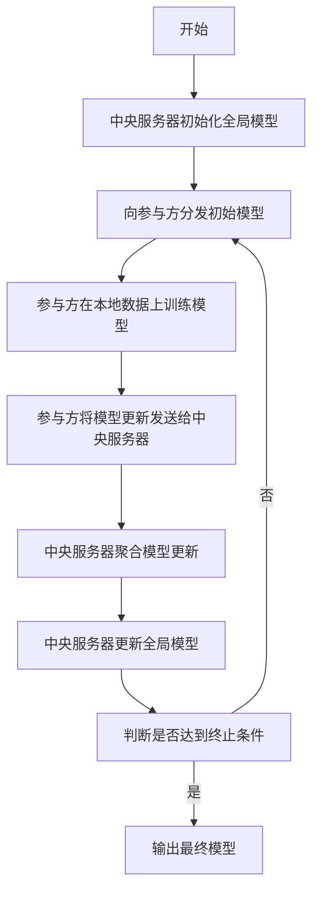

# 联邦学习(Federated Learning) - 原理与代码实例讲解

## 1. 背景介绍

### 1.1 数据隐私保护的重要性

在当今的数字时代,数据已经成为了一种新的"燃料",推动着人工智能、机器学习和其他创新技术的发展。然而,随着数据收集和利用的增加,人们对于个人隐私和数据安全的关注也与日俱增。传统的集中式机器学习方法需要将所有数据集中在一个中央服务器上进行训练,这可能会带来严重的隐私风险,尤其是在涉及敏感个人信息(如医疗记录、金融交易等)时。

### 1.2 联邦学习的兴起

为了解决这一问题,联邦学习(Federated Learning)作为一种新兴的分布式机器学习范式应运而生。联邦学习的核心思想是:让数据保留在本地设备(如手机、平板电脑等)上,而不是将其上传到中央服务器。相反,训练过程是在本地设备上进行的,只有模型的更新(如权重和梯度)会被发送到中央服务器进行聚合。这种方式可以有效保护用户隐私,同时还能利用大量分散的数据来训练出高质量的模型。

### 1.3 联邦学习的应用前景

联邦学习在许多领域都有广阔的应用前景,例如:

- **移动设备**:利用联邦学习可以在不侵犯用户隐私的情况下,从众多移动设备收集数据,用于改进语音识别、键盘自动补全等功能。
- **医疗保健**:通过联邦学习,医疗机构可以共享模型而不共享敏感的患者数据,从而提高诊断和治疗的准确性。
- **金融服务**:银行可以使用联邦学习来检测欺诈行为,而无需共享客户的隐私交易数据。
- **物联网(IoT)设备**:联邦学习可以在物联网设备(如安防摄像头、智能家居设备等)上进行本地训练,提高它们的智能化水平。

总的来说,联邦学习为保护数据隐私和提高人工智能模型的性能提供了一种有前景的解决方案。

## 2. 核心概念与联系

### 2.1 联邦学习的核心概念

联邦学习的核心概念包括:

1. **参与方(Participants)**:参与联邦学习的各个客户端设备,如手机、平板电脑等。
2. **中央服务器(Central Server)**:负责协调整个联邦学习过程的中央节点。
3. **本地训练(Local Training)**:每个参与方在本地数据上进行模型训练。
4. **模型聚合(Model Aggregation)**:中央服务器将来自各个参与方的模型更新聚合成一个全局模型。
5. **差分隐私(Differential Privacy)**:一种用于保护个人隐私的数学技术,通过在数据中引入噪声来掩盖个人信息。

### 2.2 联邦学习与其他机器学习范式的关系

联邦学习与其他一些相关的机器学习范式有着密切的联系,包括:

1. **分布式机器学习(Distributed Machine Learning)**:联邦学习可以被视为分布式机器学习的一种特殊形式,其中数据是分散在各个参与方设备上的。
2. **隐私保护机器学习(Privacy-Preserving Machine Learning)**:联邦学习是实现隐私保护机器学习的一种重要方法,它通过保留数据在本地的方式来保护隐私。
3. **迁移学习(Transfer Learning)**:在联邦学习中,中央服务器可以将聚合后的全局模型作为初始模型,分发给新加入的参与方,从而实现迁移学习。
4. **元学习(Meta-Learning)**:联邦学习可以被视为一种元学习问题,其中需要学习如何有效地从分散的数据中提取知识。

### 2.3 联邦学习的优缺点

联邦学习具有以下优点:

- 保护数据隐私
- 利用分散的数据源
- 减少通信开销
- 提高模型性能

同时,联邦学习也存在一些挑战和限制:

- 系统异构性
- 统计异常值
- 通信约束
- 隐私攻击风险

## 3. 核心算法原理具体操作步骤

联邦学习的核心算法通常采用一种迭代式的方法,其具体操作步骤如下:



1. **中央服务器初始化全局模型**:中央服务器首先初始化一个全局模型,作为联邦学习的起点。这个初始模型可以是随机初始化的,也可以是基于预训练模型或先验知识初始化的。

2. **向参与方分发初始模型**:中央服务器将初始化的全局模型分发给所有参与联邦学习的客户端设备(参与方)。

3. **参与方在本地数据上训练模型**:每个参与方在自己的本地数据上,使用分发的初始模型进行一定轮次的训练。训练过程中,参与方可以使用标准的机器学习算法,如梯度下降、随机梯度下降等。

4. **参与方将模型更新发送给中央服务器**:训练完成后,参与方将自己的模型更新(如权重、梯度等)发送给中央服务器。

5. **中央服务器聚合模型更新**:中央服务器收集来自所有参与方的模型更新,并使用特定的聚合算法(如联邦平均、加权平均等)将它们聚合成一个新的全局模型更新。

6. **中央服务器更新全局模型**:中央服务器使用聚合后的模型更新,来更新当前的全局模型。

7. **判断是否达到终止条件**:中央服务器判断是否已经达到预设的终止条件,如最大迭代轮次、模型收敛等。如果达到终止条件,则输出当前的全局模型作为最终模型;否则,重复步骤3-7。

在上述过程中,还可以引入一些额外的技术来提高联邦学习的性能和隐私保护能力,如差分隐私、安全多方计算等。

## 4. 数学模型和公式详细讲解举例说明

### 4.1 联邦平均算法(FedAvg)

联邦平均算法(FedAvg)是联邦学习中最常用的模型聚合算法之一。它的基本思想是:在每轮迭代中,中央服务器将来自所有参与方的模型权重进行加权平均,得到新的全局模型权重。

设有 $N$ 个参与方,第 $t$ 轮迭代中,第 $i$ 个参与方的本地模型权重为 $w_i^t$,那么新的全局模型权重 $w^{t+1}$ 可以通过以下公式计算:

$$w^{t+1} = \sum_{i=1}^N \frac{n_i}{n} w_i^t$$

其中,
- $n_i$ 表示第 $i$ 个参与方的本地数据样本数量
- $n = \sum_{i=1}^N n_i$ 表示所有参与方的总数据样本数量

这种方法实际上是对每个参与方的模型权重进行了数据样本数量的加权平均。具有更多数据样本的参与方在聚合过程中会获得更大的权重。

### 4.2 联邦学习目标函数

在联邦学习中,我们希望找到一个能够最小化所有参与方的本地损失函数之和的全局模型。设第 $i$ 个参与方的本地损失函数为 $F_i(w)$,那么联邦学习的目标函数可以表示为:

$$\min_w \left\{ F(w) = \sum_{i=1}^N \frac{n_i}{n} F_i(w) \right\}$$

其中,
- $w$ 表示模型权重
- $F_i(w)$ 表示第 $i$ 个参与方的本地损失函数
- $\frac{n_i}{n}$ 是对应于第 $i$ 个参与方的数据样本权重

这个目标函数实际上是所有参与方的加权平均损失函数,与联邦平均算法中的权重聚合方式一致。

在实践中,由于每个参与方只能访问自己的本地数据,因此无法直接优化上述目标函数。相反,每个参与方会在本地数据上优化自己的损失函数 $F_i(w)$,然后将更新后的模型权重发送给中央服务器进行聚合。通过多轮迭代,整个系统可以逐步逼近最优解。

### 4.3 差分隐私

差分隐私(Differential Privacy)是一种用于保护个人隐私的数学技术,它通过在数据中引入一定程度的噪声来掩盖个人信息,从而实现隐私保护。在联邦学习中,差分隐私可以应用于以下几个方面:

1. **本地模型更新**:在参与方发送模型更新给中央服务器之前,可以对模型更新添加噪声,以保护个人隐私。
2. **模型聚合**:中央服务器在聚合来自各个参与方的模型更新时,可以引入噪声,以防止恢复个人信息。
3. **输出模型**:最终输出的全局模型也可以添加噪声,以进一步增强隐私保护。

差分隐私通常使用以下指数机制(Exponential Mechanism)来引入噪声:

$$P(x) \propto \exp\left(-\frac{\epsilon f(x)}{2\Delta f}\right)$$

其中,
- $x$ 表示要输出的值(如模型权重或梯度)
- $f(x)$ 是一个评分函数,用于衡量 $x$ 的"有用性"
- $\epsilon$ 是隐私预算(Privacy Budget),控制噪声的大小
- $\Delta f$ 是评分函数 $f$ 的敏感度(Sensitivity)

通过调整隐私预算 $\epsilon$,我们可以在隐私保护和模型精度之间进行权衡。隐私预算越小,噪声越大,隐私保护能力越强,但模型精度可能会受到影响。反之亦然。

## 5. 项目实践:代码实例和详细解释说明

在本节中,我们将提供一个基于 TensorFlow 和 TensorFlow Federated (TFF) 的联邦学习代码示例,用于在 MNIST 手写数字识别任务上训练一个简单的卷积神经网络模型。

### 5.1 环境准备

首先,我们需要安装 TensorFlow 和 TensorFlow Federated 库:

```bash
pip install tensorflow
pip install tensorflow-federated
```

### 5.2 数据准备

我们使用 TensorFlow 内置的 MNIST 数据集,并将其划分为多个非 IID (Non-Independent and Identically Distributed) 的数据子集,模拟联邦学习场景中的数据分布。

```python
import tensorflow as tf
import tensorflow_federated as tff

# 加载 MNIST 数据集
mnist_train, mnist_test = tff.simulation.datasets.mnist.load_data()

# 将数据划分为非 IID 的子集
CLIENT_DATA_SEED = 123456
client_data = mnist_train.client_ids
client_data = client_data[:10]  # 仅使用前 10 个客户端
client_batches = [mnist_train.create_tf_dataset_for_client(client)
                  for client in client_data]
```

### 5.3 定义模型

我们定义一个简单的卷积神经网络模型,用于对 MNIST 手写数字进行分类。

```python
import tensorflow as tf

def create_keras_model():
    model = tf.keras.models.Sequential([
        tf.keras.layers.Conv2D(32, 3, activation='relu', input_shape=(28, 28, 1)),
        tf.keras.layers.MaxPooling2D(),
        tf.keras.layers.Flatten(),
        tf.keras.layers.Dense(64, activation='relu'),
        tf.keras.layers.Dense(10)
    ])
    return model
```

### 5.4 联邦学习训练

接下来,我们使用 TFF 提供的 `tff.learning` 模块进行联邦学习训练。