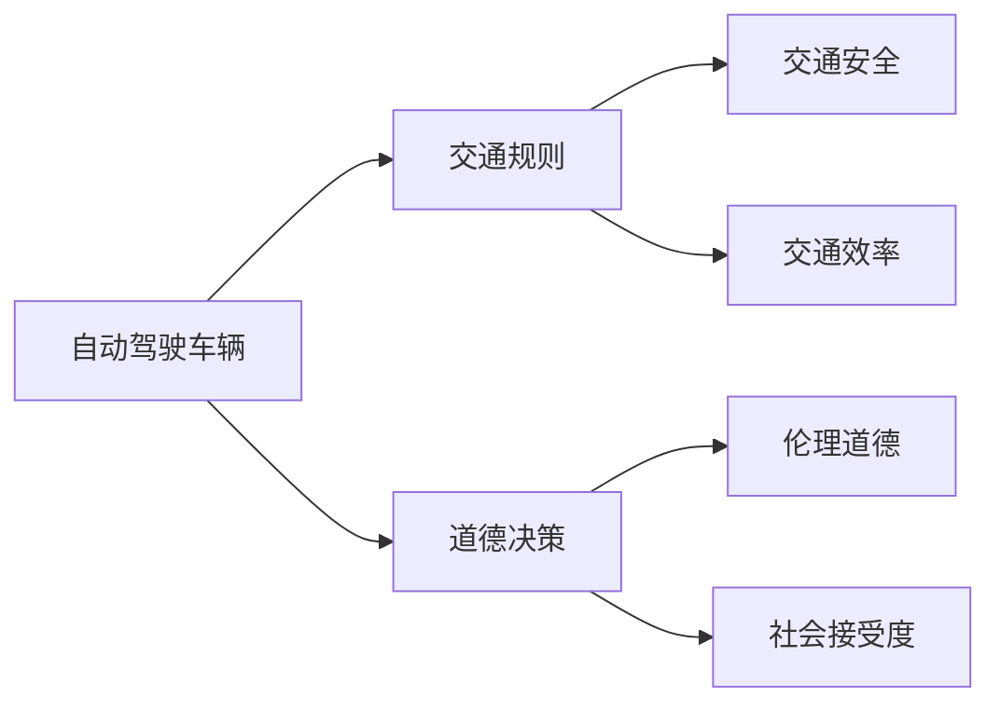

# 自动驾驶车辆的交通规则和道德决策

## 1. 背景介绍
### 1.1 自动驾驶技术的发展历程
#### 1.1.1 早期探索阶段
#### 1.1.2 技术突破阶段 
#### 1.1.3 商业化应用阶段
### 1.2 自动驾驶车辆面临的挑战
#### 1.2.1 技术挑战
#### 1.2.2 法律法规挑战
#### 1.2.3 社会伦理挑战
### 1.3 自动驾驶车辆的交通规则和道德决策的重要性
#### 1.3.1 确保交通安全
#### 1.3.2 提高交通效率
#### 1.3.3 解决道德困境

## 2. 核心概念与联系
### 2.1 自动驾驶车辆的分级
#### 2.1.1 L1级别：驾驶辅助
#### 2.1.2 L2级别：部分自动化
#### 2.1.3 L3级别：有条件自动化
#### 2.1.4 L4级别：高度自动化
#### 2.1.5 L5级别：完全自动化
### 2.2 交通规则的构成要素
#### 2.2.1 交通信号
#### 2.2.2 交通标志
#### 2.2.3 交通标线
#### 2.2.4 交通规范
### 2.3 道德决策的理论基础
#### 2.3.1 功利主义
#### 2.3.2 义务论
#### 2.3.3 美德伦理学
### 2.4 核心概念之间的关系


## 3. 核心算法原理具体操作步骤
### 3.1 感知与定位算法
#### 3.1.1 计算机视觉算法
#### 3.1.2 激光雷达点云处理算法
#### 3.1.3 多传感器融合定位算法
### 3.2 预测与规划算法
#### 3.2.1 行为预测算法
#### 3.2.2 路径规划算法
#### 3.2.3 速度规划算法
### 3.3 决策与控制算法
#### 3.3.1 有限状态机决策算法
#### 3.3.2 强化学习决策算法 
#### 3.3.3 模型预测控制算法
### 3.4 交通规则融合算法
#### 3.4.1 交通信号识别与响应
#### 3.4.2 交通标志识别与响应
#### 3.4.3 交通规范学习与遵循
### 3.5 道德决策算法
#### 3.5.1 基于规则的决策算法
#### 3.5.2 基于案例的决策算法
#### 3.5.3 基于价值观的决策算法

## 4. 数学模型和公式详细讲解举例说明
### 4.1 贝叶斯定位模型
$$P(x_t|z_{1:t},u_{1:t}) = \eta P(z_t|x_t) \int P(x_t|x_{t-1},u_t) P(x_{t-1}|z_{1:t-1},u_{1:t-1}) dx_{t-1}$$
其中，$x_t$表示$t$时刻车辆状态，$z_t$表示$t$时刻传感器观测值，$u_t$表示$t$时刻控制输入，$\eta$为归一化因子。该模型通过先验概率和似然函数，递归估计车辆状态的后验概率分布。

### 4.2 最短路径规划模型
$$\min \sum_{i,j \in V} c_{ij} x_{ij}$$
$$s.t. \sum_{j \in V} x_{ij} - \sum_{j \in V} x_{ji} = \begin{cases} 1, & i = s \\ -1, & i = t \\ 0, & otherwise \end{cases}$$
$$x_{ij} \in \{0,1\}, \forall i,j \in V$$
其中，$V$表示路网节点集合，$c_{ij}$表示节点$i$到节点$j$的代价，$x_{ij}$为决策变量，表示是否经过边$(i,j)$，$s$表示起点，$t$表示终点。该模型目标是寻找从起点到终点的最短路径。

### 4.3 马尔科夫决策过程模型
$$V^{\pi}(s) = \sum_{a \in A} \pi(a|s) \left[R(s,a) + \gamma \sum_{s' \in S} P(s'|s,a) V^{\pi}(s')\right]$$
其中，$S$表示状态集合，$A$表示动作集合，$\pi$表示策略，$R$表示奖励函数，$P$表示状态转移概率，$\gamma$表示折扣因子。该模型描述了在给定策略下，状态的期望累积奖励，常用于求解最优决策问题。

## 5. 项目实践：代码实例和详细解释说明
下面以交通信号灯识别为例，给出Python代码实现：

```python
import cv2
import numpy as np

def detect_traffic_lights(image):
    # 转换为HSV色彩空间
    hsv = cv2.cvtColor(image, cv2.COLOR_BGR2HSV)
    
    # 红色阈值
    lower_red1 = np.array([0, 50, 50])
    upper_red1 = np.array([10, 255, 255])
    lower_red2 = np.array([170, 50, 50])
    upper_red2 = np.array([180, 255, 255])
    
    # 黄色阈值
    lower_yellow = np.array([20, 50, 50])
    upper_yellow = np.array([30, 255, 255])
    
    # 绿色阈值
    lower_green = np.array([40, 50, 50])
    upper_green = np.array([90, 255, 255])
    
    # 提取红色区域
    mask1 = cv2.inRange(hsv, lower_red1, upper_red1)
    mask2 = cv2.inRange(hsv, lower_red2, upper_red2)
    mask_red = cv2.bitwise_or(mask1, mask2)
    
    # 提取黄色区域
    mask_yellow = cv2.inRange(hsv, lower_yellow, upper_yellow)
    
    # 提取绿色区域
    mask_green = cv2.inRange(hsv, lower_green, upper_green)
    
    # 找到轮廓
    contours_red, _ = cv2.findContours(mask_red, cv2.RETR_EXTERNAL, cv2.CHAIN_APPROX_SIMPLE)
    contours_yellow, _ = cv2.findContours(mask_yellow, cv2.RETR_EXTERNAL, cv2.CHAIN_APPROX_SIMPLE)
    contours_green, _ = cv2.findContours(mask_green, cv2.RETR_EXTERNAL, cv2.CHAIN_APPROX_SIMPLE)
    
    # 初始化信号灯状态
    red_light = False
    yellow_light = False
    green_light = False
    
    # 判断信号灯状态
    if len(contours_red) > 0:
        red_light = True
    if len(contours_yellow) > 0:
        yellow_light = True
    if len(contours_green) > 0:
        green_light = True
        
    return red_light, yellow_light, green_light

# 读取图像
image = cv2.imread('traffic_light.jpg')

# 检测信号灯状态
red, yellow, green = detect_traffic_lights(image)

# 输出结果
if red:
    print("Red Light")
if yellow:
    print("Yellow Light")
if green:
    print("Green Light")
```

代码详细解释：

1. 首先将图像从BGR色彩空间转换为HSV色彩空间，以便于提取特定颜色区域。
2. 定义红色、黄色、绿色在HSV空间的阈值范围。
3. 使用`cv2.inRange()`函数分别提取红色、黄色、绿色区域的二值化掩膜。
4. 对每个颜色掩膜使用`cv2.findContours()`函数找到轮廓。
5. 根据轮廓数量判断信号灯的状态，存在轮廓则表示该颜色亮起。
6. 返回红灯、黄灯、绿灯的状态。
7. 读取交通信号灯图像，调用`detect_traffic_lights()`函数检测信号灯状态。
8. 根据返回的状态值，输出相应的信号灯状态。

通过这个简单的例子，我们演示了如何使用计算机视觉技术识别交通信号灯的状态。在实际的自动驾驶系统中，还需要考虑更复杂的场景和条件，结合其他传感器信息，并与车辆控制系统相结合，才能实现可靠的交通信号响应。

## 6. 实际应用场景
### 6.1 城市道路场景
#### 6.1.1 交通信号灯识别与响应
#### 6.1.2 车道线检测与保持
#### 6.1.3 行人和车辆检测与避让
### 6.2 高速公路场景
#### 6.2.1 自适应巡航控制
#### 6.2.2 自动变道与超车
#### 6.2.3 紧急制动与避障
### 6.3 停车场场景
#### 6.3.1 自动泊车
#### 6.3.2 车位检测与规划
#### 6.3.3 行人与障碍物检测
### 6.4 特殊天气场景
#### 6.4.1 雨天行驶策略
#### 6.4.2 雪天行驶策略
#### 6.4.3 雾霾天行驶策略
### 6.5 突发事件场景
#### 6.5.1 紧急车辆避让
#### 6.5.2 事故现场处置
#### 6.5.3 施工区域通行策略

## 7. 工具和资源推荐
### 7.1 开源数据集
- KITTI数据集
- Cityscapes数据集
- Waymo开放数据集
- nuScenes数据集
- Apolloscape数据集
### 7.2 开源算法框架
- Autoware
- Apollo
- OpenPilot
- Baidu Apollo
- NVIDIA DRIVE
### 7.3 仿真平台
- CARLA
- LGSVL Simulator
- AirSim
- NVIDIA DRIVE Sim
- Waymo开放仿真平台
### 7.4 行业标准与法规
- NHTSA自动驾驶车辆政策
- SAE J3016自动驾驶分级标准
- 中国智能网联汽车道路测试规范
- 欧盟GDPR法规
- 加州DMV自动驾驶测试规范

## 8. 总结：未来发展趋势与挑战
### 8.1 技术趋势
#### 8.1.1 传感器融合与冗余
#### 8.1.2 高精度地图与定位
#### 8.1.3 车路协同与智慧交通
#### 8.1.4 5G通信与边缘计算
### 8.2 政策法规趋势
#### 8.2.1 分级管理与测试监管
#### 8.2.2 事故责任与保险制度
#### 8.2.3 隐私保护与数据安全
### 8.3 社会伦理趋势
#### 8.3.1 公平与无歧视
#### 8.3.2 透明与可解释
#### 8.3.3 社会接受度与教育普及
### 8.4 未来挑战
#### 8.4.1 极端环境下的鲁棒性
#### 8.4.2 复杂城市道路的适应性
#### 8.4.3 人机交互与权责划分
#### 8.4.4 网络安全与攻击防范

## 9. 附录：常见问题与解答
### 9.1 自动驾驶车辆安全可靠吗？
自动驾驶车辆经过严格的开发测试和验证，并配备了多重冗余的感知、决策和执行系统，在设计上已经考虑了全面的安全保障。但是，自动驾驶技术仍处于发展阶段，面临复杂多变的实际交通环境，难免存在一定的不确定性和局限性。因此，自动驾驶车辆的安全性还需要长期的技术进步和监管完善来不断提升。

### 9.2 自动驾驶车辆发生事故时，责任如何界定？
根据目前的政策法规，自动驾驶车辆事故责任的认定需要综合考虑车辆自动驾驶系统的功能状态、事故发生的具体情境、驾驶员的行为等因素。一般情况下，如果事故是由车辆的自动驾驶系统失效或错误决策导致的，则车辆制造商或运营商可能需要承担主要责任。如果事故是由驾驶员的不当操作或接管失误导致的，则驾驶员可能