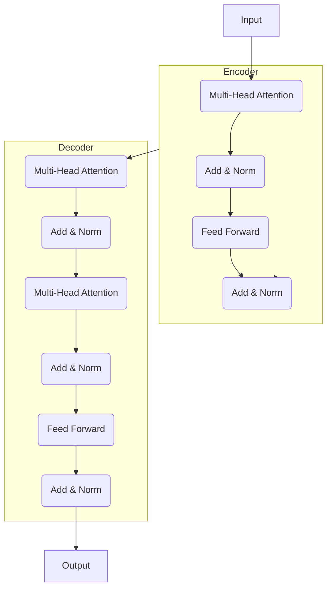

# 自然语言处理(Natural Language Processing) - 原理与代码实例讲解

## 1.背景介绍

### 1.1 什么是自然语言处理

自然语言处理(Natural Language Processing, NLP)是人工智能和语言学领域的一个重要方向,旨在研究让计算机能够理解和处理自然语言数据。它涉及计算机和人类语言之间的相互转换,包括语音识别、语义理解、文本生成、机器翻译等技术。

### 1.2 自然语言处理的重要性

随着信息时代的到来,海量的自然语言数据如网页、电子邮件、社交媒体等不断产生,对这些非结构化数据进行分析和处理成为一个迫切需求。NLP技术可以帮助我们高效地从混乱的自然语言数据中提取有价值的信息,并将其转化为可理解的结构化知识。

此外,NLP技术在很多领域都有广泛的应用,如信息检索、文本挖掘、问答系统、机器翻译、智能写作、自动化客服等,为提高工作效率和优化用户体验提供了强有力的支持。

## 2.核心概念与联系

### 2.1 自然语言处理的主要任务

自然语言处理主要包括以下几个核心任务:

1. **语音识别(Speech Recognition)**: 将语音信号转换为文本。
2. **词法分析(Lexical Analysis)**: 将文本流分割为词语序列。
3. **句法分析(Syntactic Analysis)**: 确定词语之间的语法结构关系。
4. **语义分析(Semantic Analysis)**: 计算机理解语句的实际意义。
5. **语言生成(Language Generation)**: 根据计算机内部表示生成自然语言。
6. **机器翻译(Machine Translation)**: 将一种自然语言翻译成另一种语言。

这些任务相互关联,共同构建了完整的自然语言处理系统。

### 2.2 自然语言处理的核心挑战

尽管取得了长足进步,但自然语言处理仍然面临着诸多挑战:

1. **语义歧义**: 同一个词或句子可能有多种含义,需要根据上下文理解真正含义。
2. **复杂语法**: 自然语言的语法结构错综复杂,给分析带来困难。
3. **领域知识**: 理解某些领域语言需要大量的专门知识。
4. **数据稀疏**: 训练数据的覆盖面往往不够全面,存在稀疏性问题。

克服这些挑战需要更精确的语言模型、更丰富的知识库和更强大的推理能力。

### 2.3 自然语言处理的主要方法

自然语言处理主要采用以下几种方法:

1. **统计机器学习方法**: 基于大规模语料训练统计模型,如N-gram、隐马尔可夫等。
2. **规则系统方法**: 依赖于手动编写的规则库,对语言现象进行建模。
3. **深度学习方法**: 利用神经网络自动学习特征表示,如Word2Vec、BERT等。
4. **基于知识库的方法**: 构建语义知识库,通过推理获取语义信息。

近年来,深度学习方法在自然语言处理领域取得了突破性进展,但其他方法仍有重要应用。

## 3.核心算法原理具体操作步骤

### 3.1 词向量表示

在自然语言处理任务中,首先需要将文本转化为计算机可以理解的数值向量表示。最常用的方法是词向量(Word Embedding)表示。

词向量是将每个词映射到一个连续的向量空间中,词与词之间的语义和句法信息体现在向量之间的距离和相似度上。常用的词向量模型有Word2Vec、GloVe等。

**Word2Vec训练步骤**:

1. 构建训练语料库,对语料进行分词、去除停用词等预处理。
2. 初始化词向量矩阵,将所有词对应的向量初始化为随机值。
3. 使用Skip-gram或CBOW模型在语料上训练词向量。
4. 根据上下文词预测目标词或反之,最大化目标函数,不断调整词向量。
5. 重复训练,直至收敛得到最终词向量表示。

### 3.2 序列建模

自然语言数据通常是一个序列结构,需要对整个序列进行建模才能捕捉上下文信息。常用的序列建模方法有循环神经网络(RNN)、长短期记忆网络(LSTM)、门控循环单元(GRU)等。

以LSTM为例,其核心思想是引入了控制单元,通过门机制来控制信息的流动,从而解决了普通RNN无法很好地捕获长期依赖关系的问题。

**LSTM前向计算步骤**:

1. 获取当前时刻输入 $x_t$ 和上一时刻隐状态 $h_{t-1}$。
2. 计算遗忘门 $f_t$:  $f_t = \sigma(W_f[h_{t-1}, x_t] + b_f)$
3. 计算输入门 $i_t$:  $i_t = \sigma(W_i[h_{t-1}, x_t] + b_i)$
4. 计算候选值 $\tilde{C}_t$: $\tilde{C}_t = \tanh(W_C[h_{t-1}, x_t] + b_C)$
5. 计算当前状态 $C_t$:  $C_t = f_t * C_{t-1} + i_t * \tilde{C}_t$
6. 计算输出门 $o_t$:  $o_t = \sigma(W_o[h_{t-1}, x_t] + b_o)$
7. 计算当前输出 $h_t$:  $h_t = o_t * \tanh(C_t)$

通过上述门控机制,LSTM能够很好地捕捉长期依赖关系。

### 3.3 注意力机制

在序列建模任务中,注意力机制(Attention Mechanism)是一种重要的技术,它能够自适应地为序列中不同位置的信息赋予不同的权重,从而获得对任务更加关键的特征表示。

注意力机制的核心思想是:在对序列进行编码时,对每个位置的隐状态进行加权求和,权重由注意力分数决定,注意力分数则由当前位置隐状态与其他位置隐状态的关联程度计算得到。

**注意力计算步骤**:

1. 对编码器的所有隐状态 $H=\{h_1,h_2,...,h_n\}$ 进行线性变换: $\tilde{h}_i=W_ah_i$
2. 计算当前解码器隐状态 $s_t$ 与每个 $\tilde{h}_i$ 的注意力权重:
   $$\alpha_{ti} = \frac{\exp(f(s_t, \tilde{h}_i))}{\sum_{j=1}^n \exp(f(s_t, \tilde{h}_j))}$$
   其中 $f$ 为注意力打分函数,如点积、加性等。
3. 对编码器隐状态进行加权求和,得到注意力上下文向量:
   $$c_t = \sum_{i=1}^n \alpha_{ti} \tilde{h}_i$$
4. 将注意力上下文向量 $c_t$ 与解码器隐状态 $s_t$ 进行融合,得到最终特征表示。

注意力机制使模型能够专注于输入序列中与当前任务更加相关的部分,大大提高了序列建模的性能。

### 3.4 Transformer模型

Transformer是一种全新的基于注意力机制的序列建模架构,不需要复杂的循环或者卷积结构,就能直接对序列进行建模。它的主要创新在于多头自注意力(Multi-Head Attention)和位置编码(Positional Encoding)机制。

**Transformer模型结构**:

- 编码器(Encoder)由多个相同的层组成,每层包含两个子层:多头自注意力层和前馈全连接层。
- 解码器(Decoder)也是多层结构,除了编码器的两个子层外,还包含一个用于编码器输出的多头注意力层。
- 位置编码通过对序列的位置信息进行编码,赋予不同位置的元素不同的位置表示。
- 残差连接和层归一化可以更好地训练深层次模型。

Transformer模型可以高效并行化,在机器翻译、文本生成等任务中表现出色。

## 4.数学模型和公式详细讲解举例说明

### 4.1 语言模型

语言模型是自然语言处理中一个基础性的概率模型,旨在计算给定一个句子或文本的概率。形式化地,语言模型需要学习联合概率分布:

$$P(w_1, w_2, ..., w_n) = \prod_{i=1}^n P(w_i|w_1, ..., w_{i-1})$$

其中 $w_i$ 表示句子中的第 $i$ 个词。由于直接计算联合概率是困难的,通常会引入马尔可夫假设,使用 $n$ 阶马尔可夫链对条件概率进行建模:

$$P(w_i|w_1, ..., w_{i-1}) \approx P(w_i|w_{i-n+1}, ..., w_{i-1})$$

**N-gram语言模型**

N-gram语言模型是一种常用的基于统计的语言模型,它将句子看作是由 $n-1$ 个历史词预测当前词的序列,通过计数统计从训练语料中学习概率:

$$P(w_i|w_{i-n+1}^{i-1}) = \frac{C(w_{i-n+1}^i)}{C(w_{i-n+1}^{i-1})}$$

其中 $C(w_{i-n+1}^i)$ 表示 $n$ 元语言模型 $w_{i-n+1}^i$ 在训练语料中出现的次数。

N-gram模型简单高效,但也存在数据稀疏、无法建模长距离依赖等问题。

### 4.2 神经网络语言模型

神经网络语言模型将神经网络应用于语言模型,使用分布式词向量表示词语,从而能够更好地捕捉语义和句法信息。常用的有基于前馈神经网络、RNN、LSTM等结构的语言模型。

以基于LSTM的语言模型为例,其目标是最大化给定历史词序列的当前词的条件概率:

$$\begin{aligned}
J(\theta) &= \sum_{t=1}^T \log P(w_t|w_{t-1}, ..., w_1; \theta) \\
         &= \sum_{t=1}^T \log \text{Softmax}(W_o h_t + b_o)
\end{aligned}$$

其中 $\theta$ 为模型参数, $h_t$ 为 LSTM 在时刻 $t$ 的隐状态输出。模型通过反向传播算法对参数进行学习和优化。

神经网络语言模型能够较好地解决数据稀疏和长距离依赖问题,在许多自然语言处理任务中表现出色。

### 4.3 序列到序列模型

序列到序列(Seq2Seq)模型是一种通用的编码器-解码器框架,广泛应用于机器翻译、文本摘要、对话系统等任务。该模型将输入序列先编码为向量表示,再将其解码生成输出序列。

**序列到序列模型公式**:

编码器将输入序列 $X=(x_1, x_2, ..., x_m)$ 映射到向量 $c$:

$$h_t = f(x_t, h_{t-1}), \quad c = q(h_1, ..., h_m)$$

解码器根据 $c$ 生成输出序列 $Y=(y_1, y_2, ..., y_n)$:

$$p(Y|X) = \prod_{t=1}^n p(y_t|y_1, ..., y_{t-1}, c)$$

其中 $f$ 为编码器递归函数, $q$