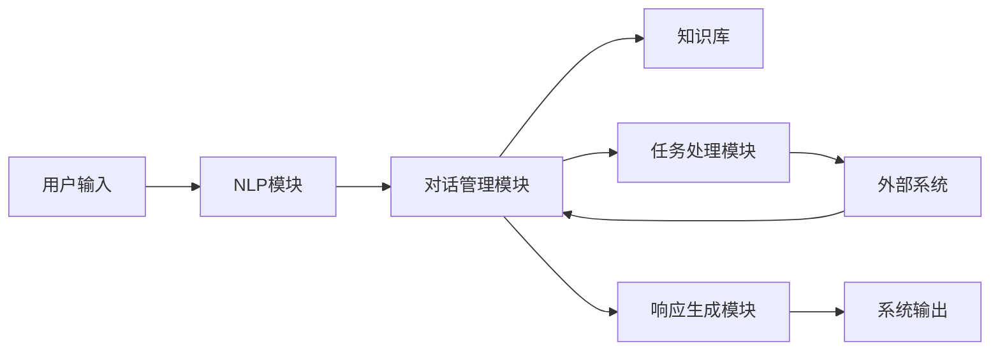

# 自然语言处理在智能客服中的应用

## 1.背景介绍

### 1.1 智能客服的兴起

近年来,随着人工智能技术的快速发展,智能客服系统开始广泛应用于各行各业。传统的客服方式已经无法满足日益增长的客户需求,企业亟需一种高效、便捷、低成本的客户服务解决方案。智能客服通过利用自然语言处理(NLP)、机器学习等技术,能够自动理解用户的问题,并给出相应的回复,从而极大地提高了客户服务的效率和质量。

### 1.2 自然语言处理的重要性

自然语言处理(NLP)是智能客服系统的核心技术。它使计算机能够理解、处理和生成人类自然语言,是实现人机自然交互的关键。在智能客服场景中,NLP技术需要解决诸多挑战,如语义理解、上下文关联、多轮对话等,这对NLP技术的发展提出了更高的要求。

## 2.核心概念与联系

### 2.1 自然语言处理概述

自然语言处理(NLP)是人工智能的一个重要分支,旨在使计算机能够理解和生成人类自然语言。NLP技术包括以下几个核心部分:

1. **语言分析**:将自然语言文本转换为计算机可以处理的形式,包括词法分析、句法分析和语义分析等。
2. **知识表示**:将语言知识以计算机可理解的形式存储和组织,如本体、知识图谱等。
3. **自然语言理解**:从语言中提取语义信息,建立对应的语义表示。
4. **自然语言生成**:根据语义表示生成自然语言文本。
5. **对话管理**:控制对话流程,处理上下文信息,实现多轮对话。

### 2.2 智能客服系统架构

智能客服系统通常由以下几个主要模块组成:



1. **NLP模块**:负责对用户输入的自然语言进行分析和理解,提取关键信息。
2. **对话管理模块**:根据对话上下文和知识库,决定系统的下一步行为。
3. **知识库**:存储领域知识、问答对等信息。
4. **任务处理模块**:执行特定任务,如查询数据库、调用外部API等。
5. **响应生成模块**:根据对话状态和任务结果,生成自然语言响应。

### 2.3 NLP在智能客服中的作用

NLP技术在智能客服系统中发挥着至关重要的作用:

1. **语义理解**:准确理解用户的问题和意图。
2. **上下文关联**:把握对话的连贯性,处理多轮对话。
3. **知识挖掘**:从海量数据中提取有价值的知识。
4. **自然语言生成**:生成通顺、人性化的响应语言。

只有将NLP技术与对话管理、知识库等模块紧密结合,才能构建出真正智能的客服系统。

## 3.核心算法原理具体操作步骤  

### 3.1 语言分析

语言分析是NLP的基础,旨在将自然语言转换为计算机可以处理的形式。主要包括以下步骤:

#### 3.1.1 分词和词性标注

分词是将连续的字符串切分为词序列的过程,是NLP任务的基础。常用算法有基于规则的方法、统计学习方法等。

词性标注是为每个词赋予相应的词性,如名词、动词等。常用的有基于规则的方法、隐马尔可夫模型(HMM)、条件随机场(CRF)等。

#### 3.1.2 句法分析

句法分析又称语法分析,是确定句子的语法结构的过程。主要方法有基于规则的方法、统计学习方法等。经典算法有CKY算法、Shift-Reduce算法等。

#### 3.1.3 语义分析

语义分析是从句子中提取语义信息的过程,包括词义消歧、命名实体识别、语义角色标注等任务。常用的方法有基于规则的方法、统计机器学习方法、深度学习方法等。

### 3.2 自然语言理解

#### 3.2.1 意图识别

意图识别是确定用户语句的意图类型,如查询、预订、投诉等。常用的方法有基于规则的方法、机器学习方法(如支持向量机、逻辑回归等)、深度学习方法(如卷积神经网络、循环神经网络等)。

#### 3.2.2 槽填充

槽填充是从用户语句中提取出意图所需的参数信息,如时间、地点等。常用的方法有基于规则的方法、序列标注方法(如HMM、CRF等)、神经网络方法等。

#### 3.2.3 上下文关联

对话系统需要关联上下文信息,以便进行多轮对话。主要方法有基于规则的方法、基于机器学习的方法(如记忆网络、Transformer等)等。

### 3.3 自然语言生成

#### 3.3.1 模板匹配

根据意图和槽位信息,从预定义的响应模板中选择合适的模板,并填入相应的槽值。这种方法简单高效,但响应的多样性和自然度较差。

#### 3.3.2 统计机器翻译

将响应生成看作是一个机器翻译问题,从语义表示翻译成自然语言文本。常用的方法有统计机器翻译模型、神经机器翻译模型等。

#### 3.3.3 生成式模型

使用生成式模型(如Seq2Seq、Transformer等)直接从语义表示生成自然语言响应。这种方法可以生成多样化、自然的响应,但控制能力较差,可能产生不相关或不合理的输出。

## 4.数学模型和公式详细讲解举例说明

### 4.1 词向量表示

词向量是将词映射到实数向量空间的一种表示方法,常用于NLP任务中。常见的词向量表示方法包括:

1. **One-Hot编码**:将每个词表示为一个长度为词表大小的向量,该词对应的位置为1,其他位置为0。这种表示方法简单,但是高维稀疏,无法体现词与词之间的语义关系。

2. **Word2Vec**:利用神经网络模型学习词向量表示。包括CBOW(连续词袋模型)和Skip-Gram两种模型,能够很好地捕捉词与词之间的语义关系。
   
   CBOW模型的目标是根据上下文词预测当前词,其对数似然函数为:

$$J = \frac{1}{T}\sum_{t=1}^{T}\log P(w_t|w_{t-n},\dots,w_{t-1},w_{t+1},\dots,w_{t+n})$$

其中 $w_t$ 表示第 $t$ 个词, $n$ 表示上下文窗口大小。

Skip-Gram模型的目标是根据当前词预测上下文词,其对数似然函数为:

$$J = \frac{1}{T}\sum_{t=1}^{T}\sum_{j=-n}^{n}\log P(w_{t+j}|w_t)$$

3. **GloVe**:基于全局词共现矩阵训练词向量,能够捕捉词与词之间的全局统计信息。

4. **FastText**:将词表示为字符n-gram的词向量之和,能够更好地表示复合词和未登录词。

5. **BERT**:基于Transformer的预训练语言模型,能够学习出极为优秀的上下文化词向量表示。

### 4.2 序列标注模型

序列标注是将一个序列(如句子)中的每个元素(如词)映射到一个标记序列的任务,在NLP中有广泛应用,如词性标注、命名实体识别等。常用的序列标注模型有:

1. **隐马尔可夫模型(HMM)**: 是一种生成模型,基于马尔可夫假设,认为每个观测值只与当前状态相关。给定观测序列 $O=\{o_1,o_2,...,o_T\}$ 和状态序列 $Q=\{q_1,q_2,...,q_T\}$,需要求解:

$$\hat{Q}=\arg\max_Q P(Q|O)=\arg\max_Q\frac{P(O|Q)P(Q)}{P(O)}$$

可以使用前向-后向算法、Viterbi算法等求解。

2. **条件随机场(CRF)**: 是一种判别模型,直接对条件概率 $P(Y|X)$ 进行建模,避免了标记偏置问题。对于线性链CRF,其条件概率为:

$$P(Y|X)=\frac{1}{Z(X)}\exp\left(\sum_{t=1}^{T}\sum_{k}\lambda_kt_k(y_{t-1},y_t,X,t)\right)$$

其中 $Z(X)$ 是归一化因子, $t_k$ 是特征函数, $\lambda_k$ 是对应的权重。可以使用LBFGS等优化算法训练模型参数。

3. **LSTM-CRF**: 将LSTM和CRF模型相结合,先用LSTM提取上下文特征表示,再将其输入到CRF中解码。这种方法能够同时利用上下文信息和转移信息。

4. **BERT+CRF**: 使用BERT提取上下文化词向量表示,再输入到CRF中解码。这种方法能够充分利用BERT强大的语义表示能力。

### 4.3 对话管理模型

对话管理模型用于控制对话流程,处理上下文信息,实现多轮对话。常用的对话管理模型包括:

1. **基于规则的模型**: 根据预定义的规则和对话状态进行转移。这种方法简单直观,但缺乏通用性和扩展性。

2. **基于机器学习的模型**:
   - **马尔可夫决策过程(MDP)**: 将对话过程建模为马尔可夫决策过程,通过强化学习求解最优策略。状态转移概率和奖赏函数需要人工设计。
   - **深度学习模型**: 使用序列到序列(Seq2Seq)模型、记忆网络等直接从对话历史中学习对话策略。这种方法具有较强的通用性,但可解释性较差。

3. **混合模型**: 结合基于规则和基于学习的方法,发挥各自的优势。如规则决策+强化学习微调等。

## 5.项目实践:代码实例和详细解释说明

以下是一个基于 Rasa 框架构建的简单天气查询对话系统的示例代码,包括 NLU 模型、对话管理和响应生成等模块。

### 5.1 项目结构

```
weather_bot/
├── actions/
│   └── actions.py
├── config.yml
├── credentials.yml
├── data/
│   ├── nlu.yml
│   └── stories.yml
├── domain.yml
├── endpoints.yml
└── README.md
```

- `actions/`: 自定义操作代码
- `config.yml`: 配置文件
- `credentials.yml`: 凭证文件
- `data/`: NLU 和对话数据
- `domain.yml`: 领域文件
- `endpoints.yml`: 端点配置

### 5.2 NLU 模型

`data/nlu.yml` 文件定义了 NLU 训练数据,包括意图和实体示例:

```yaml
nlu:
- intent: greet
  examples: |
    - 你好
    - 嗨
    - 早上好

- intent: query_weather
  examples: |
    - [上海](location)今天天气怎么样?
    - 我想知道[北京](location)的天气情况
    - [广州](location)最近几天的天气如何?

- intent: goodbye
  examples: |
    - 再见
    - 谢谢
    - 再会
```

使用 `rasa train nlu` 命令训练 NLU 模型。

### 5.3 对话管理

`data/stories.yml` 文件定义了对话故事:

```yaml
stories:
- story: query_weather
  steps:
  - intent: greet
  - action: utter_greet
  - intent: query_weather
  - action: weather_api
  - action: utter_weather
  - intent: goodbye
  - action: utter_goodbye
```

`actions/actions.py` 文件包含自定义操作代码:

```python
from typing import Any, Text, Dict, List
from rasa_sdk import Action,